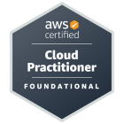
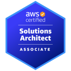

I’m an IT professional with over 15 years of experience building and supporting secure, PCI‑compliant infrastructures across `AWS Cloud` and `on‑prem` environments. My focus is on automation and resilience — using tools like `Terraform`, `Ansible`, and `CI/CD` pipelines to deliver systems that scale reliably and reduce risk.

Over the years, I’ve led projects ranging from fraud detection platforms to large‑scale payment systems, always with an emphasis on clarity, collaboration, and sustainable automation. I enjoy mentoring teams, sharing knowledge, and embedding `Agile` practices to help organizations work more transparently and effectively.

What sets me apart is the combination of deep technical expertise and a drive to make complex systems understandable and maintainable. Whether it’s modularizing Terraform code, automating deployments with `Ansible` or designing `CI/CD workflows`, I aim to create solutions that are not only robust but also auditable and future‑ready.

I’m currently expanding my cloud expertise with the AWS Solutions Architect certification, and I share code samples and infrastructure projects openly on GitHub to demonstrate my approach to automation and DevOps. Scroll down to `Selected code samples` or `CV Download` sections for more details.

<!--


My toolkit includes:
  

- AWS Cloud
- Infrastructure automation and application provisioning (Ansible, PowerShell)  
- Multi-disciplined - Linux, Windows Server and DevOps tools and techniques  
- Agile delivery and Jira project design and automation  
- Git, GitHub, Bitbucket (version control)  
- SharePoint and Confluence (collaboration and documentation)  
- Deep experience administering Microsoft server technologies

-->
## My skillset

<!--

| **Tech Stack**                           | **Details**                                                                                                                                                                                                                                    |
| ---------------------------------------- | ---------------------------------------------------------------------------------------------------------------------------------------------------------------------------------------------------------------------------------------------- |
| **☁️ Cloud Platforms**                   | `AWS`   Designing and managing scalable, high-performance cloud environments to support dynamic workloads.                                                                                                                                  |
| **📦 Containers & Orchestration**        | `Docker` 
Implementing container orchestration for seamless, reliable application deployment across diverse environments.                                                                                               |
| **🔧 DevOps Tools**                      | **`Jenkins`, `GitHub Actions`, `Maven`,`SonarQube`, `Nexus`, `Trivy`, `Prometheus`, `Grafana`**   Streamlining CI/CD pipelines by integrating testing, monitoring, and security tools to maintain high code quality and system performance. |
| **📜 Infrastructure as Code (IaC)**      | **`Terraform`, `Ansible`**   Automating the provisioning and management of infrastructure, ensuring consistency, reliability, and scalability across deployments.                                                                           |
| **💻 Programming & Scripting Languages** | `PowerShell`  Crafting automation scripts and tools to optimize workflows, reduce manual interventions, and enhance system productivity.                                                                                                    |
| **🖥️ Systems Administration**           | **`Linux`**  `Windows` Multi-disciplined - Linux, Windows Server.                                                                                                                                                                           |
| **🧭 Agile**                             | `Jira` Agile delivery and Jira project design and automation, SharePoint and Confluence (collaboration and documentation)                                                                                                                |
-->

| **Tech Stack**                      | **Details**                                                                                                                                                     |
| ----------------------------------- | --------------------------------------------------------------------------------------------------------------------------------------------------------------- |
| **🧭 Agile**                        | `Jira` Agile delivery and Jira project design and automation, SharePoint and Confluence (collaboration and documentation).                                   |
| **☁️ Cloud Platforms**              | `AWS`   Designing and managing scalable, high-performance cloud environments to support dynamic workloads.                                                   |
| **🔧 CI/CD Tools**                  | `AWS CodePipeline`, `AWS CodeBuild`, `GitHub Actions` Building and maintaining CI/CD pipelines to automate software development workflows.                   |
| **📜 Infrastructure as Code (IaC)** | `Ansible`, `Terraform`  Automating the provisioning and management of infrastructure, ensuring consistency, reliability, and scalability across deployments. |
| **🖥️ Systems Administration**      | `Linux`, `Windows` Multi-disciplined - Linux, Windows Server.                                                                                                |
## Trainings and Certifications[^Ref1]

[^Ref1]:Only those that were documented [this website]().

<!--
- 🏅 **AWS Certified Cloud Practitioner** ([CLF-C02]()) 
- [GitHub Actions - The Complete Guide]()
- 🏅 **Terraform Associate** ([HCTA0-003]())
-->


timeline    
    2025 : Ultimate Ansible Bootcamp by School of Devops® (Udemy)
         : 🏅AWS Certified Cloud Practitioner (CLF-C02)
         : 🏅HashiCorp Certified Terraform Associate (HCTA0-003)
         : GitHub Actions - The Complete Guide (Udemy)
    2026 : AWS Certified Solutions Architect Associate (SAA-C03) - IN PROGRESS


<!--
  
AWS


  
IaC


  
Ansible


  
Terraform


  
CI/CD


  
Containers


  
Linux


  
Network

-->

|                                        AWS Certified Cloud Practitioner                                        |                                         HashiCorp Certified Terraform Associate                                         |                                        AWS Certified Solutions Architect Associate                                        |
| :------------------------------------------------------------------------------------------------------------: | :---------------------------------------------------------------------------------------------------------------------: | :-----------------------------------------------------------------------------------------------------------------------: |
| 

 | 

 | 

 |
|                                     [CLF-C02]()                                      |                                        [HCTA0-003]()                                        |                                                          SAA-C03                                                          |
|                                       **Issued:** September 12, 2025                                       |                                            **Issued:** December 09, 2025                                            |                                               **Issued:** 🏅IN PROGRESS                                               |
|                                      **Expires:** September 12, 2028                                       |                                           **Expires:** December 09, 2027                                            |                                                   **Expires:** TBC                                                    |
<!--
|   [AWS]()   |        [IaC]()        |  [Ansible]()  |   [Terraform]()    |
| :-------------------------------------: | :-----------------------------------------------: | :-------------------------------------: | :--------------------------------------------: |
| [CI/CD]() | [Containers]() | [Linux]() | [Network]() |
-->

Check [🗂️My Trainings]() section for more information or jump to any category you may be interested in:

|      AWS    |           IaC         |     Ansible   |      Terraform     |
| :------------------------------------------------------------------------------------: | :----------------------------------------------------------------------------------------------: | :------------------------------------------------------------------------------------: | :-------------------------------------------------------------------------------------------: |
|    CI/CD  |    Containers  |    Linux  |    Network  |
<!--

|   [AWS]()   |        [IaC]()        |  [Ansible]()  |   [Terraform]()    |
| :-------------------------------------: | :-----------------------------------------------: | :-------------------------------------: | :--------------------------------------------: |
| [CI/CD]() | [Containers]() | [Linux]() | [Network]() |
-->
## Selected code samples

- **GitHub:** [[https://github.com/rtdevx/terraform-iac-aws-cp1](https://github.com/rtdevx/iac-terraform-aws-jvx)]([https://github.com/rtdevx/terraform-iac-aws-cp1](https://github.com/rtdevx/iac-terraform-aws-jvx)) (contains modular Terraform code, Bash provisioning scripts and CI configs)
- **GitHub:** [https://github.com/rtdevx/homelab/tree/main/ansible/site](https://github.com/rtdevx/homelab/tree/main/ansible/site) (contains Ansible playbooks that configures my homelab)


Check [my GitHub Repository](https://github.com/rtdevx) for more code samples...

## Curriculum Vitae 


📜 Download


## Contact


 LinkedIn


 


*This website does not use cookies, analytics, trackers, or any form of data collection. External links (including YouTube embeds) may have different policies - I can't vouch for what happens on other sites. Web crawlers are explicitly disallowed from indexing or scanning this site.  

**No rights reserved. For educational and informational purposes only.
