
## 3 weeks Himalaya Itinerary

- **New Delhi** – Capital of India.    
- **Rishikesh** – in the Himalayan foothills beside the Ganges River. The river is considered holy, and the city is renowned as a center for studying yoga and meditation. Highly recommend this destination.    
- **Auli** – Himalayan ski resort and hill station in the north Indian state of Uttarakhand. It’s surrounded by coniferous and oak forests, plus the Nanda Devi and Nar Parvat mountains..    
- **Malari** – Malari in the Dhauli Ganga valley of the Nanda Devi Biosphere reserve is a small village near the Tibetan border. This area has been declared as a **UNESCO World Heritage site**. 
- **Badrinath** – Badrinath is a holy town and a nagar panchayat in Chamoli district in the state of Uttarakhand, India. It is the most important of the four sites in India’s Char Dham pilgrimage and gets its name from the temple of Badrinath..


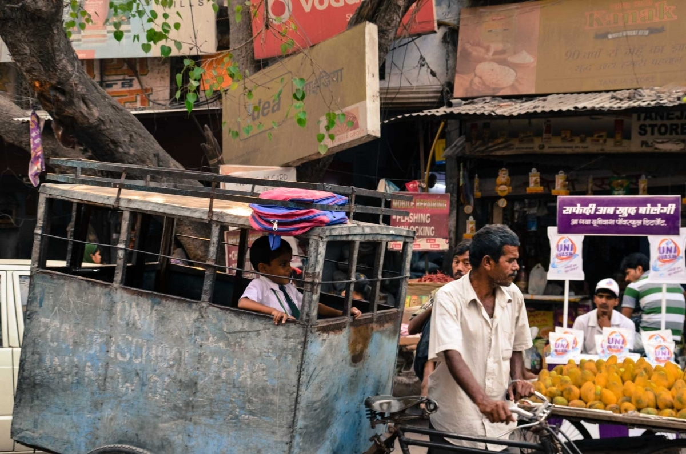

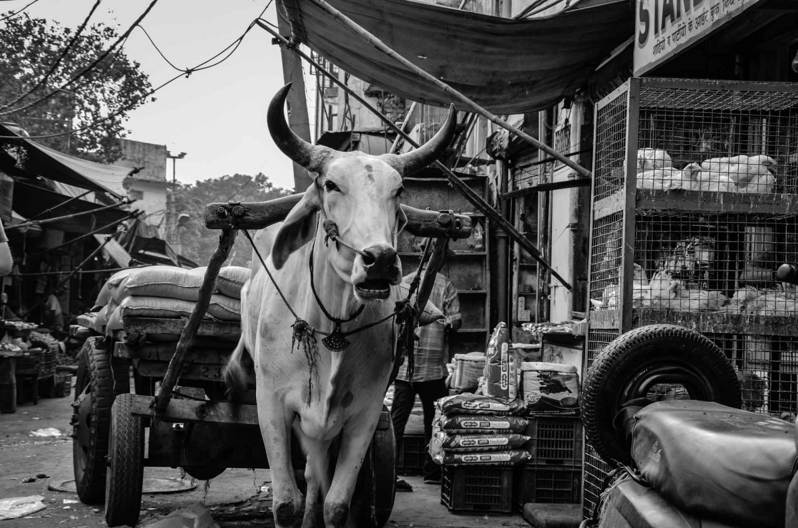

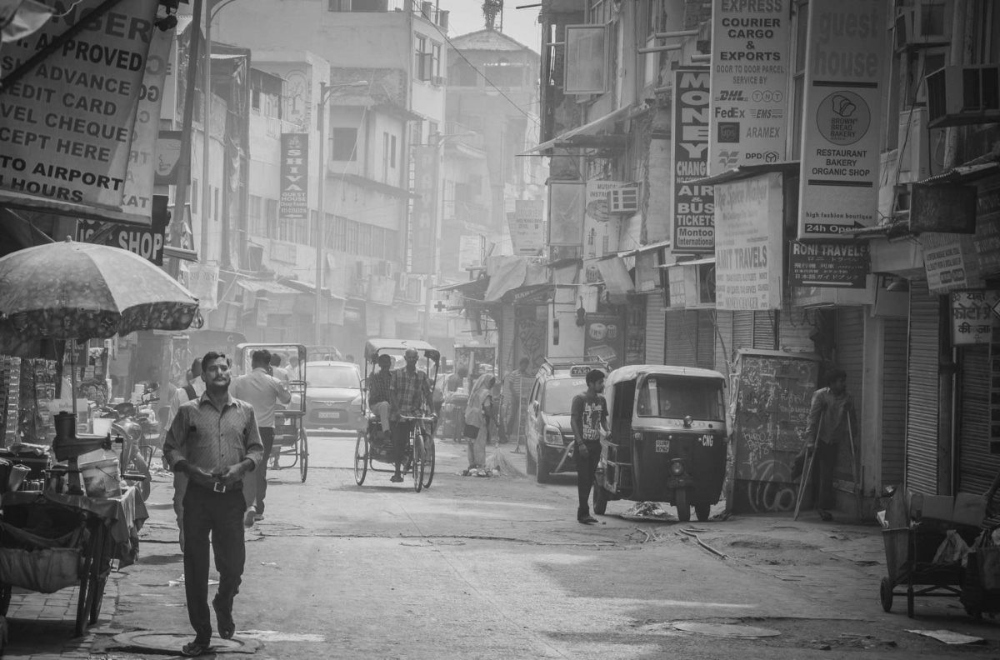

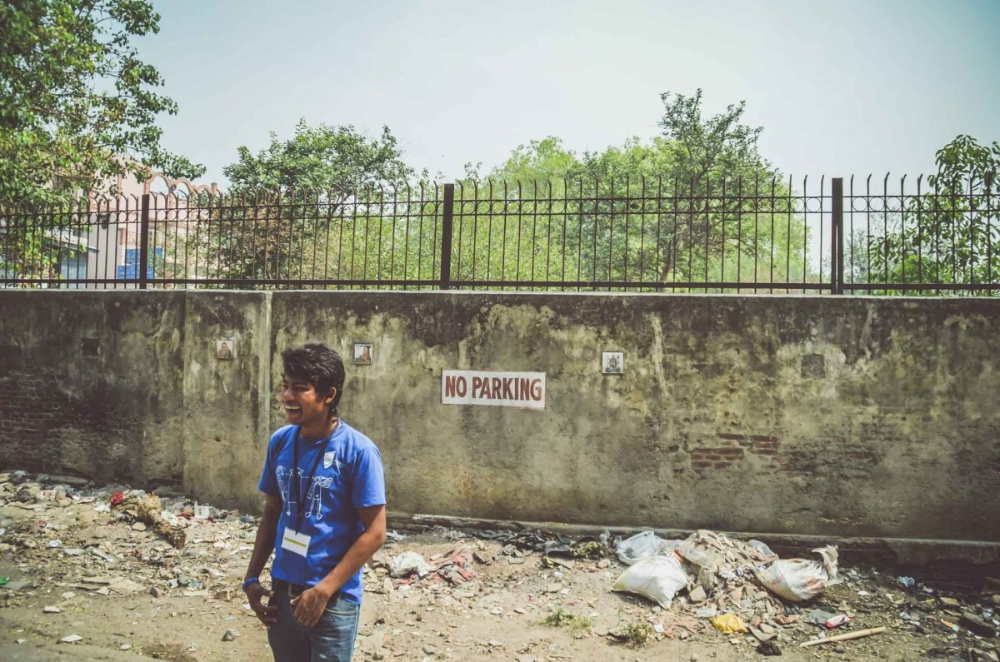

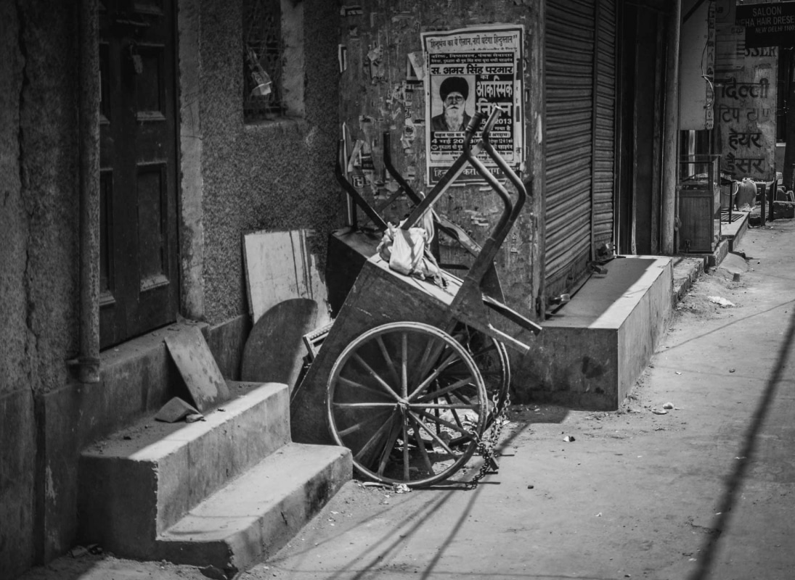

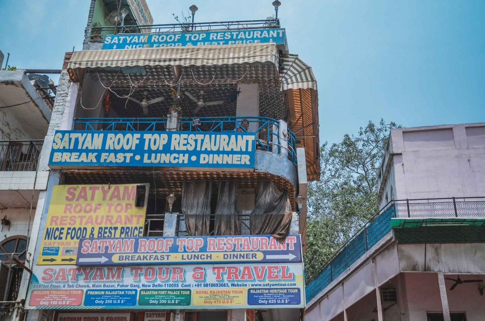

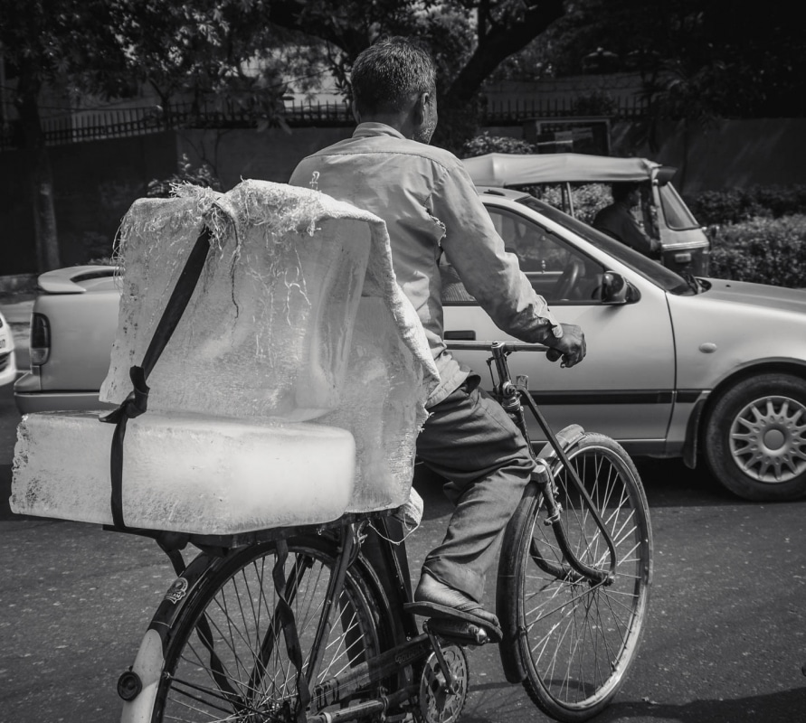

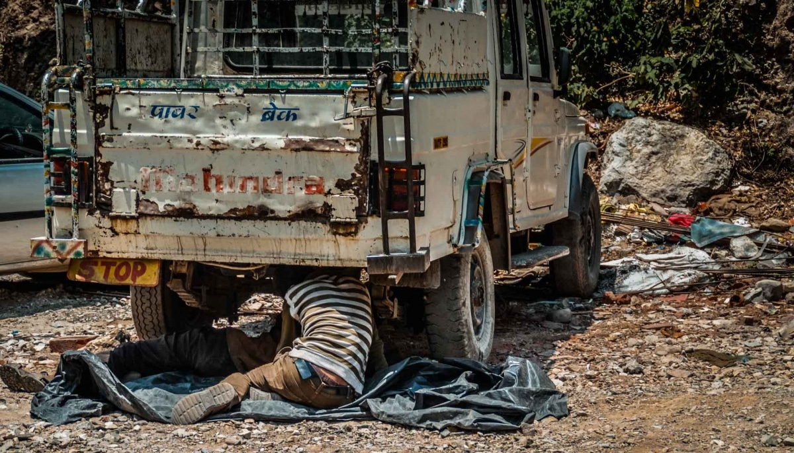

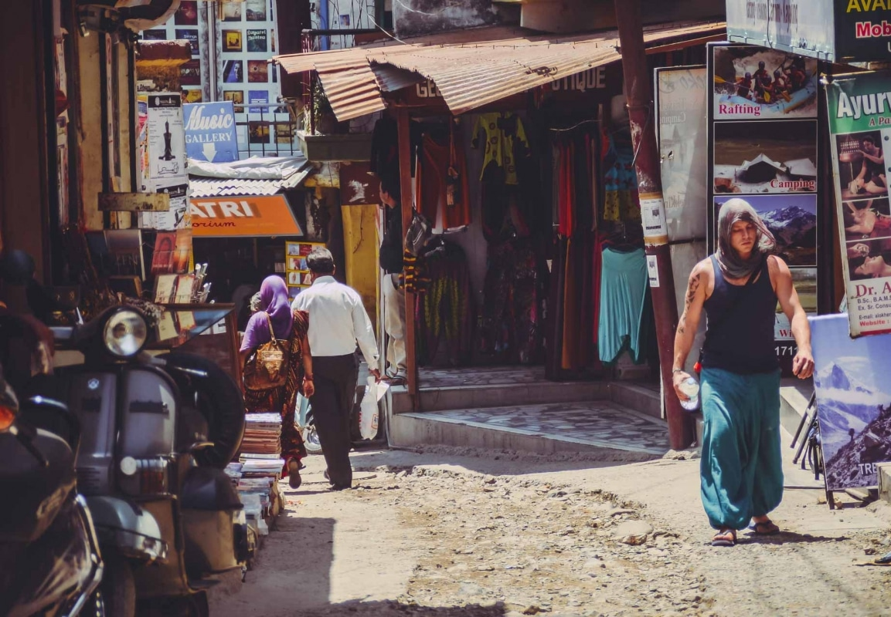

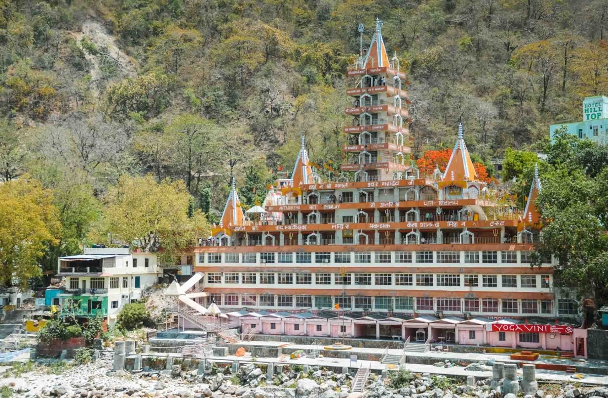

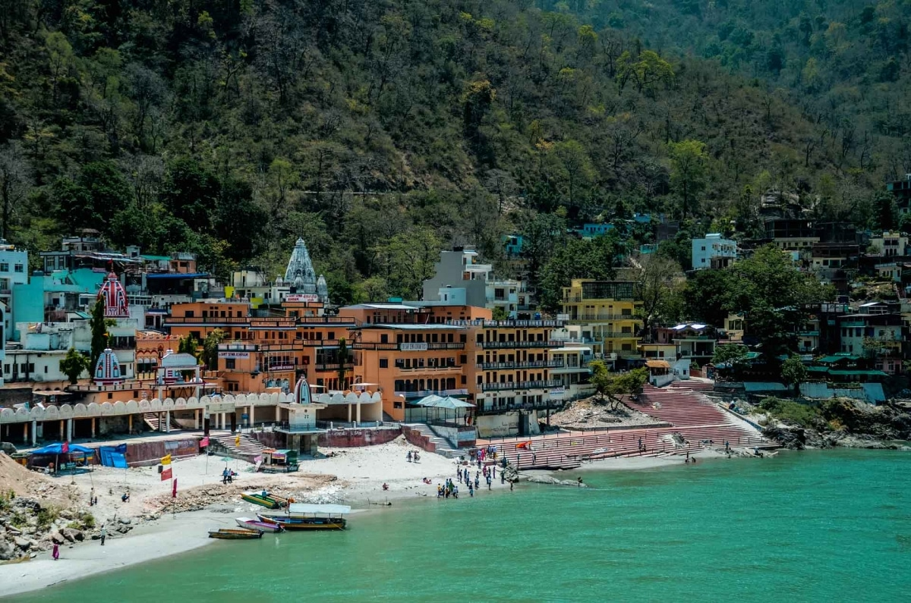

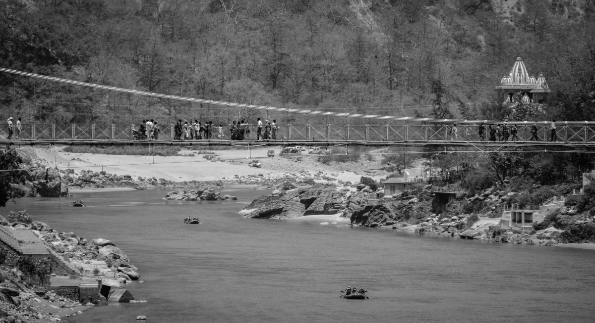

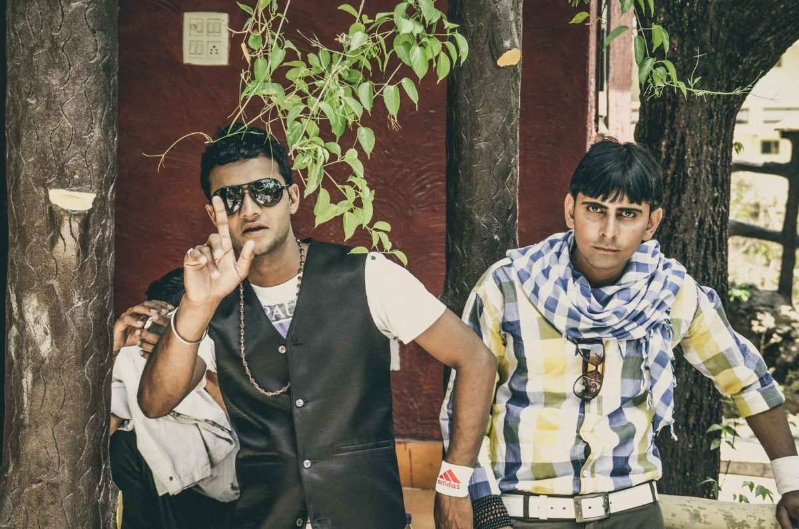

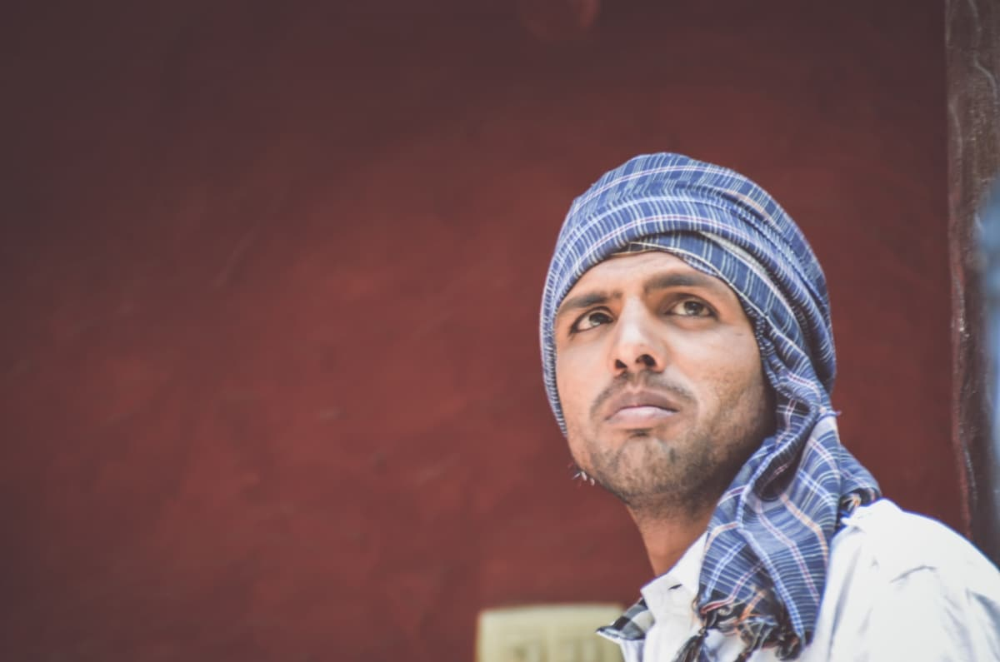

<iframe src="https://www.google.com/maps/embed?pb=!1m24!1m8!1m3!1d970357.3470410913!2d77.09727093794845!3d29.40348766824337!3m2!1i1024!2i768!4f13.1!4m13!3e0!4m5!1s0x390cfd6a1d2921af%3A0x570c5acc7d0f7853!2sPaharganj%2C%20New%20Delhi%2C%20Delhi%2C%20India!3m2!1d28.645604499999997!2d77.21277839999999!4m5!1s0x39093e67cf93f111%3A0xcc78804a6f941bfe!2sRishikesh%2C%20Uttarakhand%2C%20India!3m2!1d30.1157619!2d78.28530169999999!5e0!3m2!1sen!2suk!4v1765501555077!5m2!1sen!2suk" width="600" height="450" style="border:0;" allowfullscreen="" loading="lazy" referrerpolicy="no-referrer-when-downgrade"></iframe>

 


## Where to stay in New Delhi

If you don’t have any better ideas or arrangements, head to **Paharganj** district. It is full of [backpackers]() and is relatively safe (and close to the Train Station).

[India Mike](https://www.indiamike.com) – Travel and Community forums seem to be very good and informative source of information about travelling in India.
