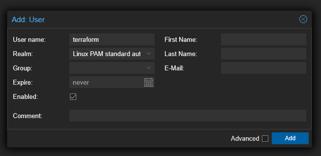
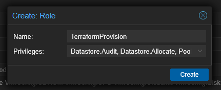
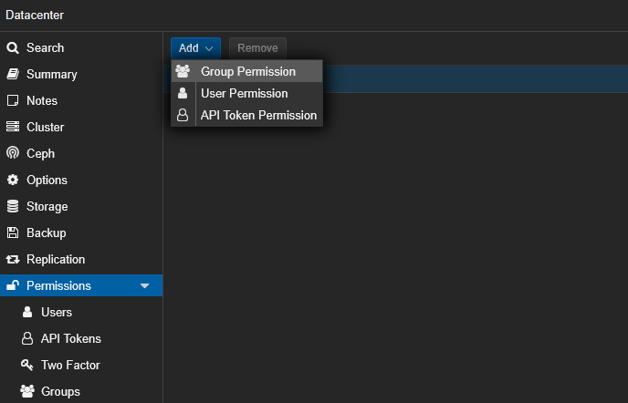
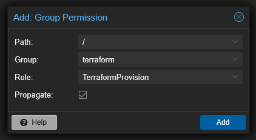
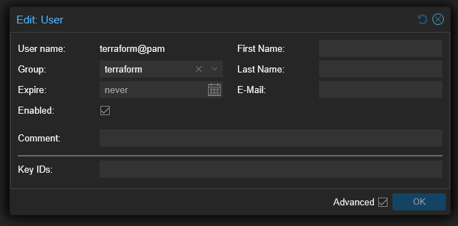
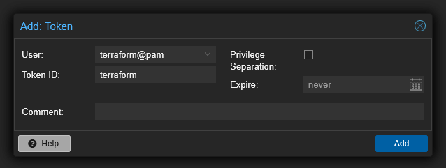


Using **Terraform** with **Proxmox** provider to deploy a (cloud-init) virtual machine. 

## Youtube Tutorial

A very good tutorial from  **Jay** ([LearnLinux.tv](https://www.learnlinux.tv/))  on how to set up Proxmox to work with Terraform.

---


_Provisioning Virtual Machines in Proxmox with Terraform – Full Walkthrough_

--- 
## Set up Proxmox for Terraform

### 1. Create terraform user

```shell
# In Proxmox GUI
Datacenter > Permissions > Users > Add
```


### 2. Configure permissions

```shell
# In Proxmox GUI
Datacenter > Permissions > Roles > Create
```

| Roles required for Terraform                                               |                                                                    |                                                                                                                                                                                                                                                                                         |
| -------------------------------------------------------------------------- | ------------------------------------------------------------------ | --------------------------------------------------------------------------------------------------------------------------------------------------------------------------------------------------------------------------------------------------------------------------------------- |
| - Datastore.Allocate<br>- Datastore.Audit<br>- Pool.Allocate <br>- SDN.Use | - Sys.Audit <br>- Sys.Console <br>- Sys.Modify <br>- Sys.PowerMgmt | - VM.Allocate <br>- VM.Audit <br>- VM.Clone <br>- VM.Config.CDROM <br>- VM.Config.CPU <br>- VM.Config.Cloudinit <br>- VM.Config.Disk <br>- VM.Config.HWType <br>- VM.Config.Memory <br>- VM.Config.Network <br>- VM.Config.Options <br>- VM.Migrate <br>- VM.Monitor <br>- VM.PowerMgmt |


### 3. Create group

```shell
# In Proxmox GUI
Datacenter > Permissions > Groups > Create
```
### 4. Add Group Permissions

```shell
# In Proxmox GUI
Datacenter > Permissions > Add > Group Permission
```



Map permissions to the group:


## 5. Add `terraform` user to `terraform` group

```shell
# In Proxmox GUI
Datacenter > Permissions > Users > terraform
```


## 6. Create API token

```shell
# In Proxmox GUI
Datacenter > Permissions > API Tokens > Add
```


_Make sure to uncheck the "Privilege Separation" box._


Note that <font color=#EB4925>Token ID can't be displayed again</font>. Copy it and keep secure.



---
## >> Sources <<

[LearnLinux.tv](https://www.learnlinux.tv/)