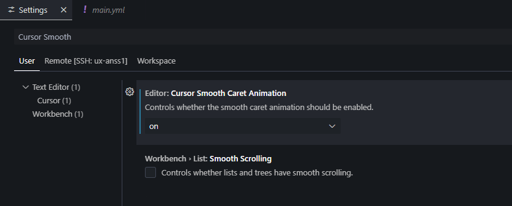
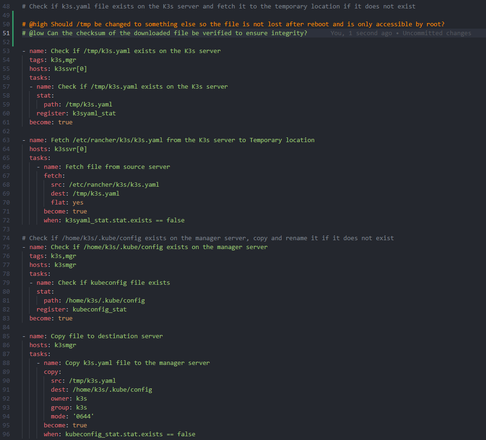
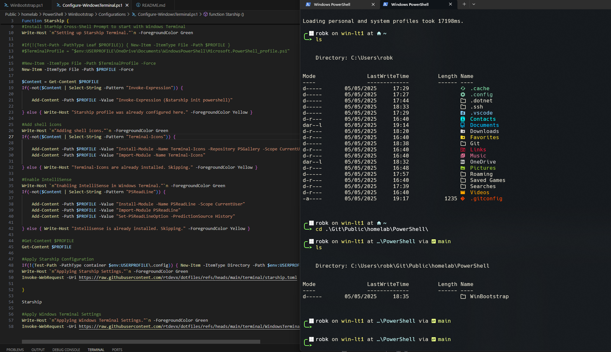


### The open source AI code editor

`Visual Studio Code` is a free and versatile code editor that supports almost every major programming language and integrates with GitHub Copilot, an AI model that suggests code edits and completions.



## 📺 YouTube Tutorial



💡One of many  `VSCode Setup Tutorials`
## Manual Settings

1. Enable minimap
2. Add theme extension 
	- One Dark Pro
	- Dark Horizon
	- Tokyo Night
	- Night Owl
3. Change cursor blinking (set to "expand")


4. Cursor Smooth Caret Animation



5. Enable Word Wrap in Settings (set to "on")
6. Ensure Bracket Pair Colorization: Enabled
## My VSCode Extensions

| VSCode Extension                                                                                                         | Purpose                                                                                                                                                                                                                                                                                                                                                                                                                                                                                                                                                                                                                                                                                                                                                                                                       |
| ------------------------------------------------------------------------------------------------------------------------ | ------------------------------------------------------------------------------------------------------------------------------------------------------------------------------------------------------------------------------------------------------------------------------------------------------------------------------------------------------------------------------------------------------------------------------------------------------------------------------------------------------------------------------------------------------------------------------------------------------------------------------------------------------------------------------------------------------------------------------------------------------------------------------------------------------------- |
| [powershell](https://marketplace.visualstudio.com/items?itemName=ms-vscode.PowerShell)                                   | This extension provides rich [PowerShell](https://github.com/PowerShell/PowerShell) language support for [Visual Studio Code](https://github.com/Microsoft/vscode) (VS Code). Now you can write and debug PowerShell scripts using the excellent IDE-like interface that VS Code provides.                                                                                                                                                                                                                                                                                                                                                                                                                                                                                                                    |
| [remote-ssh](https://marketplace.visualstudio.com/items?itemName=ms-vscode-remote.remote-ssh)                            | The **Remote - SSH** extension lets you use any remote machine with a SSH server as your development environment                                                                                                                                                                                                                                                                                                                                                                                                                                                                                                                                                                                                                                                                                              |
| [remote-server](https://marketplace.visualstudio.com/items?itemName=ms-vscode.remote-server)                             | The **Remote - Tunnels** extension lets you connect to a remote machine, like a desktop PC or virtual machine (VM), via a secure tunnel. You can then securely connect to that machine from anywhere, without the requirement of SSH.                                                                                                                                                                                                                                                                                                                                                                                                                                                                                                                                                                         |
| [remote-wsl](https://marketplace.visualstudio.com/items?itemName=ms-vscode-remote.remote-wsl)                            | The **WSL extension** lets you use VS Code on Windows to build Linux applications that run on the [Windows Subsystem for Linux (WSL)](https://docs.microsoft.com/en-us/windows/wsl). You get all the productivity of Windows while developing with Linux-based tools, runtimes, and utilities.<br><br>The **WSL** extension lets you use VS Code in WSL just as you would from Windows.                                                                                                                                                                                                                                                                                                                                                                                                                       |
| [remote-extensionpack](https://marketplace.visualstudio.com/items?itemName=ms-vscode-remote.vscode-remote-extensionpack) | The **Remote Development** extension pack allows you to open any folder in a container, on a remote machine, or in the [Windows Subsystem for Linux (WSL)](https://docs.microsoft.com/en-us/windows/wsl) and take advantage of VS Code's full feature set.                                                                                                                                                                                                                                                                                                                                                                                                                                                                                                                                                    |
| [yaml](https://marketplace.visualstudio.com/items?itemName=redhat.vscode-yaml)                                           | Provides comprehensive YAML Language support to [Visual Studio Code](https://code.visualstudio.com/), via the [yaml-language-server](https://github.com/redhat-developer/yaml-language-server), with built-in Kubernetes syntax support.                                                                                                                                                                                                                                                                                                                                                                                                                                                                                                                                                                      |
| [copilot](https://marketplace.visualstudio.com/items?itemName=GitHub.copilot)                                            | **[GitHub Copilot](https://code.visualstudio.com/docs/copilot/overview)** is an AI peer programming tool that helps you write code faster and smarter.<br><br>GitHub Copilot adapts to your unique needs allowing you to select the best model for your project, customize chat responses with custom instructions, and utilize agent mode for AI-powered, seamlessly integrated peer programming sessions.                                                                                                                                                                                                                                                                                                                                                                                                   |
| [copilot-chat](https://marketplace.visualstudio.com/items?itemName=GitHub.copilot-chat)                                  | **[GitHub Copilot](https://code.visualstudio.com/docs/copilot/overview)** is an AI peer programming tool that helps you write code faster and smarter.<br><br>GitHub Copilot adapts to your unique needs allowing you to select the best model for your project, customize chat responses with custom instructions, and utilize agent mode for AI-powered, seamlessly integrated peer programming sessions.                                                                                                                                                                                                                                                                                                                                                                                                   |
| [peacock](https://marketplace.visualstudio.com/items?itemName=johnpapa.vscode-peacock)                                   | Subtly change the color of your Visual Studio Code workspace. Ideal when you have multiple VS Code instances, use VS Live Share, or use VS Code's Remote features, and you want to quickly identify your editor.                                                                                                                                                                                                                                                                                                                                                                                                                                                                                                                                                                                              |
| [vscode-docker](https://marketplace.visualstudio.com/items?itemName=ms-azuretools.vscode-docker)                         | The Docker Extension Pack makes it easy to build, manage, and deploy containerized applications from Visual Studio Code.                                                                                                                                                                                                                                                                                                                                                                                                                                                                                                                                                                                                                                                                                      |
| [prettier-vscode](https://marketplace.visualstudio.com/items?itemName=esbenp.prettier-vscode)                            | [Prettier](https://prettier.io/) is an opinionated code formatter. It enforces a consistent style by parsing your code and re-printing it with its own rules that take the maximum line length into account, wrapping code when necessary.                                                                                                                                                                                                                                                                                                                                                                                                                                                                                                                                                                    |
| [gitlens](https://marketplace.visualstudio.com/items?itemName=eamodio.gitlens)                                           | [GitLens](https://gitkraken.com/gitlens?utm_source=gitlens-extension&utm_medium=in-app-links&utm_campaign=gitlens-logo-links "Learn more about GitLens") is a powerful [open-source](https://github.com/gitkraken/vscode-gitlens "Open GitLens on GitHub") extension for Visual Studio Code built and maintained by GitKraken.<br><br>Enhance your workflows with powerful Git functionality like in-editor blame annotations, hovers, CodeLens, and more—all fully customizable within VS Code.                                                                                                                                                                                                                                                                                                              |
| [code-runner](https://marketplace.visualstudio.com/items?itemName=formulahendry.code-runner)                             | Run code snippet or code file for multiple languages.                                                                                                                                                                                                                                                                                                                                                                                                                                                                                                                                                                                                                                                                                                                                                         |
| [vsliveshare](https://marketplace.visualstudio.com/items?itemName=MS-vsliveshare.vsliveshare)                            | Visual Studio Live Share enables you to collaboratively edit and debug with others in real time, regardless what [programming languages](https://docs.microsoft.com/en-us/visualstudio/liveshare/reference/platform-support#visual-studio-code) you're using or app types you're building. It allows you to instantly (and [securely](https://docs.microsoft.com/en-us/visualstudio/liveshare/reference/security)) share your current project, and then as needed, share [debugging sessions](https://docs.microsoft.com/en-us/visualstudio/liveshare/use/vscode#co-debugging), [terminal instances](https://docs.microsoft.com/en-us/visualstudio/liveshare/use/vscode#share-a-terminal), [localhost web apps](https://docs.microsoft.com/en-us/visualstudio/liveshare/use/vscode#share-a-server), and more! |
| [material-icon-theme](https://marketplace.visualstudio.com/items?itemName=PKief.material-icon-theme)                     | Material Design Icons for Visual Studio Code                                                                                                                                                                                                                                                                                                                                                                                                                                                                                                                                                                                                                                                                                                                                                                  |
| [pdf](https://marketplace.visualstudio.com/items?itemName=tomoki1207.pdf)                                                | Display pdf in VSCode.                                                                                                                                                                                                                                                                                                                                                                                                                                                                                                                                                                                                                                                                                                                                                                                        |
| [rainbow-csv](https://marketplace.visualstudio.com/items?itemName=mechatroner.rainbow-csv)                               | - Highlights columns in CSV, TSV, semicolon, and pipe-separated files with distinct colors.<br>- Query, transform, and filter data using a built-in SQL-like language (RBQL).<br>- and more...                                                                                                                                                                                                                                                                                                                                                                                                                                                                                                                                                                                                                |
| [better-comments](https://marketplace.visualstudio.com/items?itemName=aaron-bond.better-comments)                        | The Better Comments extension will help you create more human-friendly comments in your code.  <br>With this extension, you will be able to categorise your annotations...                                                                                                                                                                                                                                                                                                                                                                                                                                                                                                                                                                                                                                    |
| [HashiCorp.terraform](https://marketplace.visualstudio.com/items?itemName=HashiCorp.terraform)                           | The HashiCorp [Terraform Extension for Visual Studio Code (VS Code)](https://marketplace.visualstudio.com/items?itemName=HashiCorp.terraform) with the [Terraform Language Server](https://github.com/hashicorp/terraform-ls) adds editing features for [Terraform](https://www.terraform.io) and Terraform Stacks files such as syntax highlighting, IntelliSense, code navigation, code formatting, module explorer and much more!                                                                                                                                                                                                                                                                                                                                                                          |

<video id="vscode_copilot" autoplay loop>  
  <source src="./assets/vscode-copilot.webm" type="video/webm">  
Your browser does not support the video tag.  
</video>

## Better Comments options ✨

```
# !
# ?
# //
# *
# todo:
# note:
# info:
# hack:
# fix:
# optimize:
# @critical
# @high
# @low
```


ℹ️ Here are the settings:

📄settings.json

```JSON
{

"better-comments.tags": [  
  
    {
      "tag": "!",
      "color": "#FF2D00",
      "strikethrough": false,
      "backgroundColor": "transparent"
    },
    {
      "tag": "?",
      "color": "#3498DB",
      "strikethrough": false,
      "backgroundColor": "transparent"
    },
    {
      "tag": "//",
      "color": "#F0F2F5",
      "strikethrough": true,
      "backgroundColor": "transparent"
    },
    {
      "tag": "*",
      "color": "#98C379",
      "strikethrough": false,
      "backgroundColor": "transparent"
    },
    {
      "tag": "todo:",
      "color": "#000000",
      "strikethrough": false,
      "backgroundColor": "#F9E79F"
    },
    {
      "tag": "note:",
      "color": "#000000",
      "strikethrough": false,
      "backgroundColor": "#A9DFBF"
    },
    {
      "tag": "info:",
      "color": "#000000",
      "strikethrough": false,
      "backgroundColor": "#AED6F1"
    },    
    {
      "tag": "hack:",
      "color": "#000000",
      "strikethrough": false,
      "backgroundColor": "#FFC300"
    },
    {
      "tag": "fix:",
      "color": "#000000",
      "strikethrough": false,
      "backgroundColor": "#F65353"
    },
    {
      "tag": "optimize:",
      "color": "#000000",
      "strikethrough": false,
      "backgroundColor": "#98C379"
    },
    {
      "tag": "@critical",
      "color": "#FF2D00",
      "strikethrough": false,
      "backgroundColor": "transparent"
    },
    {
      "tag": "@high",
      "color": "#FF8C00",
      "strikethrough": false,
      "backgroundColor": "transparent"
    },
    {
      "tag": "@low",
      "color": "#98C379",
      "strikethrough": false,
      "backgroundColor": "transparent"
    }
  ],

}
```

 https://github.com/rtdevx/dotfiles/tree/main/vscode
### Installing listed VSCode extensions using PowerShell

💡Pick the ones you want / need or are interested in. You can install them with a single PowerShell command on a Windows machine.

```PowerShell

start-process code -windowstyle Hidden -ArgumentList "--install-extension ms-vscode.powershell --force" -PassThru -Wait

start-process code -windowstyle Hidden -ArgumentList "--install-extension ms-vscode-remote.remote-ssh --force" -PassThru -Wait

start-process code -windowstyle Hidden -ArgumentList "--install-extension ms-vscode.remote-server --force" -PassThru -Wait

start-process code -windowstyle Hidden -ArgumentList "--install-extension ms-vscode-remote.remote-wsl --force" -PassThru -Wait

start-process code -windowstyle Hidden -ArgumentList "--install-extension ms-vscode-remote.vscode-remote-extensionpack --force" -PassThru -Wait

start-process code -windowstyle Hidden -ArgumentList "--install-extension redhat.vscode-yaml --force" -PassThru -Wait

start-process code -windowstyle Hidden -ArgumentList "--install-extension github.copilot --force" -PassThru -Wait

start-process code -windowstyle Hidden -ArgumentList "--install-extension github.copilot-chat --force" -PassThru -Wait

start-process code -windowstyle Hidden -ArgumentList "--install-extension johnpapa.vscode-peacock --force" -PassThru -Wait

start-process code -windowstyle Hidden -ArgumentList "--install-extension ms-azuretools.vscode-docker --force" -PassThru -Wait

start-process code -windowstyle Hidden -ArgumentList "--install-extension esbenp.prettier-vscode --force" -PassThru -Wait

start-process code -windowstyle Hidden -ArgumentList "--install-extension eamodio.gitlens --force" -PassThru -Wait

start-process code -windowstyle Hidden -ArgumentList "--install-extension formulahendry.code-runner --force" -PassThru -Wait

start-process code -windowstyle Hidden -ArgumentList "--install-extension ms-vsliveshare.vsliveshare --force" -PassThru -Wait

start-process code -windowstyle Hidden -ArgumentList "--install-extension pkief.material-icon-theme --force" -PassThru -Wait

start-process code -windowstyle Hidden -ArgumentList "--install-extension tomoki1207.pdf --force" -PassThru -Wait

start-process code -windowstyle Hidden -ArgumentList "--install-extension mechatroner.rainbow-csv --force" -PassThru -Wait

start-process code -windowstyle Hidden -ArgumentList "--install-extension aaron-bond.better-comments --force" -PassThru -Wait

start-process code -windowstyle Hidden -ArgumentList "--install-extension hnw.vscode-auto-open-markdown-preview --force" -PassThru -Wait
```
## Screenshots





---
## >> Sources <<

- VSCode main site: https://code.visualstudio.com/
- VSCode extensions marketplace: https://marketplace.visualstudio.com/VSCode
## » References «

[Git]()
[VSCode Cheatsheet]()