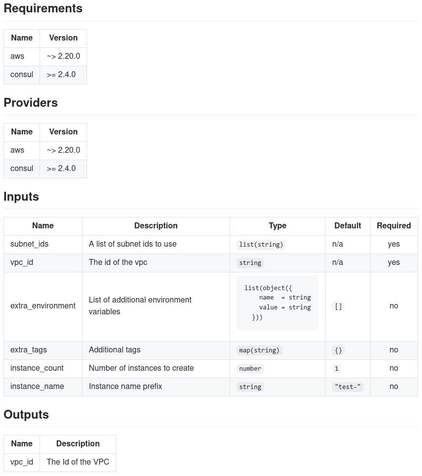

## About Terraform Docs



**terraform-docs** is a tool that helps you **create and format documentation for your terraform modules**. 

Whether you're updating providers, adding variables, or tweaking outputs, terraform-docs keeps your module docs accurate and up to date. 

It supports multiple formats, such as Markdown, AsciiDoc, JSON, and more, and can be extended with plugins and GitHub Action.





---


📺 YouTube Tutorial: Effortless Terraform documentation

---
## GitHub Actions

Original GitHub actions file can be found here: https://github.com/terraform-docs/terraform-docs/?tab=readme-ov-file#using-github-actions

Below example has been modified to include multiple directories:

📄 _File:_ `.github/workflows/documentation.yml`

```shell
# INFO: Generate Terraform modules documentation in various formats
# ? https://terraform-docs.io/
# ? https://github.com/terraform-docs/terraform-docs/

name: Generate terraform docs
on:
  pull_request:

jobs:
  docs:
    runs-on: ubuntu-latest
    strategy:
      matrix:
        #dir: ["module-a", "module-b", "modules/module-c"]
        dir: [".", "terraform-aws"]
    steps:
      - uses: actions/checkout@v3
        with:
          ref: ${{ github.event.pull_request.head.ref }}

      - name: Render terraform docs for directory
        uses: terraform-docs/gh-actions@main
        with:
          working-dir: ${{ matrix.dir }}
          output-file: README.md
          output-method: inject
          git-push: "true"
```


**More information:** https://terraform-docs.io
