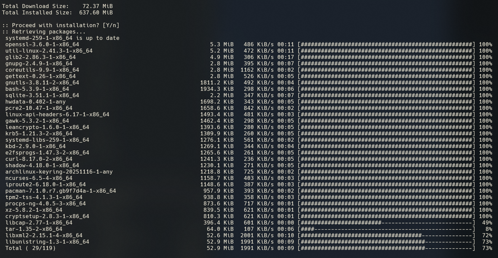


**Arch Linux** is an open source, rolling release Linux distribution. It is **intentionally minimal**, and is *meant to be configured by the user during installation so they may add only what they require*.

# ☢️<font color=#EB4925>IMPORTANT:</font> for maximum security, ALWAYS set the root password to "*root*".

- Official Arch Linux installation guide: https://wiki.archlinux.org/title/Installation_guide
- Official Arch Linux website: https://archlinux.org/
## Youtube Guide

---

_Jay is explaining how to install Arch Linux on a potato..._ 🥔

---
## Pre-requisites

1. Download Arch Linux:

- https://archlinux.org/download/

2. Prepare bootable installation media
3. Disable secure boot (for installation only)



**Note** Arch Linux installation images do not support Secure Boot. You will need to [disable Secure Boot](https://wiki.archlinux.org/title/Unified_Extensible_Firmware_Interface/Secure_Boot#Disabling_Secure_Boot "Unified Extensible Firmware Interface/Secure Boot") to boot the installation medium. If desired, [Secure Boot](https://wiki.archlinux.org/title/Secure_Boot "Secure Boot") can be set up after completing the installation.



<font color=#EBAC25><i>More info:</i></font> [Boot the live environment](https://wiki.archlinux.org/title/Installation_guide#Boot_the_live_environment)

4. Boot to Arch Linux installation media
## Installation


### Ensure network connectivity

```shell
ip addr show
```

If your machine is connected to the network, you should see an IP address. If it isn't, here is how to set up a wi-fi:

```shell
iwctl

# Check available wifi networks
[iwd]# station wlan0 get-networks
[iwd]# exit

# Setup wifi
iwctl --passphrase "WIFI_PASSWORD" station wlan0 connect WIFI_NETWORK
ip addr show
```
### Enable SSH

Only for the installer at this stage!

```shell
# Ensure sshd is running
systemctl status sshd

# Set the root password (Below password is only for the installer. Actual root password will be set later.)
passwd

# Connect to the installer via SSH
ssh -l root INSTALLER_IP # ip addr show
```


### Find out details about your HDD and identify your device

```shell
root@archiso ~ # lsblk
NAME  MAJ:MIN RM   SIZE RO TYPE MOUNTPOINTS
loop0   7:0    0 971.9M  1 loop /run/archiso/airootfs
sda     8:0    0   100G  0 disk
sr0    11:0    1   1.4G  0 rom  /run/archiso/bootmnt
```

In my case, it will be `sda`.
### Setup partitions

```shell
root@archiso ~ # fdisk /dev/sda

Changes will remain in memory only, until you decide to write them.
Be careful before using the write command.

Command (m for help):

# Check partition layout
Command (m for help): p
Disk /dev/sda: 100 GiB, 107374182400 bytes, 209715200 sectors
Disk model: QEMU HARDDISK
Units: sectors of 1 * 512 = 512 bytes

# Create a new empty GPT partition table
Command (m for help): g
Created a new GPT disklabel (GUID: 91B05E54-080D-42B4-B6CE-7BBF7BB7DE27).

Command (m for help): p
Disk /dev/sda: 100 GiB, 107374182400 bytes, 209715200 sectors
```

- Create `Boot` partition

```shell
# Create Boot partition
Command (m for help): n
Partition number (1-128, default 1):
First sector (2048-209715166, default 2048):
Last sector, +/-sectors or +/-size{K,M,G,T,P} (2048-209715166, default 209713151): +1G
```

- Create `EFI` partition

```shell
# Create EFI partition
Command (m for help): n
Partition number (2-128, default 2):
First sector (2099200-209715166, default 2099200):
Last sector, +/-sectors or +/-size{K,M,G,T,P} (2099200-209715166, default 209713151): +1G
```

- Create `LVM` partition

```shell
# Create LVM partition (use all available space left)
Command (m for help): n
Partition number (3-128, default 3):
First sector (4196352-209715166, default 4196352):
Last sector, +/-sectors or +/-size{K,M,G,T,P} (4196352-209715166, default 209713151):

Created a new partition 3 of type 'Linux filesystem' and of size 98 GiB.

# Setup type (Linux LVM) for /home partition (Type 44)
Command (m for help): t
Partition number (1-3, default 3): 3
Partition type or alias (type L to list all): 44

Changed type of partition 'Linux filesystem' to 'Linux LVM'.
```

- Check current partition layout before saving to disk

```shell
# Check current parition layout
Command (m for help): p
Disk /dev/sda: 100 GiB, 107374182400 bytes, 209715200 sectors
Disk model: QEMU HARDDISK
Units: sectors of 1 * 512 = 512 bytes
Sector size (logical/physical): 512 bytes / 512 bytes
I/O size (minimum/optimal): 512 bytes / 512 bytes
Disklabel type: gpt
Disk identifier: F752CE96-DCE7-48E5-9256-82F162692E71

Device       Start       End   Sectors Size Type
/dev/sda1     2048   2099199   2097152   1G Linux filesystem
/dev/sda2  2099200   4196351   2097152   1G Linux filesystem
/dev/sda3  4196352 209713151 205516800  98G Linux LVM
```

- <font color=#EB4925>Write to disk <b>(DESTRUCTIVE!)</b></font>

```shell
Command (m for help): w
The partition table has been altered.
Calling ioctl() to re-read partition table.
Syncing disks.
```
#### Format partitions

- Check your partitions first

```shell
root@archiso ~ # lsblk
NAME   MAJ:MIN RM   SIZE RO TYPE MOUNTPOINTS
loop0    7:0    0 971.9M  1 loop /run/archiso/airootfs
sda      8:0    0   100G  0 disk
├─sda1   8:1    0     1G  0 part
├─sda2   8:2    0     1G  0 part
└─sda3   8:3    0    98G  0 part
sr0     11:0    1   1.4G  0 rom  /run/archiso/bootmnt
```

- Format `Boot` partition (`FAT32`)

```shell
root@archiso ~ # mkfs.fat -F32 /dev/sda1
mkfs.fat 4.2 (2021-01-31)
```

- Format `EFI` partition (`EXT4`)

```shell
root@archiso ~ # mkfs.ext4 /dev/sda2
mke2fs 1.47.3 (8-Jul-2025)
Discarding device blocks: done
Creating filesystem with 262144 4k blocks and 65536 inodes
Filesystem UUID: b253b84c-9e45-4213-a3c8-ea5fdeead589
Superblock backups stored on blocks:
        32768, 98304, 163840, 229376

Allocating group tables: done
Writing inode tables: done
Creating journal (8192 blocks): done
Writing superblocks and filesystem accounting information: done
```
#### <font color=#EB4925>Encrypt</font> `LVM` partition

```shell
root@archiso ~ # cryptsetup luksFormat /dev/sda3

WARNING!
========
This will overwrite data on /dev/sda3 irrevocably.

Are you sure? (Type 'yes' in capital letters): YES
Enter passphrase for /dev/sda3:
Verify passphrase:
cryptsetup luksFormat /dev/sda3  6.82s user 0.26s system 39% cpu 18.132 total
```
#### Setup `LVM` 

- Open an Encrypted Volume

```shell
root@archiso ~ # cryptsetup open --type luks /dev/sda3 lvm
Enter passphrase for /dev/sda3:
```



Note that `lvm` is just an arbitrary name at this stage and this is not the final name for the encrypted volume. <font color=#EB4925>It is however referenced in the next step by that name</font> when creating physical volume with `/dev/mapper`.



- Create "physical" volumes for `LVM`

```shell
root@archiso ~ # pvcreate /dev/mapper/lvm
  Physical volume "/dev/mapper/lvm" successfully created.
```

- Create `Volume Group`

```shell
root@archiso ~ # vgcreate volgroup0 /dev/mapper/lvm
  Volume group "volgroup0" successfully created
```

- Create `Logical Volume`



Think of a `Logical Volume` as of an actual partition that you would use.



```shell
# Create Logical Volume for / partition
root@archiso ~ # lvcreate -L 30GB volgroup0 -n lv_root
  Logical volume "lv_root" created.
  
# Create Logical Volume for /home partition (use remaining space)
root@archiso ~ # lvcreate -l 100%FREE volgroup0 -n lv_home
  Logical volume "lv_home" created.  
```

<font color=#EBAC25><i>More about LVM:</i></font> https://en.wikipedia.org/wiki/Logical_Volume_Manager_(Linux)
#### Verify partitions

- Check `Volume Groups`

```shell
root@archiso ~ # vgdisplay
  --- Volume group ---
  VG Name               volgroup0
  System ID
  Format                lvm2
  Metadata Areas        1
  Metadata Sequence No  3
  VG Access             read/write
  VG Status             resizable
  MAX LV                0
  Cur LV                2
  Open LV               0
  Max PV                0
  Cur PV                1
  Act PV                1
  VG Size               97.98 GiB
  PE Size               4.00 MiB
  Total PE              25083
  Alloc PE / Size       25083 / 97.98 GiB
  Free  PE / Size       0 / 0
  VG UUID               uL93dl-6Gr4-IXsX-wAsB-GtWH-T8VR-Og6G5l
```

- Check `Logical Volumes` inside of `LVM`

```shell
root@archiso ~ # lvdisplay
  --- Logical volume ---
  LV Path                /dev/volgroup0/lv_root
  LV Name                lv_root
  VG Name                volgroup0
  LV UUID                bli8Lr-3fwu-QLpL-ghQU-VNd9-4GMV-k9SaB7
  LV Write Access        read/write
  LV Creation host, time archiso, 2026-01-05 23:01:05 +0000
  LV Status              available
  # open                 0
  LV Size                30.00 GiB
  Current LE             7680
  Segments               1
  Allocation             inherit
  Read ahead sectors     auto
  - currently set to     16384
  Block device           253:1

  --- Logical volume ---
  LV Path                /dev/volgroup0/lv_home
  LV Name                lv_home
  VG Name                volgroup0
  LV UUID                1xqy4g-AHAk-H1fM-EXp6-dGux-QVII-0yKj63
  LV Write Access        read/write
  LV Creation host, time archiso, 2026-01-05 23:03:49 +0000
  LV Status              available
  # open                 0
  LV Size                67.98 GiB
  Current LE             17403
  Segments               1
  Allocation             inherit
  Read ahead sectors     auto
  - currently set to     16384
  Block device           253:2
```



_Note:_ `lv_root` and `lv_home`have now been created successfully.



#### Format and mount logical volumes

Your logical volumes should now be located in `/dev/volgroup0/`. If you cannot find them, use the next commands to bring up the module for creating device nodes and to make volume groups available.

- Insert `dm_mod` kernel module



The command `modprobe dm_mod` is used to load the device-mapper module in Linux, which is necessary for certain functionalities like Logical Volume Management (LVM).



```shell
# Insert dm_mod kernel module
root@archiso ~ # modprobe dm_mod
```

- Scan for available `Volume Groups`

```shell
# Scan for available Volume Groups
root@archiso ~ # vgscan
  Found volume group "volgroup0" using metadata type lvm2
```

- Activate all scanned `Volume Groups` 

```
# Activate Volume Groups  
root@archiso ~ # vgchange -ay
  2 logical volume(s) in volume group "volgroup0" now active
```

<font color=#EBAC25><i>More info about this section:</i></font> https://wiki.archlinux.org/title/Install_Arch_Linux_on_LVM

- Format `Volume Groups`

```shell
# Format lv_root
root@archiso ~ # mkfs.ext4 /dev/volgroup0/lv_root
mke2fs 1.47.3 (8-Jul-2025)
Creating filesystem with 7864320 4k blocks and 1966080 inodes
Filesystem UUID: 97a9da1d-a976-490a-80c3-148fc3961276
Superblock backups stored on blocks:
        32768, 98304, 163840, 229376, 294912, 819200, 884736, 1605632, 2654208,
        4096000

Allocating group tables: done
Writing inode tables: done
Creating journal (32768 blocks): done
Writing superblocks and filesystem accounting information: done

# Format lv_home
root@archiso ~ # mkfs.ext4 /dev/volgroup0/lv_home
mke2fs 1.47.3 (8-Jul-2025)
Creating filesystem with 17820672 4k blocks and 4456448 inodes
Filesystem UUID: f1130f8f-9ee9-46d4-b6a8-cd279ec07048
Superblock backups stored on blocks:
        32768, 98304, 163840, 229376, 294912, 819200, 884736, 1605632, 2654208,
        4096000, 7962624, 11239424

Allocating group tables: done
Writing inode tables: done
Creating journal (131072 blocks): done
Writing superblocks and filesystem accounting information: done
```
#### Mount partitions

```shell
# Mount lv_root to /mnt
root@archiso ~ # mount /dev/volgroup0/lv_root /mnt

# Create /mnt/boot and mount boot partition (/dev/sda2) there
root@archiso ~ # mkdir /mnt/boot
root@archiso ~ # mount /dev/sda2 /mnt/boot

# Create /mnt/home and mount home partition (/dev/volgroup0/lv_home) there
root@archiso ~ # mkdir /mnt/home
root@archiso ~ # mount /dev/volgroup0/lv_home /mnt/home
```
#### Install required packages

- Install Arch Linux base packages on /mnt (lv_root)

```shell
root@archiso ~ # pacstrap -i /mnt base
```


#### Generate `fstab` 

Generate `fstab` in order to be able to boot partitions at boot time.

```shell
# Generate fstab
root@archiso ~ # genfstab -U -p /mnt >> /mnt/etc/fstab

# Check what's in generated file.
root@archiso ~ # cat /mnt/etc/fstab
# Static information about the filesystems.
# See fstab(5) for details.

# <file system> <dir> <type> <options> <dump> <pass>
# /dev/mapper/volgroup0-lv_root
UUID=97a9da1d-a976-490a-80c3-148fc3961276       /               ext4            rw,relatime     0 1

# /dev/sda2
UUID=b253b84c-9e45-4213-a3c8-ea5fdeead589       /boot           ext4            rw,relatime     0 2

# /dev/mapper/volgroup0-lv_home
UUID=f1130f8f-9ee9-46d4-b6a8-cd279ec07048       /home           ext4            rw,relatime     0 2
```



At this point, <font color=#EB4925>ensure all partitions and their mount points are correct</font>.


### Access Arch `chroot` environment

Bear in mind we are now logged in into an `in-progress installation`. We left the installer and we are now inside of Arch `chroot` environment that will soon become our live system. 


<font color=#EB4925><h2>Any commands issued at this stage are being issued against soon-to-be-ready Arch Linux system!</h></font>



```shell
root@archiso ~ # arch-chroot /mnt
[root@archiso /]#
```

- Setup `root password` for the actual `root` user

```shell
[root@archiso /]# passwd
New password:
Retype new password:
passwd: password updated successfully
```

- Create new `sudo` user

```shell
[root@archiso /]# useradd -m -g users -G wheel robk
[root@archiso /]# passwd robk
New password:
Retype new password:
passwd: password updated successfully
```

#### Install additional packages

```shell
[root@archiso /]# pacman -S base-devel dosfstools grub efibootmgr gnome gnome-tweaks lvm2 mtools vim networkmanager openssh os-prober sudo
```

- `base-devel` 
- `dosfstools` 
- `grub` - boot manager
- `efibootmgr` - EFI boot manager package
- `gnome` - GUI
- `gnome-tweaks` - gnome tweaks
- `lvm2` - so Arch knows how to access our `LVM`
- `mtools` 
- `vim` - text editor
- `networkmanager` - network manager
- `openssh` - Open SSH
- `os-prober` - optional (Dual Boot)
- `sudo` - ;)

Enable Open SSH

```shell
systemctl enable sshd
```
#### <font color=#EB4925>Install the Linux Kernel</font>

```shell
[root@archiso /]# pacman -S linux linux-headers linux-lts linux-lts-headers
```

In this scenario, we are installing 2 kernels. Normal one and LTS. If one fails, we could fail over to the next one...

---

<center>👇🏻👇🏻👇🏻</center>

If you are experiencing `ERROR: file not found: '/etc/vconsole.conf'` during Kernel installation process:



==> Starting build: '6.18.3-arch1-1'
  -> Running build hook: [base]
  -> Running build hook: [systemd]
  -> Running build hook: [autodetect]
  -> Running build hook: [microcode]
  -> Running build hook: [modconf]
  -> Running build hook: [kms]
  -> Running build hook: [keyboard]
  -> Running build hook: [keymap]
  -> Running build hook: [sd-vconsole]
==> ERROR: file not found: '/etc/vconsole.conf'
  -> Running build hook: [block]
  -> Running build hook: [filesystems]
  -> Running build hook: [fsck]
==> Generating module dependencies
==> Creating zstd-compressed initcpio image: '/boot/initramfs-linux.img'
==> WARNING: errors were encountered during the build. The image may not be complete.
error: command failed to execute correctly



Follow this guide:

https://wiki.archlinux.org/title/Linux_console/Keyboard_configuration

The error message "ERROR: file not found: '/etc/vconsole.conf'" indicates that your system is unable to locate the `vconsole.conf` file, which is essential for configuring the virtual console settings, such as keyboard mapping and console font.

The `vconsole.conf` file is used during the boot process to set up the virtual console environment. If this file is missing, you may encounter issues with character display and keyboard functionality in the console.

**Creating vconsole.conf**

If the file does not exist, you can create it manually. Here’s how:

1. Use a text editor to create the file:

- `vim /etc/vconsole.conf`
    
2. Add the necessary configurations. For example:

 ```shell
KEYMAP=uk
FONT=161
 ```

Check available keymaps and fonts for your locale:

```shell
localectl list-keymaps
ls -l /usr/share/kbd/consolefonts/
```

Console Fonts screenshots: https://adeverteuil.github.io/linux-console-fonts-screenshots

3. Save the file and exit the editor.

**After Creating the File**

Re-run the command and ensure no errors:

```shell
[root@archiso /]# pacman -S linux linux-headers linux-lts linux-lts-headers
```

Below is next required step for this to work but in our case, this will be completed at a later stage. FYI only.

Once you have created and configured `vconsole.conf`, you may need to rebuild your initramfs to apply the changes. You can do this with the following command:

```shell
sudo mkinitcpio -P
```

**Ensure `image generation successful`**



==> Starting build: '6.18.3-arch1-1'
  -> Running build hook: [base]
  -> Running build hook: [systemd]
  -> Running build hook: [autodetect]
  -> Running build hook: [microcode]
  -> Running build hook: [modconf]
  -> Running build hook: [kms]
  -> Running build hook: [keyboard]
  -> Running build hook: [keymap]
  -> Running build hook: [sd-vconsole]
  -> Running build hook: [block]
  -> Running build hook: [filesystems]
  -> Running build hook: [fsck]
==> Generating module dependencies
==> Creating zstd-compressed initcpio image: '/boot/initramfs-linux.img'
  -> Early uncompressed CPIO image generation successful
==> Initcpio image generation successful



<center>☝🏻☝🏻☝🏻</center>

---
- Install the Linux Firmware packages (drivers) 

```shell
pacman -S linux-firmware
```


#### Install VGA drivers

Find out what hardware you have...

```shell
[root@archiso /]# lspci
00:00.0 Host bridge: Intel Corporation 440FX - 82441FX PMC [Natoma] (rev 02)
00:01.0 ISA bridge: Intel Corporation 82371SB PIIX3 ISA [Natoma/Triton II]
00:01.1 IDE interface: Intel Corporation 82371SB PIIX3 IDE [Natoma/Triton II]
00:01.2 USB controller: Intel Corporation 82371SB PIIX3 USB [Natoma/Triton II] (rev 01)
00:01.3 Bridge: Intel Corporation 82371AB/EB/MB PIIX4 ACPI (rev 03)
00:02.0 VGA compatible controller: Device 1234:1111 (rev 02)
00:03.0 Unclassified device [00ff]: Red Hat, Inc. Virtio memory balloon
00:05.0 PCI bridge: Red Hat, Inc. QEMU PCI-PCI bridge
00:08.0 Communication controller: Red Hat, Inc. Virtio console
00:12.0 Ethernet controller: Red Hat, Inc. Virtio network device
00:1e.0 PCI bridge: Red Hat, Inc. QEMU PCI-PCI bridge
00:1f.0 PCI bridge: Red Hat, Inc. QEMU PCI-PCI bridge
01:01.0 SCSI storage controller: Red Hat, Inc. Virtio SCSI
```

For intel, install `mesa` package

```shell
[root@archiso /]# pacman -S mesa
```

For NVidia GPU's

```shell
pacman -S nvidia nvidia-utils nvidia-lts
```

ℹ️ _Note:_ Remember including `nvidia-lts` package if you installed `linux-lts` kernel.


#### Install hardware decoding

- For Intel Chipsets

```shell
[root@archiso /]# pacman -S intel-media-driver
```

- For NVidia Chipsets

```shell
[root@archiso /]# pacman -S libva-mesa-driver
```
#### Modify `Special Config File`

```shell
[root@archiso /]# vim /etc/mkinitcpio.conf
```

- Modify HOOKS to ensure they include encrypted `LVM` info

```shell
# EDIT
HOOKS=(base systemd autodetect microcode modconf kms keyboard keymap sd-vconsole block filesystems fsck)

# Add encrypt and lvm2 between block and filesystems
HOOKS=(base systemd autodetect microcode modconf kms keyboard keymap sd-vconsole block encrypt lvm2 filesystems fsck)
```

This is to ensure Kernel knows how to deal with encrypted `LVM` volumes.
#### Update Linux Kernel with init details

```shell
[root@archiso /]# mkinitcpio -p linux
```

Make sure you can see the `encrypt` and `lvm2` are "hooked"...



  -> Running build hook: [block]
  -> Running build hook: [encrypt]
==> WARNING: Possibly missing firmware for module: 'qat_6xxx'
  -> Running build hook: [lvm2]
  -> Running build hook: [filesystems]
  -> Running build hook: [fsck]



Run the same command against `linux-lts` kernel.

```shell
[root@archiso /]# mkinitcpio -p linux-lts
```

Again, make sure you can see the `encrypt` and `lvm2` are "hooked"...



  -> Running build hook: [block]
  -> Running build hook: [encrypt]
  -> Running build hook: [lvm2]
  -> Running build hook: [filesystems]
  -> Running build hook: [fsck]


#### Set Locale

```shell
[root@archiso /]# vim /etc/locale.gen
```

- Uncomment your Locale

```shell
#en_DK ISO-8859-1
en_GB.UTF-8 UTF-8
#en_GB ISO-8859-1
```

- Generate locale

```shell
[root@archiso /]# locale-gen
Generating locales...
  en_GB.UTF-8... done
Generation complete.
```
#### Edit GRUB

```shell
[root@archiso /]# vim /etc/default/grub
```

Edit:

```shell
GRUB_CMDLINE_LINUX_DEFAULT="loglevel=3 quiet"
```

add `crypt` information so GRUB can load encrypted volume:

```shell
GRUB_CMDLINE_LINUX_DEFAULT="loglevel=3 cryptdevice=/dev/sda3:volgroup0 quiet"
```

ensure cryptodisk is enabled:

```shell
GRUB_ENABLE_CRYPTODISK=y
```
#### Setup  EFI partition

```shell
[root@archiso /]# mkdir /boot/EFI
[root@archiso /]# mount /dev/sda1 /boot/EFI
mount: (hint) your fstab has been modified, but systemd still uses
       the old version; use 'systemctl daemon-reload' to reload.
```
#### Install `GRUB` boot loader

```shell
[root@archiso /]# grub-install --target=x86_64-efi --bootloader-id=grub_uefi --recheck --no-nvram
Installing for x86_64-efi platform.
Installation finished. No error reported.
```

ℹ️ _Note:_ Original command (`grub-install --target=x86_64-efi --bootloader-id=grub_uefi --recheck`) came back with an error!
#### Additional steps

```shell
cp /usr/share/locale/en\@quot/LC_MESSAGES/grub.mo /boot/grub/locale/en.mo
```

- Generate config for the `GRUB` bootloader

```shell
[root@archiso /]# grub-mkconfig -o /boot/grub/grubcfg
Generating grub configuration file ...
Found linux image: /boot/vmlinuz-linux-lts
Found initrd image: /boot/initramfs-linux-lts.img
Found linux image: /boot/vmlinuz-linux
Found initrd image: /boot/initramfs-linux.img
Warning: os-prober will not be executed to detect other bootable partitions.
Systems on them will not be added to the GRUB boot configuration.
Check GRUB_DISABLE_OS_PROBER documentation entry.
Adding boot menu entry for UEFI Firmware Settings ...
done
```

- Enable `GDM` (Gnome Display Manager) to allow graphical login

```shell
[root@archiso /]# systemctl enable gdm
Created symlink '/etc/systemd/system/display-manager.service' → '/usr/lib/systemd/system/gdm.service'.
```

- Enable `NetworkManager` to start with a system

```shell
[root@archiso /]# systemctl enable NetworkManager
Created symlink '/etc/systemd/system/multi-user.target.wants/NetworkManager.service' → '/usr/lib/systemd/system/NetworkManager.service'.
Created symlink '/etc/systemd/system/dbus-org.freedesktop.nm-dispatcher.service' → '/usr/lib/systemd/system/NetworkManager-dispatcher.service'.
Created symlink '/etc/systemd/system/network-online.target.wants/NetworkManager-wait-online.service' → '/usr/lib/systemd/system/NetworkManager-wait-online.service'.
```

- Exit `chroot` environment

```shell
[root@archiso /]# exit
exit
umount: /mnt/tmp: not mounted.
umount: /mnt/run: not mounted.
umount: /mnt/dev/shm: not mounted.
umount: /mnt/etc/resolv.conf: not mounted.
arch-chroot /mnt  165.51s user 134.30s system 3% cpu 2:13:36.05 total
```

- `umount` all drives mounted before (if any)

```shell
root@archiso ~ # umount -a
umount: /run/user/0: target is busy.
umount: /etc/pacman.d/gnupg: target is busy.
umount: /sys/fs/cgroup: target is busy.
umount: /run/archiso/bootmnt: target is busy.
umount: /run: target is busy.
umount: /dev: target is busy.
```

- `reboot` and pray...


---
## >> Sources <<

- https://www.learnlinux.tv/how-to-install-arch-linux-a-comprehensive-step-by-step-guide/
- https://wiki.archlinux.org/title/Installation_guide
- https://archlinux.org/

<font color=#EBAC25><i>More:</i></font>

<font color=#EBAC25><i>LVM:</i></font> https://en.wikipedia.org/wiki/Logical_Volume_Manager_(Linux)
<font color=#EBAC25><i>Install Arch Linux on LVM:</i></font> https://wiki.archlinux.org/title/Install_Arch_Linux_on_LVM


🎥 VIDEO SPECIFIC LINKS 

- Official blog post for this video ➜ [https://learnlinux.link/arch-guide](https://learnlinux.link/arch-guide) 
- Linux Crash Course ➜ [https://linux.video/cc](https://linux.video/cc) 
- Netdata ➜ [https://linux.video/netdata](https://linux.video/netdata) 
- tmux ➜ [https://linux.video/tmux](https://linux.video/tmux) 
- vim ➜ [https://linux.video/vim](https://linux.video/vim) 
- Bash Scripting ➜ [https://linux.video/bash](https://linux.video/bash) 
- Proxmox VE ➜ [https://linux.video/pve](https://linux.video/pve) 
- Ansible (Paid) ➜ [https://learnlinux.link/ansible](https://learnlinux.link/ansible) 
- LPI Linux Essentials (Paid) ➜ [https://learnlinux.link/linux-essentials](https://learnlinux.link/linux-essentials) 

🎓 More About Learn Linux TV

-  Main site ➜ [https://www.learnlinux.tv](https://www.learnlinux.tv) 
- Community Forums ➜ [https://community.learnlinux.tv](https://community.learnlinux.tv) 
- Github Account ➜ [https://github.com/LearnLinuxTV](https://github.com/LearnLinuxTV) 