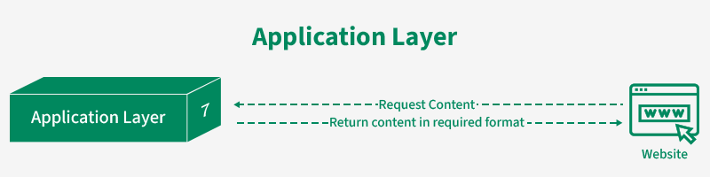
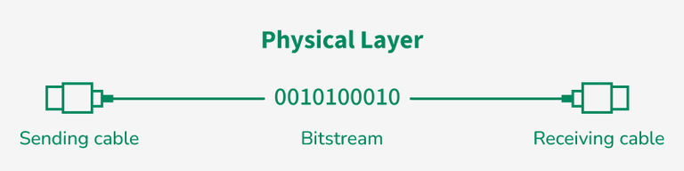

## What is OSI Model?

The **ISO OSI (Open Systems Interconnection) Model** is a set of rules that explains how different computer systems communicate over the **TCP / IP** network.

The OSI Model was developed by **International Organization for Standardization (ISO)** and it consists of **7 layers**.

---


_What is OSI Model | Real World Examples_

---
## Layers of the OSI Model

Each OSI layer has it's own functions and responsibilities. Communication process entails both directions (encapsulation and decapsulation).

Layers 5,6 and 7 can be grouped together. They are all responsible to produce the data (**Protocol Data Unit** - PDU) for the Transport layer.
### 7. Application Layer

Applications produce the data for the Transport layer and often provide a user interface to interact with.

**Example protocols** used in the Application layer: HTTP(S), SMTP, FTP,DNS, SSH...

The **application layer** is concerned with the specific type of application.
### 6. Presentation Layer

The presentation layer is primarily responsible for syntax of the data for the applications to send and consume (e.g. HTML, CSV, JSON).

- Encryption / Decryption
- Compression
### 5. Session Layer

Session Layer is responsible for establishing, managing, terminating sessions between two devices.

**Network File System (NFS)** or **Server Message Block (SMB)** are commonly used protocols at the session layer.

---


_OSI and TCP IP Models - Best Explanation_

---
### 4. Transport Layer

The primary role of the **Transport Layer** is to ensure that data packets arrive in the right order.

- **TCP** - data must be intact (e.g. file sharing) 
	- acknowledgment (ACK) of the successful data transmission and re-transmission of the data in error
	- slower than UDP but more reliable
- **UDP** - retaining packets is less critical (e.g. video streaming)
	- faster than TCP but less reliable (no ACK)

The data in the transport layer is referred to as segments. In this layer source and destination port is added in the header. Segmentation is essential for multiplexing.
### 3. Network Layer

The **Network Layer** is responsible for the transmission of data (in this layer referred to as packets) from one host to another that is located in different networks.

**Network Layer** also takes care of routing - finding the shortest path to transmit the packet, from a number of routes available.

**Network Layer** is utilizing IP protocol in order to route. Network devices (routers and switches) are appending the source and destination **IP address** to the packet's header.
### 2. Data Link Layer

The **Data Link Layer** refers to technologies used to connect two machines across a network.

Data in this layer is referred to as frame.

- Ethernet is an example of a standard at this layer.
- Switches and Bridges are **common Data Link Layer devices**.

The Data Link Layer is divided into two sublayers:

- Logical Link Control (LLC)
- Media Access Control (MAC)
### 1. Physical Layer

The **Physical Layer** refers to the physical communication medium and technologies to transmit data across that medium.

The **physical layer** contains information in the form of bits. **Physical Layer** is responsible for transmitting individual bits from one node to the next. 

When receiving data, this layer will get the signal received and convert it into **0s** and **1s** and send them to the **Data Link layer**, which will put the frame back together. Common physical layer devices are Hub, Repeater, Modem, and Cables.

_More:_ https://www.geeksforgeeks.org/computer-networks/open-systems-interconnection-model-osi/

---
## >> Sources <<

_What is OSI Model:_ 

- https://www.geeksforgeeks.org/computer-networks/open-systems-interconnection-model-osi/
- https://aws.amazon.com/what-is/osi-model/
## >> Disclaimer <<


_Disclaimer: Content for educational purposes only, no rights reserved._

