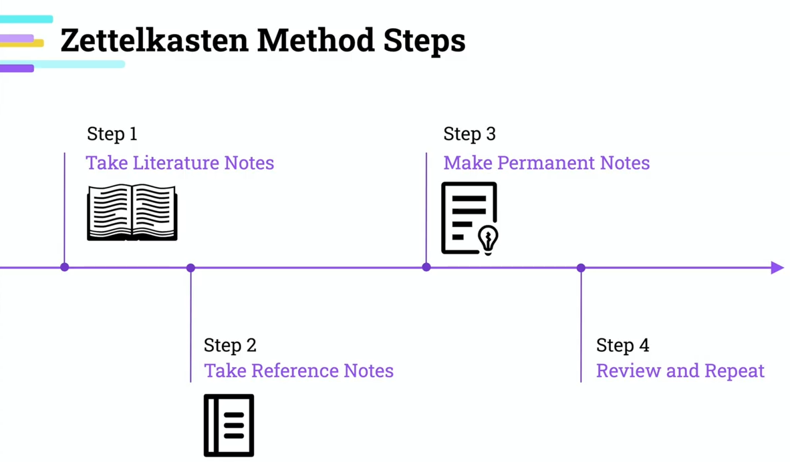

## What is the Zettelkasten method?

**Zettelkasten** is a system of identifiers to link the notes and navigating between them. This methodology leads to higher productivity.

**Zettelkasten** is not only a note taking system. It is a tool that is used for thinking since it brings a structure to note taking and "_connecting the dots_".

This method is often called a "_second brain_". And it is so for a reason...
## The history of the Zettelkasten method

The **Zettelkasten** method was created in the 20th century by social scientist _Niklas Luhman_. He used this system to organize his thoughts and research, which **allowed him to publish more than 50 books and hundreds of articles**. Luhman used physical slip boxes for his Zettelkasten, adding notes and sub notes into the box as he created new ideas.
## Writing is understanding!

Each note contains the thought or idea and should be **written in own words**. This helps mapping the ideas in human brain. Process similar to translation takes place which helps with understanding the topic.

Structuring, simplifying and linking ideas helping storing them outside of the brain and helping with solving complex problems.

A good system removes the need for remembering everything. 

> I only do what is easy. I only write when I immediately know how to do it. If I falter for a moment, I put the matter aside and do something else.
> 
> Niklas Luhmann

Highly productive people deflect resistance like judo champions. Having a flexible workflow allows doing this. This is known as "_effortless productivity_".
## Obsidian - markdown-based, multi-platform note taking app

**Obsidian** is a note-taking app that lets you link notes together. Learn how to download, create, and organize your notes with Obsidian in this comprehensive guide.

_www:_ https://obsidian.md/

---



---
### Note Taking

> Clear thinking becomes clear writing. One cannot exist without the other
> 
> William Zinnser
#### Fleeting notes

Notes being taken during content consumption are called Fleeting Notes. These are being used only as a reminder to take action later and put notes in the right order.

- **Ephemeral** - temporary, should be processed on the same or next day
- **Brief** - few words or ideas
- **Quick capture**

This ability is a cornerstone of effective learning and productivity.
#### Permanent notes

- Articulated
- **Written in own words**
- Solidified

- One idea per card
- **Do not copy**
- Brief and concise
- **Write to publish**
- Quotes allowed - they add context and can add value

Consistency in transferring Fleeting notes to Permanent notes should be frequent / daily. 
#### Linking notes

- Linking permanent notes is a powerful way of building knowledge
- Allows to see connection between notes
- Makes easier to recall and apply knowledge

_Don't collect information. Gather knowledge instead. Linking leads to surprises..._
## Content Consumption

- Intentionality for content consumption
- 80% of content consumed scheduled and aligned with goals
	- articles reading, YouTube videos watching are all scheduled beforehand with a clear purpose
	- each act of content consumption should align with one of the goals set
- 20% of content consumption used for relaxing
### Intentionality

- Consume the content with an intention of writing
	- increased focus
	- allows adapting more observant and analytical perspective
- Being intentional about content consumption will limit the content consumption

## Tags vs Folders

Folders are for separating, tags are for uniting

- Avoid moving files around
- Navigation benefits
- Satisfaction of collecting in folders
- Note taking system should free up time

---
## Sources

### Zettelkasten

- [Introduction to the Zettelkasten Method](https://zettelkasten.de/introduction/)
- [How to Use the Zettelkasten Method for Notetaking](https://www.microsoft.com/en-us/microsoft-365-life-hacks/organization/how-to-use-the-zettelkasten-method)
### Obsidian

- [Obsidian - Sharpen your thinking](https://obsidian.md/)

---