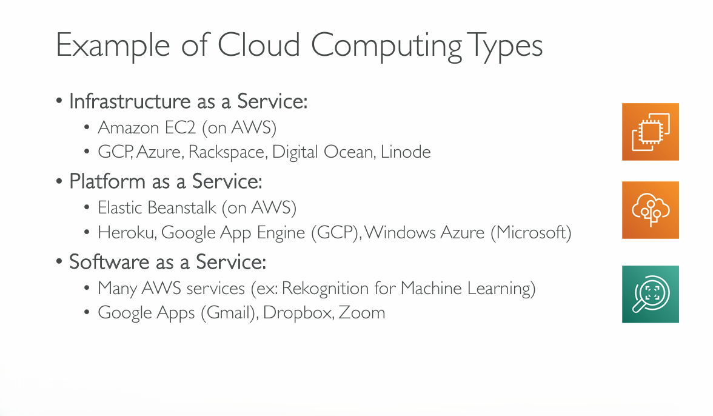
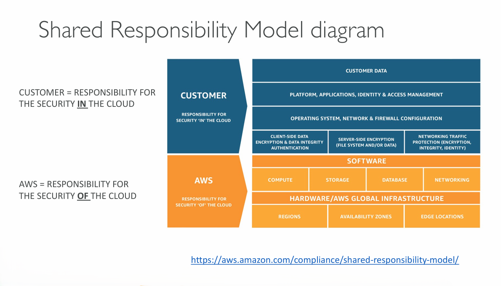
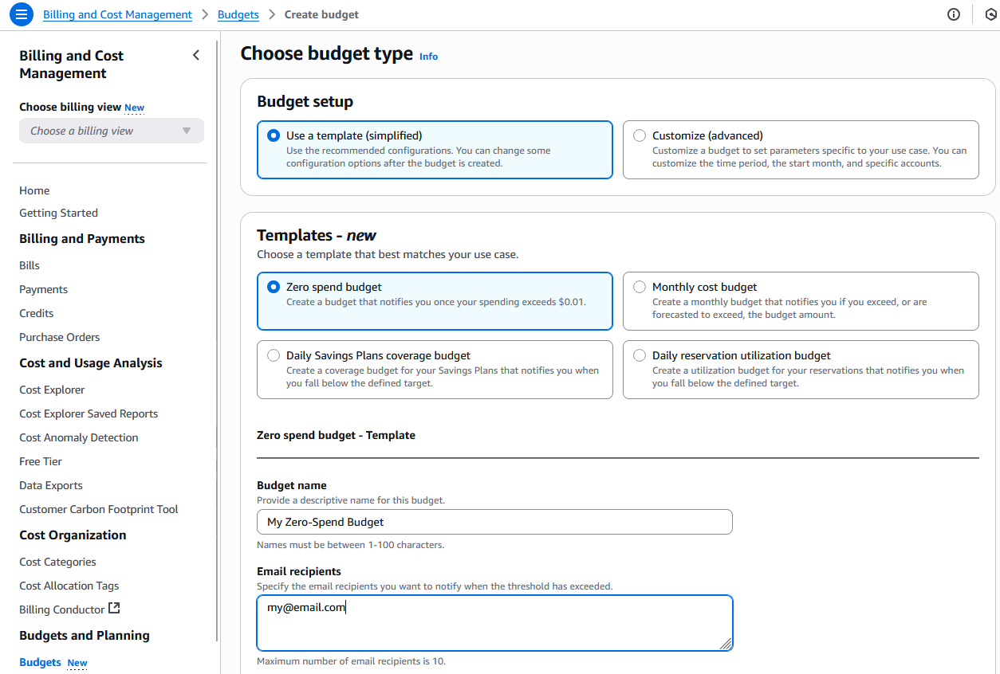


_Disclaimer: Content for educational purposes only, no rights reserved._

Most of the content in this article is coming from **Stephane Maarek's** [Ultimate AWS Certified Cloud Practitioner CLF-C02 2025](https://www.udemy.com/course/aws-certified-cloud-practitioner-new/) course on Udemy.

I highly encourage you to take the [Stephane's courses](https://www.udemy.com/user/stephane-maarek/) as they are awesome and really help understanding the subject.

_More about Stephane Maarek:_

- https://www.linkedin.com/in/stephanemaarek
- https://x.com/stephanemaarek

Below YouTube video is yet another source of information and has been recommended to me.

**This article is just a summary and has been published to help me learning and passing the practitioner exam.**


---



---
## What is Cloud Computing

| **Private Cloud**                                                       | **Public Cloud**                                                                                       | **Hybrid Cloud**                                                        |
| ----------------------------------------------------------------------- | ------------------------------------------------------------------------------------------------------ | ----------------------------------------------------------------------- |
| Cloud services used by a single organization, not exposed to the public | Cloud resources owned and operated by a third party cloud service provider delivered over the internet | Keep some servers on premises and extend some capabilities to the cloud |
| Complete control                                                        |                                                                                                        |                                                                         |
| Security for sensitive applications                                     |                                                                                                        |                                                                         |
| Meet specific business needs                                            |                                                                                                        |                                                                         |
### Five characteristics of Cloud Computing

- On-demand self service
	- Users can provision resources and use them without human interaction from the service provider
- Broad network access
	- Resources available over the network and can be accessed by diverse client platforms
- Multi-tenancy and resource pooling
	- Multiple customers can share the same infrastructure and applications with security and privacy
	- Multiple customers are serviced from the same physical resources
- Rapid elasticity and scalability
	- Automatically and quickly acquire and dispose resources when needed
	- Quickly and easily scale based on demand
- Measured service
	- Usage is measured, users pay for what they used
### Six Advantages of Cloud Computing

- Trade capital expense (CAPEX) for operational expense (OPEX)
	- Pay On-Demand: don't own the hardware
	- Reduced Total Cost of Ownership (TCO) & Operational Expense (OPEX)
- Benefit from massive economies of scale
	- Prices are reduced as AWS is more efficient due to large scale
- Stop guessing capacity
	- Scale based on actual measured usage
- Increase speed and agility
- Stop spending money running and maintaining data centers
- Go global in minutes: leverage the AWS global infrastructure
### Problems solved by the Cloud

- Flexibility: change resource types when needed
- Cost-Effectiveness: pay as you go, for what you use
- Scalability: accommodate larger loads by making hardware stronger or adding additional nodes
- Elasticity: ability to scale out and scale-in when needed
- High-Availability and fault-tolerance: build across data centers
- Agility: rapidly develop, test and launch software applications
### Types of Cloud Computing

- Infrastructure as a Service (IaaS)
	- Provide building blocks for cloud IT
	- Provides networking, computers, data storage space
	- Highest level of flexibility
	- Easy parallel with traditional on-premises IT
- Platform as a Service (PaaS)
	- Removes the need for your organization to manage the underlying infrastructure
	- Focus on the deployment and management of your applications
- Software as a Service (SaaS)
	- Completed product that is run and managed by the service provider



### AWS Global Infrastructure

- AWS Regions
- AWS Availability Zones
- AWS Data Centers
- AWS Edge Locations / Points of Presence
### Shared Responsibility Model


## IAM

IAM = Identity and Access management, Global service

**Groups only contain users, NOT other groups.**

Users don't have to belong to a group and user can belong to multiple groups.

Users or Groups can me assigned JSON documents called policies. Those policies define permissions for the users / groups.

In AWS you apply the **least privilege principle:** don't give user more permission than he / she needs.
### Creating user

```CLI
IAM console > Users
```


Create Group Admin:


### IAM policies structure


IAM policies structure consists of:

- Version: policy language version
- ID (Optional): identifier
- Statement: one or more statements (required)

Statements consists of:

- SID: identifier (optional)
- Effect: Allow or Deny
- Principal: account/user/role to which policy is applied to
- Action: list of allowed or denied actions
- Resource: list of resources to which the actions is applied to
- Condition: conditions for when the policy is applied (optional)
### MFA


### Accessing AWS

- AWS Management Console - protected by password + MFA
- AWS Command Line Interface (CLI) - protected by access keys
- AWS Software Development Kit (SDK) - for code - protected by access keys

Access Keys are generated through AWS Console
Users manage their own access keys

Access Key ID = username
Secret Access Key = password


#### Creating Access Key

```CLI
IAM > Users > Username > Security Credentials > Access Keys > Create Access Key > Command Line Interface (CLI)
```
#### Configuring AWS CLI with the new access key

```CMD
# Configure AWS CLI
aws configure

# Test
aws iam list-users
```
#### IAM roles for Services

- Some AWS service will need to perform actions on your behalf
- Those AWS services will need permissions to be assigned with IAM Roles

**Common Roles:**

- EC2 Instance Roles
- Lambda Function Roles
- Roles for CloudFormation

**Create AWS Service Role:**

```CLI
IAM > Roles > Create role > AWS service
```


Add permissions:


### IAM Security Tools

- IAM Credentials Report (account-level)
	- report that lists all users and status of their credentials

```CLI
IAM > Credentials Report
```

- IAM Access Advisor (user-level)
	- Access Advisor shows the service permissions granted to a user and when those services were last accessed

```CLI
IAM > Users > Username > Last Accessed
```

**IAM Access Advisor (Last Accessed) can be used to determine what user is accessing and to adjust his / her role in line with the "Least Privilege Principle"**
### IAM Best Practices

- Don't use root account
- One physical user = One AWS user
- **Assign users to groups** and assign permissions (policies) to groups
- Create **strong password policy**
- Use and **enforce MFA**
- Create and use **Roles** for giving permissions to AWS services
- Use Access Keys for Programmatic Access (CLI / SDK)
- Audit permissions using **IAM Credentials Report** & **IAM Access Advisor**
- **Never share IAM users & Access Keys**
### Shared Responsibility Model for IAM

| **AWS**                                  | **Organization**                                         |
| ---------------------------------------- | -------------------------------------------------------- |
| Infrastructure (global network security) | Users, Groups, Roles, Policies management and monitoring |
| Configuration and vulnerability analysis | Enabling MFA on all accounts                             |
| Compliance validation                    | Rotating keys                                            |
|                                          | Using IAM tools to apply appropriate permissions         |
|                                          | Analyze access patterns and review permissions           |
## Budget

### Setting up a budget

**Billing and Cost Management is only available for the root user (or user with the right privileges).**

#### 1. Enabling Billing and Cost Management for IAM user.

- log in as root
- click on your user in the top right corner, select account
- scroll down to "IAM user and role access to Billing information"
- activate IAM access

This will allow access to billing information for IAM users that are in Administrators group.


#### 2. Create a budget

```CLI
Billing and Cost Management > Budgets > Create a budget
```


## EC2

### EC2 sizing and configuration options

- Operating System (OS) - Linux, Windows, Mac OS
- How much compute power & cores (CPU)
- How much RAM
- How much storage space
	- Network-attached (EBS & EFS)
	- Hardware (EC2 Instance Store)
- Network card: speed of the card, Public IP address
- Firewall rules: security group
- Bootstrap script (configure at first launch): EC2 User Data
### Amazon EC2 Instance types

*More info:* 
[EC2 Instance Types](https://aws.amazon.com/ec2/instance-types/)
[EC2Instances.info](https://ec2instances.info)

- **General Purpose** (M, T) - General
- **Compute Optimized** (C) - Compute bound applications that benefit from high performance processors
- **Memory Optimized** (R, X) - Optimized to deliver fast performance for workloads that process large data sets in memory (i.e. Elastic Cache)
- **Accelerated Computing** (P, G, Trn, Inf, DL, F, VT1) - Calculations, graphics processing or data pattern matching
- **Storage Optimized** (I, Dx, H1) - High, sequential read and write access to very large data sets on local storage. Low-latency, random I/O operations per second (IOPS)
- **HPC Optimized** (Hpc) - High Performance Computing - complex simulations and deep learning workloads


### Instance type naming conventions

*More info:* [Amazon EC2 Instance type naming conventions](https://docs.aws.amazon.com/ec2/latest/instancetypes/instance-type-names.html)


#### Example

*More info:* [Amazon EC2 Instance type naming conventions](https://docs.aws.amazon.com/ec2/latest/instancetypes/instance-type-names.html)

| Series                                                                                                                                                                                                                                                                                                          | Options                                                                                                                                                                                                                                                                                                                                                                                                                                                                                                                                                                                    |
| --------------------------------------------------------------------------------------------------------------------------------------------------------------------------------------------------------------------------------------------------------------------------------------------------------------- | ------------------------------------------------------------------------------------------------------------------------------------------------------------------------------------------------------------------------------------------------------------------------------------------------------------------------------------------------------------------------------------------------------------------------------------------------------------------------------------------------------------------------------------------------------------------------------------------ |
| - **C** – Compute optimized<br>    <br>- **D** – Dense storage<br>    <br>- **G** – Graphics intensive<br>    <br>- **Hpc** – High performance computing<br>    <br>- **I** – Storage optimized<br>    <br>- **M** – General purpose<br>    <br>- **P** – GPU accelerated<br>    <br>- **R** – Memory optimized | - **a** – AMD processors<br>   <br>- **i** – Intel processors<br>    <br>- **b** – Block storage optimization<br>    <br>- **d** – Instance store volumes<br>    <br>- **e** – Extra storage (for storage optimized instance types), extra memory (for memory optimized instance types), or extra GPU memory (for accelerated computing instance types).<br>    <br>- **n** – Network and EBS optimized<br>    <br>- **q** – Qualcomm inference accelerators<br>    <br>- **`*`tb** – Amount of memory for high-memory instances (3 TiB to 32 TiB)<br>    <br>- **z** – High CPU frequency |
### Launching EC2 instance

```CLI
EC2 > Launch Instance
```

- Name and Tags
- AMI
- Instance Type (t3.micro,t3.large,etc.)
- Key Pair
- Network Settings (Security Group)
- Storage
- Advanced Settings
	- Domain Join
	- IAM Instance Profile
	- Hostname type
	- Instance auto-recovery
	- Shutdown behavior
	- Termination protection
	- Placement group
	- Purchasing option
		- None
		- Capacity Blocks
		- Spot Instances
	- Capacity reservation
	- **User data**

##### Example user data

**User data is only **bootstrap** script and **only starts once** during the machine creation.**

```bash
#!/bin/bash
# Use this for your user data (script from top to bottom)
# install httpd (Linux 2 version)
yum update -y
yum install -y httpd
systemctl start httpd
systemctl enable httpd
echo "<h1>Hello World from $(hostname -f)</h1>" > /var/www/html/index.html
```

##### Connecting to EC2 from Windows Terminal

```bash
ssh -i .\.ssh\id_rsa_aws25 ec2-user@ec2-3-95-191-175.compute-1.amazonaws.com
```

##### EC2 Instances Purchasing options

- **On-Demand instances** - short workload, predictable pricing, pay by second
	- Pay for what used
		- Linux or Windows - billing per second after the first minute
		- All other operating systems - billing per hour
	- Highest cost but no upfront payment
	- No long-term commitment
	- **Recommended for** short-term and un-interrupted workloads
- **Reserved** (1 & 3 years)
	- Up to <font color="red">72%</font> discount compared to On-demand
	- You reserve a specific instance attributes (Instance Type, Region, Tenancy, OS)
	- Reserved Instances - long workloads
	- Payment options - No upfront, Partial Upfront, All Upfront
	- Scope: Regional or Zonal
	- **Recommended for** steady-state usage applications (think #database)
	- Can be bought and sold in the Reserved Instance Market place
	- Convertible Reserved Instances - long workload with flexible instances
		- Can change the EC2 instance type, instance family, OS, scope and tenancy
		- Up to <font color="red">66%</font> discount
- **Saving plans** (1 & 3 years) - commitment to an amount of usage, long workloads
	- Get discount based on long-term usage
	- Commit to a certain type of usage ($10/hour for 1 or 3 years)
	- Usage beyond EC2 Savings Plans is billed at the On-Demand price
	- Locked to a specific instance family & AWS region
	- Flexible across
		- Instance Size (e.g. m5.xlarge, m5.2xlarge)
		- OS (e.g. Linux, Windows)
		- Tenancy (Host, Dedicated, Default)
- **Spot Instances** - short workloads, cheap, can lose instances
	- Up to <font color="red">90%</font> discount
	- Instances can be "lost" at any point if max price is less than current spot price
	- **Recommended for** workloads that are resilient to failure
		- Batch jobs
		- Data analysis
		- Image processing
- **Dedicated Hosts** - book an entire physical server, control instance placement
	- A physical server with EC2 instance capacity fully dedicated to your use
	- **Recommended for** for companies with strong compliance requirements OR server-bound software licenses (per-socket, per-core)
	- Purchasing Options:
		- On-demand
		- Reserved
	- Most expensive option
- **Dedicated Instances** - no other customers will share your hardware
	- Instances run on a dedicated hardware
	- May share hardware with other instances in the same account
	- No control over instance placement


- **Capacity Reservations** - reserve capacity in a specific AZ for any duration


## Security Groups

- Security Groups are the fundamental of network security in AWS
- They control how traffic is allowed in or out of our EC2 instances
- Security Groups **only contain allow rules**
- Security Groups rules can reference by IP or by Security Group
- Security Groups are acting as a "firewall" on EC2 instances

##### Security Group regulate:

- Access to Ports
- Authorized IP ranges - IPv4 and IPv6
- Control inbound network
- Control outbound network

##### **Good to know**

- Can be attached to multiple instances
- Locked down to a region / VPC combination
- Lives "outside" of the EC2 - if traffic is blocked, EC2 won't see it
- It's a good practice to maintain one separate SG for SSH access
- If application is not accessible (time out) then it's a Security Group issue
- If application gives a "connection refused" error then it's an application error or it's not launched
- All inbound traffic is **<font color="red">blocked</font>** by default
- All outbound traffic is **<font color="green">allowed</font>** by default
## Storage

### EBS Volume

- EBS (Elastic Block Store) - Network drive that can be attached to instances while they run
- <font color=green>It allows instances to persist the data, even after their termination</font>
- <font color=green>Can be mounted to one instance at a time</font>
- <font color=green>Bound to an availability zone</font>

- It's a network drive
	- it uses the network to communicate the instance, which means there can be latency
	- it can be detached from an EC2 instance and attached to another one quickly
- <font color=green>It's locked to an Availability Zone (AZ)</font>
	- an EBS Volume is us-east-1a can't be attached to us-east-1b
	- to move a volume across AZ snapshot has to be created first
- <font color=green>It has a provisioned capacity (size in GB and IOPS)</font>
	- you get billed for a provisioned capacity
	- you can increase the capacity of the drive over time


==EBS Volumes can be attached to only 1 EC2 instance at a time but EC2 instances can have multiple EBS Volumes attached to them.==

##### EBS - Delete on Termination


- Controls the EBS behavior when EC2 instance terminates
	- by default the root EBS volume is deleted (attribute enabled)
	- by default any other attached EBS volume is not deleted (attribute disabled)
- This can be controlled by both, AWS Console and AWS CLI
- ==Use case: preserve root volume when instance is terminated==
### EBS Snapshots

- Make a backup (snapshot) of EBS volume at a point in time
- Not necessary to detach the volume to do the snapshot but recommended
- Snapshots can be copied across AZ or Regions

	##### **Features**

	- EBS Snapshot Archive
		- Move a Snapshot to an "archive tier" that is 75% cheaper
		- Takes between 24 to 72 hours for restoring the archive

	```CLI
	EC2 > Snapshots > Recycle Bin > Create retention rule
	```

	When Snapshot Archive is enabled it is possible to Archive it from a drop-down box in AWS Console. Archived Snapshot appears in the Recycle Bin.

	- Recycle Bin for EBS Snapshots
		- Setup rules to retain deleted snapshots so you can recover them after an accidental deletion
		- Specify retention (from 1 day to 1 year)
### EC2 Instance Store

- EBS volumes are network drives with good but "limited" performance
- <font color=green>If high-performance hardware disk is required, EC2 Instance Store can be used</font>

- Better I/O performance
- EC2 Instance store is ephemeral (data lost after stopping EC2 instance)
- ==Use Case:== buffer, cache, scratch data, temporary content

==Risk of data loss if hardware fails==
### EFS - Elastic File System

- ==Managed NFS== (Network File System) that can be mounted on 100s of EC2 instances
- <font color=red>EFS works with Linux EC2 instances only</font> and it's <font color=green>multi-AZ</font>
- Highly available, scalable, <font color=red>expensive</font> (3x gp2 EBS), pay per use, no capacity planning
##### EFS Infrequent Access (EFS-IA)

- Storage class that is cost-optimized for files not accessed every day
- up to 92% lower cost compared to EFS Standard
- When enabled, EFS will automatically move your files to EFS-IA based on the last time they were accessed
- Enable EFS-IA with a Lifecycle Policy
	- Example: move files that are not accessed for 60 days to EFS-IA
- Transparent to the applications accessing EFS (apps don't see whether file is in EFS or EFS-IA)
### EBS vs EFS

| Feature             | EBS                              | EFS                           |
| ------------------- | -------------------------------- | ----------------------------- |
| **Access Model**    | Single-instance                  | Multi-instance                |
| **Use Cases**       | Databases, Development           | Web serving, big data         |
| **Performance**     | Low-latency, high IOPS           | High throughput               |
| **Scalability**     | Limited to provisioned volume    | Auto-scales to petabytes      |
| **File Size Limit** | No limit                         | 47.9 TiB                      |
| **Accessibility**   | Not accessible over the internet | Shared across instances       |
| **Pricing**         | Cheaper for single-instance      | Cost-effective for shared use |
*More:* 
- https://aws.amazon.com/efs/when-to-choose-efs/
- https://lucidity.cloud/blog/ebs-vs-efs
- https://www.cloudzero.com/blog/ebs-vs-efs/
### Amazon FSx

3rd party with high-performance file systems on AWS.

- **FSx for Lustre** - fully managed, high-performance, scalable <font color=green>file storage for High Performance Computing (HPC)</font>. 
	- ==Use cases:== Machine Learning, Analytics, Video processing, Financial Modelling
	- Scales up to 100s GB/s, millions of IOPS, sub-ms latencies
- **FSx for Windows File Server** - fully managed, highly reliable and scalable Windows native shared file system built on Windows File Server. <font color=green>Supports SMB and NTFS file systems. Integrated with AD for security. Can be accessed from AWS or from On-Premise.</font>
- **FSx for NetApp ONTAP** - 

---
# Storage summary

##### EBS Volumes

- network drives attached to one EC2 instance at a time
- Mapped to an Availability Zones
- Can use EBS snapshots for backups and then transferring across AZ's
##### AMI

- Create ready-to-use EC2 instances with own customizations
##### EC2 Image Builder

- automatically build, test and distribute AMI's
##### EC2 Instance Store

- high performance hardware disk attached to our EC2 instance
- ephemeral (data lost if instance stopped or terminated)
##### EFS

- Network File System
- Can be attached to 100s of EC2 instances
- spans through a region
- expensive compared to EBS
##### EFS-IA

- Cost-optimized storage class for infrequently accessed files
- Lifecycle Policy for automatically moving files between tiers
##### FSx for Windows

- Network File System for Windows servers
- SMB and NTFS
- Can be accessed from on-prem and the cloud
##### FSx for Lustre

- High Performance (HPC) Linux file system
