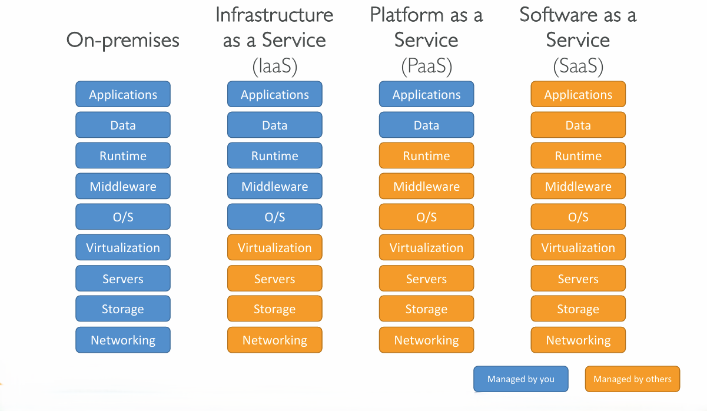
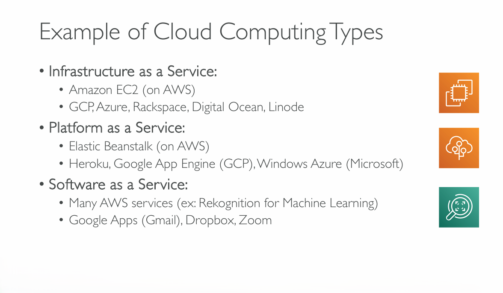
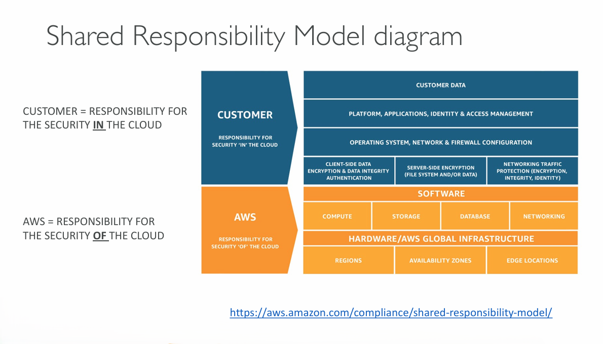

| **Private Cloud**                                                       | **Public Cloud**                                                                                       | **Hybrid Cloud**                                                        |
| ----------------------------------------------------------------------- | ------------------------------------------------------------------------------------------------------ | ----------------------------------------------------------------------- |
| Cloud services used by a single organization, not exposed to the public | Cloud resources owned and operated by a third party cloud service provider delivered over the internet | Keep some servers on premises and extend some capabilities to the cloud |
| Complete control                                                        |                                                                                                        |                                                                         |
| Security for sensitive applications                                     |                                                                                                        |                                                                         |
| Meet specific business needs                                            |                                                                                                        |                                                                         |

---



---
## Five characteristics of Cloud Computing

1. On-demand self service
	- Users can provision resources and use them without human interaction from the service provider
2. Broad network access
	- Resources available over the network can be accessed by diverse client platforms
3. Multi-tenancy and resource pooling
	- Multiple customers can share the same infrastructure and applications with security and privacy
	- Multiple customers are serviced from the same physical resources
4. Rapid elasticity and scalability
	- Automatically and quickly acquire and dispose resources when needed
	- Quickly and easily scale based on demand
5. Measured service
	- Usage is measured, users pay for what they used
## Six advantages of Cloud Computing

1. Trade capital expense (CAPEX) for operational expense (OPEX)
	- Pay On-Demand: don't own the hardware
	- Reduced Total Cost of Ownership (TCO) & Operational Expense (OPEX)
2. Benefit from massive economies of scale
	- Prices are reduced as AWS is more efficient due to a large scale
3. Stop guessing the capacity
	- Scale based on actual measured usage
4. Increase speed and agility
5. Stop spending money running and maintaining data centers
6. Go global in minutes: leverage the [AWS Global Infrastructure]()
## Problems solved by the cloud

- Flexibility: change resources when needed
- Cost-Effectiveness: pay as you go and for what you use
- [Scalability:]() accommodate larger loads by making hardware stronger or adding additional nodes
- [Elasticity:]() ability to scale out and scale in when needed
- [High-Availability]() and Fault-Tolerance: build across data centers
- Agility: rapidly develop, test and launch software applications
## Types of Cloud Computing

- Infrastructure as a Service (IaaS)
	- Provides building blocks for cloud IT
	- Provides networking, compute, storage
	- Highest level of flexibility
	- Easy parallel with traditional on-premises IT
- Platform as a Service (PaaS)
	- Removes the need for your organization to manage the underlying infrastcucture
	- Focus on the deployment and management of your applications
- Software as a Service (SaaS)
	- Completed product that is run and managed by the service provider

## AWS Global Infrastructure

- AWS Regions
- AWS Availability Zones
- AWS Data Centers
- AWS Edge Locations / Points of Presence

_More about AWS Global Infrastructure:_ [AWS Global Infrastructure](https://infrastructure.aws)
## Shared Responsibility Model

_Shared Responsibility Model:_ [Shared Responsibility Model - Amazon Web Services (AWS)](https://aws.amazon.com/compliance/shared-responsibility-model/)

---
## >> Sources <<

- _AWS Global Infrastructure:_ [AWS Global Infrastructure](https://infrastructure.aws)
- _Shared Responsibility Model:_ [Shared Responsibility Model - Amazon Web Services (AWS)](https://aws.amazon.com/compliance/shared-responsibility-model/)

## >> Table of contents (CLF-C02) <<

|                                                                         |                                                                                     |                                                                                       |
| ----------------------------------------------------------------------- | ----------------------------------------------------------------------------------- | ------------------------------------------------------------------------------------- |
| [1. What is Cloud Computing]()   | [2. IAM]()                                                       | [3. Budget]()                                                   |
| [4. Ec2]()                                           | [5. Security Groups]()                               | [6. Storage]()                                                 |
| [7. AMI]()                                           | [8. Scalability & High Availability]() | [9. Elastic Load Balancing]()                   |
| [10. Auto Scaling Group]()          | [11. S3]()                                                       | [12. Databases]()                                           |
| [13. Other Compute Services]()   | [14. Deployments]()                                     | [15. AWS Global Infrastructure]()           |
| [16. Cloud Integrations]()           | [17. Cloud Monitoring]()                           | [18. VPC]()                                                       |
| [19. Security and Compliance]() | [20. Machine Learning]()                           | [21. Account Management and Billing]() |
| [22. Advanced Identity]()             | [23. Other Services]()                               | [24. AWS Architecting & Ecosystem]()        |
## >> Disclaimer <<


_Disclaimer: Content for educational purposes only, no rights reserved._

Most of the content in this series is coming from **Stephane Maarek's** [Ultimate AWS Certified Cloud Practitioner CLF-C02 2025](https://www.udemy.com/course/aws-certified-cloud-practitioner-new/) course on Udemy.

I highly encourage you to take the [Stephane's courses](https://www.udemy.com/user/stephane-maarek/) as they are awesome and really help understanding the subject.

_More about Stephane Maarek:_

- https://www.linkedin.com/in/stephanemaarek
- https://x.com/stephanemaarek

**This article is just a summary and has been published to help me learning and passing the practitioner exam.**

