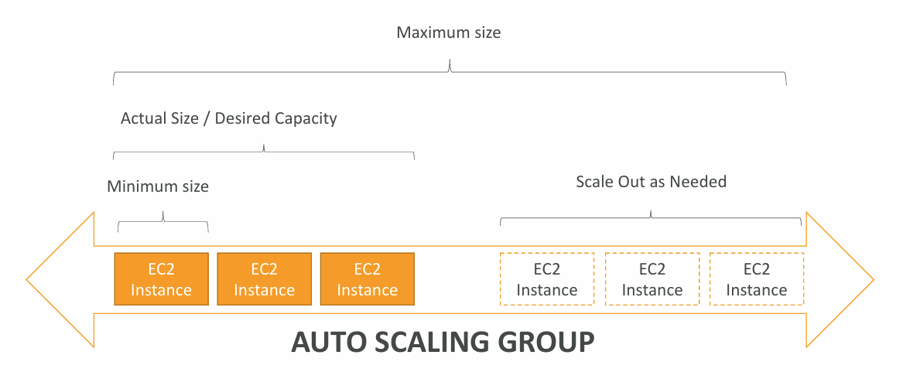

**Auto Scaling Group** contains a collection of EC2 instances that are treated as a logical grouping for the purposes of automatic scaling and management.

**Auto Scaling Group** uses **Auto Scaling** features such as **health check replacements** and **scaling policies**.

---


_AWS EC2 Auto Scaling : Step By Step Tutorial_

---
## The purpose of Auto Scaling Group

- Scale out (add EC2 instances) to match an increased load
- Scale in (remove EC2 instances) to match a decreased load
- Ensure we have a minimum and maximum number of instances running
- Automatically register new instances to the [Load Balancer]()
- Replace unhealthy instances
- Cost Saving (only run at optimal capacity)

## Creating an Auto Scaling Group

- Create Launch Template
- Create Auto Scaling Group
	- Select Availability Zones
	- Select Availability Zone distribution
	- Attach to an existing Load Balancer
	- Turn on Elastic Load Balancing health checks
	- Define the desired capacity
	- Set up Automatic Scaling (optional)
	- Select Instance maintenance policy
	- Additional capacity settings
	- Additional settings
## Auto Scaling Groups - Strategies

- **Manual Scaling** - update the size of an ASG manually
- **Dynamic Scaling** - respond to changing demand
	- **Simple / Step Scaling**
		- When a CloudWatch alarm is triggered (i.e. CPU > 70%) then add 2 instances
		- When a Cloud Watch alarm is triggered (i.e. CPU < 30%) then remove 1 instance
	- **Target Tracking Scaling**
		- Example: Average ASG CPU to stay around 40%
	- **Scheduled Scaling**
		- Anticipate a scaling based on known usage patterns
			- Example: increase the min. capacity to 10 at 5pm on Fridays
	- **Predictive Scaling**
		- Uses Machine Learning to predict the load

---
## >> Sources <<

- https://docs.aws.amazon.com/autoscaling/ec2/userguide/auto-scaling-groups.html

 _Full YouTube Rahul's AWS Course:_ https://www.youtube.com/playlist?list=PL7iMyoQPMtAN4xl6oWzafqJebfay7K8KP
## >> References <<

- [Scalability & High Availability]()
- [Elastic Load Balancing]()
## >> Table of contents (CLF-C02) <<

|                                                                         |                                                                                     |                                                                                       |
| ----------------------------------------------------------------------- | ----------------------------------------------------------------------------------- | ------------------------------------------------------------------------------------- |
| [1. What is Cloud Computing]()   | [2. IAM]()                                                       | [3. Budget]()                                                   |
| [4. EC2]()                                           | [5. Security Groups]()                               | [6. Storage]()                                                 |
| [7. AMI]()                                           | [8. Scalability & High Availability]() | [9. Elastic Load Balancing]()                   |
| [10. Auto Scaling Group]()          | [11. S3]()                                                       | [12. Databases]()                                           |
| [13. Other Compute Services]()   | [14. Deployments]()                                     | [15. AWS Global Infrastructure]()           |
| [16. Cloud Integrations]()           | [17. Cloud Monitoring]()                           | [18. VPC]()                                                       |
| [19. Security and Compliance]() | [20. Machine Learning]()                           | [21. Account Management and Billing]() |
| [22. Advanced Identity]()             | [23. Other Services]()                               | [24. AWS Architecting & Ecosystem]()        |
|                                                                         | [25. Preparing for AWS Practitioner exam]()  |                                                                                       |
## >> Disclaimer <<


_Disclaimer: Content for educational purposes only, no rights reserved._

Most of the content in this series is coming from **Stephane Maarek's** [Ultimate AWS Certified Cloud Practitioner CLF-C02 2025](https://www.udemy.com/course/aws-certified-cloud-practitioner-new/) course on Udemy.

I highly encourage you to take the [Stephane's courses](https://www.udemy.com/user/stephane-maarek/) as they are awesome and really help understanding the subject.

_More about Stephane Maarek:_

- https://www.linkedin.com/in/stephanemaarek
- https://x.com/stephanemaarek

**This article is just a summary and has been published to help me learning and passing the practitioner exam.**
