## What is Amazon S3

**Amazon S3** is <font color=#EB4925>one of the main building blocks of AWS.</font>

It is advertised as "**infinitely scaling**" [storage]().

- Many websites use Amazon S3 as a backbone
- Many AWS services use Amazon S3 as an integration

---


_AWS S3 Full Course | From Beginner to Expert | Deploy Real-Time Projects on AWS_

---
## Amazon S3 Use Cases

- Backup and Storage
- Disaster Recovery
- Archive
- Hybrid Cloud storage
- Application hosting
- Media hosting
- Data lakes & big data analytics
- Software delivery
- Static Website
## Amazon S3 - Buckets

- Amazon S3 allows people to store objects (files) in "_buckets_" (folders)
- Buckets must have a <font color=#EB4925>globally unique name</font> (across **all regions** and **all accounts**)
- Buckets are defined at the <font color=#EB4925>region level</font>
- <font color=#EB4925>S3 looks like a global service but buckets are created in a region</font>
### S3 Bucket naming convention

- No uppercase
- No underscore
- 3-63 characters long
- Not an IP
- Must start with lowercase letter or number
- Must NOT start with the prefix "_xn--_"
- Must NOT start with the suffix "_s3alias_"
## Amazon S3 - Objects

- Objects (files) have a Key
- The <font color=#C7EB25>key</font> is the FULL path:
	- s3://my-bucket/my_file.txt
	- s3://my-bucket/my_folder/another_folder/my_file.txt
- The <font color=#C7EB25>key</font> is composed of <font color=#EBAC25>prefix</font> + <font color=orange>object name</font>
	- s3://my-bucket/<font color=#EBAC25>my_folder/another_folder/</font><font color=orange>my_file.txt</font>
- There is no concept of "_directories_" within S3 buckets (although UI will suggest there is)
	- <font color=#EB4925>Just keys with very long names that contain slashes ("/")</font>

- Object values are the content of the body
	- Max Object size is <font color=#EB4925>5TB</font>
	- If uploading more than <font color=#EB4925>5GB</font>, must be "<font color=#EB4925>multi-part upload</font>"
	- Metadata (list of text key / value pairs - system or user metadata)
	- Tags (Unicode key / value pair - up to 10) - used for security / lifecycle
## Amazon S3 - Security

- User-based
	- [IAM Policies]() - which API calls should be allowed for a specific user from IAM
- Resource-based
	- Bucket policies - bucket-wide rules from the S3 console - allows cross account
	- Object Access Control List (ACL) - finer grain (can be disabled)
	- Bucket Access Control List (ACL) - less common (can be disabled)
- [IAM]() Principal can access an S3 object if
	- The user IAM permissions ALLOW it OR the resource policy ALLOWS it AND there is no explicit DENY
- Encryption - encrypt objects in Amazon S3 using [encryption keys]()
## S3 Bucket Policies

- JSON based policies
	- Resources: buckets and objects
	- Effect: <font color=#C7EB25>Allow</font> / <font color=#EB4925>Deny</font>
	- Actions: Set of API to Allow or Deny
	- Principal: The account or user to apply the policy to

- Use S3 bucket policy to:
	- Grant public access to the bucket
	- Force objects to be [encrypted]() at upload
	- Grant access to another account (Cross Account)

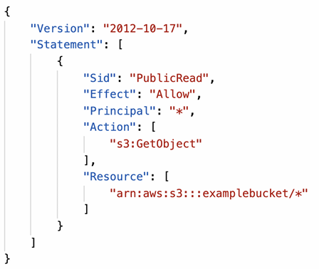

### <font color=#EB4925>Examples</font>

- **Public access** - Bucket Policy
- **User access to S3** - IAM permissions
- **EC2 instance access** - IAM Roles
- **Cross-Account access** - Bucket Policy

Bucket settings for Block Public Access

- <font color=#EB4925>Those settings were created to prevent company data leaks</font>
- If you know your bucket should never be public, leave them
### Applying Bucket Policy

```AWSConsole
S3 > General purpose buckets (or other) > your-bucket > Permissions > Ensure Allow public access is enabled
```

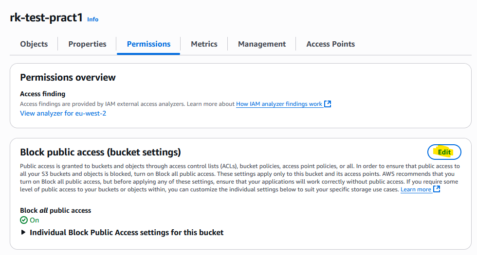

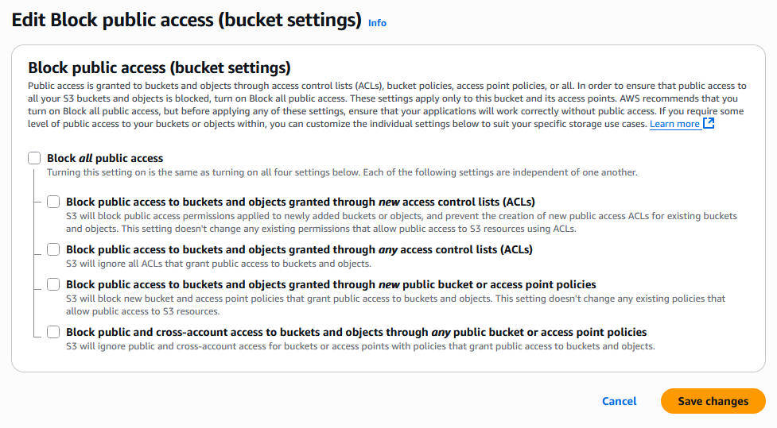

Edit Bucket policy (follow Policy examples OR Policy Generator)

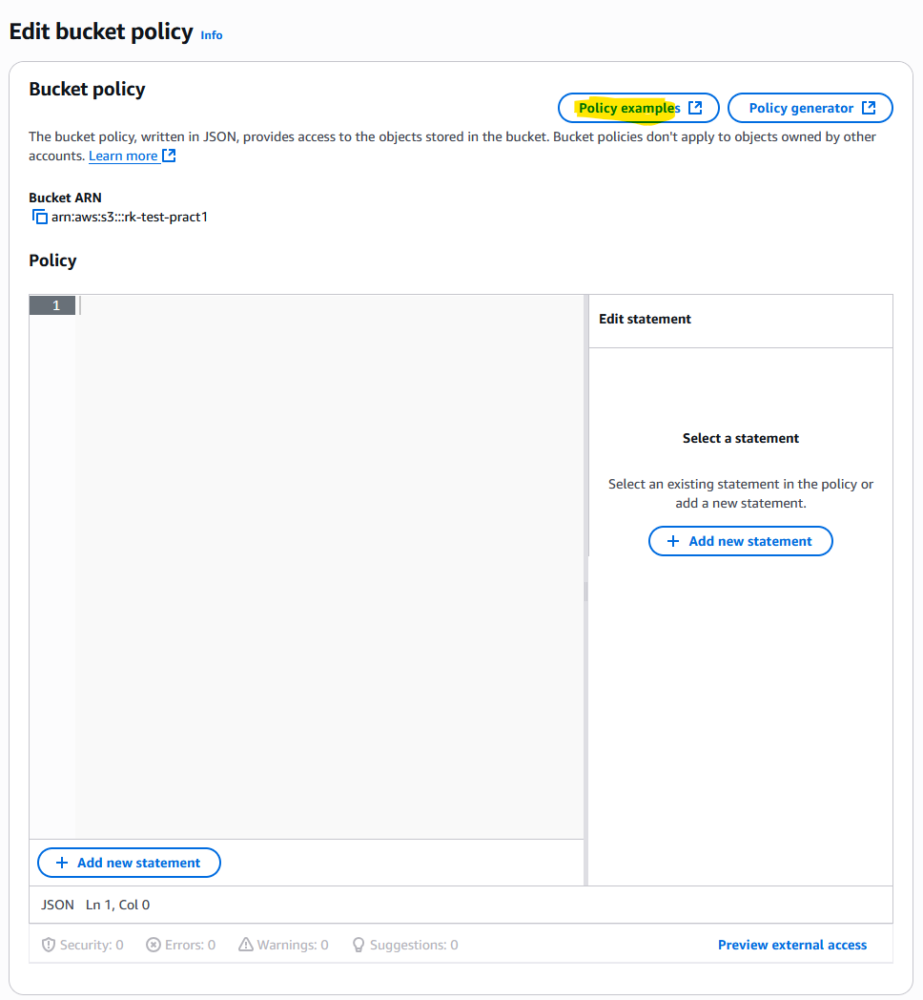

#### Policy Generator

- "arn" can  be found in the bucket settings itself
- "/\*" can / should be added to propagate to all objects in the bucket

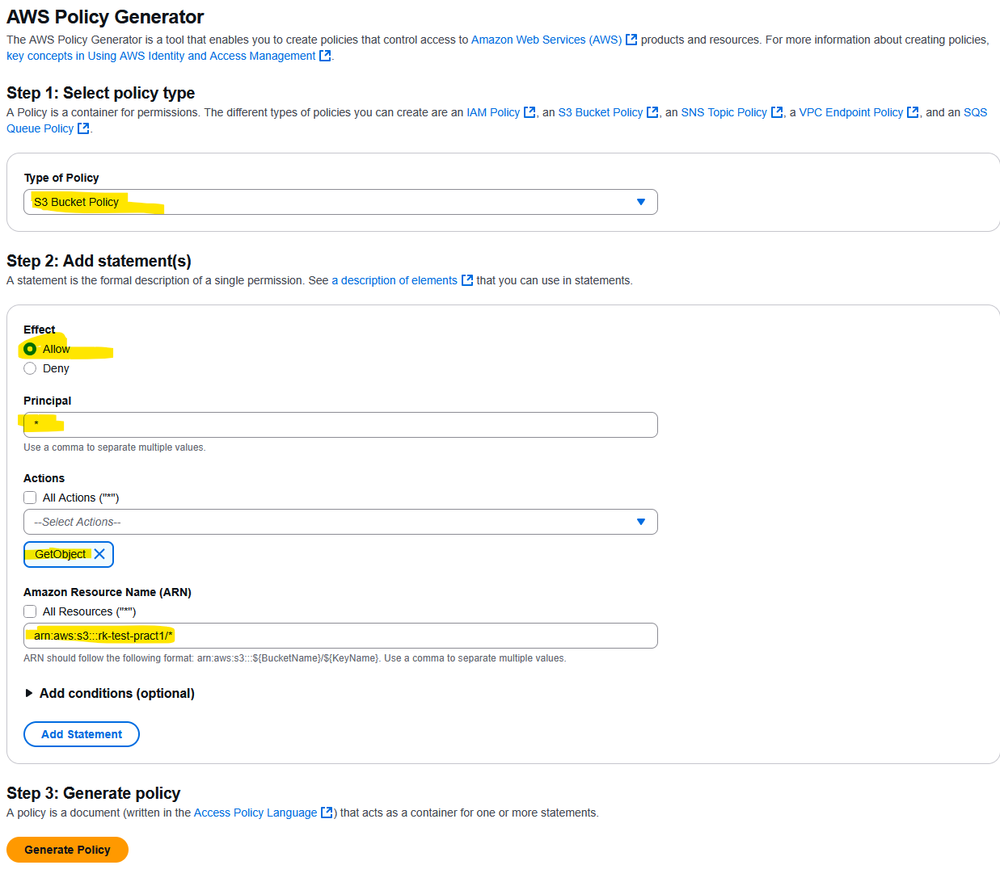

Add Statement and copy the generated policy to Bucket policy

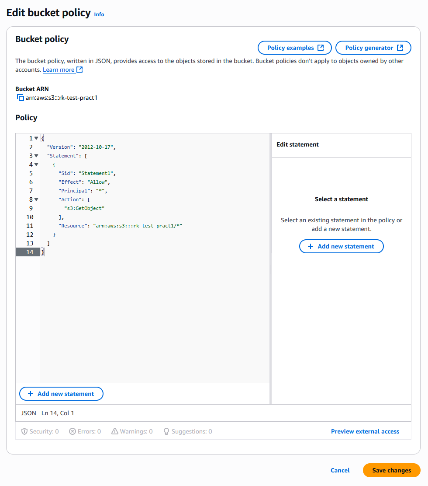

Object(s) in that bucket should now be available from the internet via URL

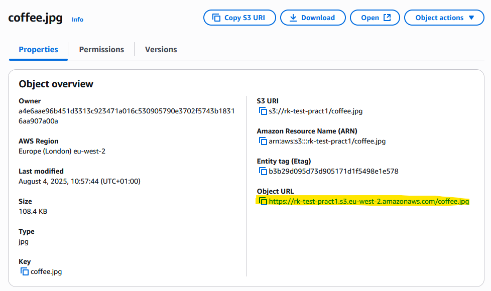
## S3 - Static Website Hosting

<font color=#EB4925>Bucket must be made public (S3 Bucket policy, see above) in order for the static website to work. If it isn't then 403 Forbidden error appears.</font>
### Enable static website hosting

```AWSConsole
S3 > General purpose buckets (or other) > your-bucket > Properties > Static website hosting
```

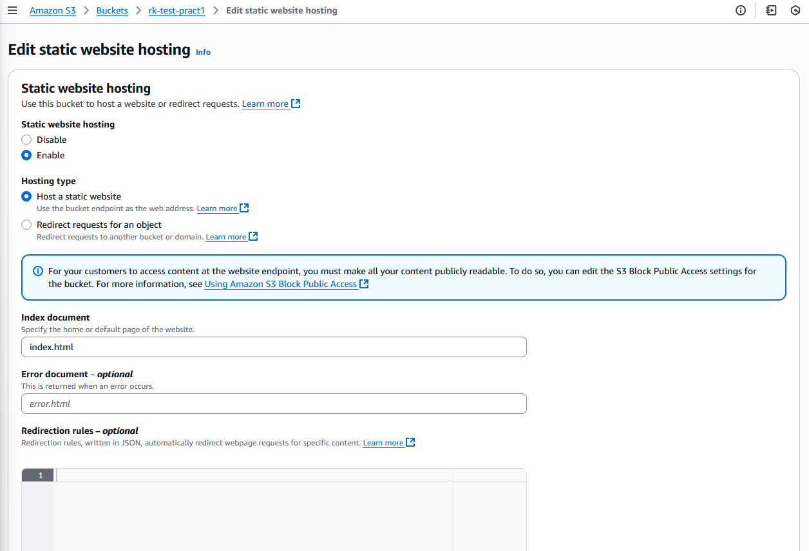

##### <font color=#EBAC25>Voila!</font>

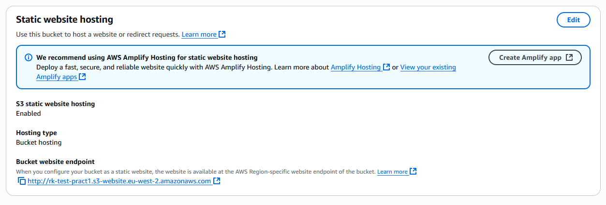

<font color=#EB4925>Although no HTTPS enabled!</font> - check "[AWS Certificate Manager (ACM)]()" section in [Security and Compliance]() on how to use ACM for SSL / TLS certificate management.
## Amazon S3 - Versioning

- Versioning can be enabled at the bucket level
- Versioning buckets:
	- Protect against unintended deletes (ability to restore the version)
	- Easy roll back to previous version
- <font color=#EBAC25>Notes:</font>
	- Any file that is not versioned prior to enabling versioning will have version "_null_"
	- Suspending versioning does not delete the previous versions
### Enable S3 Versioning

```AWSConsole
S3 > General purpose buckets (or other) > your-bucket > Properties > Bucket Versioning > Edit > Enable
```

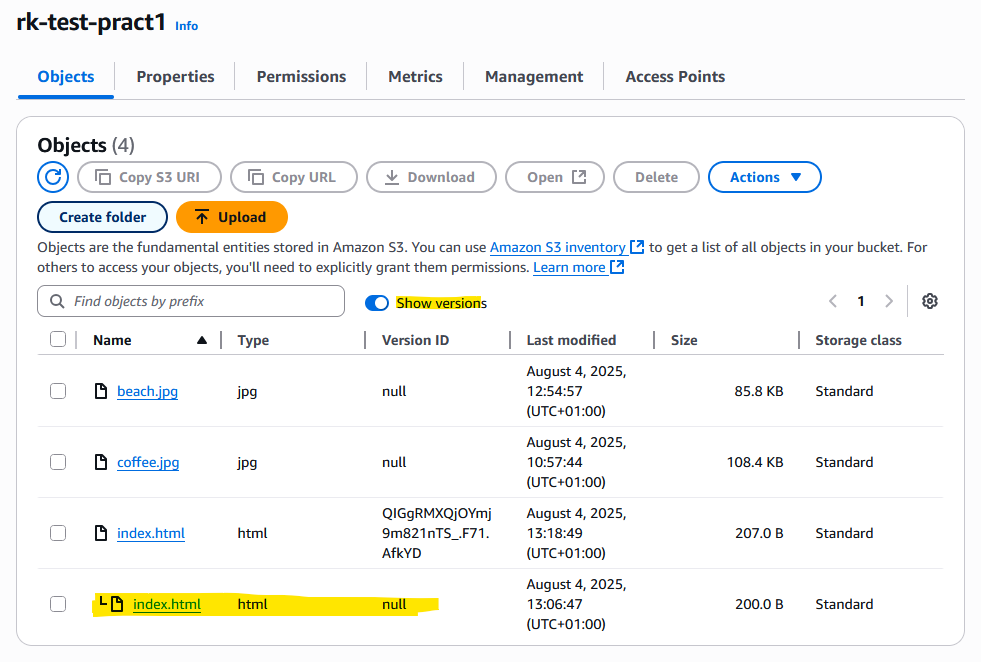

In order to <font color=#C7EB25>restore the file</font>, toggle "_Show Versions_" switch and <font color=#EB4925>DELETE</font> unwanted object (destructive, will permanently delete).
##### <font color=#EB4925>If "show versions" toggle is off, object can be safely deleted. It will NOT be permanently deleted, only "Delete marker" will be applied. Object can be easily restored when "Show versions" is ON.</font>
## S3 - Replication

- **CRR** - Cross Region Replication
- **SRR** - Same Region Replication

<font color=#EB4925>For S3 replication to work,</font> [versioning]()  <font color=#EB4925>must be enabled</font> on both - source and destination buckets. Buckets can be different AWS Accounts.

Copying is asynchronous, proper IAM permissions must be applied to S3.
##### <font color=#EBAC25>Use Cases:</font>

- **CRR** - compliance, lower latency access, replication across accounts
- **SRR** - log aggregation, live replication between production and test accounts
### Enabling S3 Replication

1. Create 2 new buckets and <font color=#EB4925>enable</font> [versioning]() <font color=#EB4925>in both</font>

	- rk-test-replica-london-origin
	- rk-test-replica-irl-dest	

2. On the origin bucket create the Replication rules

	- Enable replication
	- Select source and destination buckets
	- Create IAM role or select an existing one (Create)
	- Select any other options (encryption, destination storage class, delete marker replication and so on)
## S3 Storage Classes

### <font color=#EBAC25>Standard</font>

- Amazon S3 Standard - General Purpose
	- 99.99% Availability
	- Used for frequently accessed data
	- Low latency and high throughput
	- Sustain 2 concurrent facility failures
	- <font color=#EBAC25>Use cases:</font> Big Data analytics, mobile & gaming applications, content distribution
### <font color=#EBAC25>Infrequent access</font>

For data that is less frequently accessed but requires rapid access when needed. Lower cost than <font color=#EBAC25>S3 Standard</font>.

- Amazon S3 Standard-Infrequent Access (IA)
	- 99.9% Availability
	- <font color=#EBAC25>Use cases:</font> Disaster Recovery, backups
- Amazon S3 One Zone-Infrequent Access
	- For data that is less frequently accessed but requires rapid access when needed
	- High Durability (99.999999999% Availability in a single AZ)
	- 99.5% Availability
	- <font color=#EBAC25>Use cases:</font> Secondary backup copies of on-prem data, data can be recreated
### <font color=#EBAC25>Glacier</font>

**Low-cost** object storage for archiving / backup.

**Pricing includes storage price + retrieval cost.**

- Amazon S3 Glacier Instant Retrieval
	- Milliseconds retrieval, great for data accessed once a quarter
	- Minimum storage duration of 90 days
- Amazon S3 Glacier Flexible Retrieval
	- Expedited (1 to 5 mins), Standard (3 to 5 hours), Bulk (5 to 12 hours) - free
- Amazon S3 Glacier Deep Archive
	- For long-term storage
	- Standard (12 hours), Bulk (48 hours)
	- Minimum storage duration of 180 days
## Intelligent tiering

Moves objects automatically between Storage Tiers based on usage for a small monthly monitoring and auto-tiering fee.

<font color=#C7EB25>There is no retrieval charges in S3 Intelligent Tiering.</font>

- **Frequent Access tier** (automatic): default tier
- **Infrequent Access tier** (automatic): objects not accessed for 30 days
- **Archive instant Access tier** (automatic): objects not accessed for 90 days
- **Archive Access tier (optional):** configurable from 90 to 700+ days
- **Deep Archive Access tier (optional):** configurable from 180 to 700+ days

Objects can be moved between classes manually or using S3 Lifecycle policies.

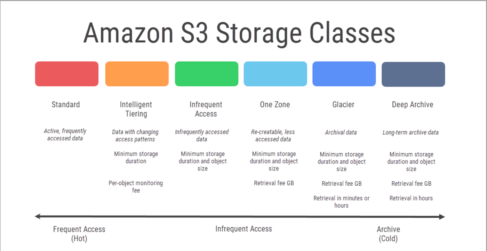

_More:_ 
- S3 Storage classes: https://aws.amazon.com/s3/storage-classes/
- S3 Pricing: https://aws.amazon.com/s3/pricing/
## S3 Durability and Availability

- **Durability**
	- High durability (99.999999999, 11 9's) of objects across multiple AZ
	- If you store 10,000,000 objects with Amazon S3, you can on average expect to incur a loss of a single object once every 10,000 years
	- Same for all storage classes
- **Availability**
	- Measures how readily available a service is
	- Varies depending on storage class
	- Example: S3 standard has 99.99% availability = not available for 53 minutes a year

_More:_ 
- https://docs.aws.amazon.com/AmazonS3/latest/userguide/DataDurability.html
- https://aws.amazon.com/s3/storage-classes/
## S3 Encryption

- Server-Side Encryption (Default)
- Client-Side Encryption (Encrypted by user at the client side)
## IAM Access Analyzer for S3

- Ensures that only intended people have access to your S3 buckets
- Example: publicly accessible bucket, bucket shared with other AWS account
- Evaluates S3 Bucket Policies, S3 ACLs, S3 Access Point Policies
- Powered by [IAM Access Analyzer](), ([Security and Compliance section]())
## AWS Snowball

- Highly-secure, portable devices to collect and process data at the edge and / or migrate data in and out of AWS
- Helps to migrate up to Petabytes of data
##### <font color=#EB4925>It is recommended to use AWS Snowball devices if it would take more than a week to transfer over the network.</font>

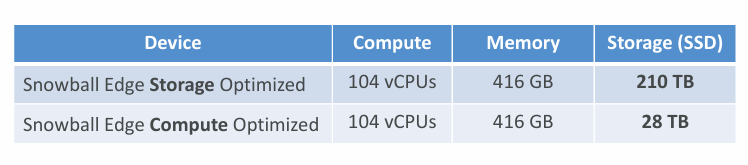

_More:_
- https://aws.amazon.com/snowball/
- https://aws.amazon.com/snowball/pricing/
## AWS Storage Gateway

Amazon S3 File Gateway connects on-premises applications to the cloud to store and access archive repositories, application data, database backups and so on.

S3 File Gateway is used for on-premises data intensive applications that need file protocol access to objects in S3.


_More:_ https://aws.amazon.com/storagegateway/file/s3/
### Types of Storage Gateway

- <font color=#EBAC25>File Gateway</font>
	- [S3 File Gateway]() presents Server Message Block (**SMB**) or Network File System (**NFS**) based access to data in Amazon [S3]()
- <font color=#EBAC25>Volume Gateway</font>
	- **iSCSI block storage** volumes to your on-premises applications that you can store in Amazon [S3]() or migrate to [EBS]()
- <font color=#EBAC25>Tape Gateway</font>
	- virtual tapes to leading to backup application that can be stored in [S3]() or [S3 Glacier]()

_More about Storage Gateway types:_ https://aws.amazon.com/storagegateway/

---
## >> Sources <<

- S3 Documentation: https://docs.aws.amazon.com/s3/
- S3 Availability and Durability: https://docs.aws.amazon.com/AmazonS3/latest/userguide/DataDurability.html
- S3 Storage Classes: https://aws.amazon.com/s3/storage-classes/
- S3 Pricing: https://aws.amazon.com/s3/pricing/
- S3 AWS Snowball: https://aws.amazon.com/snowball/
- S3 File Gateway: https://aws.amazon.com/storagegateway/file/s3/
- AWS Storage Gateway types: https://aws.amazon.com/storagegateway/

 _Full YouTube Rahul's AWS Course:_ https://www.youtube.com/playlist?list=PL7iMyoQPMtAN4xl6oWzafqJebfay7K8KP
## >> References <<

- [Storage]()
- [Security and Compliance]()
## >> Table of contents (CLF-C02) <<

|                                                                         |                                                                                     |                                                                                       |
| ----------------------------------------------------------------------- | ----------------------------------------------------------------------------------- | ------------------------------------------------------------------------------------- |
| [1. What is Cloud Computing]()   | [2. IAM]()                                                       | [3. Budget]()                                                   |
| [4. EC2]()                                           | [5. Security Groups]()                               | [6. Storage]()                                                 |
| [7. AMI]()                                           | [8. Scalability & High Availability]() | [9. Elastic Load Balancing]()                   |
| [10. Auto Scaling Group]()          | [11. S3]()                                                       | [12. Databases]()                                           |
| [13. Other Compute Services]()   | [14. Deployments]()                                     | [15. AWS Global Infrastructure]()           |
| [16. Cloud Integrations]()           | [17. Cloud Monitoring]()                           | [18. VPC]()                                                       |
| [19. Security and Compliance]() | [20. Machine Learning]()                           | [21. Account Management and Billing]() |
| [22. Advanced Identity]()             | [23. Other Services]()                               | [24. AWS Architecting & Ecosystem]()        |
|                                                                         | [25. Preparing for AWS Practitioner exam]()  |                                                                                       |
## >> Disclaimer <<


_Disclaimer: Content for educational purposes only, no rights reserved._

Most of the content in this series is coming from **Stephane Maarek's** [Ultimate AWS Certified Cloud Practitioner CLF-C02 2025](https://www.udemy.com/course/aws-certified-cloud-practitioner-new/) course on Udemy.

I highly encourage you to take the [Stephane's courses](https://www.udemy.com/user/stephane-maarek/) as they are awesome and really help understanding the subject.

_More about Stephane Maarek:_

- https://www.linkedin.com/in/stephanemaarek
- https://x.com/stephanemaarek

**This article is just a summary and has been published to help me learning and passing the practitioner exam.**

