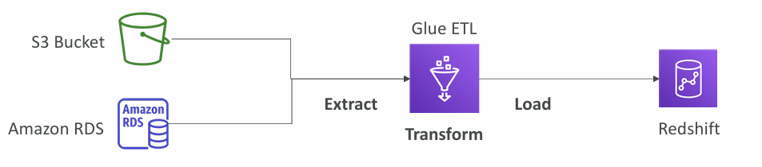

## Relational Databases

A **relational database** is a type of database that organizes data into **rows** and **columns**, which **collectively form a table where the data points are related to each other**.

Data is typically structured across multiple tables, which can be joined together via a primary key or a foreign key. **These unique identifiers demonstrate the different relationships which exist between tables, and these relationships are usually illustrated through different types of data models**.
## No-SQL Databases

- No-SQL = non-relational databases
- No-SQL databases are purpose built for specific data models and have flexible schemas for building modern applications

**Benefits:**
- Flexibility (easy to evolve data model)
- Scalability (designed to scale out by using distributed clusters)
- High-Performance (optimized for a specific data model)
- Highly functional (types optimized for the data model)

<font color=#EBAC25>Use cases:</font> Key-value, document, graph, in-memory, search databases
## RDS and Aurora
### Amazon RDS

<font color=#EBAC25>RDS</font> stands for <font color=#EBAC25>Relational Database Service</font>. It is a managed DB service.

It allows creating databases in the cloud that are managed by AWS:

- Postgres
- MySQL
- MariaDB
- Oracle
- Microsoft SQL Server
- IBM DB2
- Aurora (AWS Proprietary)

**Advantage of using RDS vs deploying DB on EC2:**

- RDS is a managed service
	- Automated Provisioning and OS patching
	- Continuous backups and restore to specific timestamp (Point in Time Restore)
	- Monitoring dashboards
	- Read replicas for improved read performance
	- [Multi-AZ setup]() for DR
	- Maintenance windows for upgrades
	- [Scaling]() capability (both, vertical and horizontal)
	- Storage backed by [EBS]()
- Not possible to SSH into DB instances (managed service)
#### Example RDS application architecture


_Source:_ https://docs.aws.amazon.com/AmazonRDS/latest/UserGuide/Welcome.html
### Amazon Aurora

- Aurora is proprietary technology from AWS (not open sourced)
- PostgreSQL and MySQL are both supported
- Aurora is "**AWS Optimized**" and claims to be **5x performance improved over MySQL on RDS** and **3x the performance of Postgres on RDS**
- Aurora storage automatically grows and increments of 10GB (up to 128 TB)
- Aurora costs about 20% more than RDS
#### Amazon Aurora Serverless

- Automated (on-demand) database with autoscaling based on actual usage
- PostgreSQL and MySQL are both supported as Aurora Serverless DB
- No capacity planning required
- Least management overhead
- Pay-per-second, COULD BE more effective
 
<font color=#EBAC25>Use cases:</font>  infrequent, intermittent or unpredictable workloads.
##### <font color=#C7EB25>Aurora with no management overhead = Aurora Serverless.</font>
#### Create RDS database

```AWSConsole
Aurora and RDS > Create a database
```
#### RDS Deployment options

- Read Replicas
	- Scale the read workload of your DB
	- Can create up to 15 replicas
	- Data is only written to the main DB
- Multi-AZ
	- Failover in case of AZ outage ([High-Availability]())
	- Data only read/written to the main DB
	- Can only have 1 [AZ]() as a failover
- Multi-Region
	- Multi-Region (Read Replicas)
	- Writes only to the main database
	- Local performance for global reads
	- Additional replication cost
	- <font color=#EBAC25>Use case:</font> DR in another region

_More:_ [Configuring and managing a Multi-AZ deployment for Amazon RDS](https://docs.aws.amazon.com/AmazonRDS/latest/UserGuide/Concepts.MultiAZ.html)
## Other Database Types
### <font color=#EBAC25>Amazon ElastiCache</font>

- The same way **RDS** is to get **managed Relational Databases**, **ElastiCache** is to get managed <font color=#EBAC25>Redis</font> or <font color=#EBAC25>Memcached</font>.
- Caches are <font color=#C7EB25>in-memory databases</font> with high performance and low latency
- Helps <font color=#C7EB25>reducing load</font> from <font color=#C7EB25>databases with read-intensive workloads</font>

- AWS taking care of OS maintenance, patching, optimizations, setup, configuration, monitoring, failure recovery and backups

_More:_ https://docs.aws.amazon.com/elasticache/
### <font color=#EBAC25>DynamoDB</font>

- Fully managed, [Highly Available]() with replication across 3AZ
- <font color=#C7EB25>No-SQL database</font> - not a relational DB
- <font color=#C7EB25>Scales to massive workloads, distributed, "serverless"</font>
- Millions of requests per second, trillions of row, 100s TB of storage
- Fast and consistent performance
- <font color=#C7EB25>Single-digit millisecond latency</font>
- Integrated with [IAM]() for security, authorization and administration
- Low cost and auto scaling capabilities
- Standard & Infrequent Access (IA) Table Class
#### DynamoDB Accelerator (DAX)

- Fully Managed in-memory cache for DynamoDB
- 10x performance improvement when accessing DynamoDB tables

DAX is only used for DynamoDB where [ElastiCache]() can be used for other databases.
#### DynamoDB Global Tables

- Makes DynamoDB table accessible with low latency in multiple-regions
- Active-Active replication (read/write to any AWS Region)
### <font color=#EBAC25>Redshift</font>

- Redshift is based on PostgreSQL
- It's <font color=#C7EB25>OLAP - Online Analytical Processing (analytics and data warehousing)</font>
- Load data once every hour, not every second
- 10x better performance than other data warehouses
- Scales to PBs of data
- Columnar storage of data (instead of rows)
- Massively Parallel Query Execution (MPP)
- Pay-as-you-go based on the instances provisioned
- Has a SQL interface for performing queries
#### Redshift Serverless

- Auto Scaling
- Run analytics workload without managing data warehouse infrastructure
- Pay only for what you use
- <font color=#EBAC25>Use cases:</font> Reporting, real-time analytics
### <font color=#EBAC25>Amazon EMR</font>

- EMR stands for "_Elastic MapReduce_"
- EMR helps creating <font color=#C7EB25>Hadoop clusters (Big Data)</font> to analyze and process vast amounts of data
- The clusters can be made of hundreds of EC2 instances
- EMR takes care of all the provisioning and configuration
- Auto-scaling and integrated with Spot instances
- <font color=#EBAC25>Use cases:</font> data processing, machine learning, web indexing, big data
### <font color=#EBAC25>Athena</font>

- <font color=#C7EB25>Serverless</font> query service to perform analytics against [S3]() objects
- <font color=#C7EB25>Uses standard SQL language</font> to query the files
- Supports CSV, JSON, ORD, Avro, Parquet
- Pricing: $5 per TB of data scanned
- <font color=#EBAC25>Use cases:</font> Business intelligence, analytics, reporting, analyze & query [VPC Flow Logs](), [ELB]() Logs, [CloudTrail]() logs, etc.
##### <font color=#EB4925>Exam tip:</font> analyze data in S3 using serverless SQL = <font color=#EBAC25>Athena</font>
### <font color=#EBAC25>QuickSight</font>

Allows creating dashboards for services used in AWS. Per-session pricing.

- <font color=#C7EB25>Serverless machine-learning powered business intelligence service</font> to create <font color=#EBAC25>interactive dashboards</font>
- <font color=#EBAC25>Use cases:</font>
	- Business analytics
	- Building visualisations
	- Ad-hoc analysis
	- Get business insights using data
- Integrated with RDS, Aurora, Athena, Redshift, S3

_More:_ https://docs.aws.amazon.com/quicksight/
### <font color=#EBAC25>DocumentDB</font>

Aurora version for MongoDB (NoSQL database).

- MongoDB is used to store, query and index JSON data
- Fully Managed, Highly Available with replication across 3AZ
- DocumentDB storage automatically grows in increments of 10 GB
### <font color=#EBAC25>Neptune</font>

- Fully managed <font color=#C7EB25>graph</font> database
- A popular graph dataset would be a <font color=#C7EB25>social network</font>
	- Users have friends
	- Posts have comments
	- Comments have likes from users
	- Users share and like posts
- [Highly Available]() across 3AZ with up to 15 replicas
- Build and run applications working with highly connected datasets = optimized for those complex queries
- Can store up to billions of relations and query the graph with milliseconds latency
- <font color=#EBAC25>Use cases:</font> knowledge graphs (Wikipedia), fraud detection, recommendation engines, social networking
### <font color=#EBAC25>Amazon Timestream</font>

- Serverless time series database
- Automatically scales up and down to adjust capacity
- Store and analyze trillions of events per day
### <font color=#EBAC25>Amazon managed Blockchain</font>

- Blockchain makes it possible to build applications where multiple parties can execute transactions without the need for a trusted, central authority
- Amazon managed Blockchain is a managed service that allows:
	- Join public Blockchain networks
	- Create your own scalable, private network
- Compatible with:
	- <font color=#C7EB25>Hyperledger Fabric</font>
	- <font color=#C7EB25>Ethereum</font>
### <font color=#EBAC25>AWS Glue</font>

Managed <font color=#EB4925>E</font>xtract, <font color=#EB4925>T</font>ransform and <font color=#EB4925>L</font>oad (<font color=#EB4925>ETL</font>) service.

- Useful to prepare and transform data for analytics
- Fully <font color=#C7EB25>serverless</font> service


### <font color=#EBAC25>DMS</font>

**DMS** - <font color=#EB4925>D</font>atabase <font color=#EB4925>M</font>igration <font color=#EB4925>S</font>ervice

- Quick and secure migrate databases to AWS
- The source database remains available during the migration

- Homogeneous migrations: i.e. Oracle to Oracle
- Heterogeneous migrations: i.e. MSSQL to Aurora
## Database Summary

- **Relational Databases** - OLTP: RDS & Aurora (SQL)
- Differences between Multi-AZ, Read Replicas, Multi-Region
- **In-memory Database:** ElastiCache
- **Key/Value Database:** DynamoDB (serverless) & DAX (cache for DynamoDB)
- **Warehouse** - OLAP: **Redshift** (SQL)
- **Hadoop Cluster:** EMR
- **Athena:** query data on Amazon S3 (serverless & SQL)
- **QuickSight:** dashboards on your data (serverless)
- **DocumentDB:** “Aurora for MongoDB” (JSON – NoSQL database)
- **Amazon QLDB:** Financial Transactions Ledger (immutable journal, cryptographically verifiable)
- **Amazon Managed Blockchain:** managed Hyperledger Fabric & Ethereum blockchains
- **Glue:** Managed ETL (Extract Transform Load) and Data Catalog service
- **Database Migration:** DMS
- **Neptune:** graph database
- **Timestream:** time-series database 

---
## >> Sources <<

- Amazon RDS and Aurora Documentation: https://docs.aws.amazon.com/rds/
- ElastiCache: https://docs.aws.amazon.com/elasticache/
- QuickSight: https://docs.aws.amazon.com/quicksight/
- [Configuring and managing a Multi-AZ deployment for Amazon RDS](https://docs.aws.amazon.com/AmazonRDS/latest/UserGuide/Concepts.MultiAZ.html)

## >> Table of contents (CLF-C02) <<

|                                                                         |                                                                                     |                                                                                       |
| ----------------------------------------------------------------------- | ----------------------------------------------------------------------------------- | ------------------------------------------------------------------------------------- |
| [1. What is Cloud Computing]()   | [2. IAM]()                                                       | [3. Budget]()                                                   |
| [4. EC2]()                                           | [5. Security Groups]()                               | [6. Storage]()                                                 |
| [7. AMI]()                                           | [8. Scalability & High Availability]() | [9. Elastic Load Balancing]()                   |
| [10. Auto Scaling Group]()          | [11. S3]()                                                       | [12. Databases]()                                           |
| [13. Other Compute Services]()   | [14. Deployments]()                                     | [15. AWS Global Infrastructure]()           |
| [16. Cloud Integrations]()           | [17. Cloud Monitoring]()                           | [18. VPC]()                                                       |
| [19. Security and Compliance]() | [20. Machine Learning]()                           | [21. Account Management and Billing]() |
| [22. Advanced Identity]()             | [23. Other Services]()                               | [24. AWS Architecting & Ecosystem]()        |
|                                                                         | [25. Preparing for AWS Practitioner exam]()  |                                                                                       |
## >> Disclaimer <<


_Disclaimer: Content for educational purposes only, no rights reserved._

Most of the content in this series is coming from **Stephane Maarek's** [Ultimate AWS Certified Cloud Practitioner CLF-C02 2025](https://www.udemy.com/course/aws-certified-cloud-practitioner-new/) course on Udemy.

I highly encourage you to take the [Stephane's courses](https://www.udemy.com/user/stephane-maarek/) as they are awesome and really help understanding the subject.

_More about Stephane Maarek:_

- https://www.linkedin.com/in/stephanemaarek
- https://x.com/stephanemaarek

**This article is just a summary and has been published to help me learning and passing the practitioner exam.**

