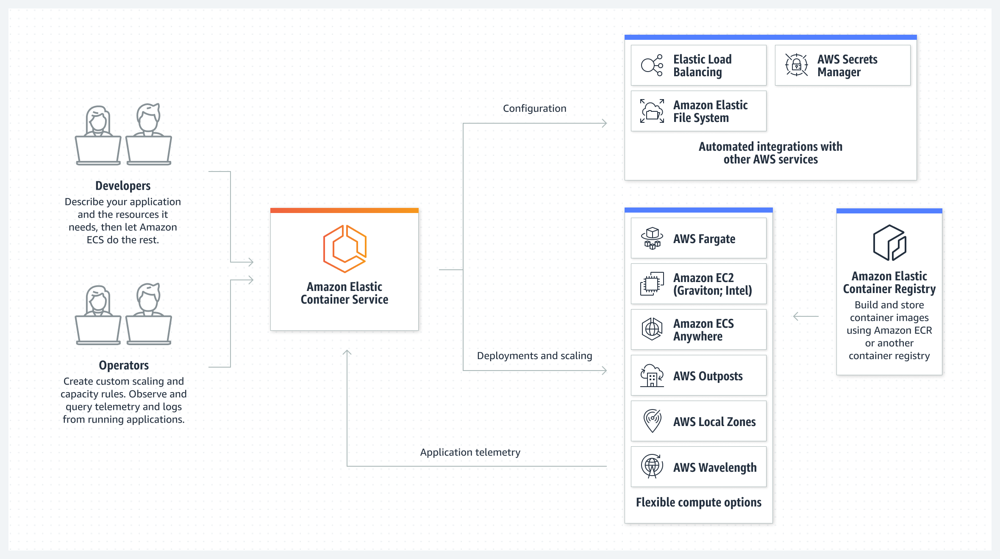

## Docker

**Docker** is a software development platform to deploy apps.

Apps are packaged in containers that can be run on any OS.

- Applications function in the same way, no matter where they're run
	- Any machine
	- No compatibility issues
	- Predictable behavior
	- Less work
	- Easier to maintain and deploy
- Scale containers up and down quickly (seconds)

Docker images are stored in Docker Repositories.

- Public: Docker Hub (https://hubl.docker.com)
- Private: Amazon ECR (Elastic Container Registry)
## ECS (Elastic Container Service)

**Amazon ECS** = Elastic Container Service.

ECS allows launching Docker containers on AWS. It is an orchestrator.

- You must provision and maintain the infrastructure ([EC2]() instances)
- AWS takes care of starting / stopping containers
- Has integrations with the [Application Load Balancer]()

## Fargate

- Launch Docker containers on AWS
- Serverless. No need to provision the infrastructure (no EC2 instances to manage)
- AWS runs the containers based on CPU / RAM needed
## ECR

- Elastic Container Registry
- Private Docker Registry on AWS
## Amazon EKS

Amazon EKS = Elastic Kubernetes Service.

Allows launching and managing Kubernetes clusters on AWS.

Kubernetes is an open-source system for management, deployment and scaling of containerized apps (Docker, Containerd).

**Containers can be hosted on:**

- EC2 instances
- Fargate
## Lambda

- Virtual functions - no servers to manage
- Limited by time - short executions
- Run on-demand
- Scaling is automated
### Benefits of Lambda

- Easy pricing:
	- Pay per request and compute time
- Integrated with the whole AWS suite of services
- Event-Driven: functions get invoked by AWS when needed
- Integrated with many programming languages
	- Node.js (JavaScript)
	- Python
	- Java
	- C# (.NET Core) / PowerShell
	- Ruby
	- Custom Runtime API (community supported, example Rust or Golang)
- Easy monitoring through [AWS CloudWatch]()
- Easy to get more resources per functions (up to 10 GB of RAM)
- Increasing RAM will also improve CPU and Network

Lambda Container Image - although ECS / Fargate is preferred for running Docker images.

Lambda pricing is based on calls and duration.
## Amazon API Gateway

- Fully managed service for developers to easily create, publish, maintain, monitor and secure APIs
- Serverless and scalable
- Supports RESTful APIs and WebSocket APIs
- Support for security, user authentication, API throttling, API keys, monitoring
##### Creating Serverless API = API Gateway + Lambda. Expose Lambda functions as HTTP API.
## AWS Batch

- Fully managed batch processing at any scale
- Efficiently run 100,000s of computing batch jobs on AWS
- A "_batch_" job is a job with start and and end (opposed to continuous)
- Batch will dynamically launch EC2 instances or Spot instances
- AWS batch provisions the right amount of compute / memory
- You submit or schedule batch jobs and AWS Batch does the rest
- Batch jobs are defined as Docker images and run on ECS
- Helpful for cost optimizations and focusing less on the infrastructure
### Batch vs Lambda

- **Lambda**
	- Time limit
	- Limited runtimes
	- Limited temporary disk space
	- Serverless
- **Batch**
	- No time limit
	- Any runtime as long as it's packaged as a Docker image (no programming language dependency)
	- Rely on [EBS]() / [Instance Store]() for disk space
	- Relies on [EC2]() (can be managed by AWS)
## Lightsail

- Virtual servers, [storage](), [databases]() and networking
- Low & predictable pricing
- Simpler alternative to using [EC2](), [RDS](), [ELB](), [EBS](), [Route53]()
- Great for people with little cloud experience
- Can setup notifications and monitoring of your Lightsail resources
- Use cases:
	- Simple web applications
	- Websites
	- Dev / Test environment
- Has High Availability but no auto scaling, limited AWS integrations
## Summary

- Docker: container technology to run applications
- ECS: run Docker container on EC2 instances
- Fargate:
	- Run Docker containers without provisioning the infrastructure
	- Serverless offering (no EC2 instances)
- ECR: Private Docker Images Repository
- EKS: Allows launching and managing Kubernetes clusters on AWS (hosted on: EC2 instances OR Fargate)
- Batch: run batch jobs on AWS across managed EC2 instances
- Lightsail: predictable & low pricing for simple application & DB stacks
- Lambda:
	- Serverless, Function as a Service, seamless scaling, reactive
	- Lambda Billing:
		- By the time run x by the RAM provisioned
		- By the number of invocations
	- Language support: many programming languages except (arbitrary) Docker
	- Invocation time: up to 15 minutes
- API Gateway: expose Lambda functions as HTTP API

---
## >> Sources <<

- ECS Documentation: https://docs.aws.amazon.com/ecs/
## >> References <<

- [EC2]()
## >> Table of contents (CLF-C02) <<

|                                                                         |                                                                                     |                                                                                       |
| ----------------------------------------------------------------------- | ----------------------------------------------------------------------------------- | ------------------------------------------------------------------------------------- |
| [1. What is Cloud Computing]()   | [2. IAM]()                                                       | [3. Budget]()                                                   |
| [4. EC2]()                                           | [5. Security Groups]()                               | [6. Storage]()                                                 |
| [7. AMI]()                                           | [8. Scalability & High Availability]() | [9. Elastic Load Balancing]()                   |
| [10. Auto Scaling Group]()          | [11. S3]()                                                       | [12. Databases]()                                           |
| [13. Other Compute Services]()   | [14. Deployments]()                                     | [15. AWS Global Infrastructure]()           |
| [16. Cloud Integrations]()           | [17. Cloud Monitoring]()                           | [18. VPC]()                                                       |
| [19. Security and Compliance]() | [20. Machine Learning]()                           | [21. Account Management and Billing]() |
| [22. Advanced Identity]()             | [23. Other Services]()                               | [24. AWS Architecting & Ecosystem]()        |
|                                                                         | [25. Preparing for AWS Practitioner exam]()  |                                                                                       |
## >> Disclaimer <<


_Disclaimer: Content for educational purposes only, no rights reserved._

Most of the content in this series is coming from **Stephane Maarek's** [Ultimate AWS Certified Cloud Practitioner CLF-C02 2025](https://www.udemy.com/course/aws-certified-cloud-practitioner-new/) course on Udemy.

I highly encourage you to take the [Stephane's courses](https://www.udemy.com/user/stephane-maarek/) as they are awesome and really help understanding the subject.

_More about Stephane Maarek:_

- https://www.linkedin.com/in/stephanemaarek
- https://x.com/stephanemaarek

**This article is just a summary and has been published to help me learning and passing the practitioner exam.**

