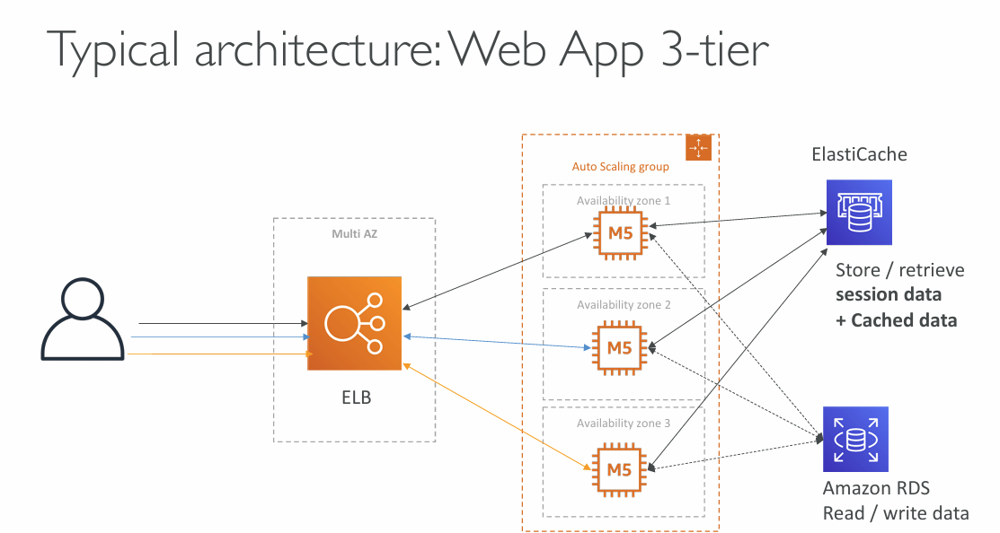
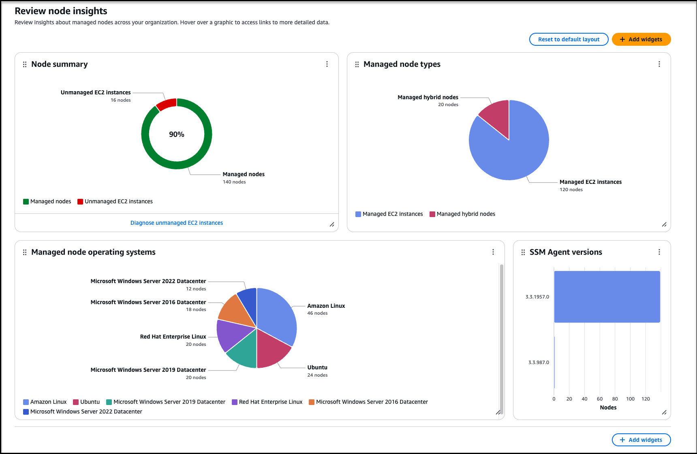
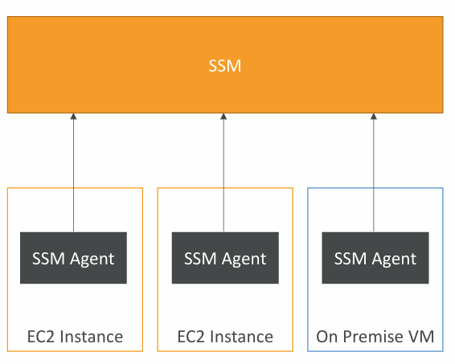

# Deploying and Managing Infrastructure at scale

## CloudFormation

CloudFormation is a declarative way of outlining an AWS infrastructure.

<font color=#f1ef63>Example:</font>
- [Security Group]()
- Two [EC2]() instances using this Security Group
- [S3]() Bucket
- [Load Balancer]() (ELB) in front

Then CloudFormation creates those resources <font color=#10b981>in the right order</font> and with the exact configuration that was specified (declared).

---


_Introduction to AWS CloudFormation_

---
### Benefits of CloudFormation

- Infrastructure as Code
	- No resources are manually created
	- Changes to the infrastructure are reviewed through code
- Cost
	- Each resource within the stack is tagged with an identifier so you can easily see how much a stack costs
	- Cost can be estimated by using CloudFormation template
	- <font color=#f1ef63>Cost savings strategy:</font> in Dev, automation can delete resources at 5pm and recreate at 8am automatically
- Productivity
	- Ability to destroy and re-create and infrastructure in the cloud on the fly
	- Declarative programming (no need to figure out ordering and orchestration)
- Don't re-invent the wheel
	- Leverage existing templates on the web
	- Leverage the documentation
- Supports (almost) all AWS resources
	- "_Custom resources_" can be used for resources that are not supported
### CloudFormation + <font color=#f1ef63>Infrastructure Composer</font>

<font color=#f1ef63>Example:</font> Wordpress CloudFormation Stack

- We can see all the resources
- We can see the relations between components

<!--

-->

_More:_ https://docs.aws.amazon.com/AWSCloudFormation/latest/UserGuide/infrastructure-composer-for-cloudformation.html
## AWS Cloud Development Kit (CDK)

- Define your cloud infrastructure using a familiar language:
	- JavaScript/TypeScript, Python, Java, .NET
	- For that reason infrastructure and application can be deployed "together" - they share the runtime
- The infrastructure code is converted into a CloudFormation template (JSON / YAML)
## Beanstalk

<font color=#f1ef63>Elastic Beanstalk is a developer-centric view of deploying an application on AWS.</font>

It uses all the components mentioned earlier (EC2, ASG, ELB, RDS, etc...)
##### <font color=#f1ef63>Beanstalk = Platform as a Service (PaaS)</font>



- Managed service
	- Instance configuration / OS is handled by  Beanstalk
	- Deployment strategy is configurable but performed by Elastic Beanstalk
	- Capacity provisioning
	- Load Balancing and Auto-Scaling
	- Application health-monitoring and responsiveness
- Just the application code is the responsibility of the developer
- Three architecture models:
	- Single instance deployment: for DEV environments
	- LB + ASG: for prod or pre-prod web apps
	- ASG only: for non-web apps in production (workers, etc...)
##### <font color=#f1ef63>Beanstalk supports many platforms:</font>

- Go
- Java SE
- Java with Tomcat
- .NET on Windows Server with IIS
- Node.js
- PHP
- Python
- Ruby
- Packer Builder
- Single-Container Docker
- Multi-Container Docker
- Preconfigured Docker

<font color=#f1ef63>Beanstalk Health Agent pushes metrics to CloudWatch, checks for app health and publishes health events.</font>
## AWS CodeDeploy

AWS CodeDeploy is a deployment service that automates application deployments to:

- <font color=#10b981>EC2 instances</font> as well as <font color=#10b981>on-premise</font> instances - it is a <font color=#f43f5e>Hybrid</font> service
- serverless Lambda functions
- Amazon ECS (<font color=#f43f5e>E</font>lastic <font color=#f43f5e>C</font>ontainer <font color=#f43f5e>S</font>ervices)

Servers / Instances must be provisioned and configured ahead of time with the CodeDeploy Agent.
## AWS CodeBuild

Code building service in the cloud.

CodeBuild compiles source code, run tests, produces packages that are ready to be deployed.
## AWS CodePipeline

CodePipeline orchestrates the different steps to have the code automatically pushed to production.

```Code
Code > Build > Test > Provision > Deploy
```
## AWS CodeArtifact

Software packages depends on each other to be built (also called code dependencies).
Storing and retrieving those dependencies is called artifact management.
Traditionally you need to setup your own artifact management system.

CodeArtifact works with common dependency management tools such as:

Maven, Gradle, npm, yarn, twine, pip, NuGet.

Developers and CodeBuild can retrieve dependencies straight from CodeArtifact.
## <font color=#f1ef63>Systems Manager (SSM)</font>

SSM helps managing EC2 and On-Premises systems at scale.



- Another <font color=#10b981>Hybrid</font> AWS service
- Get operational insights about the state of the infrastructure
- Suite of 10+ products
- <font color=#f1ef63>Features:</font>
	- <font color=#f43f5e>Patching automation</font> for enhanced compliance
	- <font color=#f43f5e>Run commands across entire fleet of servers</font>
	- <font color=#f43f5e>Store parameter configuration</font> with the SSM Parameter Store
- Works with Linux, Windows, MacOS and Raspberry Pi OS (Raspbian)
	- Allows starting SSH session on EC2 and On-Premise servers
	- No SSH access, bastion hosts or SSH keys needed
	- No port 22 needed
	- Send session log data to S3 or CloudWatch


### Systems Manager Parameter Store

- <font color=#10b981>Secure storage for configuration and secrets</font>
- API Keys, passwords, configurations
- Serverless, scalable, durable, easy SDK
- Control access permissions with IAM policies
- Version tracking and encryption (optional)

_More:_ https://docs.aws.amazon.com/systems-manager/

---
## >> Sources <<

- Infrastructure Composer: https://docs.aws.amazon.com/AWSCloudFormation/latest/UserGuide/infrastructure-composer-for-cloudformation.html
- AWS Systems Manager (SSM): https://docs.aws.amazon.com/systems-manager/
## >> Highlights <<

- <font color=#f1ef63>Infrastructure Composer</font>
- <font color=#f1ef63>Systems Manager (SSM)</font>
## >> Table of contents (CLF-C02) <<

|                                                                         |                                                                                     |                                                                                       |
| ----------------------------------------------------------------------- | ----------------------------------------------------------------------------------- | ------------------------------------------------------------------------------------- |
| [1. What is Cloud Computing]()   | [2. IAM]()                                                       | [3. Budget]()                                                   |
| [4. EC2]()                                           | [5. Security Groups]()                               | [6. Storage]()                                                 |
| [7. AMI]()                                           | [8. Scalability & High Availability]() | [9. Elastic Load Balancing]()                   |
| [10. Auto Scaling Group]()          | [11. S3]()                                                       | [12. Databases]()                                           |
| [13. Other Compute Services]()   | [14. Deployments]()                                     | [15. AWS Global Infrastructure]()           |
| [16. Cloud Integrations]()           | [17. Cloud Monitoring]()                           | [18. VPC]()                                                       |
| [19. Security and Compliance]() | [20. Machine Learning]()                           | [21. Account Management and Billing]() |
| [22. Advanced Identity]()             | [23. Other Services]()                               | [24. AWS Architecting & Ecosystem]()        |
|                                                                         | [25. Preparing for AWS Practitioner exam]()  |                                                                                       |
## >> Disclaimer <<


_Disclaimer: Content for educational purposes only, no rights reserved._

Most of the content in this series is coming from **Stephane Maarek's** [Ultimate AWS Certified Cloud Practitioner CLF-C02 2025](https://www.udemy.com/course/aws-certified-cloud-practitioner-new/) course on Udemy.

I highly encourage you to take the [Stephane's courses](https://www.udemy.com/user/stephane-maarek/) as they are awesome and really help understanding the subject.

_More about Stephane Maarek:_

- https://www.linkedin.com/in/stephanemaarek
- https://x.com/stephanemaarek

**This article is just a summary and has been published to help me learning and passing the practitioner exam.**

