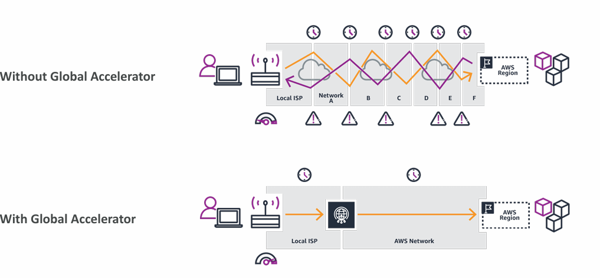
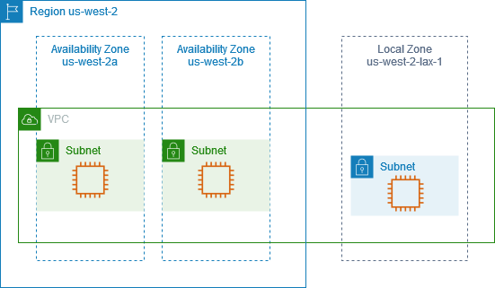

A Global Application is an application deployed in multiple geographies.
On AWS this could be Regions and / or Edge Locations.

- Decreased Latency
- [Disaster Recovery]() 
- (DOS / [DDoS]()) Attack protection (distributed global infrastructure is harder to attack)

_More:_ https://aws.amazon.com/about-aws/global-infrastructure/

- [Route53]()
- [CloudFront]() (Global CDN)
- [S3 Transfer Acceleration]()
- [AWS Global Accelerator]()

---


_AWS Global Infrastructure Overview - Regions, Availability Zones, Edge Locations and more_

---
## Route53

**Route53** is managed **DNS**.


_[How Route 53 routes traffic for your domain](https://docs.aws.amazon.com/Route53/latest/DeveloperGuide/welcome-dns-service.html#welcome-dns-service-how-route-53-routes-traffic)_
### Route53 Routing Policies

- <font color=#10b981>Simple</font> Routing Policy - <font color=#f43f5e>No health checks,</font> just DNS check
- <font color=#10b981>Weighted</font> Routing Policy - <font color=#f43f5e>Specify what amount of traffic goes where</font> (i.e. 70% = Server1, 20% = Server2, 10% = Server3. Simple form of Load Balancing)
- <font color=#10b981>Latency</font> Routing Policy - <font color=#f43f5e>Based on latency</font> - minimizing the latency between user and the server sending the traffic that is geographically (latency-based) closer to the user
- <font color=#10b981>Failover</font> Routing Policy - <font color=#f43f5e>Disaster Recovery</font> ([DR]()) - based on Health Checks
- <font color=#10b981>Geolocation</font> Routing Policy - <font color=#f43f5e>Routing based specifically on Geolocation</font>
- <font color=#10b981>IP-based</font> Routing Policy - <font color=#f43f5e>Route the traffic based on the IP address originates from</font>

_More on Routing Policies:_ https://docs.aws.amazon.com/Route53/latest/DeveloperGuide/routing-policy.html

---


_AWS Route 53 Course_

---
#### Registering a domain

```CLI
# Register a Domain
Route 53 > Registered Domains > Register Domain > CHOOSEADOMAIN.COM

# Hosted zones
Route 53 > Hosted zones > select "CHOOSEADOMAIN.COM" > Update the DNS records with the right EC2 instances, select an adequate Routing Policy
```

_More about Registering and managing domains:_ https://docs.aws.amazon.com/Route53/latest/DeveloperGuide/registrar.html

_More about Route 53:_ https://docs.aws.amazon.com/route53/
## Amazon CloudFront

- <font color=#10b981>Content Delivery Network</font> (CDN)
- Improves read performance, content cached at the edge
- Improves users experience
- Many Points of Presence globally (Edge Locations, Edge Caches)
- [DDoS]() protection (because it's distributed globally)
- <font color=#10b981>Integrated with Shield and AWS WAF</font> (Web Application Firewall)
### CloudFront - Origins

- S3 Bucket
	- For distributing files and caching them at the edge
	- For uploading files to S3 through CloudFront
	- Secured using Origin Access Control (OAC)
- VPC Origin
	- For applications hosted in [VPC]() private subnets
	- [Application Load Balancer]() / [Network Load Balancer]() / [EC2]() Instances
- Custom Origin (HTTP)
	- S3 website (must first enable the bucket as a static S3 website)
	- Any public HTTP backend


_[How CloudFront delivers content](https://docs.aws.amazon.com/AmazonCloudFront/latest/DeveloperGuide/HowCloudFrontWorks.html)_
### CloudFront vs [S3 Cross Region Replication]()

#### CloudFront

- Global Edge Network
- Files are cached for a TTL (day?)
- <font color=#f1ef63>Use case:</font> static content that must be available everywhere
#### S3 Cross Region Replication

- Must be setup for each region you want your replication to happen
- Files are updated in near real-time
- Read-only
- <font color=#f1ef63>Use case:</font> dynamic content that needs to be available at low-latency in few regions only
## S3 Transfer Acceleration

Increase transfer speed by transferring files to an AWS edge location which will forward the data to the S3 bucket in the target region.
## AWS Global Accelerator

**AWS Global Accelerator** is used to improve global application availability and performance using the AWS global network.

Leverage the AWS internal network to optimize the route to your application (60% improvement).



_More about AWS Global Accelerator:_ 
- https://aws.amazon.com/global-accelerator/
- https://docs.aws.amazon.com/global-accelerator/latest/dg/what-is-global-accelerator.html
- https://speedtest.globalaccelerator.aws
## AWS Global Accelerator vs CloudFront

- They both use AWS global network and it's edge locations
- Both services integrate with AWS Shield for [DDoS]() protection
- **CloudFront** - Content Delivery Network
	- Improves performance for cacheable content (images, videos, etc.)
	- Content is served at the edge
- **Global Accelerator**
	- No caching, proxying packets at the edge to applications running in one or more AWS regions
	- Improves performance for a wide range of applications running in one or more AWS regions
	- Improves performance for a wide range of applications over TCP or UDP
	- Good for HTTP use cases that require static IP addresses
	- Good for HTTP use cases that require deterministic, fast, regional failover
## AWS Outposts

##### <font color=#f1ef63>AWS Outposts</font> = Hybrid Cloud appliances.

Outposts are "server racks" that offer the same AWS infrastructure, services, API's & tools to build your own applications on-premises just as in the cloud.
##### <font color=#10b981>AWS will setup and manage Outposts racks within your on-premises infrastructure.</font>

**Benefits**

- Low latency access to on-premises system
- Local data processing
- Data residency
- Easier migration from on-premises to the cloud
- Fully managed service
- Some example services that work on Outposts:
	- [EC2]()
	- [EBS]()
	- [S3]()
	- [EKS]()
	- [ECS]()
	- [RDS]()
	- [EMR]()
## Wavelength

Wavelength Zones are infrastructure deployments embedded within the telecommunication providers datacenters <font color=#10b981>at the edge of the 5G networks</font>.

- Ultra low latency applications through 5G networks
- Traffic doesn't leave the **Communication Service Provider's (CSP)** network
- High bandwidth and secure connection to the parent AWS Region
- No additional charges or service agreements
- <font color=#f1ef63>Use cases:</font>
	- Smart Cities
	- ML-assisted (Machine Learning) diagnostics
	- Connected Vehicles
	- Interactive Live Video Streams
	- AR / VR
	- Real-time gaming
## AWS Local Zones

**AWS Local Zones** allow placing compute, storage, database and other selected AWS services closer to the users to run latency-sensitive applications.

It is an "<font color=#f1ef63>Extension of AWS Region</font>".
##### <font color=#f1ef63>Example:</font>

- AWS Region: N. Virginia (us-east-1)
	- AWS Local Zones: Boston, Chicago, Dallas, Houston, Miami, ...


_[How AWS Local Zones work](https://docs.aws.amazon.com/local-zones/latest/ug/what-is-aws-local-zones.html)_

##### <font color=#f1ef63>Compatible with:</font>

- [EC2]()
- [RDS]()
- [ECS]()
- [EBS]()
- [ElastiCache]()
- [Direct Connect]()
- More...

_More about AWS Local Zones:_ https://docs.aws.amazon.com/local-zones/latest/ug/what-is-aws-local-zones.html

## Summary

<font color=#f1ef63>Route 53 - Global DNS</font>

- Great to route users to the closest deployment with least latency
- Great for Disaster Recovery - DR - Strategies

<font color=#f1ef63>CloudFront - Global CDN - Content Delivery Network</font>

- Replicate part of your application to AWS Edge Locations - decreased latency
- Cache common requests - improved user experience and decreased latency

<font color=#f1ef63>S3 Transfer Acceleration</font>

- Accelerate global uploads & downloads into Amazon S3 

<font color=#f1ef63>AWS Global Accelerator</font>

- Improve global application availability and performance using the AWS global network

<font color=#f1ef63>AWS Outposts</font>

- Deploy Outposts racks in an on-premises datacenter to extend some AWS services and for easier migration

<font color=#f1ef63>AWS Wavelength</font>

- Brings AWS services to the edge of the 5G networks
- Ultra-low latency applications

<font color=#f1ef63>AWS Local Zones</font>

- Bring AWS resources (compute, database, storage, ...) closer to your users
- Good for latency-sensitive applications

---
## >> Sources <<

Global Infrastructure: https://aws.amazon.com/about-aws/global-infrastructure/
### Route 53
Route 53: https://docs.aws.amazon.com/route53/
Route 53 Routing Policies: https://docs.aws.amazon.com/Route53/latest/DeveloperGuide/routing-policy.html
Registering and managing domains: https://docs.aws.amazon.com/Route53/latest/DeveloperGuide/registrar.html
### CloudFront
CloudFront: https://docs.aws.amazon.com/cloudfront/
### AWS Global Accelerator
https://aws.amazon.com/global-accelerator/
https://docs.aws.amazon.com/global-accelerator/latest/dg/what-is-global-accelerator.html
https://speedtest.globalaccelerator.aws
### AWS Local Zones
https://docs.aws.amazon.com/local-zones/latest/ug/what-is-aws-local-zones.html
## >> References <<

- [S3]()
- [Security and Compliance]()
## >> Table of contents (CLF-C02) <<

|                                                                         |                                                                                     |                                                                                       |
| ----------------------------------------------------------------------- | ----------------------------------------------------------------------------------- | ------------------------------------------------------------------------------------- |
| [1. What is Cloud Computing]()   | [2. IAM]()                                                       | [3. Budget]()                                                   |
| [4. EC2]()                                           | [5. Security Groups]()                               | [6. Storage]()                                                 |
| [7. AMI]()                                           | [8. Scalability & High Availability]() | [9. Elastic Load Balancing]()                   |
| [10. Auto Scaling Group]()          | [11. S3]()                                                       | [12. Databases]()                                           |
| [13. Other Compute Services]()   | [14. Deployments]()                                     | [15. AWS Global Infrastructure]()           |
| [16. Cloud Integrations]()           | [17. Cloud Monitoring]()                           | [18. VPC]()                                                       |
| [19. Security and Compliance]() | [20. Machine Learning]()                           | [21. Account Management and Billing]() |
| [22. Advanced Identity]()             | [23. Other Services]()                               | [24. AWS Architecting & Ecosystem]()        |
|                                                                         | [25. Preparing for AWS Practitioner exam]()  |                                                                                       |
## >> Disclaimer <<


_Disclaimer: Content for educational purposes only, no rights reserved._

Most of the content in this series is coming from **Stephane Maarek's** [Ultimate AWS Certified Cloud Practitioner CLF-C02 2025](https://www.udemy.com/course/aws-certified-cloud-practitioner-new/) course on Udemy.

I highly encourage you to take the [Stephane's courses](https://www.udemy.com/user/stephane-maarek/) as they are awesome and really help understanding the subject.

_More about Stephane Maarek:_

- https://www.linkedin.com/in/stephanemaarek
- https://x.com/stephanemaarek

**This article is just a summary and has been published to help me learning and passing the practitioner exam.**

