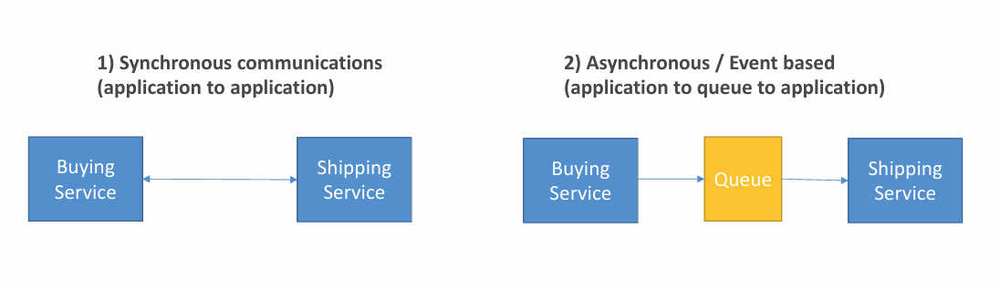
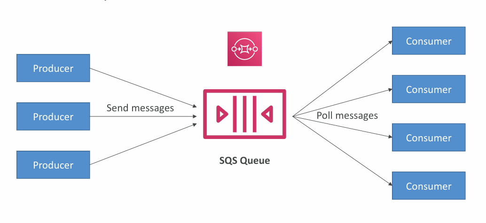
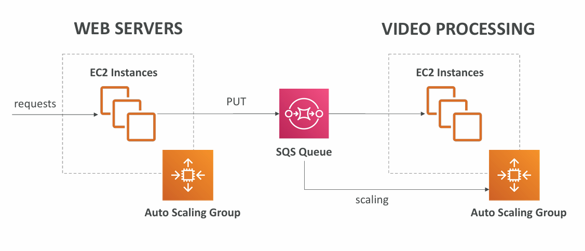
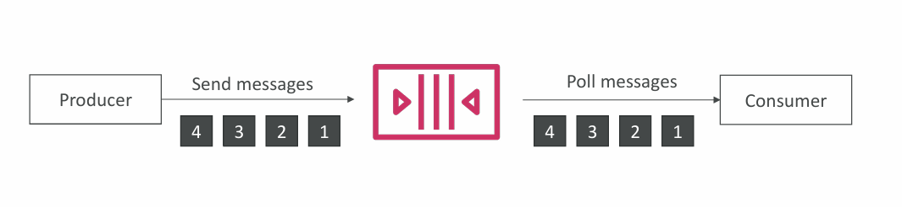
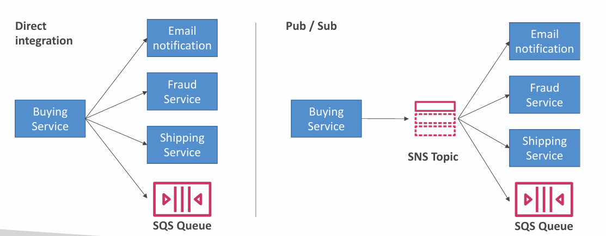
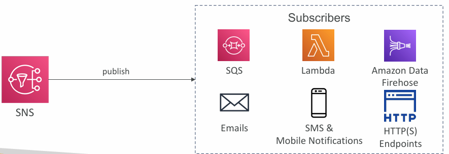

This section is about multiple applications communicating with each other.

1. Synchronous communication (application to application)
	- Can be problematic if there are sudden spikes of traffic
2. Asynchronous / Event-based communication (application to queue to application)
	- It is called decoupling of applications
		- **SQS:** queue model
		- **SNS:** pub / sub model
		- **Kinesis:** real-time data streaming model
	- Those services can scale independently from our application

## SQS

##### SQS = Simple Queue Service.

_[What is Amazon SQS](https://docs.aws.amazon.com/AWSSimpleQueueService/latest/SQSDeveloperGuide/welcome.html)_
### SQS - Standard Queue

- Oldest AWS offering (over 10 years old)
- Fully managed, serverless service used to decouple applications
- Sales from 1 message per second to 10,000s per second
- Default messages retention: 4 days, maximum 14 days
- No limit to how many messages can be in the queue
- Messages are deleted after they're read by consumers (applications)
- Low latency
- Consumers share the work to read messages and scale horizontally

### SQS - FIFO Queue

##### FIFO = First in First Out (ordering of messages in the queue)

_Messages are processed in order by the consumer._
## Amazon Kinesis

##### Kinesis = real-time big data streaming.

Managed service to collect, process and analyze real-time streaming data at any scale.
## Amazon SNS

##### SNS = Simple Notification Service.

**SNS** is sending one message to multiple receivers.

- The "event publishers" only sending message to one SNS topic
- As many "event publishers" as we want to listen to the SNS topic notifications
- Each subscriber to the topic will get all the messages
- Up to 12,500,000 subscriptions per topic, 100,000 topics limit

## Amazon MQ

SQS and SNS are "cloud-native" services. Traditional applications running from on-premises may use open protocols, such as:

- MQTT
- AMQP
- STOMP
- Openwire
- WSS

When migrating to the cloud, instead of re-engineering the application to use **SQS** and **SNS**, **Amazon MQ** can be used instead.

**Amazon MQ** is a managed message broker service for:

- RabbitMQ
- Active MQ

- Amazon MQ doesn't scale as much as SQS / SNS
- Amazon MQ runs on servers, can run in Multi-AZ with failover
- Amazon MQ has both - queue feature (~SQS) and topic features (~SNS)
## Summary

- SQS
	- Queue service in AWS
	- Multiple Producers, messages kept up to 14 days
	- Multiple Consumers share the read and delete messages when done
	- Used to decouple applications in AWS
- SNS
	- Notification service in AWS
	- Subscribers:
		- Email
		- Lambda
		- SQS
		- HTTP
		- Mobile
		- Others
	- Multiple Subscribers, sending all messages to all of them
	- No message retention
- Kinesis
	- Real-time data streaming
- Amazon MQ
	- Managed message broker for Active MQ and Rabbit MQ in the cloud (MQTT, AMQP protocols)

---
## >> Sources <<

- Amazon SQS: https://docs.aws.amazon.com/AWSSimpleQueueService/latest/SQSDeveloperGuide/welcome.html
## >> Disclaimer <<


