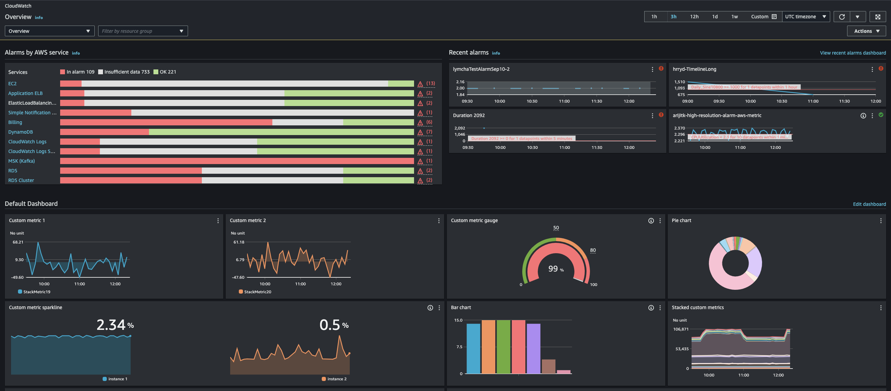
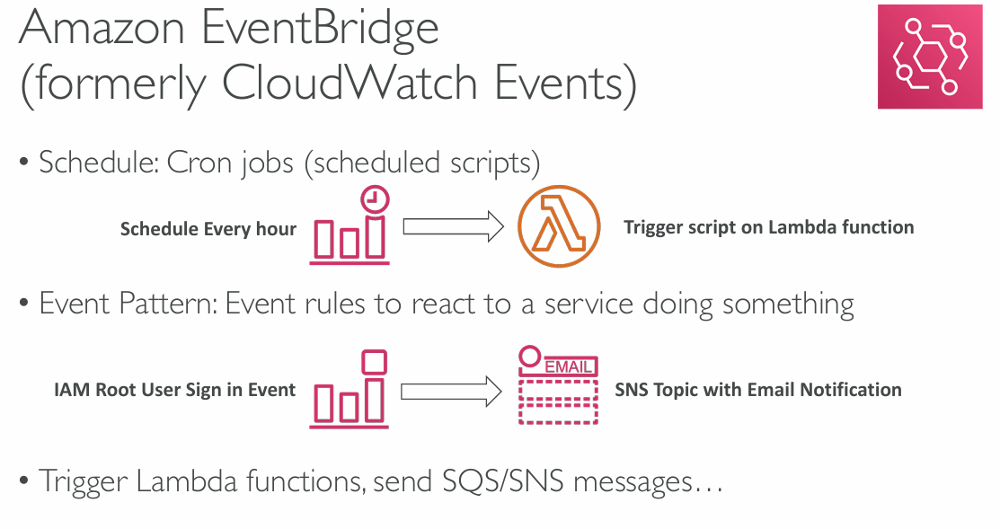
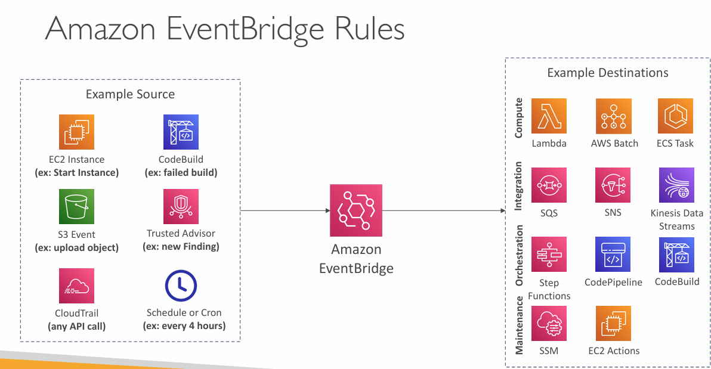
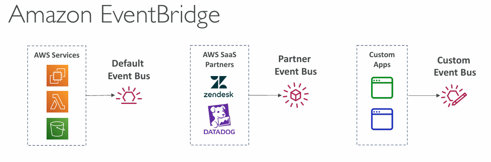
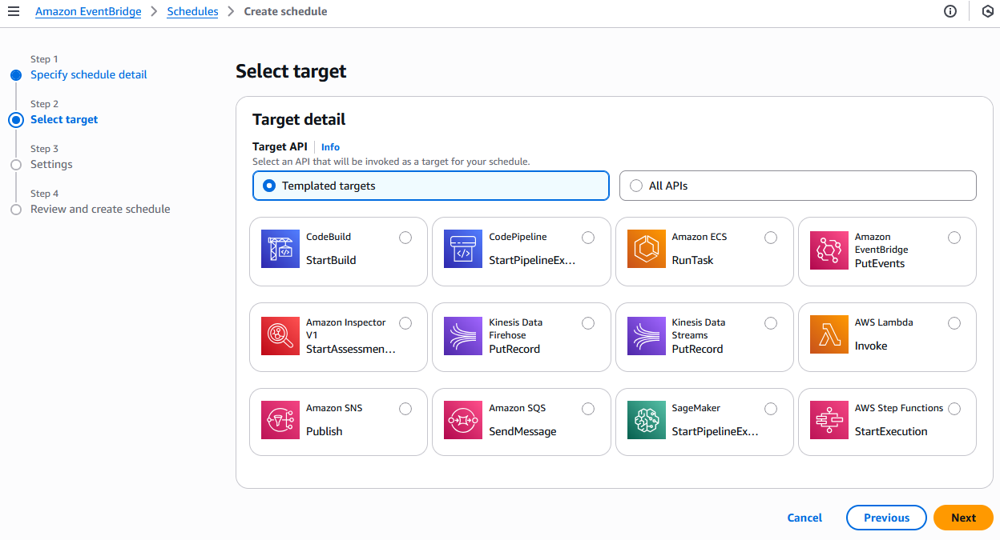
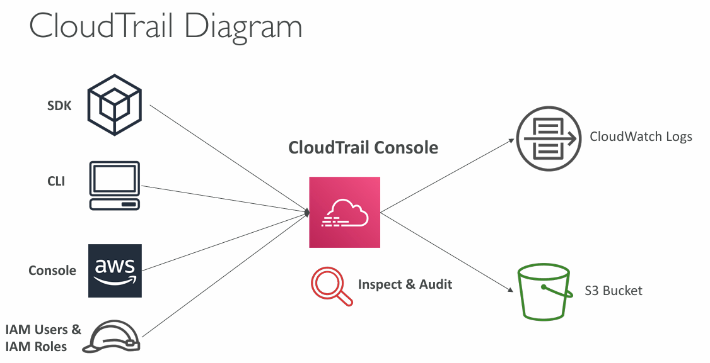
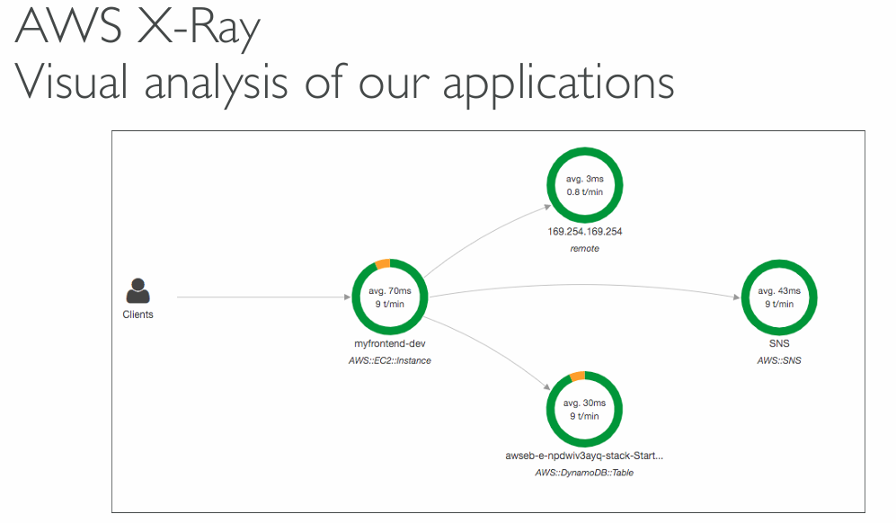

## CloudWatch Metrics

**CloudWatch** provides metrics for every service in AWS.

It is possible to create **CloudWatch Dashboards** that consist of different metrics.


_CloudWatch console_

_CloudWatch Console:_ https://console.aws.amazon.com/cloudwatch
### Important Metrics

- **EC2 instances:** CPU Utilization, Status Checks, Network (not RAM!)
	- Default metrics **every 5 minutes**
	- Option for Detailed Monitoring ($!): metrics **every 1 minute**
- **EBS Volumes:** Disk Read / Writes
- **S3 Buckets:** Bucket size, Number of Objects, All requests
- **Billing:** Total Estimated Charge (only in us-east-1)
- **Service Limits:** how much of service API's was used (Lambda?)
- Custom metrics: push your own metrics

```AWSConsole
# See All metrics
CloudWatch > Metrics > All metrics

# Create a custom alarm
CloudWatch > Alarms > All alarms
```
### CloudWatch Alarms

- Alarms are used to trigger notifications for any metric
- Alarms actions
	- Auto Scaling - increase or decrease EC2 instances "desired" count
	- EC2 Actions - stop, terminate, reboot or recover and EC2 instance
	- SNS notifications - send a notification into an SNS topic
- Various options (sampling, %, max, min, etc...)
- Can choose the period on which to evaluate an alarm
- **Example:** create a billing alarm on the CloudWatch Billing metric
- Alarm States: OK, INSUFFICIENT_DATA, ALARM

<font color=#f43f5e>Billing alarms are only available in us-east-1</font>
### CloudWatch Logs

CloudWatch Logs can collect logs from:

- Elastic Beanstalk - collection of logs from application
- ECS - collection of logs from containers
- AWS Lambda - collection of logs from functions
- CloudTrail based on filter
- <font color=#10b981>CloudWatch log agents</font> - on EC2 machines or on-premises servers
- [Route53]() - DNS logs
### CloudWatch Logs for EC2 / on-premise

<font color=#f43f5e>CloudWatch agent is required to be installed (and configured?) on EC2 instance 
to push the logs that are needed.</font>

<font color=#f43f5e>CloudWatch agent can also be installed on on-premise servers too.</font>

IAM permissions must be set for CloudWatch Logs to function correctly.
## Amazon EventBridge

- Schedule - cron jobs (scheduled scripts)
- Event Pattern -Event rules to react to a service doing something
- Trigger Lambda functions, send SQS / SNS messages





- Default Event Bus - for AWS Services
- Partner Event Bus - for external entities (i.e. Zendesk) sending events to the cloud
- Custom Event Bus - custom



```AWSConsole
EventBridge > Create rule
```


## AWS CloudTrail

##### <font color=#f43f5e>AWS CloudTrail provides governance, compliance and audit your AWS Account and it is ENABLED BY DEFAULT.</font>

It can get a history of events / API calls made within your AWS account by:

- Console
- SDK
- CLI
- AWS Services

<font color=#10b981>Logs from CloudTrail can be stored in CloudWatch Logs or S3. Trail can be applied to All Regions (default) or a single region.</font>

### <font color=#f43f5e>If a resource is deleted in AWS, investigate CloudTrail first!</font>



```AWSConsole
# Check Events History
CloudTrail > Event history
```
## AWS X-Ray

##### <font color=#f43f5e>Visual analysis of our applications.</font> Common view of entire architecture.

- **Troubleshooting performance**
- Understanding dependencies in a microservices architecture
- Pinpoint service issues
- Review request behavior
- **Find Errors** and **Exceptions**
- SLA's
- Identify impacted users


## Amazon CodeGuru

##### ML-powered service for automated code reviews and application performance recommendations.

**Provides 2 functionalities:**

- **CodeGuru Reviewer** - automated code reviews for static code analysis (development)
	- Identify critical issues, security vulnerabilities and hard to find bugs
	- Common coding best practices, resource leaks, security detection, input validation
	- Uses **Machine Learning** and automated reasoning
	- Hard-learned lessons across millions of code reviews on 1000s of open-source repositories
	- Supports Java and Python
	- Integrates with GitHub, Bitbucket and ~~AWS CodeCommit~~
- **CodeGuru Profiler** - visibility / recommendations about application performance during runtime (production)
	- Helps understand the runtime behavior of an application
	- Identify if application is consuming excessive CPU, etc...
	- **Features:**
		- Identify and remove code inefficiencies
		- Improve application performance (e.g. reduce CPU utilization)
		- **Decrease compute costs**
		- Provide heap summary (identify which objects using up the memory)
		- Anomaly detection
- Supports applications running on AWS as well as on-premise
- Minimal overhead on application
## AWS Health Dashboard

##### Shows all regions, all services health. General information, not specific to you.

Shows historical information for each day.

Has an RSS feed that can be subscribed to.
### AWS Health Dashboard - Your Account

**AWS Account Health Dashboard** provides alerts and remediation guidance when AWS is experiencing events that may impact you.

<font color=#f43f5e>While the **Service Health Dashboard** displays the general status of AWS services, **Account Health Dashboard** gives you a personalized view into the performance and availability of the AWS services underlying your AWS resources.</font>

<font color=#f43f5e>It can aggregate data from an entire AWS Organization.</font>
## Summary

- <font color=#f1ef63>CloudWatch</font>
	- Metrics - monitor the performance of AWS services and billing metrics
	- Alarms - automate notification, perform [EC2]() action, notify to [SNS]() based on metric
	- Logs - collects log files from EC2 instances, servers, [Lambda]() functions
- <font color=#f1ef63>Events (EventBridge)</font> - react to events in AWS or trigger a rule on a schedule
- <font color=#f1ef63>CloudTrail</font> - audit API calls made within your AWS account
	- CloudTrail Insights - automated analysis of your CloudTrail Events
- <font color=#f1ef63>X-Ray</font> - trace requests made through your distributed applications (analyze flow)
- <font color=#f1ef63>AWS Health Dashboard</font> - general status of ALL AWS services across all regions
- <font color=#f1ef63>AWS Account Health Dashboard</font> - AWS events that impact your infrastructure
- <font color=#f1ef63>Amazon CodeGuru</font> - automated code reviews and application performance recommendations

---
## >> Sources <<

CloudWatch / CloudWatch Logs / CloudWatch Events (EventBridge): 
- https://docs.aws.amazon.com/cloudwatch/
- https://console.aws.amazon.com/cloudwatch

## >> Table of contents (CLF-C02) <<

|                                                                         |                                                                                     |                                                                                       |
| ----------------------------------------------------------------------- | ----------------------------------------------------------------------------------- | ------------------------------------------------------------------------------------- |
| [1. What is Cloud Computing]()   | [2. IAM]()                                                       | [3. Budget]()                                                   |
| [4. EC2]()                                           | [5. Security Groups]()                               | [6. Storage]()                                                 |
| [7. AMI]()                                           | [8. Scalability & High Availability]() | [9. Elastic Load Balancing]()                   |
| [10. Auto Scaling Group]()          | [11. S3]()                                                       | [12. Databases]()                                           |
| [13. Other Compute Services]()   | [14. Deployments]()                                     | [15. AWS Global Infrastructure]()           |
| [16. Cloud Integrations]()           | [17. Cloud Monitoring]()                           | [18. VPC]()                                                       |
| [19. Security and Compliance]() | [20. Machine Learning]()                           | [21. Account Management and Billing]() |
| [22. Advanced Identity]()             | [23. Other Services]()                               | [24. AWS Architecting & Ecosystem]()        |
## >> Disclaimer <<


_Disclaimer: Content for educational purposes only, no rights reserved._

Most of the content in this series is coming from **Stephane Maarek's** [Ultimate AWS Certified Cloud Practitioner CLF-C02 2025](https://www.udemy.com/course/aws-certified-cloud-practitioner-new/) course on Udemy.

I highly encourage you to take the [Stephane's courses](https://www.udemy.com/user/stephane-maarek/) as they are awesome and really help understanding the subject.

_More about Stephane Maarek:_

- https://www.linkedin.com/in/stephanemaarek
- https://x.com/stephanemaarek

**This article is just a summary and has been published to help me learning and passing the practitioner exam.**

