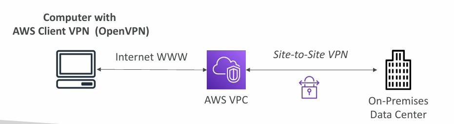

## VPC - Virtual Private Cloud

Amazon **Virtual Private Cloud** (VPC) enables you to provision logically isolated section of the AWS Cloud where you can launch AWS resources in a virtual network that you defined.

- VPC, Subnets, Internet Gateways, NAT Gateways
- [Security Groups](), Network ACL (NACL), [VPC Flow Logs]()
- [VPC Peering](), [VPC Endpoints]()
- [Site to Site VPN and Direct Connect]()
- [Transit Gateway]()
## IP Addresses in AWS

- IPv4 (4.3 Billion Addresses)
	- Public IPv4 - can be used on the Internet
		- EC2 instance gets a new public IP address every time it's started
	- Private IPv4 - can be used on private networks (LAN) such as internal AWS networking
		- Private IPv4 is fixed for EC2 instances even after stopping / starting
- Elastic IP - allows to attach a fixed public IPv4 address to an EC2 instance
- <font color=#EBAC25>Note:</font> Every public IPv4 address on AWS will be charged **$0.005 per hour** (including Elastic IP)

- IPv6 - Number of addresses: 3.4 x 10^38
	- Every IP address is public in AWS (no private range) (<font color=#EB4925>??</font>)
	- Free
## VPC and Subnets Primer

VPC - Virtual Private Cloud - private network to deploy resources (regional resource)

- Subnets allow to partition the network inside of VPC (Availability Zone Resource)
- A <font color=#C7EB25>public subnet</font> is a subnet that is <font color=#C7EB25>accessible</font> from the internet
- A <font color=#EB4925>private subnet</font> is a subnet that is <font color=#EB4925>not accessible</font> from the internet
- <font color=#C7EB25>To define access to the internet and between subnets, we use Route Tables</font>
## Internet Gateway & NAT Gateways

- **Internet Gateways** help our VPC instances connecting with the internet
	- Public Subnets will have a route to the internet gateway

- **NAT Gateways** (<font color=#EB4925>AWS Managed</font>) & **NAT Instances** (<font color=#EB4925>self managed</font>) allow instances in Private Subnets to access the internet while remaining private


_Internet Gateway & NAT Gateways._

```AWSConsole
VPC > Subnets
```

EC2 Instance created in a Public Subnet will have Public IPv4 address associated.
All Public Subnets have Internet Gateway (IGW) associated with them.

```AWSConsole
VPC > Virtual Private Cloud > Subnets > subnet-ID > Route table
```


_All traffic coming to 172.31.0.0/16 will be considered local. Traffic to / from anywhere will go through an associated Internet Gateway._
### Creating Private Subnet

```AWSConsole
# For Private Subnet we don't associate it with any Internet Gateway. Traffic OUT goes via the NAT Gateway.

VPC > Virtual Private Cloud > Subnets > Create subnet
```
## Security Groups & Network ACL

### [Security Groups]()

- <font color=#EB4925>A firewall that controls traffic to and from an EC2 Instance</font>
- Can only have <font color=#EB4925>allow rules</font>
- Rules include <font color=#EB4925>IP addresses and other security groups</font>
### NACL (Network ACL)

- <font color=#EB4925>A firewall that controls traffic to and from a SUBNET</font>
- Can have <font color=#C7EB25>allow</font> and <font color=#EB4925>deny</font> rules
- Are attached at the <font color=#EB4925>Subnet level</font>
- Rules only include IP addresses

_More:_ [AWS Network Firewall]() that <font color=#EB4925>protects entire VPC</font>.

```AWSConsole
VPC > Security > Security Groups

VPC > Security > Network ACLs
```

| Security Group                                                                                                                                | Network ACL                                                                                   |
| --------------------------------------------------------------------------------------------------------------------------------------------- | --------------------------------------------------------------------------------------------- |
| Operates at the instance level                                                                                                                | Operates at the subnet level                                                                  |
| Supports ALLOW rules ONLY                                                                                                                     | Supports ALLOW and DENY rules                                                                 |
| Is stateful (return traffic is automatically allowed, regardless of any rules)                                                                | Is stateless (return traffic must be explicitly allowed by rules)                             |
| All rules are evaluated before deciding whether to allow the traffic                                                                          | Rules are processed in a number order when deciding to allow the traffic                      |
| Applies to an instance only if someone specified the Security Group when launching the instance (or associates it with the instance later on) | Automatically applies to all instances in the subnets to which Network ACL is associated with |
_More info:_ https://docs.aws.amazon.com/vpc/latest/userguide/VPC_Security.html


_Default ACLs associated with the Default Subnets allow all traffic IN and OUT._
## VPC Flow Logs
### <font color=#EB4925>Helps to monitor and troubleshoot connectivity issues</font>

- <font color=#EB4925>Capture information about IP traffic going into your interfaces</font>
	- VPC Flow Logs
	- Subnet Flow Logs
	- Elastic Network Interface Flow Logs

- <font color=#EB4925>Helps to monitor and troubleshoot connectivity issues</font>
	- Subnets to internet
	- Subnets to subnets
	- Internet to subnets

- <font color=#EB4925>Captures network information from AWS managed interfaces too:</font>
	- [Elastic Load Balancers]()
	- [ElastiCache]()
	- [RDS]()
	- [Aurora]()
	- etc...
##### <font color=#EB4925>VPC Flow Logs must first be created for each VPC</font>

```AWSConsole
VPC > Virtual Private Cloud > Your VPCs > Flow Logs > Create flow log
```
## VPC Peering

Connect to VPC privately using AWS Network and make them behave as if they were in the same network.

- Must NOT have overlapping CIDR (IP address range)
- VPC Peering connection is NOT transitive (must be established for each VPC that needs to communicate with one another)


```AWSConsole
VPC > Virtual Private Cloud > Your VPCs > Peering Connections > Create peering connection
```
## VPC Endpoints

Endpoints allow connecting to AWS Services using a private network instead of the public www network.

This gives enhanced security and lower latency to access AWS services.

- VPC <font color=#EB4925>Endpoint Gateway</font> - for Amazon [S3]() and [DynamoDB]() only
- VPC <font color=#EB4925>Endpoint Interface</font> - most services (including S3 and DynamoDB)
## Private Link

Most secure and scalable way to expose a service to 1000s of VPCs. Using VPC Peering (see above) is not practical because of the management overhead.

- Does not require VPC peering, internet gateway, NAT, route tables...
- Requires a Network Load Balancer (NLB) - Service VPC and Elastic Network Interface (ENI) - Customer VPC


_AWS Private Link_
## Site to Site VPN & Direct Connect
### Site to Site VPN

- Connect to an on-premises VPN to AWS
- The connection is automatically encrypted
- Goes over the <font color=#EB4925>public internet</font> (cheaper and slower than Direct Connect)


_Site-to-Site VPN:_
_- On-Premises - <font color=#EB4925>must use Customer Gateway</font> (CGW)_
_- AWS: <font color=#EB4925>must use a Virtual Private Gateway</font> (VGW)_
### Direct Connect (DX)

- Establish a physical connection between on-premises and AWS
- The connection is private, secure and fast
- Goes over a <font color=#EB4925>private network</font> (more expensive but faster than Site to Site VPN)
- Takes at least a month to establish
## AWS Client VPN

Connect from your computer using OpenVPN to your private network in AWS and on-premises.

<font color=#C7EB25>Allows connecting to your EC2 instances over a private IP</font> (just as you were in the private VPC network).

<font color=#EB4925>Goes over the public Internet.</font>


## Transit Gateway


##### Transit Gateway is used for having transitive peering between thousands of VPC and on-premises, hub-and-spoke (star) connection.


Works with Direct Connect Gateway, VPN connections.
## Summary

- <font color=#EBAC25>VPC:</font> Virtual Private Cloud
- <font color=#EBAC25>Subnets:</font> Tied to and AZ, network partition of the VPC
- <font color=#EBAC25>Internet Gateway:</font> at the VPC level, provide Internet Access
- <font color=#EBAC25>NAT Gateway / Instances:</font> give internet access to private subnets
- <font color=#EBAC25>Security Groups:</font> Stateful, operate at the EC2 instance level for ENI
- <font color=#EBAC25>NACL:</font> Stateless, subnet rules for inbound and outbound
- <font color=#EBAC25>VPC Peering:</font> Connect two VPC with non overlapping IP ranges, non-transitive (must be established for each VPC that needs to communicate with one another)
- <font color=#EBAC25>Elastic IP:</font> Fixed public IPv4
- <font color=#EBAC25>VPC Endpoints:</font> Provide private access to AWS Services within VPC
- <font color=#EBAC25>Private Link:</font> Privately connect to a service in a 3rd party VPC
- <font color=#EBAC25>VPC Flow Logs:</font> Network traffic logs
- <font color=#EBAC25>Site to Site VPN:</font> VPN over public internet between on-premises DC and AWS
- <font color=#EBAC25>Client VPN:</font> OpenVPN connection from your computer into your VPC
- <font color=#EBAC25>Direct Connect:</font> Direct private connection to AWS
- <font color=#EBAC25>Transit Gateway:</font> Connect thousands of VPC and on-premises networks together

---
## >> Sources <<

- Amazon VPC Documentation: https://docs.aws.amazon.com/vpc/
- Internetwork traffic privacy in VPC: https://docs.aws.amazon.com/vpc/latest/userguide/VPC_Security.html
## >> References <<

- [Elastic Load Balancing]()
- [S3]()
## >> Disclaimer <<


