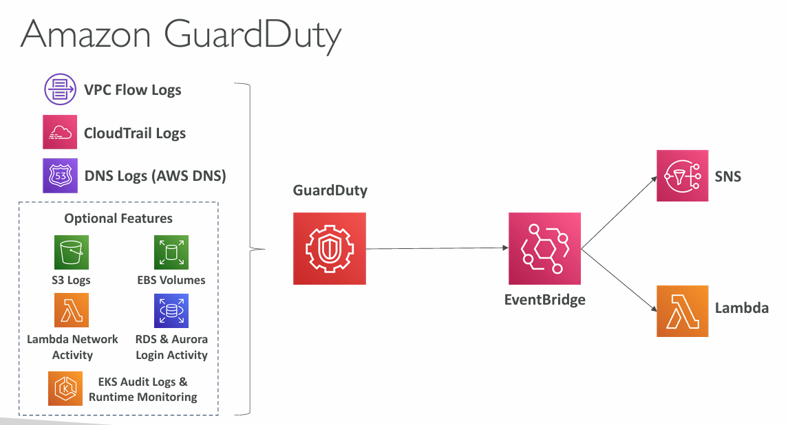

## Shared Responsibility Model

### AWS responsibility - Security <font color=#f43f5e>of</font> the Cloud

- Protecting infrastructure( hardware, software, facilities, networking) that runs the AWS services
- Managed services, like S3, DynamoDB, RDS, etc.
### Customer responsibility - Security <font color=#f43f5e>in</font> the cloud

- For EC2 instance, customer is responsible to the management of the guest OS (including the security patches and updates), firewall and network configuration, IAM
- Encrypting application data
### Shared controls

- Patch Management, Configuration Management, Awareness & Training
#### <font color=#f1ef63>Example</font> - RDS

- **AWS responsibility**
	- Manage underlying EC2 instance, disable SSH access
	- Automated DB patching
	- Automated OS patching
	- Audit the underlying instance and disks and guarantee it functions
- **Customer responsibility**
	- Check if the ports / IP / security group inbound rules in DB's SG
	- In-database user creation and permissions
	- Creating a database with or without public access
	- Ensure parameter groups or DB is configured to only allow SSL connections
	- Database encryption setting
#### <font color=#f1ef63>Example</font> - S3

- **AWS responsibility**
	- Guarantee you get unlimited storage
	- Guarantee you get encryption
	- Ensure data separation between customers
	- Ensure AWS employees can't access your data
- **Customer responsibility**
	- Bucket configuration
	- Bucket policy / public setting
	- IAM user and roles
	- Enabling encryption


_AWS Shared Responsibility Model_

_More about Shared Responsibility Model:_ https://aws.amazon.com/compliance/shared-responsibility-model/
## DDoS Protection on AWS

- <font color=#f1ef63>AWS Shield Standard</font> - protects against DDoS attack for website and applications - <font color=#10b981>for all customers at no additional cost</font>
- <font color=#f1ef63>AWS Shield Advanced</font> - 24/7 premium DDoS protection and support
- <font color=#f1ef63>AWS WAF</font> - filter specific requests based on predefined rules
- <font color=#f1ef63>CloudFront and Route53</font>
	- Availability protection using global edge network
	- Combined with AWS Shield provides attach mitigation at the edge

Be ready to scale - use <font color=#27D3F5>AWS Auto Scaling</font>.


_Sample Reference Architecture for DDOS Protection in AWS_
##### <font color=#10b981>DDoS components on above picture:</font>

- <font color=#27D3F5>Route53</font> - Latency / Geolocation routing policies
- <font color=#27D3F5>CloudFront</font> - to ensure data is cached at the edge
- Shield - see below section
- <font color=#27D3F5>WAF</font> - optionally
- <font color=#27D3F5>LB and Auto Scaling</font>

_More about DDOS protection:_ https://docs.aws.amazon.com/whitepapers/latest/aws-best-practices-ddos-resiliency/aws-best-practices-ddos-resiliency.html
### AWS Shield

- <font color=#f1ef63>AWS Shield Standard</font>
	- Free service that is activated for every AWS customer
	- Provides protection from attacks such as SYN / UDP Floods, Reflection attacks and other layer 3 / layer 4 attacks
- <font color=#f1ef63>AWS Shield Advanced</font>
	- Optional DDoS mitigation service (<font color=#f43f5e>$3000</font> per month per organization)
	- Protecting against more sophisticated attacks on <font color=#f43f5e>Amazon EC2, Elastic Load Balancing (ELB), Amazon CloudFront, AWS Global Accelerator and Route53</font>
## AWS WAF

- Protecting web applications from common web exploits (Layer 7)
- <font color=#10b981>Layer 7 is HTTP (vs Layer 4 is TCP)</font>
- <font color=#10b981>Can be deployed on Application Load Balancer, API Gateway, CloudFront</font>
### Web Access Control List

- Rules can include <font color=#f43f5e>filters for IP addresses, HTTP headers, HTTP body, URi strings</font>
- Protecting from common attacks - <font color=#f43f5e>SQL injection, Cross-Site Scripting (XSS)</font>
- Size constraints (to ensure request size) , geo match (block countries)
- Rate-based rules - <font color=#f43f5e>to count occurrences of events, limit users to x requests per second</font>, etc. - for DDoS protection
## AWS Network Firewall

- Protects entire Amazon VPC
- From Layer 3 to Layer 7 protection
- Any direction, you can inspect
	- VPC to VPC traffic
	- Outbound to the internet
	- Inbound from the internet
	- To / From Direct Connect & Site-to-Site VPN


_AWS Network Firewall is protecting entire VPC from Layer 3 to Layer 7_
##### <font color=#f43f5e>AWS Network Firewall offers much better protection than NACL that only operates at the subnet level. AWS Network Firewall operates at VPC level.</font>

_More about Network Firewall:_ https://docs.aws.amazon.com/network-firewall/
## AWS Firewall Manager

##### AWS Firewall Manager manages security rules in all accounts of an AWS Organization.

- Security policy: common set of security rules
	- VPC Security Groups for EC2, Application Load Balancer, etc...
	- WAF rules
	- AWS Shield Advanced
	- AWS Network Firewall
##### <font color=#f43f5e>Rules are applied to new resources as they are created (good for compliance) across ALL EXISTING AND FUTURE accounts in all Organization.</font>
## Penetration Testing on AWS Cloud

##### <font color=#10b981>Allowed activities:</font>

##### AWS Customers <font color=#10b981>are allowed to carry out security assessment or penetration tests against their AWS infrastructure without prior approval for 8 services:</font>

- Amazon EC2 instances, NAT Gateways and Elastic Load Balancers
- Amazon RDS
- Amazon CloudFront
- Amazon Aurora
- Amazon API Gateways
- AWS Lambda and Lambda Edge functions
- Amazon Lightsail resources
- Amazon Elastic Beanstalk environments
### <font color=#f43f5e>Prohibited activities:</font>

- DNS zone walking via Amazon Route53 and Hosted Zones
- Denial of Service (DoS), Distributed Denial of Service (DDoS), Simulated DoS, Simulated DDoS
- Port flooding
- Protocol flooding
- Request flooding (login request flooding, API request flooding)

For any simulated events, contact aws-security-simulated-event@amazon.com

_Read More about Penetration Testing: _ https://aws.amazon.com/security/penetration-testing/ _
## Data at rest vs Data in Transit

- <font color=#f1ef63>At rest:</font> data stored or archived on a device
	- On a hard disk, in RDS, in S3 Glacier, etc.
- <font color=#f1ef63>In transit (in motion):</font> data being transferred
##### <font color=#f43f5e>Data in both states (at rest, in transit) should be encrypted as a best practice.</font>
### AWS KMS (Key Management Service)

##### <font color=#10b981>AWS is managing encryption keys for the customers using KMS.</font>

- Encryption Opt-in:
	- <font color=#f1ef63>EBS Volumes:</font> encrypt volumes
	- <font color=#f1ef63>S3 buckets:</font> server-side encryption of objects (SSE-S3 enabled by default, SSE-KMS opt-in)
	- <font color=#f1ef63>Redshift Database</font>
	- <font color=#f1ef63>RDS database</font>
	- <font color=#f1ef63>EFS drives:</font> encryption of data
- Encryption Automatically enabled:
	- CloudTrail Logs
	- S3 Glacier
	- Storage Gateway
### Cloud HSM

- **KMS** = <font color=#f43f5e>AWS manages the software for encryption</font>
- **Cloud HSM** = <font color=#10b981>AWS is provisioning encryption hardware</font> (HSM = Hardware Security Module)
	- Customer is managing their own encryption keys instead of AWS
	- HSM devices are tamper resistant and FIPS compliant
### <font color=#f1ef63>Types of KMS Keys</font>

- **Customer Managed Key:**
	- Created, managed and used by the customer
	- Possibility of rotation policy (new key generated every year, old key preserved)
	- Possibility to bring-your-own-key
- **AWS Managed Key:**
	- Created, managed and used on the customer's behalf by AWS
	- Used by AWS services (S3, EBS, Redshift, etc.)
- **AWS Owned Key:**
	- Collection of CMDs that an AWS service owns and manages to use in multiple accounts
- **CloudHSM Keys:**
	- Keys generated from your own (dedicated) CloudHSM hardware device
	- Cryptographic operations are performed within the CloudHSM cluster

```AWSConsole
KMS > AWS managed keys
```
### AWS Certificate Manager (ACM)

**ACM** - allows easy provisioning and deploying SSL / TLS Certificates used to provide encryption for HTTPS enabled websites.

- Supports both, public and private TLS certificates
- Free of charge for public TLS certificates
- Automatic TLS certificate renewal
- Integrations with AWS Services, such as:
	- Elastic Load Balancers (ELB)
	- CloudFront Distributions
	- APIs on API Gateway
### AWS Secrets Manager

- Capability to force rotation of secrets every X days
- Automate generations of secrets (uses Lambda)
- Integration with Amazon RDS (MySQL, PostgreSQL, Aurora)
- Secrets are encrypted using KMS

<font color=#f1ef63>Use case:</font> RDS integrations.

```AWSConsole
Secrets Manager > Store a new secret
```
## Artifact Overview

**Artifact** is a portal that provides customers with on-demand access to <font color=#10b981>AWS compliance documentation</font> and <font color=#10b981>AWS agreements</font>.

- Artifact Reports - allows downloading AWS security and compliance documents from third-party auditors, like AWS ISO certifications, Payment Card Industry (PCI) and System and Organization Control (SOC) reports
- Artifact Agreements - allows reviewing, accepting and tracking the status of AWS agreements, such as:
	- Business Associate Addendum (BAA)
	- Health Insurance Portability and Accountability Act (HIPAA) for an individual account in the organization
##### <font color=#f1ef63>Can be used to support internal audit or compliance.</font>

```CLI
Artifact > View reports
```
## GuardDuty

**GuardDuty** is an <font color=#f43f5e>Intelligent Threat Discovery</font> to protect AWS account.

Uses Machine Learning algorithms, <font color=#f43f5e>anomaly detection.</font>

Enabled with 1-click, no need to install any software.
##### Input data includes:

- <font color=#27D3F5>CloudTrail Event Logs</font> - unusual API calls, unauthorized deployments
	- CloudTrail Management Events - create VPC subnet, create trail, ...
	- CloudTrail S3 Data Events - get object, list object, delete object, ...
- <font color=#27D3F5>VPC Flow Logs</font> - unusual internal traffic, unusual IP addresses
- DNS Logs - compromised EC2 instances sending encoded data within DNS queries
- Optional Features

EventBridge <font color=#27D3F5>Cloud Monitoring</font> can be set up to be notified in case of any findings. Rules can target AWS Lambda or SNS.

GuardDuty has a dedicated finding for Crypto Currency (mining?) attacks.


_Amazon GuardDuty input data example_
## Amazon Inspector

##### <font color=#f1ef63>Automated Security Assessment.</font>

- For EC2 instances
	- <font color=#10b981>Using AWS System Manager (SSM) agent</font>
	- Analyze against <font color=#f43f5e>unintended network accessibility</font>
	- Analyze the <font color=#f43f5e>running OS against known vulnerabilities</font>
- For Container Images pushed to ECR
	- Assessment of Container Images as they are pushed
- For Lambda Functions
	- Identifies software vulnerabilities in function code and package dependencies
	- Assessment of functions as they are deployed
##### <font color=#f1ef63>Reporting and integration with AWS Security Hub.</font>

**Amazon Inspector** <font color=#f43f5e>evaluates vulnerabilities (against CVE database)</font> only running EC2 instances, Container Images and Lambda Functions.

A risk score is associated with all vulnerabilities for prioritization.
## AWS Config

**AWS Config** helps with auditing and recording compliance of your AWS resources. It is recording configurations and changes over time.

It can store the configuration data into S3 (then analyzed by <font color=#27D3F5>Athena</font>).
##### What AWS Config can record (examples):

- Unrestricted SSH access to the Security Groups (i.e. port open for everyone)
- Public access to S3 buckets
- ELB configuration changes over time

It is using <font color=#27D3F5>SNS</font> (_check:_ <font color=#27D3F5>Cloud Integrations</font>) for sending notifications.

**AWS Config** is a per-region service but can be aggregated across regions and accounts.

```AWSConsole
AWS Config > 1-click setup
```
## AWS Macie

**Amazon Macie** is a fully managed data security and data privacy service that uses <font color=#10b981>machine learning and pattern matching</font> to discover <font color=#f43f5e>your sensitive data in AWS.</font>

**Macie** helps identifying and alerting <font color=#f43f5e>sensitive data</font>, such as e.g. <font color=#f43f5e>PII</font> (Personally Identifiable Information).
## AWS Security Hub

**AWS Security Hub** is a <font color=#10b981>central security tool</font> to manage security across several AWS accounts and automate security checks.

Integrated dashboards showing current security and compliance status to quickly take actions.

**Security Hub** automatically aggregates alerts in predefined formats from AWS services (or AWS partner tools):

- Config
- GuardDuty
- Inspector
- Macie
- IAM Access Analyzer
- AWS Systems Manager
- AWS Firewall Manager
- AWS Health
- AWS Partner Network Solutions

<font color=#f1ef63>AWS Config service is a dependency and must first be enabled to use Security Hub.</font>


_AWS Security Hub_
## Amazon Detective

<font color=#27D3F5>GuardDuty</font>, <font color=#27D3F5>Macie</font> and <font color=#27D3F5>Security Hub</font> are used to identify potential security issues of findings.

Often security findings require deeper analysis to isolate the root cause and take action - it can be a complex process.

**Amazon Detective** <font color=#f43f5e>analyzes, investigates and identifies the root cause of security issues or suspicious activities</font> (using Machine Learning).

It is automatically collecting and processing events from <font color=#27D3F5>VPC Flow Logs</font>, <font color=#27D3F5>CloudTrail</font>, and <font color=#27D3F5>GuardDuty</font> and creating an unified view. It can produce visualizations with details and context to help <font color=#f43f5e>getting to the root cause.</font>
## AWS Abuse

Report suspected AWS resources used to abusive or illegal purposes.

- Abusive and prohibited behaviors:
	- SPAM
	- Port scannint
	- DoS or DDoS
	- Intrusion attempts
	- Hosting illegal or copyrighted content
	- Distributing malware

Contact the AWS Abuse team at abuse@amazonaws.com
## Root user privileges

Root user = AWS Account Owner
##### Actions that can be performed only by the root user:

- <font color=#f43f5e>Change account settings</font> (account name, email address, root user password, root user access keys)
- View certain tax invoices
- <font color=#f43f5e>Close AWS account</font>
- Restore IAM user permissions
- <font color=#f43f5e>Change or cancel your AWS Support plan</font>
- <font color=#f43f5e>Register as a seller in the Reserved Instance Marketplace</font>
- Configure an Amazon S3 bucket to enable MFA
- Edit or delete an Amazon S3 bucket policy that includes an invalid VPC ID or VPC endpoint ID
- Sign up for GovCloud
## IAM Access Analyzer

##### <font color=#f1ef63>Find out which resources are shared externally with IAM Access Analyzer.</font>

- S3 Buckets
- IAM Roles
- KMS Keys
- Lambda Functions and Layers
- SQS queues
- Secrets Manager Secrets

Define <font color=#f43f5e>Zone of Trust</font> (AWS Account or AWS Organization).

Access outside zone of trusts = findings.
## Summary

- <font color=#f1ef63>Shared Responsibility Model</font> on AWS
- <font color=#f1ef63>Shield:</font> Automatic DDoS Protection + 24/7 support for advanced
- <font color=#f1ef63>WAF:</font> Web Application Firewall to filter incoming web requests based on rules
- <font color=#f1ef63>KMS:</font> Encryption keys managed by AWS
- <font color=#f1ef63>CloudHSM:</font> Hardware encryption (AWS Customer managing own keys)
- <font color=#f1ef63>AWS Certificate manager:</font> Provision, manage and deploy TLS Certificates
- <font color=#f1ef63>Artifact:</font> Get access to compliance reports such as PCI, ISO, etc.
- <font color=#f1ef63>GuardDuty:</font> Find malicious behavior within VPC, DNS and CloudTrail Logs
- <font color=#f1ef63>Inspector:</font> Find software vulnerabilities in EC2, ECR images and Lambda functions
- <font color=#f1ef63>Network Firewall:</font> Protect VPC against network attacks
- <font color=#f1ef63>Config:</font> Track config changes and compliance against rules
- <font color=#f1ef63>Macie:</font> Find sensitive data (e.g. PII Personally Identifiable Information data) in Amazon S3 buckets
- <font color=#f1ef63>CloudTrail:</font> Track API calls made by users within account
- <font color=#f1ef63>AWS Security Hub:</font> gather security findings from multiple AWS accounts
- <font color=#f1ef63>Amazon Detective:</font> Find the root cause of security issues or suspicious activities
- <font color=#f1ef63>AWS Abuse:</font> Report AWS resources used for abusive or illegal purposes
- <font color=#f1ef63>Root user privileges:</font>
	- Change account settings
	- Close AWS account
	- Change or cancel AWS Support plan
	- Register as a seller in the Reserved Instance Marketplace
- <font color=#f1ef63>IAM Access Analyzer:</font> Identify which resources are shared externally
- <font color=#f1ef63>Firewall Manager:</font> Manage security rules across an Organization (WAF, Shield...)

---
## >> Sources <<

- Shared Responsibility Model: https://aws.amazon.com/compliance/shared-responsibility-model/
- DDOS: https://docs.aws.amazon.com/whitepapers/latest/aws-best-practices-ddos-resiliency/aws-best-practices-ddos-resiliency.html
- Network Firewall: https://docs.aws.amazon.com/network-firewall/
- Penetration Testing: https://aws.amazon.com/security/penetration-testing/
## >> References <<

- <font color=#27D3F5>EC2</font>
- <font color=#27D3F5>S3</font>
- <font color=#27D3F5>Storage</font>
- <font color=#27D3F5>Elastic Load Balancing</font>
- <font color=#27D3F5>Cloud Monitoring</font>
- <font color=#27D3F5>Databases</font>
- <font color=#27D3F5>Other Compute Services</font>
- <font color=#27D3F5>AWS Global Infrastructure</font>
## >> Table of contents (CLF-C02) <<

|                                                                         |                                                                                     |                                                                                       |
| ----------------------------------------------------------------------- | ----------------------------------------------------------------------------------- | ------------------------------------------------------------------------------------- |
| [1. What is Cloud Computing]()   | [2. IAM]()                                                       | [3. Budget]()                                                   |
| [4. Ec2]()                                           | [5. Security Groups]()                               | [6. Storage]()                                                 |
| [7. AMI]()                                           | [8. Scalability & High Availability]() | [9. Elastic Load Balancing]()                   |
| [10. Auto Scaling Group]()          | [11. S3]()                                                       | [12. Databases]()                                           |
| [13. Other Compute Services]()   | [14. Deployments]()                                     | [15. AWS Global Infrastructure]()           |
| [16. Cloud Integrations]()           | [17. Cloud Monitoring]()                           | [18. VPC]()                                                       |
| [19. Security and Compliance]() | [20. Machine Learning]()                           | [21. Account Management and Billing]() |
| [22. Advanced Identity]()             | [23. Other Services]()                               | [24. AWS Architecting & Ecosystem]()        |
## >> Disclaimer <<


_Disclaimer: Content for educational purposes only, no rights reserved._

Most of the content in this series is coming from **Stephane Maarek's** [Ultimate AWS Certified Cloud Practitioner CLF-C02 2025](https://www.udemy.com/course/aws-certified-cloud-practitioner-new/) course on Udemy.

I highly encourage you to take the [Stephane's courses](https://www.udemy.com/user/stephane-maarek/) as they are awesome and really help understanding the subject.

_More about Stephane Maarek:_

- https://www.linkedin.com/in/stephanemaarek
- https://x.com/stephanemaarek

**This article is just a summary and has been published to help me learning and passing the practitioner exam.**

