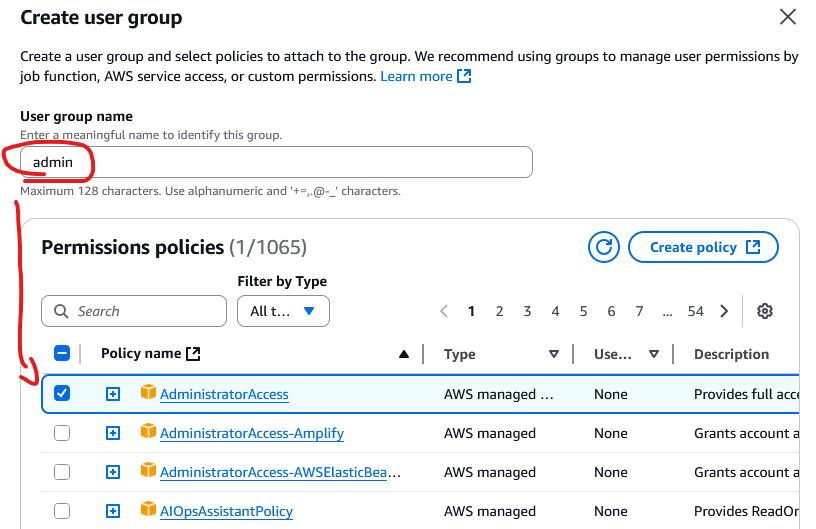

## **IAM** = Identity and Access management

**IAM** is AWS Global service.

<font color=#f43f5e>Groups only contain users, NOT other groups.</font>

Users don't have to belong to a group and user can belong to multiple groups.

Users or Groups can have assigned JSON documents called <font color=#f43f5e>policies</font>. Those <font color=#f43f5e>policies define permissions</font> for the users / groups.

In AWS you apply the <font color=#f43f5e>least privilege principle:</font> don't give user more permission than they need.

---



---
## Creating user in AWS CLI

```AWSConsole
IAM console > Users
```

### Create user


### Create group "admin"




## IAM policies structure


**IAM policies structure includes:**

- **Version:** policy version
- **ID** (Optional): identifier
- **Statement:** one or more statements (<font color=#f43f5e>required</font>)	
	- **SID:** identifier (optional)
	- **Effect:** <font color=#10b981>Allow</font> or <font color=#f43f5e>Deny</font>
	- **Principal:** account / user / role to which policy is applied to
	- **Action:** list of allowed or denied actions
	- **Resource:** list of resources to which the action is applied to
	- **Condition:** conditions for when the policy is applied (optional)
## MFA


## Accessing AWS

- **AWS Management Console** - protected by <font color=#f1ef63>password + MFA</font>
- **AWS Command Line** (CLI) - protected by <font color=#f1ef63>access keys</font>
- **AWS Software Development Kit** (SDK) - for code - protected by <font color=#f1ef63>access keys</font>
##### <font color=#10b981>Access Keys can be generated through AWS Console. Users manage their own access keys.</font>

**Access Key ID** = username<br />
**Secret Access Key** = password


### Creating Access Key

```AWSConsole
IAM > Users > Username > Security Credentials > Access Keys > Create Access Key > Command Line Interface (CLI)
```
### <font color=#f1ef63>Configuring AWS CLI with the new access key</font>

```CMD
# Configure AWS CLI
aws configure

# Test
aws iam list-users
```

### IAM roles for Services

- Some AWS services will need to perform actions on your behalf
- Those AWS services will need permissions to be assigned with IAM Roles

**Common Roles for Services:**

- [EC2]() Instance Roles
- [Lambda Function]() Roles
- Roles for [CloudFormation]()
#### Create AWS Service Role

```AWSConsole
IAM > Roles > Create role > AWS service
```


Add permissions:


## <font color=#f1ef63>IAM Security Tools</font>

### IAM Credentials Report (account-level)

- Report that lists all users and status of their credentials

```AWSConsole
IAM > Credentials Report
```
### IAM Access Advisor (user-level)

- Access Advisor shows the service permissions granted to a user and when those services were last accessed

```AWSConsole
IAM > Users > Username > Last Accessed
```

<font color=#f43f5e>IAM Access Advisor (Last Accessed) can be used to determine what user is accessing and to adjust his / her role in line with the "Least Privilege Principle".</font>
## <font color=#f1ef63>IAM Best Practices</font>

- Don't use root account
- One physical user = One AWS user
- **Assign users to groups** and assign permissions (policies) to groups
- Create **strong password policy**
- Use and **enforce MFA**
- **Create and use Roles** for giving permissions to AWS services
- Use Access Keys for Programmatic access (CLI / SDK)
- Audit permissions using **IAM Credentials Report** and **IAM Access Advisor**
- <font color=#f43f5e>Never share IAM users & Access Keys</font>
## Shared Responsibility Model for IAM

| **AWS**                                  | **Organization**                                         |
| ---------------------------------------- | -------------------------------------------------------- |
| Infrastructure (global network security) | Users, Groups, Roles, Policies management and monitoring |
| Configuration and vulnerability analysis | Enabling MFA on all accounts                             |
| Compliance validation                    | Rotating keys                                            |
|                                          | Using IAM tools to apply appropriate permissions         |
|                                          | Analyze access patterns and review permissions           |

---
## >> Sources <<

- _AWS Global Infrastructure:_ [AWS Global Infrastructure](https://infrastructure.aws)
- _Shared Responsibility Model:_ [Shared Responsibility Model - Amazon Web Services (AWS)](https://aws.amazon.com/compliance/shared-responsibility-model/)

 _Full YouTube Rahul's AWS Course:_ https://www.youtube.com/playlist?list=PL7iMyoQPMtAN4xl6oWzafqJebfay7K8KP

- [Security and compliance](https://docs.aws.amazon.com/whitepapers/latest/aws-overview/security-and-compliance.html)    
- [What is IAM?](https://docs.aws.amazon.com/IAM/latest/UserGuide/introduction.html)    
- [What is AWS IAM Identity Center?](https://docs.aws.amazon.com/singlesignon/latest/userguide/what-is.html)    
- [IAM identities](https://docs.aws.amazon.com/IAM/latest/UserGuide/id.html)    
- [AWS security documentation](https://docs.aws.amazon.com/security/)
## >> References << 

- [Account Management and Billing]()
## >> Table of contents (CLF-C02) <<

|                                                                         |                                                                                     |                                                                                       |
| ----------------------------------------------------------------------- | ----------------------------------------------------------------------------------- | ------------------------------------------------------------------------------------- |
| [1. What is Cloud Computing]()   | [2. IAM]()                                                       | [3. Budget]()                                                   |
| [4. EC2]()                                           | [5. Security Groups]()                               | [6. Storage]()                                                 |
| [7. AMI]()                                           | [8. Scalability & High Availability]() | [9. Elastic Load Balancing]()                   |
| [10. Auto Scaling Group]()          | [11. S3]()                                                       | [12. Databases]()                                           |
| [13. Other Compute Services]()   | [14. Deployments]()                                     | [15. AWS Global Infrastructure]()           |
| [16. Cloud Integrations]()           | [17. Cloud Monitoring]()                           | [18. VPC]()                                                       |
| [19. Security and Compliance]() | [20. Machine Learning]()                           | [21. Account Management and Billing]() |
| [22. Advanced Identity]()             | [23. Other Services]()                               | [24. AWS Architecting & Ecosystem]()        |
|                                                                         | [25. Preparing for AWS Practitioner exam]()  |                                                                                       |
## >> Disclaimer <<


_Disclaimer: Content for educational purposes only, no rights reserved._

Most of the content in this series is coming from **Stephane Maarek's** [Ultimate AWS Certified Cloud Practitioner CLF-C02 2025](https://www.udemy.com/course/aws-certified-cloud-practitioner-new/) course on Udemy.

I highly encourage you to take the [Stephane's courses](https://www.udemy.com/user/stephane-maarek/) as they are awesome and really help understanding the subject.

_More about Stephane Maarek:_

- https://www.linkedin.com/in/stephanemaarek
- https://x.com/stephanemaarek

**This article is just a summary and has been published to help me learning and passing the practitioner exam.**
