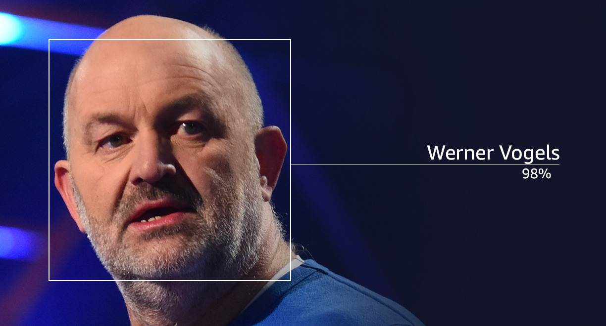

## Amazon Rekognition

##### Finding objects, people, text, scenes in images and videos using Machine Learning.

Facial analysis and facial search to perform user verification, people count, etc.

- Use cases:
	- Labeling
	- Content Moderation
	- Text Detection
	- Face Detection and Analysis (gender, age, range, emotions, ...)
	- Face Search and Verification
	- Celebrity Recognition
	- Pathing (e.g. sports game analysis)

|  |  |
| ---------------------------------- | ----------------------------------- |
|  |  |
_More about Rekognition:_ https://aws.amazon.com/rekognition
## Transcribe

##### Automatically converts speech to text. Uses deep learning process called ASR (Automatic Speech Recognition) to convert speech to text.

It has a capability of removing Personally Identifiable information (PII) using Redaction.

It also supports Automatic Language Identification for multi-lingual audio.

- Use cases:
	- transcribe customer service calls
	- automate closed captioning and subtitling
	- generate metadata for media assets to create a fully searchable archive
## Polly

##### Opposite of Transcribe. Turns text into speech using deep learning.
## Translate

**Amazon Translate** allows localizing the content - websites and applications - for international users. It has a capability of translating large volumes of text efficiently.
## Lex & Connect

- Amazon Lex: same technology that powers Alexa
	- Automatic Speech Recognition (ASR) to convert speech to text
	- Natural Language Understanding to recognize the intent of the text
	- Helps building chatbots or call center bots
- Amazon Connect
	- Receive calls, create contact flows, cloud-based virtual contact center
	- Can integrate with other CRM systems or AWS
	- No upfront payment, 80% cheaper than traditional contact center solutions
## Comprehend

##### Uses Machine Learning to find insights and relationships in the text for Natural Language Processing - NLP.

- Language of the text
- Extracting key phrases, places, people, brands or events
- Understand how positive or negative text is
- Analyzes text using tokenization and parts of speech
- Automatically organizes a collection of text files by topic

Use cases:

- Analyze customer interactions (emails) to find what leads to a positive or negative experience
- Create and group articles by topics
## SageMaker

Fully managed service for developers / data scientists to build Machine Learning (ML) models. Model requires training.
## Kendra

Fully managed document search service powered by Machine Learning.

- Can extract answers from withing a document (text, pdf, HTML, Power Point, MS Word, FAQs, etc.).
- Can learn from user interactions or feedback to promote preferred results (Incremental Learning)
- Has an ability to manually fine-tune search results (importance of data, freshness, custom, etc.)
## Personalize

Fully managed Machine Learning service to build apps with real-time personalized recommendations.

Same tech used by amazon.com

Use Cases: retail stores, media, entertainment...
# Textract

Automatically extracts text, handwriting and data from scanned documents using AI and ML.

Can read and process any type of document (PDF, images, etc.)
## Summary

- Rekognition: face detection, labeling, celebrity recognition
- Transcribe: audio to text (e.g. subtitles)
- Polly: text to audio
- Translate: translations
- Lex: build conversational bots / chatbots
- Connect: cloud contact center
- Comprehend: natural language processing
- SageMaker: machine learning for every developer and data scientist
- Kendra: ML-powered document search engine
- Personalize: real-time personalized recommendation
- Textract: detect text and data in documents (handwriting / scanned data)

---
## Sources

- Amazon Rekognition: https://aws.amazon.com/rekognition

---
### Disclaimer


_Disclaimer: Content for educational purposes only, no rights reserved._

Most of the content in this series is coming from **Stephane Maarek's** [Ultimate AWS Certified Cloud Practitioner CLF-C02 2025](https://www.udemy.com/course/aws-certified-cloud-practitioner-new/) course on Udemy.

I highly encourage you to take the [Stephane's courses](https://www.udemy.com/user/stephane-maarek/) as they are awesome and really help understanding the subject.

_More about Stephane Maarek:_

- https://www.linkedin.com/in/stephanemaarek
- https://x.com/stephanemaarek

**This article is just a summary and has been published to help me learning and passing the practitioner exam.**

