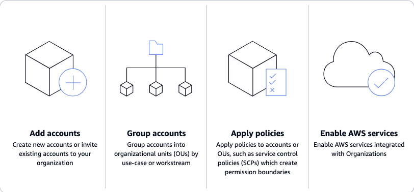
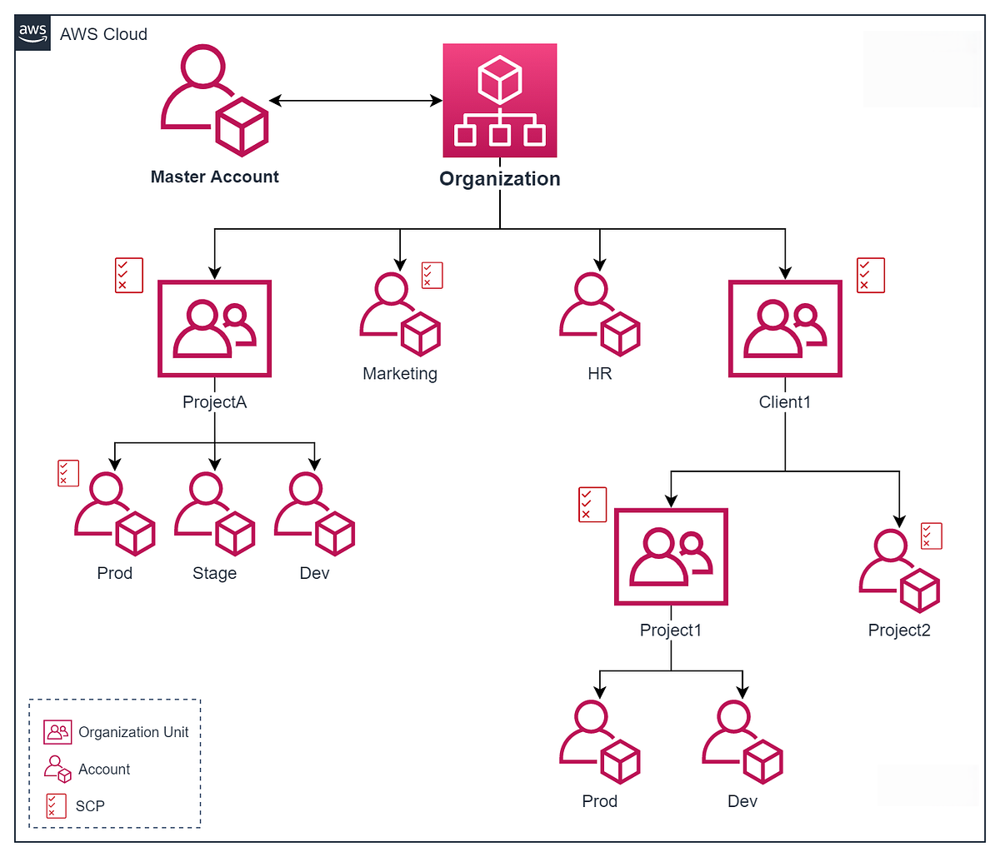
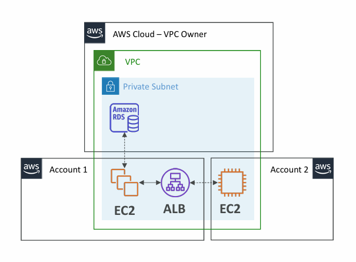
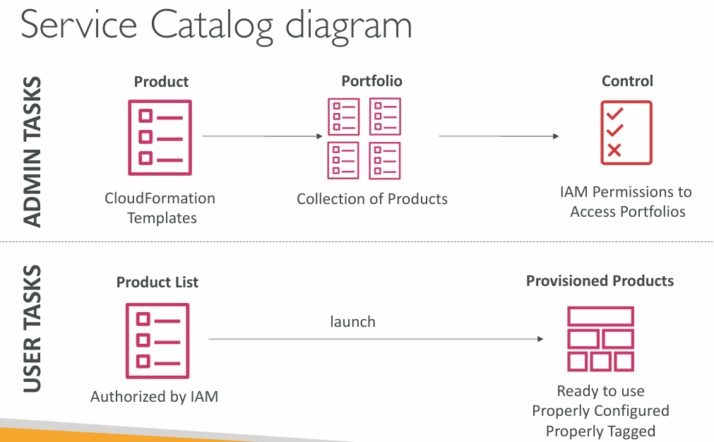
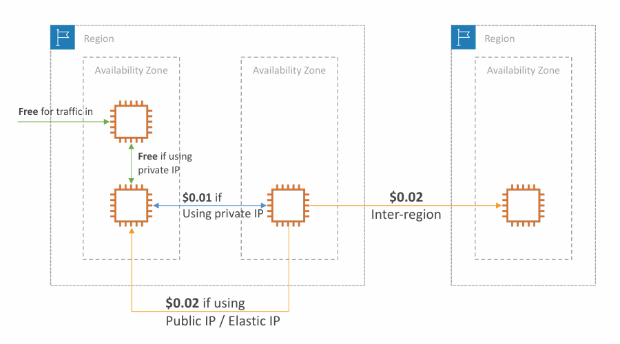
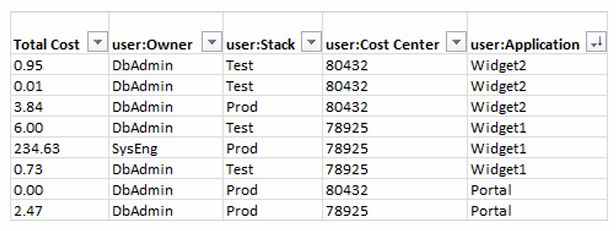
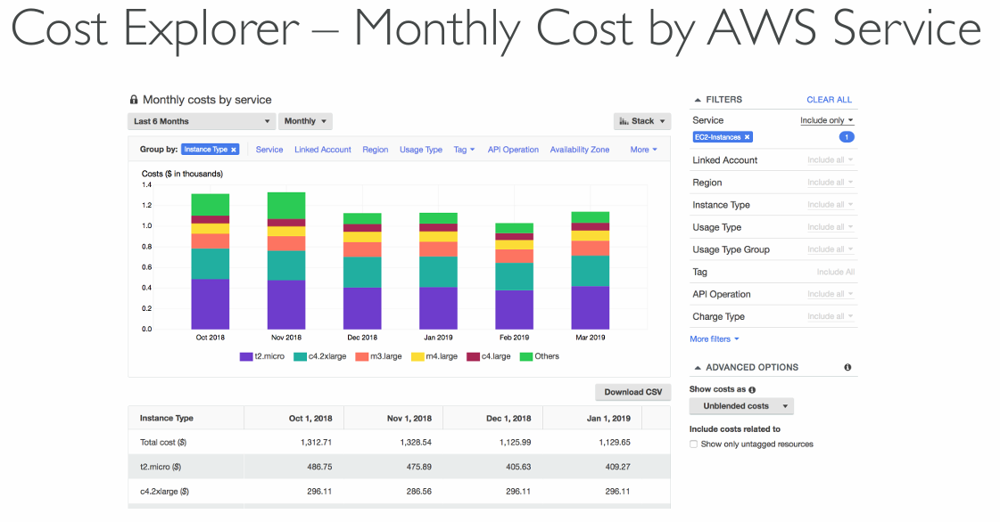

## AWS Organizations

_How AWS Organizations work_

_Diagram of basic Organization_

_More about Organizations terminology and structure:_ https://docs.aws.amazon.com/organizations/latest/userguide/orgs_getting-started_concepts.html_

_Best Practices for Organizational Units with AWS Organizations:_ https://aws.amazon.com/blogs/mt/best-practices-for-organizational-units-with-aws-organizations/
### Creating Organizations and Accounts
---


*Accessing newly created accounts to manage organizations wasn't clear. This video explains it in great details. Please note it doesn't cover permissions / restrictions for that account to have in the organization.

---
### AWS Organization - Consolidated Billing

Consolidated billing must first be enabled.

- **Combined Usage** - combine the usage across all AWS accounts in the AWS Organization to **share the volume pricing, reserved instances and saving plans discounts**
- **One bill** - get one bill for all AWS Accounts in the AWS Organization
## AWS Control Tower

##### **AWS Control Tower** = easy way to set up and govern a secure and compliant multi-account AWS environment based on best practices.

- Automate the setup of your environment in a few clicks
- Automate ongoing policy management using guardrails
- Detect policy violations and remediate them
- Monitor compliance through an interactive dashboard
##### AWS Control Tower runs on top of AWS Organizations.

- It automatically set up AWS Organizations to organize accounts and implement **SCPs** (Service Control Policies)
## AWS Resource Access Manager (RAM)

- Share AWS resources that you own with other AWS accounts
- **Share with any account or withing your organization**
- **Avoid resource duplication**
- Supported resources include:
	- Aurora
	- VPC Subnets
	- Transit Gateway
	- Route53
	- EC2 Dedicated Hosts
	- License Manager Configurations

_AWS Resource Access Manager (RAM)_
## AWS Service Catalog

**AWS Service Catalog** is a **self-service portal** that allows users to launch a set of authorized products predefined by admins.
##### Users that are new to the organization could create stacks that are not compliant / not in line with the rest of the organization.

Includes: Virtual Machines, Databases, Storage options, etc.

_More about Service Catalog:_ https://docs.aws.amazon.com/servicecatalog/

Service offering with standards how the company is building their services.
## Pricing models in AWS
### 4 AWS pricing models

- Pay as you go: pay for what you use, remain agile, responsive, meet scale demands
- Save when you reserve: minimize risks, predictably manage budgets, comply with long-term requirements
	- Reservations are available for [EC2 Reserved Instances](), [DynamoDB]() Reserved Capacity, [ElastiCache]() Reserved Nodes, [RDS]() Reserved Instance, [Redshift]() Reserved Nodes
- Pay less by using more: volume-based discounts
- Pay less as AWS grows
### Free Services & Free Plan in AWS

- With a new AWS account, you get up to $200 in credits
- You choose between **Free Plan** or **Paid Plan**
	- **Free Plan** expires in 6 months or when credits are consumed
	- **Paid Plan** charged after you consume your credits
- Both plans have access to **Always Free** services (monthly free usage limits)
	- [Lambda]() - 1,000,000 requests / month and 400,000 GB-seconds compute / month
	- [DynamoDB]() - 25 GB of storage and 200M requests / month

_More about free services in AWS:_ https://aws.amazon.com/free/
### Compute pricing
#### EC2

- On-demand instances
	- Minimum of 60 seconds
	- Pay per second (Linux / Windows) or per hour (Other)
- Reserved instances
	- Up to 75% discount compared to On-demand on hourly rate
	- 1 or 3 years commitment
	- All upfront, partial upfront, no upfront
- Spot instances
	- Up to 90% discount compared to On-demand on hourly rate
	- Bid for unused capacity
- Dedicated host
	- On-demand
	- Reservation for 1 or 3 years commitment
- Saving plans as an alternative to save on sustained usage
#### Lambda & ECS

- [Lambda]()
	- Pay per call
	- Pay per duration
- [ECS]()
	- EC2 Launch Type Model: No additional fees, you pay for AWS resources stored and created in the application
- [Fargate]()
	- Pay for vCPU and memory resources allocated to the applications running in your containers
### Storage Pricing
#### [S3]()

- [Storage class]() (S3 Standard, S3 Infrequent Access, S3 One-Zone IA, S3 Intelligent Tiering, S3 Glacier and S3 Glacier Deep Archive)
- Number and size of objects: Price can be tiered (based on volume)
- Number and type of requests
- Data transfer OUT of S3 region
- [S3 Transfer Acceleration]()
- Lifecycle transitions

Similar service: [EFS]() (pay per use, has infrequent access and lifecycle rules).
#### [EBS]()

- Volume type (based on performance)
- Storage volume in GB per month (**provisioned!**)
- IOPS
	- General Purpose SSD: included
	- Provisioned IOPS SSM: provisioned amount of IOPS
	- Magnetic: number of requests
- Snapshots
	- Added data cost per GB per month
- Data transfer
	- Outbound data transfer are tiered for volume discounts
	- Inbound is free
### Database Pricing
#### [RDS]()

- Per hour billing
- Database characteristics:
	- Engine
	- Size
	- Memory class
- Purchase type:
	- On-demand
	- Reserved instances (1 or 3 years) with optional up-front
- Backup Storage: there is no additional charge for backup storage up to 100% of your total database storage for a region
- Additional storage (per GB per month)
- Number of input and output requests per month
- Deployment type (storage and I/O are variable)
	- Single AZ
	- Multiple AZ
- Data transfer
	- Outbound data transfer are tiered for volume discounts
	- Inbound is free
### Content Delivery
#### [CloudFront]()

- Pricing is different across different geographic regions
- Aggregated for each edge location, then applied to the bill
- Data Transfer Out (volume discount)
- Number of HTTP(s) requests
### Networking costs in AWS per GB - Simplified

- Use Private IP instead of Public IP for good savings and better network performance
- Use same AZ for maximum savings (at the cost of High Availability)

## Savings Plan

- Commit a certain $ amount per hours for 1 or 3 years
- Easiest way to setup long-term commitment on AWS
- **EC2 Savings plan**
	- Up to 72% discount compared to On-demand
	- **Commit to usage of individual instance families** (e.g. C5 or M5)
	- Regardless of AZ, size, OS or tenancy
	- All upfront, partial upfront, no upfront
- **Compute Savings plan**
	- Up to 66% discount compared to On-demand
	- **Regardless of Family, Region, size, OS, tenancy, compute options**
	- Compute Options: [EC2](), [Fargate](), [Lambda]()
- Machine learning Savings plan: [SageMaker]()...
##### Savings plans can be set up from AWS Cost Explorer console.
## Compute Optimizer

**Reduce costs** and **improve performance** by recommending optimal AWS resources for your workloads.

Helps you choose optimal configurations and right-size your workloads (over / under provisioned).

Uses Machine Learning to analyze your resources configurations and their utilization ([CloudWatch]() metrics).

Supported resources:

- EC2 Instances
- EC2 Auto Scaling Groups
- EBS Volumes
- Lambda functions
##### Compute Optimized can lower costs by up to 25%.

Recommendations can be exported to S3.
## Billing and Costing Tools
### Estimating costs in the cloud

- Pricing Calculator
	- Available at: https://calculator.aws
	- Estimate the cost of your solution architecture
### Tracking costs in the cloud

- Billing Dashboard (`AWSConsole > Billing`)
	- Cost
	- Forecast
	- Month to date
- Cost Allocation Tags (`AWSConsole > Resource Groups & Tag Editor`)
	- Allows tracking your AWS costs at a detailed level
	- AWS generated tags (automatically applied to resources that are created, start with prefix aws:)
	- User generated tags (defined by user, start with prefix user:)	
	
	- Tags can be used for organizing resources:
		- EC2: instances, images, load balancers, security groups...
		- RDS, VPC resources, Route53, IAM users...
#### Most granular AWS cost report:

- Cost and Usage Reports (`AWSConsole > Billing`)
	- The most comprehensive set on AWS cost and usage data available, including additional metadate about AWS services, pricing and reservations (e.g. EC2 Reserved Instances)
	- Lists AWS usage for each service category used by an account and it's IAM users in hourly or daily line items as well as any tags associated / created for cost allocation purposes
	- Can be integrated with [Athena](), [Redshift]() or [QuickSight]()

- Cost Explorer (`AWSConsole > Billing > Cost Explorer`)
	- Visualize, understand and manage your AWS costs and usage over time
	- Create custom reports that analyze cost and usage data
	- Analyze your data at higher level: total costs and usage across all accounts
	- Monthly, hourly, resource-level granularity
	- Choose optimal Savings Plan (to lover the prices)
	- Forecast usage up to 12 months based on previous usage
	- Monthly cost by AWS service
	

#### Monitoring against cost plans:

- Billing Alarms
	- Billing data metric is stored in CloudWatch us-east-1
	- Billing data are for overall worldwide AWS costs
	- It's for actual cost, not for projected costs
	- Intended a simple alarm (not as powerful as Budgets)
- Budgets (`AWSConsole > Billing > Budgets and Planning`)
	- Create budget and send alarms when cost (or forecast) exceeds the budget
	- 4 types of budgets: Usage, Cost, Reservation, Savings Plans
	- Up to 5 SNS notifications per budget
## AWS Cost Anomaly Detection

AWS Cost Anomaly Detection is continuously monitoring your cost and usage using Machine Learning to detect unusual activities.

It is learning your unique, historic spending patterns to detect on-time cost spike OR continuous cost increases.

It will send the anomaly detection report with root-cause analysis.

`AWSConsole > Billing > Cost and Usage Analysis > Cost Anomaly Detection`
## AWS Service Quotas

Notify when you're close to a service quota (e.g. Lambda concurrent connections).

Create [CloudWatch]() Alarms on the Service Quotas console.

`AWSConsole > Service Quotas`
## AWS Trusted Advisor

Built in, no need to install anything. High level AWS account assessment.

Analyzes AWS accounts and provides recommendation in 6 categories:

- Cost optimization
- Performance
- Security
- Fault tolerance
- Service limits
- Operational Excellence

Business or Enterprise support plan for full set of checks.
## Support Plans for AWS

### Basic

- **Customer Service & Communities** - 24/7 access to customer service, documentation, whitepapers, support forums
- **AWS Trusted Advisor** - Access to the 7 core Trusted Advisor checks and guidance to provision your resources following best practices to increase performance and improve security
- **AWS Personal Health Dashboard** - A personalized view of the health of AWS services and alerts when your resources are impacted
### Developer

- **All Basic**
- **Business hours email access to Cloud Support Associates**
- Unlimited cases / unlimited contacts

Response times:

- General guidance: < 24 business hours
- System impaired: <12 business hours
### Business

- **All Developer**
- Intended for **production workloads**
- **Trusted Advisor** - full set of checks + API access
- **24/7 phone, email and chat access** to Cloud Support Engineers

Response times:

- General guidance: < 24 business hours
- System impaired: <12 business hours
- Production system impaired: < 4 hours
- Production system down: < 1 hour
### Enterprise (On-Ramp)

- **All business**
- Access to a pool of **Technical Account Managers (TAM)**
- **Concierge Support Team** (for billing and account best practices)
- **Infrastructure Event Management, Well-Architected & Operations Reviews**

Response times:

- Production system impaired: < 4 hours
- Production system down: < 1 hour
- **Business-critical system down:** < 30 minutes
### Enterprise

- **All Enterprise (On-Ramp)**
- Access to a designated **Technical Account Manager (TAM)**
- Access to **AWS Incident Detection and Response** (for an additional fee)

Response times:

- **Business-critical system down:** < 15 minutes
## Account Best Practices

- Operate multiple accounts using **Organizations**
- Use **SCP** (Service Control Policies) to restrict the account privileges
- Easily setup multiple accounts with best-practices with **AWS Control Tower**
- **Use Tags & Cost Allocation Tags** for easy management and billing
- **IAM guidelines:** MFA, least-privilege, password policy, password rotation
- **Config** to record all resources configurations and compliance over time
- **CloudFormation** to deploy stacks across accounts and regions
- **Trusted Advisor** to get insights, Support Plan adapted to your needs
- Send Service Logs and Access Logs to [S3]() or [CloudWatch]()
 Logs
- **CloudTrail** to record API calls made within your account
- Use **AWS Service Catalog** to define pre-defined stacks that are used by your organization
## Summary

- Compute Optimizer: recommends resources configurations to reduce cost
- Pricing Calculator: cost of services on AWS (estimate the cost of your solution)
- Billing Dashboard: high-level overview (cost, forecast, month to date)
- Cost Allocation Tags: tag resources to create detailed reports
- Cost and Usage Reports: most comprehensive billing dataset
- Cost Explorer: View current usage (detailed) and forecast usage
- Billing Alarms: in us-east-1 - track overall and per-service billing
- Budgets: more advanced - track usage, costs and get alerts
- Savings Plans: easy way to save based on long-term usage of AWS
- Cost Anomaly Detection: detect unusual spends using Machine Learning
- Service Quotas: notify you when you're close to service quota threshold

---
## >> Sources <<

- AWS Organizations: https://docs.aws.amazon.com/organizations
- Best Practices for Organizational Units with AWS Organizations: https://aws.amazon.com/blogs/mt/best-practices-for-organizational-units-with-aws-organizations/
- Free Services in AWS: https://aws.amazon.com/free/

- AWS Pricing Calculator: https://calculator.aws

 _Full YouTube Rahul's AWS Course:_ https://www.youtube.com/playlist?list=PL7iMyoQPMtAN4xl6oWzafqJebfay7K8KP
## >> References <<

- [Identity and Access management (IAM)]()
## >> Table of contents (CLF-C02) <<

|                                                                         |                                                                                     |                                                                                       |
| ----------------------------------------------------------------------- | ----------------------------------------------------------------------------------- | ------------------------------------------------------------------------------------- |
| [1. What is Cloud Computing]()   | [2. IAM]()                                                       | [3. Budget]()                                                   |
| [4. EC2]()                                           | [5. Security Groups]()                               | [6. Storage]()                                                 |
| [7. AMI]()                                           | [8. Scalability & High Availability]() | [9. Elastic Load Balancing]()                   |
| [10. Auto Scaling Group]()          | [11. S3]()                                                       | [12. Databases]()                                           |
| [13. Other Compute Services]()   | [14. Deployments]()                                     | [15. AWS Global Infrastructure]()           |
| [16. Cloud Integrations]()           | [17. Cloud Monitoring]()                           | [18. VPC]()                                                       |
| [19. Security and Compliance]() | [20. Machine Learning]()                           | [21. Account Management and Billing]() |
| [22. Advanced Identity]()             | [23. Other Services]()                               | [24. AWS Architecting & Ecosystem]()        |
|                                                                         | [25. Preparing for AWS Practitioner exam]()  |                                                                                       |
## >> Disclaimer <<


_Disclaimer: Content for educational purposes only, no rights reserved._

Most of the content in this series is coming from **Stephane Maarek's** [Ultimate AWS Certified Cloud Practitioner CLF-C02 2025](https://www.udemy.com/course/aws-certified-cloud-practitioner-new/) course on Udemy.

I highly encourage you to take the [Stephane's courses](https://www.udemy.com/user/stephane-maarek/) as they are awesome and really help understanding the subject.

_More about Stephane Maarek:_

- https://www.linkedin.com/in/stephanemaarek
- https://x.com/stephanemaarek

**This article is just a summary and has been published to help me learning and passing the practitioner exam.**
