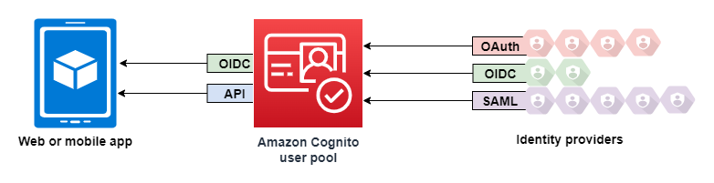

## AWS STS (Security Token Service)

- Enables creating temporary, limited-privileged credentials to access AWS resources
- Short-term credentials (you configure the expiration period)
- Use cases:
	- Identify federation: manage user identities in external systems and provide them STS tokens to access AWS resources
	- IAM Roles for cross / same account access
	- IAM Roles for Amazon EC2: provide temporary credentials for EC2 instances to access AWS resources
## Amazon Cognito

##### Identity for Web and Mobile application users (potentially millions).

Instead of creating users in IAM, web users can be created using Cognito

_Amazon Cognito for web and mobile applications. It can also integrate with Google and Facebook login._
## Directory Services

##### Database of objects: User accounts, Computers, Printers, File Shares, Security Groups...
### AWS Directory Services

- AWS Managed Microsoft AD
	- Create our own AD in AWS, manage users locally, supports MFA
	- Establish "Trust" connections with on-premise AD
- AD Connector
	- Directory Gateway (proxy) to redirect to on-premise AD, supports MFA
	- Users are managed on the on-premise AD
- Simple AD
	- AD-compatible managed directory on AWS
	- Cannot be joined with on-premise AD
## AWS IAM Identity Center

### One login (single sign-on) for:

- AWS Accounts in AWS Organizations
- Business cloud application (e.g. Salesforce, Box, Microsoft 365, ...)
- SAML2.0-enabled applications
- EC2 Windows Instances
### Identity providers:

- Built-in identity store in IAM Identity Center
- 3rd party: Active Directory, OneLogin, Okta, ...
## Summary

- IAM
	- Identity and Access Management inside your AWS account
	- For users that you trust and belong to your company
- Organizations
	- Manage multiple accounts
- Security Token Service (STS)
	- Temporary, limited-privileges credentials to access AWS resources
- Cognito
	- Create a database of users for your web and mobile applications
- Directory Services
	- Integrate Microsoft Active Directory in AWS
- IAM Identity Center
	- One login for multiple AWS accounts and applications

---
## >> References <<

- [Identity and Access management (IAM)]()
## >> Table of contents (CLF-C02) <<


## >> Disclaimer <<


