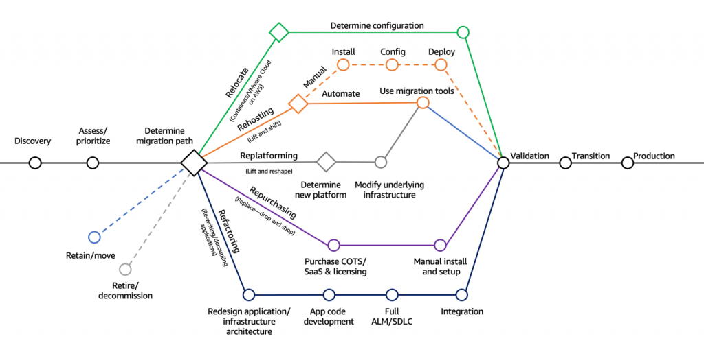

# Other AWS Services that don't fit in other categories.

## Workspaces

Managed **Desktop as a Service (DaaS)** solution to easily provision Windows or Linux desktops.

- Great to eliminate management of on-premise VDI infrastructure
- Fast and quickly scalable to thousands of users
- Secured data - integrates with KMS
- Pay-as-you-go service with monthly or hourly rates
## AppStream

- Desktop Application Streaming Service
- Deliver to any computer without provisioning infrastructure
- **The application is delivered within a web browser**
## IoT Core

IoT Core allows easily connecting IoT devices to the AWS Cloud.
## AppSync

Store and sync data across mobile and web apps in real-time using **GraphQL (mobile technology from Facebook).**
## Amplify

A set of tools and services that helps you to develop and deploy scalable full stack web mobile applications.

- Authentication, Storage, API (REST, GraphQL), CI/CD, Analytics, Monitoring, ...
## AWS Infrastructure Composer

Visually design and build serverless applications quickly on AWS.

Deploy AWS infrastructure code without needing to be an expert in AWS.

**Generates Infrastructure as Code (IaC) using CloudFormation**

```AWSConsole
CLI > Infrastructure Composer
```
## Device Farm Overview

Fully-managed service that can test your web and mobile app against desktop browsers, real mobile devices and tablets.


## AWS Backup

Fully-managed service to centrally manage and automate backups across AWS services.

- On-demand and scheduled backups.
- Cross-region and cross-account (AWS Organizations) backups


## <font color=#f43f5e>Disaster Recovery Strategies</font>

- <font color=#f1ef63>Backup and Restore</font> - cheapest method
- <font color=#f1ef63>Pilot Light</font> - core functions are there (e.g. database) but it's not scaled up
- <font color=#f1ef63>Warm Standby</font> - full version of the app but at minimum size (databases, webs, api, ...)
- <font color=#f1ef63>Multi-Site / Hot-Site</font> - full version, full size active-active DR
### AWS Elastic Disaster Recovery (DRS)

Quickly and easily recover physical, virtual and cloud-based servers into AWS.

- Continuous block-level replication of servers to the cloud


## AWS DataSync

Move large amount of data from on-premises to AWS.

- Can synchronize to: 
	- Amazon S3 (any storage classes - including Glacier)
	- Amazon EFS
	- Amazon FSx for Windows
- Replication tasks can be scheduled hourly, daily, weekly
- The replication tasks are <font color=#f43f5e>incremental</font> after the first full load
## Cloud Migration Strategies - the 7Rs



_More info about Cloud Migration Strategy:_ https://aws.amazon.com/blogs/enterprise-strategy/new-possibilities-seven-strategies-to-accelerate-your-application-migration-to-aws/
### Application Discovery Service & Application Migration Service

- Plan migration projects by gathering information about on-premises data centers
- Server utilization data and dependency mapping are important for migrations

- Agentless Discovery
- Agent-based Discovery
### AWS Migration Evaluator

Helps to build a data-driven business case for migration to AWS.
### AWS Migration Hub

Central location to collect servers and applications inventory data for the assessment, planning and tracking of migrations to AWS.
## AWS Fault Injection Service (FIS)

A fully-managed service for running fault injection experiments on AWS workloads. Based on <font color=#f43f5e>Chaos Enginneering</font>.

Supports the following services: EC2, ECS, EKS, RDS, ...
## Step Functions

Build serverless visual workflow to orchestrate your Lambda functions.


## Ground Station

Fully managed service to control satellite communications, process data and scale your satellite operations.

Provides a global network of satellite ground stations near AWS regions.

Send satellite data to S3 or EC2 instance.

<font color=#f1ef63>Use Cases:</font>
- Weather forecasting
- Surface imaging
- Communications
- Video broadcasts
## AWS Pinpoint

Scalable 2-way (outbound / inbound) marketing communication service.

Supports email, SMS, push, voice and in-app messaging.

Used for running marketing campaigns.

---
## Sources

- More info about Cloud Migration Strategy: https://aws.amazon.com/blogs/enterprise-strategy/new-possibilities-seven-strategies-to-accelerate-your-application-migration-to-aws/

---
### Disclaimer


_Disclaimer: Content for educational purposes only, no rights reserved._

Most of the content in this series is coming from **Stephane Maarek's** [Ultimate AWS Certified Cloud Practitioner CLF-C02 2025](https://www.udemy.com/course/aws-certified-cloud-practitioner-new/) course on Udemy.

I highly encourage you to take the [Stephane's courses](https://www.udemy.com/user/stephane-maarek/) as they are awesome and really help understanding the subject.

_More about Stephane Maarek:_

- https://www.linkedin.com/in/stephanemaarek
- https://x.com/stephanemaarek

**This article is just a summary and has been published to help me learning and passing the practitioner exam.**

