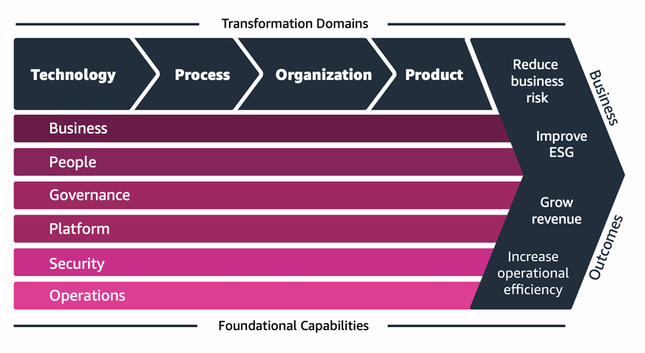

## Well-Architected Framework

- Stop guessing capacity (use [Auto Scaling]())
- Test systems at production scale
- Automate!
- Allow for evolutionary architectures

Scalability: vertical & horizontal 
Disposable Resources: servers should be disposable & easily configured 
Automation: serverless, Infrastructure as a Service, Auto Scaling... 

Loose coupling:
- _Monolith applications_ that do more and more over time become bigger
- Break it down into smaller, "_loosely coupled_" components
- A change or failure in one component should not cascade to other components

Services, not Servers:
- Don't just use EC2
- Use managed services, databases, serverless, etc...

_AWS Well-Architected:_ https://aws.amazon.com/architecture/well-architected/
### 1. Operational Excellence

##### **Operational excellence** includes the ability to run and monitor systems to deliver business value and continually improve supporting processes and procedures.

Design Principles:

- Perform Operations as Code - IaS
- Frequent, small, reversible changes - reverse in case of failure
- Refine operations procedures frequently - ensure team members are familiar with it
- Anticipate failure
- Learn from the failures
- Use managed services - to reduce operational burden
- Implement observability for actionable insights - performance, reliability, cost, ...
### 2. Security
##### **Security** includes an ability to protect information, systems and assets while delivering business value through risk assessments and mitigation strategies.

Design Principles:

- Implement a strong identity foundation - centralize privilege management and reduce (or eliminate) reliance on long-term credentials - _Principle of least privilege_ - [IAM]()
- Enable traceability - integrate logs and metrics with systems to automatically respond and take action - [Cloud Monitoring]()
- Apply security at all layers - edge network, VPC, subnet, load balancer, (every) EC2 instance, operating system, application
- Automate security best practices
- Protect data in transit and at rest - [encryption](), [tokenization]() and [access control]()
- Keep people away from data - reduce or eliminate the need for direct access or manual processing of data
- Prepare for security events - run incident response simulations and use tools with automation to increase your speed of detection, investigation and recovery
### 3. Reliability

##### **Reliability** is an **ability of a system to recover from infrastructure or service disruptions**, dynamically acquire computing resources to meet demand and mitigate disruptions such as misconfigurations or transient network issues.

Design Principles:

- Test recovery procedures - use automation to simulate different failures or to recreate scenarios that led to failures before
- Automatically recover from failure - anticipate and remediate failures before they occur
- Scale horizontally to increase aggregate system availability - distribute requests across multiple, smaller resources to ensure that they don't share a common point of failure
- Stop guessing capacity - maintain the optimal level to satisfy demand without over or under provisioning
- Manage change in automation - use automation to make changes to infrastructure
### 4. Performance Efficiency
##### **Performance Efficiency** includes **ability to use computing resources efficiently** to meet system requirements and to maintain that efficiency as demand changes and technologies evolve.

Design Principles:

- Democratize advanced technologies - advance technologies become services and hence you can focus more on product development
- Go Global in minutes - easy deployment in multiple regions
- Use serverless architecture - avoid the burden of managing servers
- Experiment more often - easy to carry out comparative testing
- Mechanical sympathy - be aware of all AWS services
### 5. Cost Optimization

##### **Cost Optimization** includes ability to run systems to deliver business value at the lowest price point.

Design Principles:

- Adopt a consumption mode - pay only for what you use
- Measure overall efficiency - use [CloudWatch]()
- Stop spending money on data center operations - AWS does the infrastructure part and enables customer to focus on organization projects
- Analyze and attribute expenditure - accurate identification of system usage and costs helps to measure Return on Investment (ROI) - make sure to use tags!
- Use managed and application level services to reduce cost of ownership - as managed services operate at cloud scale then can offer a lower cost per transaction or service
### 6. Sustainability
##### **Sustainability** focuses on minimizing the environmental impact of running cloud workloads.

Design Principles:

- Understand your impact - establish performance indicators, evaluate improvements
- Establish sustainability goals - set long-term goals for each workload, model Return on Investment (ROI)
- Maximize utilization = right size each workload to maximize the energy efficiency of the underlying hardware and minimize idle resources
- Anticipate and adopt new, more efficient hardware and software offerings - and design for flexibility to adopt new technologies over time
- Use managed services - shared services reduce the amount of infrastructure
## AWS Well-Architected Tool

Free tool to review your architecture against the 6 pillars of Well-Architected Framework and adopt architectural best practices.
## AWS Customer Carbon Footprint Tool

Tool to track, measure, review and forecast the carbon emissions generated from your AWS usage.
## AWS Cloud Adoption Framework (CAF)

Helps you build and then execute a comprehensive plan for your digital transformation through innovative use of AWS.

Created by AWS Professionals by taking advantage of AWS Best Practices and lessons learned from 1000s of customers.
##### **AWS CAF** groups it's capabilities in six perspectives:

- Business
	- Business perspective helps to ensure that your cloud investments accelerate your digital transformation ambitions and business outcomes
- People
	- Serves a **bridge between technology and business**, accelerating the cloud journey to help organizations more rapidly evolve to a culture of continuous growth, learning and where change becomes BAU
- Governance
	- Helps orchestrating cloud initiatives while maximizing organizational benefits and minimizing transformation related risks
- Platform
	- Helps building an enterprise-grade, scalable, hybrid cloud platform and modernize existing workloads
- Security
	- Helps achieving the confidentiality, integrity and availability of the data and cloud workflows
- Operations
	- Helps ensuring that your cloud services are delivered at a level that meets the needs of your business

	
	_AWS Cloud Adoption Framework (CAF)_
### AWS CAF - Transformation Domains

- Technology - using the cloud to migrate and modernize legacy infrastructure, applications, data and analytics platforms
- Process - digitizing, automating and optimizing your business operations
- Organization - reimagining your operating model
### AWS CAF - Transformation Phases

- Envision - demonstrate how the Cloud will accelerate business outcomes
- Align - identify capability gaps across the 6 AWS CAF Perspectives which results in an Action Plan
- Launch - build and deliver pilot initiatives in production and demonstrate incremental business value
- Scale - expand pilot initiatives to the desired scale while realizing the desired business benefits

_More:_ [AWS Cloud Adoption Framework (AWS CAF)](https://aws.amazon.com/cloud-adoption-framework/)
## AWS Right Sizing

[EC2]() has many [instance types](). Right sizing is the process of matching instance types and sizes to your workload.

**Scaling up is easy so always start small...**
## AWS Ecosystem - Free resources

- AWS Blogs: https://aws.amazon.com/blogs/aws/ 
- AWS Forums (community): https://forums.aws.amazon.com/index.jspa
- AWS Whitepapers & Guides: https://aws.amazon.com/whitepapers
- AWS Solutions Library (formerly Quick Starts): https://aws.amazon.com/solutions/
	- Vetted Technology Solutions for the AWS Cloud
	- Example: live streaming on AWS https://aws.amazon.com/solutions/implementations/live-streaming-on-aw
## AWS Professional Services and Partner Network

##### **APN:** AWS Partner Network.

- APN Technology Partners: providing hardware, connectivity, software
- APN Consulting Partners: professional services firm to help build on AWS
- APN Training Partners: learning AWS
## AWS IQ

Engage and pay AWS Certified 3rd party experts for on-demand project work.
## AWS re:Post

AWS Forums.

AWS re:Post is not intended to be used for questions that are time-sensitive.

[Discover AWS Official Knowledge Center Articles | AWS re:Post](https://repost.aws/knowledge-center)

---
## >> Sources <<

- AWS Well-Architected: https://aws.amazon.com/architecture/well-architected/
- AWS Cloud Adoption Framework (CAF): https://aws.amazon.com/cloud-adoption-framework
- AWS re:Post forums: https://repost.aws/knowledge-center

- AWS Blogs: https://aws.amazon.com/blogs/aws/ 
- AWS Forums (community): https://forums.aws.amazon.com/index.jspa
- AWS Whitepapers & Guides: https://aws.amazon.com/whitepapers
- AWS Solutions Library (formerly Quick Starts): https://aws.amazon.com/solutions/
	- Vetted Technology Solutions for the AWS Cloud
	- Example: live streaming on AWS https://aws.amazon.com/solutions/implementations/live-streaming-on-aw

## >> Table of contents (CLF-C02) <<


## >> Disclaimer <<


