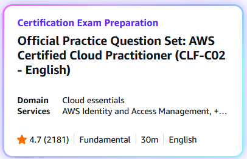
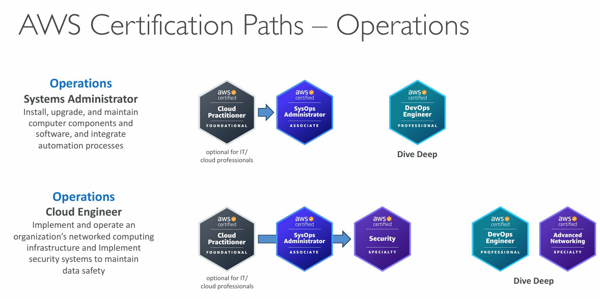

## AWS Certified Cloud Practitioner

The **AWS Certified Cloud Practitioner** validates foundational, high-level understanding of AWS Cloud, services, and terminology.  This is a good starting point on the AWS Certification journey...

_Official website for AWS Certified Cloud Practitioner:_ [AWS Certified Cloud Practitioner](https://aws.amazon.com/certification/certified-cloud-practitioner/)

_Exam guide:_ https://d1.awsstatic.com/training-and-certification/docs-cloud-practitioner/AWS-Certified-Cloud-Practitioner_Exam-Guide.pdf
### Content domains and weightings

- Domain 1: **Cloud Concepts** (24% of scored content)
- Domain 2: **Security and Compliance** (30% of scored content)
- Domain 3: **Cloud Technology and Services** (34% of scored content)
- Domain 4: **Billing, Pricing, and Support** (12% of scored content)
### Exam Prep Official Questions Set

- https://skillbuilder.aws/
- https://skillbuilder.aws/category/exam-prep/cloud-practitioner-foundational

_Official Practice Question Set for CLF-C02_

\*Loads more learning and exam preparation resources on [AWS Skill Builder website](https://skillbuilder.aws/)
## Registering for the exam

https://www.aws.training/certification
## AWS Certification Paths - Operations

## >> Sources <<

**Amazon Whitepapers:**

- [Overview of Amazon Web Services](https://docs.aws.amazon.com/whitepapers/latest/aws-overview/introduction.html)    
- [AWS Well-Architected Framework](https://docs.aws.amazon.com/wellarchitected/latest/framework/welcome.html)    
- [AWS Shared Responsibility Model](https://docs.aws.amazon.com/whitepapers/latest/aws-risk-and-compliance/shared-responsibility-model.html)    
- [AWS Pricing](https://aws.amazon.com/pricing/?aws-products-pricing.sort-by=item.additionalFields.productNameLowercase&aws-products-pricing.sort-order=asc&awsf.Free%20Tier%20Type=*all&awsf.tech-category=*all)    
- [Compare AWS Support Plans](https://aws.amazon.com/premiumsupport/plans/)
## >> Table of contents (CLF-C02) <<

|                                                                         |                                                                                     |                                                                                       |
| ----------------------------------------------------------------------- | ----------------------------------------------------------------------------------- | ------------------------------------------------------------------------------------- |
| [1. What is Cloud Computing]()   | [2. IAM]()                                                       | [3. Budget]()                                                   |
| [4. EC2]()                                           | [5. Security Groups]()                               | [6. Storage]()                                                 |
| [7. AMI]()                                           | [8. Scalability & High Availability]() | [9. Elastic Load Balancing]()                   |
| [10. Auto Scaling Group]()          | [11. S3]()                                                       | [12. Databases]()                                           |
| [13. Other Compute Services]()   | [14. Deployments]()                                     | [15. AWS Global Infrastructure]()           |
| [16. Cloud Integrations]()           | [17. Cloud Monitoring]()                           | [18. VPC]()                                                       |
| [19. Security and Compliance]() | [20. Machine Learning]()                           | [21. Account Management and Billing]() |
| [22. Advanced Identity]()             | [23. Other Services]()                               | [24. AWS Architecting & Ecosystem]()        |
|                                                                         | [25. Preparing for AWS Practitioner exam]()  |                                                                                       |


Take look at [Stephane Maarek's courses](https://www.udemy.com/user/stephane-maarek/) on [Udemy](https://www.udemy.com/) if you want to prepare for **AWS certifications** or just **learn AWS**. Top quality content, highly recommended.

