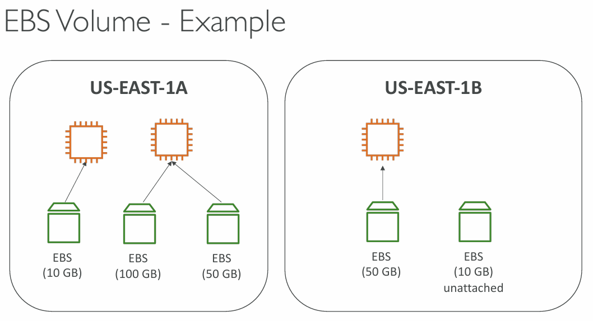
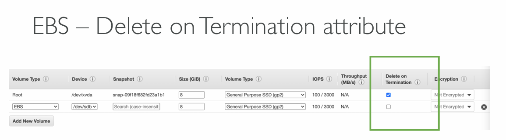

## EBS Volume

- **EBS** (Elastic Block Store) - Network drive that can be attached to instances while they run
- <font color=#10b981>It allows instances to persist the data, even after their termination</font>
- <font color=#10b981>Can be mounted to 1 instance at a time</font>
- <font color=#10b981>Bound to an Availability Zone</font>
- It's a "**Network Drive**"
	- it uses the network to communicate to the instance (there can be latency)
	- it can be detached from an EC2 instance and attached to another one quickly
- <font color=#10b981>It's locked to an Availability Zone (AZ)</font>
	- an EBS Volume that is _us-east-1a_ can't be attached to _us-east-1b_
	- to move a volume across AZ, snapshot has to be created first
- <font color=#10b981>It has a provisioned capacity (size in GB and IOPS)</font>
	- you will get billed for a provisioned capacity
	- You can increase the capacity of the drive


_<font color=#f43f5e>EBS Volumes can be attached to only 1 EC2 instance at a time but EC2 instances can have multiple EBS Volumes attached to them</font>_
### EBS Delete on Termination



- Controls the EBS behavior when EC2 instance terminates
	- by default the root EBS volume is deleted (attribute enabled)
	- by default any other attached EBS volume is not deleted (attribute disabled)
- This can be controlled by both, AWS Console and AWS CLI
- <font color=#f1ef63>Use case:</font> preserve root volume when instance is terminated
## EBS Snapshots

- Make a backup (snapshot) of EBS volume at a point in time
- Not necessary to detach the volume to do the snapshot but recommended
- Snapshots can be copied across AZ or Regions
### EBS Snapshots features

- EBS Snapshot Archive
	- Move a Snapshot to an "archive tier" that is 75% cheaper
	- Takes between 24 to 72 hours of restoring the archive

```AWSConsole
EC2 > Snapshots > Recycle Bin > Create retention rule
```

When Snapshot Archive is enabled, it is possible to Archive it from a drop-down box in AWS Console. Archived Snapshot appears in the Recycle Bin

- Recycle Bin for EBS Snapshots
	- Setup rules to retain deleted snapshots so you can recover them after an accidental deletion
	- Specify retention (from 1 day to 1 year)
## EC2 Instance Store

- EBS volumes are network drives with good but "limited" performance
- <font color=#10b981>If high-performance hardware disk is required, EC2 Instance Store can be used</font>

- Better I/O performance
- EC2 Instance Store is ephemeral (data is lost after stopping EC2 instance)
- <font color=#f1ef63>Use case:</font> buffer, cache, scratch data, temporary content

<font color=#f43f5e>Risk of data loss if hardware fails.</font>
## EFS - Elastic File System

- <font color=#f1ef63>Managed NFS</font> (Network File System) that can be mounted on 100s of EC2 instances
- <font color=#f43f5e>EFS works with Linux EC2 instances only</font> and is <font color=#10b981>multi-AZ.</font>
- Highly-available, scalable, <font color=#f43f5e>expensive</font> (3x gp2 EBS), pay per use, no capacity planning
### EFS Infrequent Access (EFS-IA)

- Storage class that is cost-optimized for files not accessed every day
- up to <font color=#f43f5e>92% lower cost</font> compared to EFS Standard
- When enabled, EFS will automatically move your files to **EFS-IA** based on last time they were accessed
- Enable **EFS-IA** with a **Lifecycle Policy**
	- Example: move files that are not accessed for 60 days to **EFS-IA**
- Transparent to the applications accessing EFS (apps don't see whether file is in EFS or EFS-IA)
## EBS vs EFS

| Feature             | EBS                              | EFS                           |
| ------------------- | -------------------------------- | ----------------------------- |
| **Access Model**    | Single-instance                  | Multi-instance                |
| **Use Cases**       | Databases, Development           | Web serving, big data         |
| **Performance**     | Low-latency, high IOPS           | High throughput               |
| **Scalability**     | Limited to provisioned volume    | Auto-scales to petabytes      |
| **File Size Limit** | No limit                         | 47.9 TiB                      |
| **Accessibility**   | Not accessible over the internet | Shared across instances       |
| **Pricing**         | Cheaper for single-instance      | Cost-effective for shared use |
*More:* 
- https://aws.amazon.com/efs/when-to-choose-efs/
- https://lucidity.cloud/blog/ebs-vs-efs
- https://www.cloudzero.com/blog/ebs-vs-efs/
## Amazon FSx

3rd party with high-performance file system on AWS.

- **FSx for Lustre** - fully managed, high-performance, scalable <font color=green>file storage for High Performance Computing (HPC)</font>. 
	- <font color=#f1ef63>Use cases:</font> Machine Learning, Analytics, Video processing, Financial Modelling
	- Scales up to 100s GB/s, millions of IOPS, sub-ms latencies
- **FSx for Windows File Server** - fully managed, highly reliable and scalable Windows native shared file system built on Windows File Server. <font color=green>Supports SMB and NTFS file systems. Integrated with AD for security. Can be accessed from AWS or from On-Premise.</font>
- **FSx for NetApp ONTAP** - 
## Summary

##### EBS Volumes

- network drives attached to one EC2 instance at a time
- Mapped to an Availability Zones
- Can use EBS snapshots for backups and then transferring across AZ's
##### AMI

- Create ready-to-use EC2 instances with own customizations
##### EC2 Image Builder

- automatically build, test and distribute AMI's
##### EC2 Instance Store

- high performance hardware disk attached to our EC2 instance
- ephemeral (data lost if instance stopped or terminated)
##### EFS

- Network File System
- Can be attached to 100s of EC2 instances
- spans through a region
- expensive compared to EBS
##### EFS-IA

- Cost-optimized storage class for infrequently accessed files
- Lifecycle Policy for automatically moving files between tiers
##### FSx for Windows

- Network File System for Windows servers
- SMB and NTFS
- Can be accessed from on-prem and the cloud
##### FSx for Lustre

- High Performance (HPC) Linux file system


---
## Sources

- https://aws.amazon.com/efs/when-to-choose-efs/
- https://lucidity.cloud/blog/ebs-vs-efs
- https://www.cloudzero.com/blog/ebs-vs-efs/
## References

- <font color=#27D3F5>S3</font>
- <font color=#27D3F5>EC2</font>
- <font color=#27D3F5>AMI</font>
---
### Disclaimer


_Disclaimer: Content for educational purposes only, no rights reserved._

Most of the content in this series is coming from **Stephane Maarek's** [Ultimate AWS Certified Cloud Practitioner CLF-C02 2025](https://www.udemy.com/course/aws-certified-cloud-practitioner-new/) course on Udemy.

I highly encourage you to take the [Stephane's courses](https://www.udemy.com/user/stephane-maarek/) as they are awesome and really help understanding the subject.

_More about Stephane Maarek:_

- https://www.linkedin.com/in/stephanemaarek
- https://x.com/stephanemaarek

**This article is just a summary and has been published to help me learning and passing the practitioner exam.**

