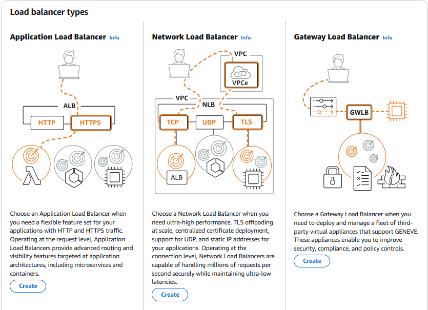

**Elastic Load Balancing** automatically **distributes your incoming traffic** across multiple targets (EC2 instances, containers, IP addresses) in **one or more Availability Zones**.

It monitors the health of its registered targets and routes the traffic only to healthy targets.

---


_AWS Elastic Load Balancing Introduction_

---
## Benefits of using Load Balancer

- Spread load across multiple downstream instances
- Expose a single point of access (DNS) to the application
- Seamlessly handle failures of downstream instances
- Do regular health checks to the instances
- SSL termination
- High Availability across Availability Zones

- ELB is a managed Load Balancer
	- AWS is responsible for upgrades, maintenance and High Availability
	- AWS provides only a few configuration items
## 3 kinds of Load Balancers offered by AWS

| Application Load Balancer               | Network Load Balancer                              | Gateway Load Balancer                                       |
| --------------------------------------- | -------------------------------------------------- | ----------------------------------------------------------- |
| HTTP / HTTPS / gRPC protocols (Layer 7) | TCP / UDP protocols (Layer 4)                      | Geneve Protocol on IP Packets (Layer 3)                     |
| HTTP Routing features                   | High Performance (millions or requests per second) | Route Traffic to Firewalls that you manage on EC2 instances |
| Static DNS (URL)                        | Static IP through Elastic IP                       | Intrusion Detection                                         |

### 1. Application Load Balancer 

- HTTP / HTTPS only (Layer 7)


_AWS ALB (Application Load Balancer) - Step By Step Tutorial_

---
### 2. Network Load Balancer 

- ultra high performance, allows for TCP (Layer 4)


_Mastering AWS Network Load Balancer | ALB vs NLB | Step by Step Tutorial_

---

### 3. Gateway Load Balancer

- Supports GENEVE protocol. Built for extra security (Layer 3)

---
## >> Sources <<

- https://aws.amazon.com/elasticloadbalancing/
- https://aws.amazon.com/compare/the-difference-between-the-difference-between-application-network-and-gateway-load-balancing/
- https://medium.com/@xiaotiancheng.orange/comparison-between-alb-nlb-and-glb-4444f3291173
- https://tutorialsdojo.com/application-load-balancer-vs-network-load-balancer-vs-gateway-load-balancer/

 _Stephane Maarek's AWS playlists on YouTube:_ https://www.youtube.com/@StephaneMaarek/playlists
 _Full YouTube Rahul's AWS Course:_ https://www.youtube.com/playlist?list=PL7iMyoQPMtAN4xl6oWzafqJebfay7K8KP
## >> References <<

- [Scalability & High Availability]()
- [Auto Scaling Groups]()
## >> Table of contents (CLF-C02) <<

|                                                                         |                                                                                     |                                                                                       |
| ----------------------------------------------------------------------- | ----------------------------------------------------------------------------------- | ------------------------------------------------------------------------------------- |
| [1. What is Cloud Computing]()   | [2. IAM]()                                                       | [3. Budget]()                                                   |
| [4. EC2]()                                           | [5. Security Groups]()                               | [6. Storage]()                                                 |
| [7. AMI]()                                           | [8. Scalability & High Availability]() | [9. Elastic Load Balancing]()                   |
| [10. Auto Scaling Group]()          | [11. S3]()                                                       | [12. Databases]()                                           |
| [13. Other Compute Services]()   | [14. Deployments]()                                     | [15. AWS Global Infrastructure]()           |
| [16. Cloud Integrations]()           | [17. Cloud Monitoring]()                           | [18. VPC]()                                                       |
| [19. Security and Compliance]() | [20. Machine Learning]()                           | [21. Account Management and Billing]() |
| [22. Advanced Identity]()             | [23. Other Services]()                               | [24. AWS Architecting & Ecosystem]()        |
|                                                                         | [25. Preparing for AWS Practitioner exam]()  |                                                                                       |
## >> Disclaimer <<


_Disclaimer: Content for educational purposes only, no rights reserved._

Most of the content in this series is coming from **Stephane Maarek's** [Ultimate AWS Certified Cloud Practitioner CLF-C02 2025](https://www.udemy.com/course/aws-certified-cloud-practitioner-new/) course on Udemy.

I highly encourage you to take the [Stephane's courses](https://www.udemy.com/user/stephane-maarek/) as they are awesome and really help understanding the subject.

_More about Stephane Maarek:_

- https://www.linkedin.com/in/stephanemaarek
- https://x.com/stephanemaarek

**This article is just a summary and has been published to help me learning and passing the practitioner exam.**

