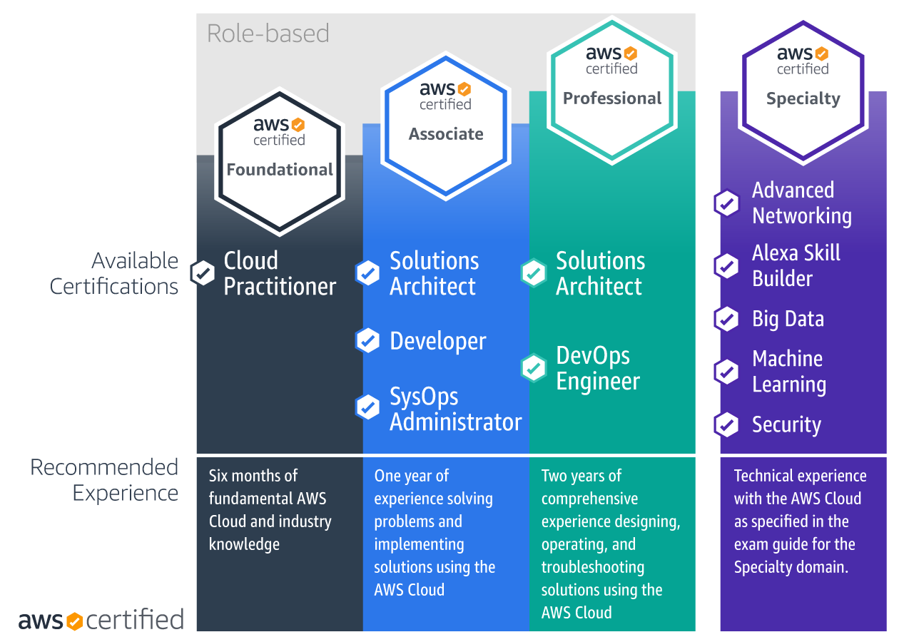

| AWS Series »                               |                                                                       |
| --------------------------------------------------------------------- | --------------------------------------------------------------------- |
| [AWS Cloud Practitioner]() | [AWS Solution Architect]() |
## AWS FAQ


A bunch of **FAQ's**, **Resources** and **general advice on AWS careers and certifications**.

_Sources:_ 
- [GitHub - simplesteph/AWS-FAQ · GitHub](https://github.com/simplesteph/AWS-FAQ)
- [Amazon AWS FAQ's](https://aws.amazon.com/faqs/)

### AWS Certification Course Resources

1. [learn.cantrill.io](https://learn.cantrill.io/) - ([Adrian Cantrill](https://www.linkedin.com/in/adriancantrill/))    
2. [Linux Academy](https://linuxacademy.com/) - (multiple authors)    
3. [Data Cumulus](https://courses.datacumulus.com/) - ([Stephane Maarek](https://www.linkedin.com/in/stephanemaarek/))    
4. [Tutorial Dojo](https://tutorialsdojo.com/) - ([Jon Bonso](https://www.linkedin.com/in/jonbonso/))    
5. [A Cloud Guru](https://acloud.guru/) - (multiple authors)    
6. [Digital Cloud Training](https://digitalcloud.training/) - ([Neal Davis](https://www.linkedin.com/in/nealkdavis/))    
7. [WhizLabs](https://www.whizlabs.com/)    
8. [Exam Pro](https://www.exampro.co/) - ([Andrew Brown](https://www.linkedin.com/in/andrew-wc-brown/))    
9. [CBT Nuggets](https://www.cbtnuggets.com/certification-playlist/aws) - (Anthony Sequeria, [Bart Castle](https://www.linkedin.com/in/bartcastleit/), [Ben Finkel](https://www.linkedin.com/in/benjaminfinkel/))    

**Verify the course you are looking at is for the exam version you are going to take.**
### AWS Certification Practice Exams

1. [Tutorial Dojo](https://tutorialsdojo.com/) - (Jon Bonso)    
2. [WhizLabs](https://www.whizlabs.com/)    
3. [Digital Cloud Training](https://digitalcloud.training/) - (Neal Davis)    
4. [LinuxAcademy](https://www.linuxacademy.com/) - (multiple authors)    
5. [AWS Exam Readiness](https://www.aws.training/LearningLibrary?&search=exam%20readiness&tab=digital_courses) (free recap made by exams creators)    
6. [Review Prep](https://reviewnprep.com/quiz)    
7. [Quizlet](https://www.reddit.com/r/AWSCertifications/comments/gz6ie9/quizlets_aws_certification_practice_questions_by)    
8. [Exam Pro](https://www.exampro.co/) included with courses
### AWS Certification Cheat Sheets

1. [Tutorial Dojo](https://tutorialsdojo.com/) - (Jon Bonso)    
2. [Digital Cloud Training](https://digitalcloud.training/) - (Neil Davis)    
3. [Curated list](https://gist.github.com/leonardofed/bbf6459ad154ad5215d354f3825435dc) of AWS resources for the certification    
4. [AWS in Plain English](https://expeditedsecurity.com/aws-in-plain-english/)    
5. [Exam Pro](https://www.exampro.co/) included with courses
### AWS Whitepaper Help

1. AWS Ramp Up PDFs    
    1. [Business-Finance](https://cdn.discordapp.com/attachments/570278657323565066/695249732137648128/AWS_RampUp_Business-Finance.pdf)        
    2. [Architect](https://cdn.discordapp.com/attachments/570278657323565066/695249730397274152/AWSRampUp_Architect.pdf)        
    3. [Developer](https://cdn.discordapp.com/attachments/570278657323565066/695249728857833513/AWSRampUp_Developer.pdf)        
    4. [Operations](https://cdn.discordapp.com/attachments/570278657323565066/695249723191459900/AWSRampUp_Operations.pdf)        
2. Knowledge Hut [Whitepaper Recommendations](https://www.knowledgehut.com/blog/cloud-computing/recommended-aws-whitepapers)    
3. AWS Well Architected Whitepapers    
    5. [Framework](https://d1.awsstatic.com/whitepapers/architecture/AWS_Well-Architected_Framework.pdf)        
    6. [Operational Excellence](https://d1.awsstatic.com/whitepapers/architecture/AWS-Operational-Excellence-Pillar.pdf)        
    7. [Security](https://d1.awsstatic.com/whitepapers/architecture/AWS-Security-Pillar.pdf) 
    8. [Reliability](https://d1.awsstatic.com/whitepapers/architecture/AWS-Reliability-Pillar.pdf)
    9. [Performance](https://d1.awsstatic.com/whitepapers/architecture/AWS-Performance-Efficiency-Pillar.pdf)        
    10. [Cost](https://d1.awsstatic.com/whitepapers/architecture/AWS-Cost-Optimization-Pillar.pdf)
### Communities

1. Linux Academy Slack - [https://linuxacademy-community-slack.herokuapp.com/](https://linuxacademy-community-slack.herokuapp.com/)    
2. Learn.cantrill.io Slack - [https://techstudyslack.com/](https://techstudyslack.com/)    
3. [NetworkChuck](https://www.linkedin.com/in/chuckkeith/) Discord - [https://discord.gg/networkchuck](https://discord.gg/networkchuck)    
4. Tortoise - Python Beginner Discord - [https://discord.gg/8DnGKc2](https://discord.gg/8DnGKc2)    
5. OG-AWS Slack - [https://og-aws-slack.lexikon.io/](https://og-aws-slack.lexikon.io/)    
6. DevOpsChatCo Slack - [https://devopschat.co/register](https://devopschat.co/register)    
7. AWS Community Discord - [https://discord.gg/JN9FMbm](https://discord.gg/JN9FMbm)    
### What Do I Need For AWS Job?

While not specific to AWS, the [DevOps Roadmap](https://roadmap.sh/devops) is incredibly useful in painting some context for the general learning of AWS concepts like EC2 and logs management and CI/CD tooling.

[Why An AWS Certification Will Not Get You An AWS Job!](https://www.reddit.com/r/AmazonWebServices/comments/ga0tqc/why_an_aws_certification_will_not_get_you_an_aws/)

[We Hire AWS Solutions Architects Not Paper Certified Ones](https://medium.com/linux-academy/we-hire-real-aws-solutions-architects-not-paper-certified-ones-e17bd28ba487)

No two jobs will be the same. Find out the AWS position you want and then go research it on Indeed, LinkedIn, ZipRecruiter, CareerBuilder, GlassDoor, Monster. What appears on "most" of those job reqs is what you need to learn/know.

[Create better searches on those job sites!](https://business.linkedin.com/content/dam/me/business/en-us/talent-solutions/learning-center/tip-sheets/en-us/UseBooleanLogic.pdf)

You can find recruiters by doing fuzzy searches on keywords + location. Then follow or message said recruiter for future opportunities. From there you can also find the commonly used "recruiter hashtags" that are relevant to your area. 

[Where Do I Find Recruiters?](https://www.reddit.com/r/ITCareerQuestions/comments/f8bo3v/where_do_i_find_recruiters/)

That being said here is a very general idea to get you started.

- At least 1 major cloud associate level certification (AWS, Azure, GCP)
- At least 1 hands on with Ansible, Puppet, Chef, Salt
- At least 1 hands on with Docker or Kubernetes
- At least one scripting language, perf Python, JavaScript, Go, or Java
- At least 1 Windows or Linux, perf both
- An understanding of DevOps and Agile environments
### What Certification Should I Get?



📺[David Bombal](https://www.youtube.com/@davidbombal): What you need to study in 2020

### Where can I pickup those non AWS skills?

1. [KodeKloud](https://kodekloud.com/p/learning-path) (DevOps, Linux, Docker, Ansible, Puppet, Kubernetes, Chef, Docker Swarm, OpenShift)    
2. [instruqt](https://play.instruqt.com/public) (DevOps, Docker, Kubernetes, Terraform, React, CI/CD, Git)    
3. [Codecademy](https://www.codecademy.com/) (Python, JavaScript, Java, SQL, Go, etc.)    
4. [Automate the Boring Stuff](https://automatetheboringstuff.com/) (Python)    
5. [Katacoda](https://www.katacoda.com/learn) (Docker, Kubernetes, Linux, Git, Languages, Terraform)    
6. [Linux Journey](https://linuxjourney.com/) [https://linuxjourney.com/](https://linuxjourney.com/) (Linux)    
7. [Over The Wire](https://overthewire.org/wargames/) (Security)    
8. [DevOps Bootcamp](https://www.youtube.com/playlist?list=PLleOCN2eBn8IhLAckXL0BWomad5lrhB8j) (24 Video DevOps Bootcamp)
### More Resources?

CCP Write Ups

1. [AWS CCP - Thoughts, My Journey, My Opinion](https://www.reddit.com/r/AWSCertifications/comments/grlzah/aws_ccp_thoughts_my_journey_my_opinion/)

CSAA Write Ups

1. [AWS CSAA - Thoughts, My Journey, My Opinion, What’s Next](https://www.reddit.com/r/AWSCertifications/comments/grn03n/aws_csaa_thoughts_my_journey_my_opinion_what_next/)    
2. [Thoughts AWS Certified Associate Exam](https://intrinsecsecurity.com/thoughts-aws-certified-architect-associate-exam/)    
3. [Passing AWS Solutions Architect Exam in 2019](https://blog.usejournal.com/passing-the-aws-solutions-architect-associate-exam-in-2019-81fccb7caebd)    
4. [So You Want To Learn AWS](https://www.reddit.com/r/sysadmin/comments/8inzn5/so_you_want_to_learn_aws_aka_how_do_i_learn_to_be/)    
5. AWS CSAA [Bullet Point Study Guide](https://github.com/undergroundwires/AWS-in-bullet-points)    

Real World Examples

1. Amazon’s [This Is My Architecture](https://aws.amazon.com/this-is-my-architecture/?tma.sort-by=item.additionalFields.airDate&tma.sort-order=desc)

Other

1. What Is [SRE](https://landing.google.com/sre/sre-book/chapters/introduction/)?    
2. What is [DevOps](https://resources.collab.net/devops-101/what-is-devops)?    
3. What is [Agile](https://www.cprime.com/resources/what-is-agile-what-is-scrum/)?    
4. What is [CI/CD](https://www.redhat.com/en/topics/devops/what-is-ci-cd)?    

AWS Topics more:Explanation

1. [Transit Gateway](https://medium.com/@heycasey/creating-a-transit-gateway-6e3df814a07a) - ([Paul Casey](https://www.linkedin.com/in/heycasey/))    
2. [AWS Stash](https://awsstash.com/) - filterable collection of AWS resources
## Related AWS Github Repos

1. [Practical Guide](https://github.com/open-guides/og-aws) to AWS    
2. My Arsenal of AWS [Security Tools](https://github.com/toniblyx/my-arsenal-of-aws-security-tools)    
3. [Curated List](https://github.com/donnemartin/awesome-aws) of Awesome AWS libraries, open source repos, guides, blogs, etc.    
4. AWS [Status Page Explanations](https://github.com/neilthecellist/Statuspage2English)

---
## >> Sources <<

_Sources:_ 
- [GitHub - simplesteph/AWS-FAQ · GitHub](https://github.com/simplesteph/AWS-FAQ)
- [Amazon AWS FAQ's](https://aws.amazon.com/faqs/)

_Series:_
- [Series: AWS Cloud Practitioner]()
- [Series: AWS Solution Architect]()
## SAA-C03 details and Resources

- [Ultimate AWS Certified Solutions Architect Associate 2026](https://www.udemy.com/course/aws-certified-solutions-architect-associate-saa-c03)
- [AWS Certified Solutions Architect Associate Code & Slides](https://courses.datacumulus.com/downloads/certified-solutions-architect-pn9/)
	- [AWS Certified Solutions Architect Associate | Slides](https://media.datacumulus.com/aws-saa/AWS%20Certified%20Solutions%20Architect%20Slides%20v47.pdf)
	- [AWS Certified Solutions Architect Associate | Code](https://links.datacumulus.com/sa-associate-code-pn9)
- [Practice Exams | AWS Certified Solutions Architect Associate](https://www.udemy.com/course/practice-exams-aws-certified-solutions-architect-associate)

_Source:_ https://courses.datacumulus.com/downloads/certified-solutions-architect-pn9/