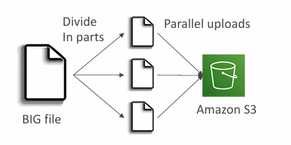
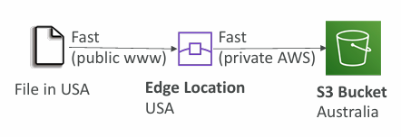

| AWS Certifications Series  »               |                                                                       |
| --------------------------------------------------------------------- | --------------------------------------------------------------------- |
| [AWS Cloud Practitioner]() | [AWS Solution Architect]() |

## S3 - Introduction

ℹ️ **Associate‑level extension** of the [S3]() section from the [AWS Cloud Practitioner]() series. In this post, I expand on key **S3** concepts and introduce deeper topics relevant to the **Associate‑level understanding**.

---



<b>Do not skip S3 foundational section!</b>
 

<small><small>⬇️⬇️⬇️</small></small>



‼️<a href="" target="_self"> S3 Foundational Section</a>

---
## S3 - Advanced

ℹ️ Read more about [S3 Storage Classes]() in the [AWS Cloud Practitioner]() series.
### Moving between Storage Classes

- You can transition objects between storage classes
- For **infrequently accessed** object, move them to **Standard IA**
- For **archive objects** that you don’t need fast access to, move them to **Glacier** or **Glacier Deep Archive**
- Moving objects **can be automated using a Lifecycle Rules**

")
### Lifecycle Rules

- **Transition Actions** - configure objects to transition to another storage class
	- Move objects to Standard IA class 60 days after creation
	- Move to Glacier for archiving after 6 months

- **Expiration actions** - configure objects to expire (delete) after some time
	- Access log files can be set to delete after a 365 days
	- Can be used to delete old versions of files (if versioning is enabled)
	- Can be used to delete incomplete Multi-Part uploads
	
Rules can be created for a certain prefix (example: _s3://mybucket/mp3/*_)
Rules can be created for certain objects Tags (example: Department: Finance)
#### Storage Class Analysis

- Helps you determine when to move objects into the appropriate storage class    
- Provides **recommendations for Standard and Standard‑IA**    
- Does **not support One‑Zone IA or Glacier**
- Report updates daily    
- Takes 24-48 hours before analysis begins
### Requester Pays

- Normally, the bucket owner pays for all S3 storage and data‑transfer costs    
- With **Requester Pays**, the requester covers request and data‑download charges instead    
- Useful for sharing large datasets across AWS accounts
- The requester must be authenticated in AWS (cannot be anonymous)
### Event Notifications

- Supports events like **ObjectCreated**, **ObjectRemoved**, **ObjectRestore**, **Replication**, etc.    
- Allows object‑name filtering (e.g., `*.jpg`)    
- Common use cases: generate image thumbnails, trigger data processing pipelines, send notifications, update search indexes, run ETL jobs, or kick off serverless workflows    
- You can define as many S3 event notifications as needed

")
### Performance

- Amazon S3 automatically scales to high request rates, latency 100-200 ms
- Your application can achieve at least **3,500 PUT/COPY/POST/DELETE** or **5,500 GET/HEAD requests per second per prefix in a bucket.**

| Example (object path => prefix): |                   |
| -------------------------------- | ----------------- |
| bucket/folder1/sub1/file         | => /folder1/sub1/ |
| bucket/folder1/sub2/file         | => /folder1/sub2/ |
| bucket/1/file                    | => /1/            |
| bucket/2/file                    | => /2/            |



- Objects (files) have a Key
- The key is the FULL path:
	- s3://my-bucket/my_file.txt
	- s3://my-bucket/my_folder/another_folder/my_file.txt
- The key is composed of prefix + object name
	- s3://my-bucket/my_folder/another_folder/my_file.txt
- There is no concept of "_directories_" within S3 buckets (although UI will suggest there is), just keys with very long names that contain slashes ("/")



<i>More about S3 Objects:</i> [Amazon S3 - Objects]()

| Multi-Part upload:                                      | S3 Transfer Acceleration                                                                                                               |
| ------------------------------------------------------- | -------------------------------------------------------------------------------------------------------------------------------------- |
| recommended for files > 100MB, must use for files > 5GB | Increase transfer speed by transferring file to an AWS edge location which will forward the data to the S3 bucket in the target region |
| Can help parallelize uploads (speed up transfers)       | Compatible with multi-part upload                                                                                                      |
|                            |                                                                                                           |

### Storage Lens

- Provides visibility to **understand, analyze, and optimize storage usage across your entire AWS Organization**
- **Surfaces anomalies**, **highlights cost‑saving opportunities**, and **recommends data‑protection best practices** using 30 days of usage and activity metrics
- Lets you aggregate insights at the Organization, account, region, bucket, or prefix level

- Default dashboard shows Multi-Region and Multi-Account data
	- Preconfigured by Amazon S3
## S3 - Security

- [Security best practices for Amazon S3](https://docs.aws.amazon.com/AmazonS3/latest/userguide/security-best-practices.html)
- [Amazon S3 Security Controls Cheat Sheet](https://www.cybr.com/cloud-security/amazon-s3-security-controls-cheat-sheet/)

")

### Object Encryption

- **Server-Side Encryption (SSE)**
	- Server-Side Encryption with Amazon S3-Managed Keys (SSE-S3) - Enabled by Default
		- Encrypts S3 objects using keys handled, managed, and owned by AWS
	- Server-Side Encryption with KMS Keys stored in AWS KMS (SSE-KMS)
		- Leverage AWS Key Management Service (AWS KMS) to manage encryption keys
	- Server-Side Encryption with Customer-Provided Keys (SSE-C)
		- When you want to manage your own encryption keys
- **Client-Side Encryption**



- **SSE‑S3** → AWS owns and manages everything
- **SSE‑KMS** → AWS KMS manages keys, but you can own them and enforce strict controls
- **SSE‑C** → You own the keys entirely and provide them with every request



| Feature                                       | SSE-S3                                   | SSE-KMS                                                                | SSE-C                                                                     |
| --------------------------------------------- | ---------------------------------------- | ---------------------------------------------------------------------- | ------------------------------------------------------------------------- |
| Who owns the keys? | AWS (S3 owns & manages all keys)         | AWS KMS owns keys, but you can own/manage Customer‑Managed Keys (CMKs) | You (customer provides and fully owns the keys)                           |
| Key storage        | Managed internally by S3                 | Stored in AWS KMS                                                      | Not stored by AWS                                                         |
| Key rotation       | Automatic (AWS‑controlled)               | Optional automatic rotation for CMKs                                   | You must rotate keys yourself                                             |
| Access control     | Basic S3 IAM permissions                 | Fine‑grained IAM + KMS key policies                                    | Controlled entirely by you                                                |
| Audit logging      | No per‑object key usage logs             | Full CloudTrail audit of every key request                             | No AWS audit logs (AWS never sees the key)                                |
| Performance        | Fastest (no KMS calls)                   | Slightly slower due to KMS API calls                                   | Similar to SSE‑S3, but you must supply keys per request                   |
| Must set header    | "x-amz-server-side-encryption": "AES256" | "x-amz-server-side-encryption": "aws:kms"                              | Encryption key must provided in HTTP headers, for every HTTP request made |
| Use cases          | Default encryption, general workloads    | Compliance, regulated workloads, strict access control                 | Bring‑your‑own‑key requirements, external key management                  |
#### SSE-S3

- Uses encryption keys that are fully handled, managed, and owned by AWS    
- Objects are encrypted on the server side before being stored    
- Encryption algorithm is **AES‑256**    
- Requires the header: `x-amz-server-side-encryption: AES256`    
- Enabled by default for all new buckets and newly uploaded objects
#### SSE-KMS

- Uses encryption keys that are created, stored, and managed by **AWS KMS**    
- Provides stronger controls: you can manage permissions and audit every key use through **CloudTrail**    
- Objects are encrypted on the server side before being stored



Using **SSE‑KMS** means every S3 upload triggers a **GenerateDataKey** call to KMS, and every download triggers a **Decrypt** call. These operations count toward your **KMS request-per‑second quotas** (which vary by region: 5,500 / 10,000 / 30,000 req/s). 

If your workload is high‑volume, you can hit these limits and experience throttling. You can request a quota increase through the **Service Quotas** console.


#### SSE-C

- Uses server‑side encryption with keys that are fully managed and controlled by the customer, outside of AWS    
- Amazon S3 never stores or retains the encryption key you supply    
- All requests must be sent over HTTPS



**SSE‑C = Server‑Side Encryption with Customer‑Provided Keys.**

**Where the keys live**

- **AWS never stores SSE‑C keys.**    
- **You store them yourself**, typically in:    
    - Your own **on‑premises HSM**        
    - A **third‑party key management system**        
    - A **self‑hosted KMS** (HashiCorp Vault, Thales, Fortanix, etc.)        
    - A **secure secrets manager** (1Password, Bitwarden, CyberArk, etc.)        
    - A **custom encrypted database** or internal secrets vault        

**How they are used**
- For every **PUT** and **GET** request, you must send the key in the HTTPS request header.    
- AWS uses the key **only in memory** to encrypt/decrypt the object.    
- AWS immediately discards the key after the operation.    
- If you lose the key, **the object is unrecoverable**.

**Why SSE‑C exists**
- Some organisations have compliance rules requiring:    
    - **External key custody**        
    - **Keys never stored or managed by AWS**
    - **Full customer control of key lifecycle**



")
### CORS



**Cross-Origin Resource Sharing** (CORS).



- Origin = scheme (protocol) + host (domain) + port
	- example: https://www.example.com (implied port is 443 for HTTPS, 80 for HTTP)
- Web Browser based mechanism to allow requests to other origins while visiting the main origin
- Same origin: http://example.com/app1 & http://example.com/app2
- Different origins: http://www.example.com & http://other.example.com
- The requests won’t be fulfilled unless the other origin allows for the requests, using CORS Headers (example: Access-Control-Allow-Origin)

")


- If a client makes a cross-origin request on our S3 bucket, we need to enable the correct CORS headers
- It’s a popular exam question
- You can allow for a specific origin or for * (all origins)


")
### MFA Delete

- **MFA Delete** adds an extra security layer by requiring a one‑time MFA code before performing sensitive S3 actions    
- MFA is required to **permanently delete object versions** and to **suspend versioning**    
- MFA is _not_ required to **enable versioning** or **list deleted versions**    
- MFA Delete only works when **Versioning is enabled**    
- Only the **root account (bucket owner)** can turn MFA Delete on or off
### S3 Access Logs

S3 access logs let you record **every request** made to your bucket - whether allowed or denied, and regardless of which AWS account made it. Logs are delivered to another S3 bucket **in the same region**, where they can be analysed with tools like Athena, EMR, or external analytics systems. 

The log format is documented by AWS: [Amazon S3 server access log format - Amazon Simple Storage Service](https://docs.aws.amazon.com/AmazonS3/latest/userguide/LogFormat.html)
### Pre-Signed URLs

- Pre‑signed URLs can be generated via the S3 Console, AWS CLI, or SDKs    
- Expiration limits:    
    - **Console:** 1–720 minutes (up to 12 hours)        
    - **CLI:** `--expires-in` (default 3600s, max 604800s ≈ 168 hours)        
- Anyone using the URL inherits the **permissions of the creator** for GET/PUT    
- Common uses:
    - Give authenticated users temporary access to premium content        
    - Dynamically generate download links for changing user lists        
    - Allow temporary, controlled uploads to a specific S3 location
### Glacier Vault Lock

- Implements a **WORM (Write Once, Read Many)** model for immutable data    
- You create a **Vault Lock policy** and then **lock** it so it cannot be changed or deleted    
- Ensures strong compliance and long‑term data retention guarantees
### Object Lock

- Enforces a **WORM (Write Once, Read Many)** model to prevent object version deletion    
- **Retention modes:**    
    - **Compliance:** No one (not even root) can delete or shorten retention; fully immutable        
    - **Governance:** Most users are blocked, but privileged users can modify retention or delete   
- **Retention period:** Protects an object for a fixed time; can only be extended    
- **Legal Hold:**    
    - Protects an object indefinitely, independent of retention        
    - Can be added or removed with the `s3:PutObjectLegalHold` permission
### Access Points

- Access Points simplify security management for S3 Buckets
- Each Access Point has:
	- its own DNS name (Internet Origin or VPC Origin)
	- an access point policy (similar to bucket policy) – manage security at scale

")



You can restrict an S3 Access Point to a VPC by making it **VPC‑only**, requiring access through a **VPC Endpoint**, whose policy must allow the target bucket and Access Point.



")
### Object Lambda

- Use **S3 Object Lambda** with **Lambda functions** to transform objects dynamically before they’re returned    
- Works with a single S3 bucket plus an Access Point and an Object Lambda Access Point    
- Common uses: redact PII, convert data formats (e.g., XML → JSON), or resize/watermark images on demand

---
## >> Sources <<

- [Amazon S3](https://aws.amazon.com/s3/)
- [Amazon Simple Storage Service Documentation](https://docs.aws.amazon.com/s3/)
- [Amazon S3 server access log format - Amazon Simple Storage Service](https://docs.aws.amazon.com/AmazonS3/latest/userguide/LogFormat.html)

**S3 Security:**

- [Security best practices for Amazon S3](https://docs.aws.amazon.com/AmazonS3/latest/userguide/security-best-practices.html)
- [Amazon S3 Security Controls Cheat Sheet](https://www.cybr.com/cloud-security/amazon-s3-security-controls-cheat-sheet/)
## >> References <<

**Cloud Practitioner:** 
- [S3]()
	- [S3 Storage Classes]()
## >> Disclaimer <<

