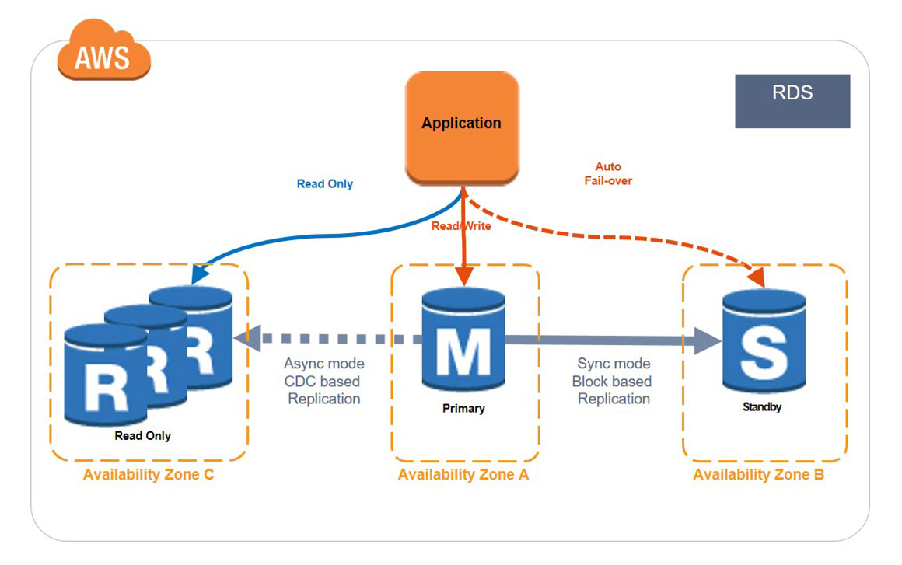

---
ℹ️ **Associate‑level extension** of the [Databases]() section from the [AWS Cloud Practitioner]() series. 

| AWS Certifications Series  »               |                                                                       |
| --------------------------------------------------------------------- | --------------------------------------------------------------------- |
| [AWS Cloud Practitioner]() | [AWS Solution Architect]() |

## RDS

ℹ️ **Cloud Practitioner:** [Amazon RDS]()

- **RDS** stands for _Relational Database Service_
	- Fully managed service for SQL‑based relational databases
	- Lets you run and maintain cloud‑hosted databases without managing the underlying infrastructure    
- **Supported engines:**    
    - **PostgreSQL**        
    - **MySQL**        
    - **MariaDB**        
    - **Oracle**        
    - **Microsoft SQL Server**        
    - **IBM DB2**        
    - **Aurora** (AWS‑built, cloud‑optimised engine)
### RDS - Storage Autoscaling

- Automatically increases storage on your RDS instance when you start running low
- Removes the need for manual storage adjustments    
- You define a Maximum Storage Threshold as the upper limit    
- **Storage is auto‑expanded when:**
    - Free space drops below **10%**        
    - Low‑storage condition lasts **5 minutes**        
    - At least **6 hours** have passed since the last increase        
- Ideal for workloads with unpredictable or spiky storage growth
- Supported across **all RDS engines**
### RDS Read Replicas

- Supports **up to 15 Read Replicas**    
- Replicas can be created **within the same AZ**, **across AZs**, or **across Regions**    
- Replication is **ASYNC**, so read replicas are **eventually consistent**    
- A read replica can be **promoted to a standalone primary database** (i.e., becomes its own **read/write** DB instance)    
- Applications must update their **connection strings** to make use of read replicas



**RDS Read Replicas** let you offload reporting or analytics to a separate read‑only copy of your database so production stays unaffected, since replicas handle SELECT‑only queries and keep heavy workloads away from the primary.



ℹ️ In AWS you normally pay for data transferred between AZs, but <b>RDS Read Replicas within the same region avoid that cross‑AZ data transfer cost</b>.

")
### RDS Multi AZ (Disaster Recovery)

**RDS Multi‑AZ** provides **synchronous replication** to a standby in another AZ, uses a **single DNS endpoint** for automatic failover, boosts availability during AZ, network, instance, or storage failures, requires **no application changes**, and is designed for **high availability rather than scaling**; additionally, **Read Replicas themselves can be configured as Multi‑AZ** for disaster‑recovery purposes.

You can switch an RDS instance from Single‑AZ to Multi‑AZ **with zero downtime by modifying the database configuration**, no restart required.

<i>More info:</i> [Amazon RDS multi-AZ](https://aws.amazon.com/rds/features/multi-az/)
### RDS Backups

- **Automated backups:**
	- Daily full backup of the database (during the backup window)
	- Transaction logs are backed-up by RDS every 5 minutes
	- Ability to restore to any point in time (from oldest backup to 5 minutes ago)
	- 1 to 35 days of retention, set 0 to disable automated backups
- **Manual DB Snapshots:**
	- Manually triggered by the user
	- Retention of backup set by the user
## Aurora

ℹ️ **Cloud Practitioner:** [Amazon Aurora]()



**Aurora** is AWS’s **high‑performance**, **cloud‑optimised database engine** that’s **compatible with MySQL and PostgreSQL**, delivers significantly higher throughput than RDS, auto‑scales storage up to 256 TB, supports up to 15 low‑lag replicas, provides near‑instant failover with built‑in high availability, and costs roughly 20% more than standard RDS in exchange for much greater efficiency.


### High Availability and Read Scaling

### Aurora DB Cluster

### Features of Aurora

### Aurora Replicas - Auto Scaling

### Aurora – Custom Endpoints

### Aurora Serverless

### Global Aurora

### Aurora Backups

### Aurora Database Cloning

## RDS & Aurora Security

## ElastiCache

ℹ️ **Cloud Practitioner:** [ElastiCache]()
### DB Cache

### User Session Store

### Redis vs Memcached

### Cache Security

### Patterns

---
## >> Sources <<

- [Amazon RDS](https://docs.aws.amazon.com/AmazonRDS/latest/UserGuide/Welcome.html)
	- [Amazon RDS multi-AZ](https://aws.amazon.com/rds/features/multi-az/)
- [Amazon Aurora](https://aws.amazon.com/rds/aurora/)
## >> References <<

- **Cloud Practitioner:** [Databases]()
	- **Cloud Practitioner:** [RDS and Aurora]()
	- **Cloud Practitioner:** [Elasticache]()
## >> Disclaimer <<


### Solutions Architect Resources

- [Ultimate AWS Certified Solutions Architect Associate 2026](https://www.udemy.com/course/aws-certified-solutions-architect-associate-saa-c03)
- [AWS Certified Solutions Architect Associate Code & Slides](https://courses.datacumulus.com/downloads/certified-solutions-architect-pn9/)
	- [AWS Certified Solutions Architect Associate | Slides](https://media.datacumulus.com/aws-saa/AWS%20Certified%20Solutions%20Architect%20Slides%20v47.pdf)
	- [AWS Certified Solutions Architect Associate | Code](https://links.datacumulus.com/sa-associate-code-pn9)
- [Practice Exams | AWS Certified Solutions Architect Associate](https://www.udemy.com/course/practice-exams-aws-certified-solutions-architect-associate)

_Source:_ https://courses.datacumulus.com/downloads/certified-solutions-architect-pn9/

| AWS Certifications Series  »               |                                                                       |
| --------------------------------------------------------------------- | --------------------------------------------------------------------- |
| [AWS Cloud Practitioner]() | [AWS Solution Architect]() |
