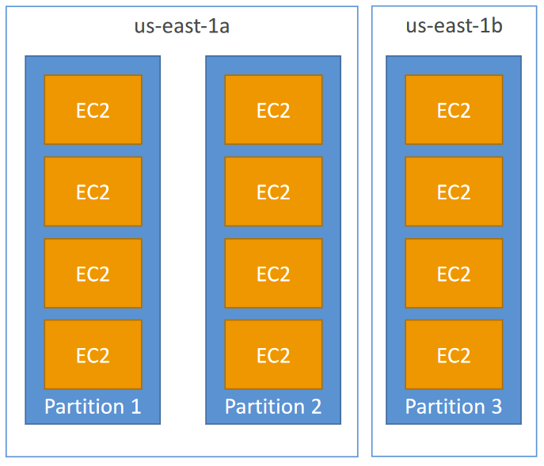

--- 
ℹ️ **Associate‑level extension** of the [EC2]() section from the [AWS Cloud Practitioner]() series. In this post, I expand on key EC2 concepts and introduce deeper topics relevant to the **Associate‑level understanding**.

| AWS Certification Series »                 |                                                                       |
| --------------------------------------------------------------------- | --------------------------------------------------------------------- |
| [AWS Cloud Practitioner]() | [AWS Solution Architect]() |

## Public vs Private vs Elastic IP

- **Public IP**
	- Machine can be identified on the internet
	- Unique across whole web
	- Can be geo-located
- **Private IP**
	- Machine can be identified on the Private Network only
	- Unique across the Private Network
	- Connection to the internet via NAT / Internet Gateway (proxy)
- **Elastic IP**
	- When machine is stopped and started again, it can change it's public IP
	- If fixed Public IP is needed, Elastic IP is required
	- Elastic IP is a Public IPv4 IP address owned by you until it's deleted
	- Can be attached to one instance at a time
	- Only 5 Elastic IP's per account (soft limit, can be extended with AWS support)



**Avoid using Elastic IPs where possible**, since they usually indicate weak architecture choices; instead rely on random public IPs with DNS or, place workloads behind a load balancer so no public IP is needed.

By default, your EC2 machine comes with a private IP for the internal AWS Network and a public IP, for the WWW.

If EC2 instance is stopped and then started, **the public IP can change**.


## Placement Groups

To meet the needs of your workload, you can launch a group of _interdependent_ EC2 instances into a _placement group_ to influence their placement.

")

Depending on the type of workload, you can create a placement group using one of the following placement strategies:
### Cluster

Packs instances close together inside an Availability Zone. This strategy enables workloads to achieve the low-latency network performance necessary for tightly-coupled node-to-node communication that is typical of high-performance computing (HPC) applications.

|               |                                                                                                                                                                                                                                  |
| ------------- | -------------------------------------------------------------------------------------------------------------------------------------------------------------------------------------------------------------------------------- |
| **Pros**      | - Extremely high network throughput and very low latency between instances (**up to 10–100 Gbps with Enhanced Networking**) - Ideal for tightly coupled, high‑performance workloads that need fast node‑to‑node communication |
| **Cons**      | - All instances are in a single AZ, so an AZ outage takes down the entire group  - Capacity can be limited - launches may fail if AWS can’t place all instances close enough together              |
| **Use Cases** | - Big Data or distributed compute jobs that must complete quickly     - HPC workloads, analytics engines, or applications requiring ultra‑low latency and high network bandwidth                                              |
### Partition

Spreads your instances across logical partitions such that groups of instances in one partition do not share the underlying hardware with groups of instances in different partitions. This strategy is typically used by large distributed and replicated workloads, such as Hadoop, Cassandra, and Kafka.

|               |                                                                                                                                                                                                         |
| ------------- | ------------------------------------------------------------------------------------------------------------------------------------------------------------------------------------------------------- |
| **Pros**      | - Can span multiple Availability Zones, improving resilience     - Reduces the risk of simultaneous failure across instances     - Instances are isolated on separate racks and physical hardware |
| **Cons**      | - Limited to **seven partitions per AZ** within a placement group                                                                                                                                       |
| **Use Cases** | - Applications that need maximum high availability     - Critical workloads where each instance must be isolated from failures in other nodes                                                        |
### Spread 

Strictly places a small group of instances across distinct underlying hardware to reduce correlated failures.

|               |                                                                                                                                                         |
| ------------- | ------------------------------------------------------------------------------------------------------------------------------------------------------- |
| **Pros**      | - Highest failure isolation - each instance sits on distinct hardware     - Ideal for small numbers of critical instances needing maximum resilience |
| **Cons**      | - Limited to **seven instances per AZ**                                                                                                                 |
| **Use Cases** | - Critical services where no two instances should fail together                                                                                         |



Placement groups are optional. If you don't launch your instances into a placement group, EC2 tries to place the instances in such a way that all of your instances are spread out across the underlying hardware to minimize correlated failures.


### Pricing

There is no charge for creating a placement group.

📡 _Sources:_ 
- https://docs.aws.amazon.com/AWSEC2/latest/UserGuide/placement-groups.html
- [KodeKloud: EC2 Placement](https://notes.kodekloud.com/docs/AWS-Certified-Developer-Associate/Elastic-Compute-CloudEC2/EC2-Placement)
## Elastic Network Interfaces (ENI)

- Logical component in a VPC that represents a virtual network card 
- The ENI can have the following attributes:
	- Primary private IPv4, one or more secondary IPv4
	- One Elastic IP (IPv4) per private IPv4
	- One Public IPv4
	- One or more security groups
	- A MAC address
	- You can create ENI independently and attach them on the fly (move them) on EC2 instances for failover
	- Bound to a specific availability zone (AZ)

")



**ENIs** are a more advanced networking feature in AWS, and they take a bit of time and hands‑on practice to fully understand. 

They’re powerful once you get comfortable with them, especially for multi‑homed architectures, failover patterns, and security‑focused designs. 

For a deeper dive, **AWS** has a **solid introductory post here:** 

🔥[Elastic Network Interfaces in the Virtual Private Cloud](https://aws.amazon.com/blogs/aws/new-elastic-network-interfaces-in-the-virtual-private-cloud/)



📡 _More:_ 
- https://docs.aws.amazon.com/AWSEC2/latest/UserGuide/using-eni.html
- [KodeKloud: Elastic Network Interfaces](https://notes.kodekloud.com/docs/AWS-Solutions-Architect-Associate-Certification/Services-Compute/Elastic-Network-Interfaces)
## EC2 Hibernate

- **EC2 Hibernate**
	- The in-memory (RAM) state is preserved
	- The instance boot is much faster! (the OS is not stopped / restarted)
	- RAM state is written to a file in the root EBS volume
		- The root EBS volume must be encrypted
 
- **Use cases**
	- Long-running processing
	- Saving the RAM state
	- Services that take time to initialize

- **Instance RAM Size** - must be less than 150 GB
- **Instance Size** - not supported for bare metal instances
- **AMI** - Amazon Linux 2, Linux AMI, Ubuntu, RHEL, CentOS & Windows…
- **Root Volume** - must be EBS, encrypted, not instance store
- **Available for** On-Demand, Reserved and Spot Instances

‼️An instance can NOT be hibernated more than 60 days.
## EC2 Fleet and Spot Fleet



**Fleets** provide the following features and benefits, enabling you to **maximize cost savings** and **optimize availability and performance** when running applications on multiple EC2 instances.



- **Multiple instance types**

A fleet can launch multiple instance types, ensuring it isn't dependent on the availability of any single instance type. This increases the overall availability of instances in your fleet.

- **Distributing instances across Availability Zones**

A fleet can launch into multiple Availability Zones, enabling you to reduce costs and improve availability. If your fleet includes Spot Instances, the fleet automatically selects Availability Zones based on your preferences regarding price and interruptions.

- **Multiple purchasing options**

A fleet can launch multiple purchase options (Spot and On-Demand Instances), allowing you to optimize costs through Spot Instance usage. You can also take advantage of Reserved Instance and Savings Plans discounts by using them in conjunction with On-Demand Instances in the fleet.

- **Automated replacement of Spot Instances**

If your fleet includes Spot Instances, it can automatically request replacement Spot capacity if your Spot Instances are interrupted. Through [Capacity Rebalancing](https://docs.aws.amazon.com/AWSEC2/latest/UserGuide/ec2-fleet-capacity-rebalance.html), a fleet can also monitor and proactively replace your Spot Instances that are at an elevated risk of interruption.

- **Reserve On-Demand capacity**

A fleet can use an [On-Demand Capacity Reservation](https://docs.aws.amazon.com/AWSEC2/latest/UserGuide/ec2-fleet-on-demand-capacity-reservations.html) to reserve On-Demand capacity. A fleet can also include [Capacity Blocks for ML](https://docs.aws.amazon.com/AWSEC2/latest/UserGuide/ec2-capacity-blocks.html), allowing you to reserve GPU instances on a future date to support short duration machine learning (ML) workloads.

<i>More info:</i> [EC2 Fleet and Spot Fleet](https://docs.aws.amazon.com/AWSEC2/latest/UserGuide/Fleets.html)

---
## >> Sources <<

**Placement Groups:** 
- https://docs.aws.amazon.com/AWSEC2/latest/UserGuide/placement-groups.html
- [KodeKloud: EC2 Placement](https://notes.kodekloud.com/docs/AWS-Certified-Developer-Associate/Elastic-Compute-CloudEC2/EC2-Placement)

**Elastic Network Interface (ENI):**

- https://docs.aws.amazon.com/AWSEC2/latest/UserGuide/using-eni.html
- [KodeKloud: Elastic Network Interfaces](https://notes.kodekloud.com/docs/AWS-Solutions-Architect-Associate-Certification/Services-Compute/Elastic-Network-Interfaces)
- 🔥[Elastic Network Interfaces in the Virtual Private Cloud](https://aws.amazon.com/blogs/aws/new-elastic-network-interfaces-in-the-virtual-private-cloud/)

**EC2 Fleets:**

- [EC2 Fleet and Spot Fleet](https://docs.aws.amazon.com/AWSEC2/latest/UserGuide/Fleets.html)
## >> References <<

**Cloud Practitioner:** [EC2]()
## >> Disclaimer <<

