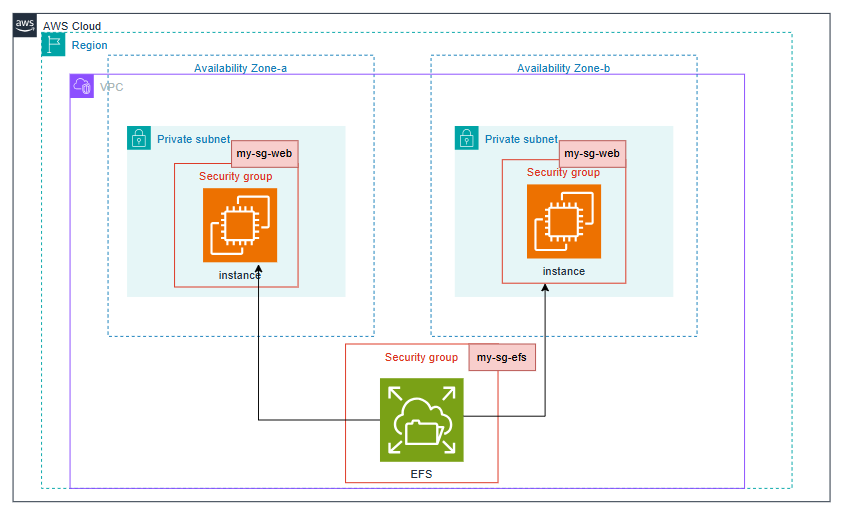

---
ℹ️ **Associate‑level extension** of the [Storage]() section from the [AWS Cloud Practitioner]() series. In this post, I expand on key EC2 concepts and introduce deeper topics relevant to the **Associate‑level understanding**.

| AWS Certifications Series  »               |                                                                       |
| --------------------------------------------------------------------- | --------------------------------------------------------------------- |
| [AWS Cloud Practitioner]() | [AWS Solution Architect]() |

ℹ️ There’s very little difference between the **Cloud Practitioner** and **Associate** content in the **Storage** domain, so I’m only covering the additional **Associate‑level** points here. 

For full foundational coverage, refer to the table below from the Cloud Practitioner section:

| Tag: [Storage]()                                                |                                                                                                                     |                                                                                                             |
| ----------------------------------------------------------------------------------------- | ------------------------------------------------------------------------------------------------------------------- | ----------------------------------------------------------------------------------------------------------- |
| [Storage]()                                                        | - [EBS]() - [EC2 Instance Store]() | - [EFS]() - [FSx]() |
| - [S3 - CLF-C02]() - [S3 - SAA-C03]()  |                                                                                                                     |                                                                                                             |
| AMI                                                                                       | - [AMI]()                                                                                        |                                                                                                             |
## EBS Volume Types

**EBS volumes come in six types:**

- **gp2 / gp3 (SSD)** - General‑purpose SSD volumes offering a balance of cost and performance for most workloads    
- **io1 / io2 Block Express (SSD)** - Highest‑performance SSD options for mission‑critical, low‑latency, or high‑throughput workloads    
- **st1 (HDD)** - Low‑cost, throughput‑optimised HDD volumes for frequently accessed, streaming‑style workloads    
- **sc1 (HDD)** - Lowest‑cost HDD option for infrequently accessed data

**Additional notes:**

- EBS volumes are defined by **size, throughput, and IOPS**    
- Only **gp2/gp3** and **io1/io2 Block Express** can be used as **boot volumes**
### General Purpose and IOPS

||[Amazon EBS General Purpose SSD volumes](https://docs.aws.amazon.com/ebs/latest/userguide/general-purpose.html)|   |[Amazon EBS Provisioned IOPS SSD volumes](https://docs.aws.amazon.com/ebs/latest/userguide/provisioned-iops.html)|   |
|---|:-:|:-:|:-:|:-:|
|**Volume type**|`gp3` 6|`gp2`|`io2` Block Express|`io1`|
|**Durability**|99.8% - 99.9% durability (0.1% - 0.2% annual failure rate)|   |99.999% durability (0.001% annual failure rate)|99.8% - 99.9% durability (0.1% - 0.2% annual failure rate)|
|**Use cases**|- Transactional workloads      - Virtual desktops      - Medium-sized, single-instance databases      - Low-latency interactive applications      - Boot volumes      - Development and test environments|   |**Workloads that require:**  - Consistent sub-millisecond latency with average latency under 500 microseconds      - Sustained IOPS performance      - More than 80,000 IOPS or 2,000 MiB/s of throughput|**Workloads that require:**  - sustained IOPS performance or more than 16,000 IOPS      - I/O-intensive database workloads|
|**Volume size**|1 GiB - 64 TiB|1 GiB - 16 TiB|4 GiB - 64 TiB|4 GiB - 16 TiB|
|**Max IOPS**|80,000 3 (25.6 KiB I/O 4)|16,000 (16 KiB I/O 4)|256,000 3 (16 KiB I/O 4)|64,000 (16 KiB I/O 4)|
|**Max throughput**|2,000 MiB/s|250 MiB/s 1|4,000 MiB/s|1,000 MiB/s 2|
|**Amazon EBS Multi-attach**|Not supported|   |Supported|   |
|**NVMe reservations**|Not supported|   |Supported|Not supported|
|**Boot volume**|Supported|   |   |   |

📡 <i>Source:</i> **Amazon EBS volume types:** [Solid state drive (SSD) volumes](https://docs.aws.amazon.com/ebs/latest/userguide/ebs-volume-types.html#vol-type-ssd)
### HDD

||[Throughput Optimized HDD volumes](https://docs.aws.amazon.com/ebs/latest/userguide/hdd-vols.html#EBSVolumeTypes_st1)|[Cold HDD volumes](https://docs.aws.amazon.com/ebs/latest/userguide/hdd-vols.html#EBSVolumeTypes_sc1)|
|---|---|---|
|**Volume type**|`st1`|`sc1`|
|**Durability**|99.8% - 99.9% durability (0.1% - 0.2% annual failure rate)|   |
|**Use cases**|- Big data      - Data warehouses      - Log processing|- Throughput-oriented storage for data that is infrequently accessed      - Scenarios where the lowest storage cost is important|
|**Volume size**|125 GiB - 16 TiB|   |
|**Max IOPS per volume** (1 MiB I/O)|500|250|
|**Max throughput per volume**|500 MiB/s|250 MiB/s|
|**Amazon EBS Multi-attach**|Not supported|   |
|**Boot volume**|Not supported|   |

📡 <i>Source:</i> [Hard disk drive (HDD) volumes](https://docs.aws.amazon.com/ebs/latest/userguide/ebs-volume-types.html#vol-type-hdd)

For more information about the Hard disk drives (HDD) volumes, see [Amazon EBS Throughput Optimized HDD and Cold HDD volumes](https://docs.aws.amazon.com/ebs/latest/userguide/hdd-vols.html).

📡 <i>Source:</i> **Amazon EBS volume types:** [Amazon EBS volume types](https://docs.aws.amazon.com/ebs/latest/userguide/ebs-volume-types.html)
## EBS Multi‑Attach (io1 / io2 family)

- Allows the **same EBS volume** to be attached to **multiple EC2 instances** within the **same Availability Zone**    
- Each attached instance gets **full read/write access** to the high‑performance volume    
- Supports up to **16 EC2 instances** at once    
- Designed for **clustered Linux applications** that require shared block‑level storage  
- Applications **must handle concurrent writes** safely - AWS does _not_ manage write coordination    
- Requires a **cluster‑aware file system** (standard single‑node file systems like XFS or EXT4 will corrupt data)
### Use cases

- Increasing availability for clustered workloads (e.g., **Teradata**, shared‑disk clustering, HA databases)    
- Scenarios where multiple nodes need simultaneous, low‑latency access to the same block device    
### Examples of cluster‑aware file systems

- **GFS2** (Red Hat Global File System 2)    
- **OCFS2** (Oracle Cluster File System 2)    
- **BeeGFS** (parallel cluster file system)    
- **Lustre** (high‑performance distributed file system)    

These file systems are designed to coordinate locks, manage concurrent writes, and prevent corruption - something traditional file systems cannot do.

📡 <i>Source:</i> [Attach an EBS volume to multiple EC2 instances using Multi-Attach](https://docs.aws.amazon.com/ebs/latest/userguide/ebs-volumes-multi.html)
## EBS Encryption

- Encrypting an EBS volume protects **data at rest**, **data in transit** between the instance and the volume, **all snapshots**, and **any volumes created from those snapshots**    
- Encryption and decryption are handled **transparently** by AWS    
- Performance impact is **minimal**    
- Uses **KMS-managed keys** (AES‑256)    
- Copying an **unencrypted snapshot** allows you to create an **encrypted** version    
- Snapshots taken from **encrypted volumes** remain encrypted automatically

📡 <i>Source:</i> [Amazon EBS encryption](https://docs.aws.amazon.com/ebs/latest/userguide/ebs-encryption.html)
## EFS

ℹ️ For more information about **Elastic File System**, refer to [EFS]() section from the [AWS Cloud Practitioner]() series.

---
## >> Sources <<

- [Amazon EBS volume types](https://docs.aws.amazon.com/ebs/latest/userguide/ebs-volume-types.html)
- [Attach an EBS volume to multiple EC2 instances using Multi-Attach](https://docs.aws.amazon.com/ebs/latest/userguide/ebs-volumes-multi.html)
- [Amazon EBS encryption](https://docs.aws.amazon.com/ebs/latest/userguide/ebs-encryption.html)
## >> References <<

- **Cloud Practitioner:** [Storage]()
	- **Cloud Practitioner:** [EBS]()
	- **Cloud Practitioner:** [EC2 Instance Store]()
	- **Cloud Practitioner:** [EFS]()
	- **Cloud Practitioner:** [FSx]()
- **Cloud Practitioner:** [AMI]()
- **EC2**
	- **Cloud Practitioner:** [EC2 (CLF-C02)]()
	- **Solutions Architect:** [EC2 (SAA-C03)]()
## >> Disclaimer <<

