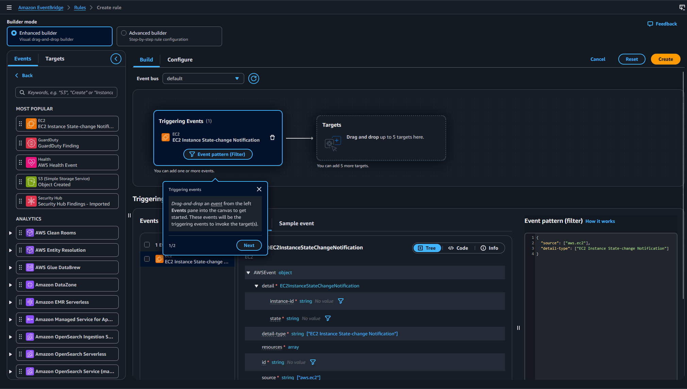

---
ℹ️ **Associate‑level extension** of the [Cloud Monitoring]() section from the [AWS Cloud Practitioner]() series.

| AWS Certifications Series  »               |                                                                       |
| --------------------------------------------------------------------- | --------------------------------------------------------------------- |
| [AWS Cloud Practitioner]() | [AWS Solution Architect]() |

## CloudWatch



Amazon **CloudWatch** is AWS’s **monitoring service** that **collects metrics**, **logs**, and **events** from your infrastructure and applications. It gives you **real‑time visibility** into **performance and operational health** so you can detect issues and automate responses.


### CloudWatch Metrics

- CloudWatch provides **metrics for all AWS services**    
- A metric is a monitored variable (e.g., **CPUUtilization**, **NetworkIn**)    
- Metrics live in **namespaces** and can include up to **30 dimensions** (e.g., instance ID, environment)    
- All metrics have timestamps    
- Supports **dashboards** for visualisation    
- You can publish **custom metrics** (e.g., RAM usage)
### CloudWatch Metric Streams

- Continuously streams CloudWatch metrics to your chosen destination with **low‑latency, near‑real‑time** delivery    
- Supports [Kinesis]() Data Firehose targets and third‑party tools like **Datadog, Dynatrace, New Relic, Splunk, Sumo Logic**    
- You can **filter** which metrics are streamed to control volume and cost

")
### CloudWatch Logs

- **Log groups** represent applications; **log streams** represent individual instances, files, or containers    
- Supports configurable **retention policies** (from 1 day to 10 years, or never expire)    
- Logs can be sent to:
	- [S3]()
	- [Kinesis]() Data Streams
	- [Kinesis]() Firehose
	- [Lambda]()
	- OpenSearch
- Logs are encrypted by default
- Can setup KMS-based encryption with your own keys



**CloudWatch Logs sources:**

- Logs can come from the SDK, CloudWatch Logs Agent, or the Unified Agent    
- Elastic Beanstalk collects app logs; ECS collects container logs    
- Lambda automatically sends function logs    
- VPC Flow Logs capture network traffic; API Gateway and CloudTrail can emit logs    
- Route 53 can log DNS queries


### CloudWatch Logs Insights

- Lets you **search and analyse** log data stored in CloudWatch Logs using a purpose‑built query language    
- Automatically extracts fields from AWS services and JSON logs    
- Supports filtering, field selection, aggregations, sorting, and limiting results    
- Queries can be saved and added to CloudWatch Dashboards
- Can query **multiple log groups across accounts**    
- It’s a **query engine**, not a real‑time streaming system

")
### CloudWatch Logs - S3 Export

- Log data can take up to 12 hours to become available for export CloudWatch Logs Amazon S3
- The API call is CreateExportTask
- Not near-real time or real-time… use Logs Subscriptions instead
### CloudWatch Logs Subscriptions

- Streams **real‑time log events** from CloudWatch Logs for processing and analysis    
- Can deliver logs to [Kinesis]() Data Streams, **Kinesis Firehose**, or **Lambda**    
- Uses **subscription filters** to control which log events are forwarded

")

**Cross-Account Subscription** - send log events to resources in a different AWS account (KDS, KDF).

")
### CloudWatch Logs for EC2

- EC2 instances don’t send logs to CloudWatch by default - you must install and configure the **CloudWatch agent**    
- The agent pushes selected log files and requires the correct **IAM permissions**    
- The same agent can also be used on **on‑premises** servers
### CloudWatch Logs Agent & Unified Agent

- For virtual servers (EC2 instances, on-premises servers…)
- **CloudWatch Logs Agent**
	- Old version of the agent
	- Can only send to CloudWatch Logs
- **CloudWatch Unified Agent**
	- Collect additional system-level metrics such as RAM, processes, etc…
	- Collect logs to send to CloudWatch Logs
	- Centralized configuration using SSM Parameter Store
#### CloudWatch Unified Agent - Metrics

- Collects detailed Linux/EC2 system metrics: 
	- CPU (user, system, idle, steal)
	- disk usage and I/O
	- RAM stats (free, inactive, used, total, cached)
	- network connections/traffic (number of TCP and UDP connections, net packets, bytes)
	- process counts
	- swap usage    
- Complements EC2’s built‑in high‑level metrics (CPU, disk, network) with deeper, host‑level visibility
### CloudWatch Alarms

- Alarms monitor metrics and trigger notifications based on thresholds (max, min, %, sampling, etc.)    
- Alarm states are **OK**, **INSUFFICIENT_DATA**, and **ALARM**    
- The **period** defines the evaluation window in seconds; high‑resolution custom metrics support **10s**, **30s**, or 60‑second multiples
#### CloudWatch Alarm Targets

- Stop, Terminate, Reboot, or Recover an EC2 Instance
- Trigger Auto Scaling Action
- Send notification to SNS (from which you can do pretty much anything)
### CloudWatch Alarms - Composite Alarms

- Standard CloudWatch alarms track a **single metric**, while composite alarms evaluate the **states of multiple alarms**    
- Support **AND/OR logic**, helping reduce noise by triggering only when complex conditions are met

")



**To test alarms and notifications, set the alarm state to Alarm using CLI:**

`aws cloudwatch set-alarm-state --alarm-name "myalarm" --state-value ALARM --state-reason "testing purposes"`


### CloudWatch Network Synthetic Monitor

- Monitors connectivity between your AWS‑hosted applications and on‑premises environments, detecting issues like **latency, jitter, and packet loss**    
- Requires no agents and tests **ICMP or TCP** traffic to on‑prem destinations over Direct Connect or Site‑to‑Site VPN    
- Publishes all results as **CloudWatch metrics**
### Amazon EventBridge

<i>More info:</i> [Amazon EventBridge](https://docs.aws.amazon.com/eventbridge/latest/userguide/eb-what-is.html)

- **Schedule:** Cron jobs + Event Bus 
- **Event Pattern:** Event rules to react to a service doing something
- Trigger Lambda functions, send SQS/SNS messages

")


🙋🏻 _Question:_ Give me some example AWS EventBridge Sources. It is said that EventBridge is equivalent to the Cron Jobs but I understand it can also be triggered by an event. Can you clarify?

EventBridge has **two completely different triggering models**:

**1. Scheduled rules (cron/ rate)**

This is the part people compare to cron jobs.

Examples:
- Run a Lambda every hour    
- Trigger a workflow every day at 02:00    
- Clean up old data every 15 minutes    
- Rotate a job weekly    

This is the **cron‑like** functionality.

**2. Event‑driven rules (the real power)**

EventBridge can listen to **events emitted by AWS services, SaaS providers, or your own apps**, and trigger targets when something happens.

This is the **event bus** functionality - far more powerful than cron.

**Examples of AWS EventBridge event sources**

- **Compute** - Lambda function invocations failure, EC2 instance state changes (start, stop, terminate), ECS task state changes, EKS cluster events
- **Storage** - S3 object-level events
- **Networking** - VPC flow log delivery failures, API Gateway request events
- **Security** - IAM access key lifecycle events, GuardDuty findings, Security Hub findings, AWS Config compliance changes, CloudTrail events (via EventBridge)
- **Database** - DynamoDB table state changes, RDS instance failover events, Aurora cluster events
- **Messaging** - SNS topic events, SQS queue events, Step Functions execution status changes
- **Management & Monitoring** - CloudWatch Alarms, Auto Scaling lifecycle events, AWS Backup job events, AWS Health Dashboard events
- **SaaS integrations** - Auth0, Zendesk, Shopify, Datadog, Stripe, Many others...


#### EventBridge Create rule



 EventBridge’s visual builder lets you design event‑driven workflows through a drag‑and‑drop interface, so you can connect services and define routing rules without writing code.



### CloudWatch Insights

- **CloudWatch Container Insights**
	- ECS, EKS, Kubernetes on EC2, Fargate, needs agent for Kubernetes
	- Metrics and logs
- **CloudWatch Lambda Insights**
	- Detailed metrics to troubleshoot serverless applications
- **CloudWatch Contributors Insights**
	- Find “Top-N” Contributors through CloudWatch Logs
- **CloudWatch Application Insights**
	- Automatic dashboard to troubleshoot your application and related AWS services
#### CloudWatch Container Insights

- Collects, aggregates, and summarises **container metrics and logs**    
- Supports ECS, EKS, Kubernetes on EC2, and **Fargate** for both ECS and EKS    



In **Amazon EKS** and **Kubernetes**, CloudWatch Insights is using a containerized version of the CloudWatch Agent to discover containers.


#### CloudWatch Lambda Insights

- Provides monitoring and troubleshooting for Lambda‑based serverless applications    
- Captures system‑level metrics (CPU time, memory, disk, network) and diagnostic data like cold starts and worker shutdowns    
- Delivered as a **Lambda Layer**
#### CloudWatch Contributor Insights

- Analyses log data to produce time‑series showing **top‑N contributors** and total unique contributors    
- Helps identify “top talkers” and pinpoint hosts, users, or URLs impacting performance    
- Works with AWS‑generated logs like **VPC Flow Logs** and **DNS logs**    
- You can build custom rules or use AWS‑provided sample and built‑in rules to analyse CloudWatch Logs and other AWS service metrics
#### CloudWatch Application Insights

- Provides automated dashboards that show potential problems with monitored applications, to help isolate ongoing issues
- Your applications run on Amazon EC2 Instances with select technologies only (Java, .NET, Microsoft IIS Web Server, databases…)
## AWS CloudTrail

- Provides **governance, compliance, and audit visibility** for your AWS account, and is **enabled by default**    
- Records all API activity from the console, SDKs, CLI, and AWS services    
- Logs can be sent to **CloudWatch Logs** or **S3**, and trails can cover **all regions** or a single region   
- When something is deleted or changed, **CloudTrail is the first place to investigate**
### CloudTrail Events

- **Management events** capture operations performed on AWS resources, such as security changes, network configuration, or creating trails. Trails log these by default, and you can separate **Read** (non‑mutating) from **Write** (resource‑changing) actions.

- **Data events** record high‑volume, resource‑level activity and are **disabled by default**. They include S3 object‑level actions (GetObject, PutObject, DeleteObject) and Lambda **Invoke** operations, with optional separation of Read and Write events.
#### CloudTrail Insights

- Detects unusual account activity such as misconfigured provisioning, service‑limit spikes, bursts of IAM actions, or gaps in routine operations    
- Builds a baseline from normal **management events**, then analyses **write events** to spot anomalies    
- Anomalies appear in the CloudTrail console, are delivered to **S3**, and also generate **EventBridge events** for automation
### CloudTrail Events Retention

- Events are stored for 90 days in CloudTrail
- To keep events beyond this period, log them to S3 and use Athena
## AWS Config

**AWS Config** is a service that continuously tracks and records the configuration of your AWS resources, then evaluates those configurations against rules you define. 

It gives you a clear history of how resources have changed over time, helps you detect drift, and supports compliance by showing whether resources meet required policies. 

You can use AWS‑managed rules or create custom ones, and every evaluation result is visible through dashboards, timelines, and detailed compliance reports. AWS Config Rules does not prevent actions from happening (no deny).

**Use EventBridge to trigger notifications when AWS resources are non compliant:**

")
## CloudWatch vs CloudTrail vs Config

| CloudWatch                                                        | CloudTrail                                            | Config                                      |
| ----------------------------------------------------------------- | ----------------------------------------------------- | ------------------------------------------- |
| Performance monitoring (metrics, CPU, network, etc…) & dashboards | Record API calls made within your Account by everyone | Record configuration changes                |
| Events & Alerting                                                 | Can define trails for specific resources              | Evaluate resources against compliance rules |
| Log Aggregation & Analysis                                        | Global Service                                        | Get timeline of changes and compliance      |
### ELB Example

| CloudWatch                                                        | CloudTrail                                                     | Config                                                                         |
| ----------------------------------------------------------------- | -------------------------------------------------------------- | ------------------------------------------------------------------------------ |
| Monitoring Incoming connections metric                            | Track who made any changes to the Load Balancer with API calls | Track security group rules for the Load Balancer                               |
| Visualize error codes as % over time                              |                                                                | Track configuration changes for the Load Balancer                              |
| Make a dashboard to get an idea of your load balancer performance |                                                                | Ensure an SSL certificate is always assigned to the Load Balancer (compliance) |

---
## >> Sources <<

CloudWatch / CloudWatch Logs / CloudWatch Events (EventBridge): 
- https://docs.aws.amazon.com/cloudwatch/
- https://console.aws.amazon.com/cloudwatch
- [Amazon EventBridge](https://docs.aws.amazon.com/eventbridge/latest/userguide/eb-what-is.html)
## >> References <<

**Cloud Practitioner:** [Cloud Monitoring]()
## >> Disclaimer <<

