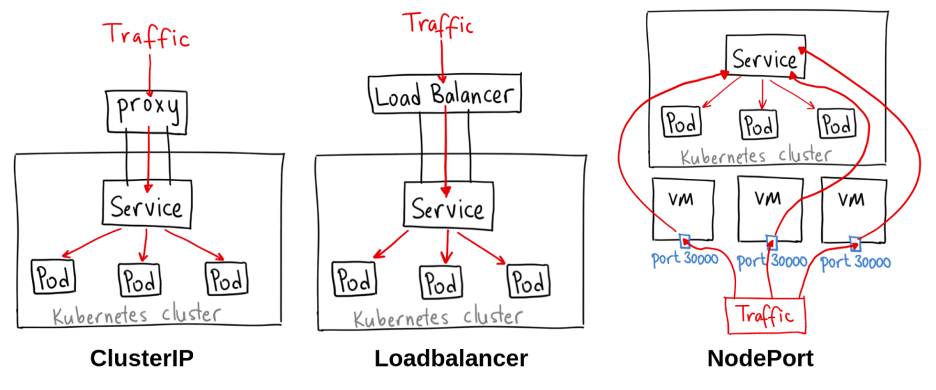

| External Resources »                                                                                              |                                                                                            |                                                                                  |
| -------------------------------------------------------------------------------------------------------------------------------------------- | ------------------------------------------------------------------------------------------ | -------------------------------------------------------------------------------- |
| [Kubernetes Official Documentation](https://kubernetes.io/docs/home/)                                                                        | [`kubectl` quick reference](https://kubernetes.io/docs/reference/kubectl/quick-reference/) | [`kubectl` cheatsheet](https://kubernetes.io/docs/reference/kubectl/cheatsheet/) |
| [Kubernetes Fundamentals](https://github.com/stacksimplify/kubernetes-fundamentals) (Practice Kubernetes commands with _Kalyan Reddy Daida_) | [Nigel Poulton Blog](https://www.nigelpoulton.com/blog/categories/kubernetes)              |                                                                                  |
| [K8s YAML Specification](https://dev.to/harshm03/comprehensive-guide-to-k8s-yaml-4c3c)                                                       | API reference: https://kubernetes.io/docs/reference/                                       |                                                                                  |


**Kubernetes** is a portable, extensible, open-source platform for managing containerized workflows.

- Service discovery and Load Balancing
- Storage Orchestration
- Automated rollouts and rollbacks
- Automatic bin packing
- Self-healing
- Secret and configuration  management


## Kubernetes Architecture

")
## Kubernetes components



An overview of the **key components** that make up a Kubernetes cluster (official documentation):

- https://kubernetes.io/docs/concepts/overview/components/



### kube-apiserver

- It is acting as a front-end for the Kubernetes Control Plane. It exposes the Kubernetes API.
- Command line tools (like `kubectl`), Users as well as Master components (scheduler, controller manager, etcd) and Worker node components (`kubelet`) talk to API server.
### etcd

- Consistent and highly-available key value store used as Kubernetes backing store for all cluster data.
- It stores all the masters and worker node information.
### kube-scheduler

- **Scheduler** is responsible for distributing containers across multiple nodes.
- It watches for newly created Pods with no assigned node and selects the node to run it on.
### Controllers



flowchart TD
    User["User applies YAML (kubectl apply)"]

    subgraph API_Server["API Server"]
        Desired["Desired State (spec)"]
        Actual["Actual State (status)"]
    end

    subgraph Controller_Manager["Controller Manager"]
        Controller["Controller (e.g., Deployment Controller)"]
        Loop["Reconciliation Loop: Observe → Compare → Act"]
    end

    subgraph Cluster["Cluster Resources"]
        Pods["Pods / ReplicaSets / Nodes"]
    end

    User --> Desired
    Pods --> Actual

    Controller --> Desired
    Controller --> Actual

    Controller --> Loop
    Loop --> Pods





**Controllers** are responsible for noticing and responding when nodes, containers or endpoints go down. They make decisions to bring up new containers.



- kube-controller-manager
	- Node Controller - noticing and responding when nodes go down.
	- Replication Controller - maintaining the right number of PODs.
	- Endpoints Controller - populating the Endpoints object (joins Services & PODs).
	- Service Account & Token Controller - creating default accounts and API Access for new namespaces.

- cloud-controller-manager
	- Runs controllers specific to the cloud provider.
	- Node Controller - checking the cloud provider to determine if node has been deleted.
	- Route Controller - setting up routes in the underlying cloud infrastructure.
	- Service Controller - creating, updating, deleting cloud provider Load Balancer.
### Container Runtime

Container Runtime is the underlying software where we run all those Kubernetes components.

Example Container Runtimes:

- [Docker Engine](https://kubernetes.io/docs/setup/production-environment/container-runtimes/#docker)
- [containerd](https://kubernetes.io/docs/setup/production-environment/container-runtimes/#containerd)
- [CRI-O](https://kubernetes.io/docs/setup/production-environment/container-runtimes/#cri-o)
- [Mirantis Container Runtime](https://kubernetes.io/docs/setup/production-environment/container-runtimes/#mcr)

<i>More info:</i> https://kubernetes.io/docs/setup/production-environment/container-runtimes/
### Kubelet

- Agent that runs on every node in the cluster.
- Responsible for making sure that containers are running in a POD on a node.
### Kube-Proxy

- It is a network proxy that runs on each node in the cluster.
- It maintains network rules on nodes.
	- Those network rules allow network communication to your PODs from network sessions inside or outside the cluster.
## EKS Cluster Architecture

")

ℹ️ _Note:_ EKS lets us focus only on Application Workloads. We don't need to worry about any of those components as those are being managed by AWS EKS.
## Kubernetes Fundamentals

### POD

- A **POD** is a single instance of an Application.
- A **POD** is the smallest object that you can create in Kubernetes.
### ReplicaSet

A **ReplicaSet** is responsible for maintaining a stable set of replica PODs running at any given time. 

It is used to guarantee availability of a specified number of identical PODs.



flowchart TD

    A[Replica Sets] -->B[High Availability or Reliability]

    A -->C[Scaling]

    A -->D[Load Balancing]

    A -->E[Labels & Selectors]



If an application crashes (any pod dies), **ReplicaSet** will recreate the pod immediately to ensure the configured number of PODs is running at any time.
### Deployment

A **Deployment** runs multiple replicas of your application and automatically replaces any instances that fail or become unresponsive.

Rollout & Rollback changes to applications. Deployments are well-suited for stateless applications.
### Service ✨

A **service** is an abstraction for **POD**s, allocating and providing **VIP** (Virtual IP) addresses.

In simple terms - service sits in front of a POD and acts as a Load Balancer.



We can expose an application running a set of PODs using different types of [services](https://kubernetes.io/docs/concepts/services-networking/service/##publishing-services-service-types) available in K8s.

- **ClusterIP** - default Service type and exposes the Service within the cluster ONLY. Used for **communication between applications inside K8s cluster** (Example: Frontend application accessing backend application).
- [NodePort](https://kubernetes.io/docs/concepts/services-networking/service/##publishing-services-service-types) - exposes the Service externally on each Node’s IP at a static port so that the Service is accessible via each Node’s IP and `nodePort` outside of the Kubernete cluster. Kubernetes control plane allocates a port from a range specified by `--service-node-port-range`.
- [LoadBalancer](https://kubernetes.io/docs/concepts/services-networking/service/##loadbalancer) - exposes the Service externally using a load blancer, which directs traffic from a `loadBalancerIP` to `clusterIP`.
- [Ingress](https://kubernetes.io/docs/concepts/services-networking/ingress/) - advanced Load Balancer which provides **context path based routing**, **SSL**, **SSL Redirect** and many more (i.e. AWS ALB)
- [ExternalName](https://kubernetes.io/docs/concepts/services-networking/service/##externalname) - maps the Service to the DNS name specified by `externalName` field.



<i>More info:</i>

- https://bsdnet.github.io/posts/kubernetes-service-illustrated/
- https://www.nigelpoulton.com/post/explained-kubernetes-service-ports

---


Kubernetes Networking Explained - _Mischa van den Burg_, [Kubecraft](https://www.skool.com/kubecraft)

---
## Kubernetes API Reference ✨

The Kubernetes API Reference provides detailed information about the various API objects, their operations, and how to interact with them. It includes specifications for resources like Pods, Services, and Deployments, as well as guidelines for using the API effectively.

- Reference: https://kubernetes.io/docs/reference/
- v1.24 Reference: https://kubernetes.io/docs/reference/generated/kubernetes-api/v1.24/
- [K8s YAML Specification](https://dev.to/harshm03/comprehensive-guide-to-k8s-yaml-4c3c)
## >> Sources <<

Kubernetes components: https://kubernetes.io/docs/concepts/overview/components/

Kubernetes Service types: https://kubernetes.io/docs/concepts/services-networking/service/##publishing-services-service-types

Kubernetes Service Ports (Nigel Poulton): https://www.nigelpoulton.com/post/explained-kubernetes-service-ports

Kubernetes Services Illustrated (The Infra Guy): https://bsdnet.github.io/posts/kubernetes-service-illustrated/

Container Runtimes: https://kubernetes.io/docs/setup/production-environment/container-runtimes/

**Kubernetes API Reference:**

- Reference: https://kubernetes.io/docs/reference/
- v1.24 Reference: https://kubernetes.io/docs/reference/generated/kubernetes-api/v1.24/
## >> Disclaimer <<

