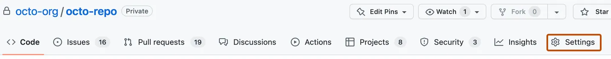
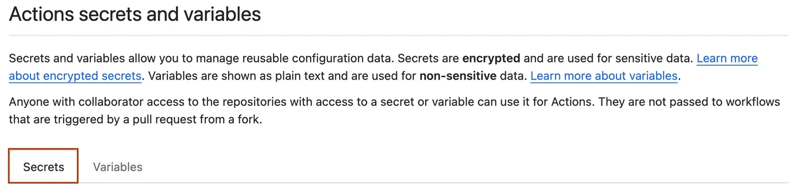


**GitHub Actions** <font color=#C7EB25>environment variables</font> are <font color=#EBAC25>user-defined values that can influence the behaviour of workflows, allowing for customization based on different contexts</font>. 


| <font color=#EB4925>External Resources</font> »                             |                                                                           |                                  |
| --------------------------------------------------------------------------- | ------------------------------------------------------------------------- | -------------------------------- |
| [GitHub Actions official Documentation](https://docs.github.com/en/actions) | [GitHub Actions Marketplace](https://github.com/marketplace?type=actions) | [GitHub.com](https://github.com) |
## Environment Variables

### Declaring a variable


In **GitHub Actions**, <font color=#EB4925>you can declare variables at three levels</font>: 
- workflow
- job
- step
 
**Workflow-level** variables apply to the entire workflow, **job-level** variables are specific to a job, and **step-level** variables are only available within a specific step.


#### 1. At Workflow level

```YAML
env:
  GLOBAL_VAR: 'Global Value'
```

Variable is always the same across all jobs and environments in this Workflow.
#### 2. At a Job level

```YAML
jobs:
  build:
    runs-on: ubuntu-latest
    env:
      JOB_VAR: 'Job-specific Value'
```

Variable is different for each environment.
#### 3. At a Step level

```YAML
steps:
  - name: Set Step Variable
    run: echo "STEP_VAR=Step Value" >> $GITHUB_ENV
```
### Accessing a variable

To access these variables in your scripts, use the following syntax:

- For shell commands: `$VARIABLE_NAME`
- In YAML expressions: `${{ env.VARIABLE_NAME }}`

This structure allows you to adapt your workflows based on the context of the run, making your CI/CD processes more flexible and efficient.


flowchart TB

classDef redclass fill:#EB4925
classDef redclasss stroke:#EB4925
classDef yellowclass stroke:#EBAC25
classDef greenclass stroke:#C7EB25

    A[Environment 1 <br>'Testing']:::greenclass --> subB
    D[Environment 2 <br>'Production']:::redclasss --> subB

    subgraph DB_password
        direction TB
        subB[const password = <i>process.env.DB_PASSWORD</i>]:::redclass        
    end

    subB --> C[const password = 'abc']:::greenclass
    subB --> F[const password = '123']:::redclasss



To access environment variables in a Windows runner, use the syntax `$env:VARIABLE_NAME` in `PowerShell`. This allows you to retrieve the value of the specified environment variable during your script execution.

<font color=#EBAC25><i>More info:</i></font> 
- https://docs.github.com/en/actions/how-tos/write-workflows/choose-where-workflows-run/choose-the-runner-for-a-job - GitHub Action Runners
- https://docs.github.com/en/actions/reference/workflows-and-actions/variables - Variable references

<br/>

<b><font color=#EB4925>IMPORTANT</font></b>: 
When calling variables, ensure you respect the levels where the variable was declared (i.e. you can only call a workflow-level variable in all steps but you can't call variables defined at a step-level in another step).

## Default Environment Variables

GitHub Actions also provides a couple of default environment variables that are set automatically: [https://docs.github.com/en/actions/learn-github-actions/environment-variables#default-environment-variables](https://docs.github.com/en/actions/learn-github-actions/environment-variables#default-environment-variables)

These environment variable can, for example, give you quick access to the repository to which the workflow belongs, the name of the event that triggered the workflow and many other things.
## Environment Variables vs Secrets



In **GitHub Actions**, <font color=#C7EB25>variables are used to store non-sensitive information</font> that can be displayed and edited, while <font color=#EB4925>secrets are specifically designed to securely store sensitive data</font>, such as **API keys**, and <font color=#EB4925>are encrypted to prevent exposure in logs</font>. 





<font color=#EB4925>Secrets</font> should be used for any **sensitive information**, whereas <font color=#C7EB25>variables</font> can be used for **general configuration data**.


<br/>


flowchart TD

classDef redclass fill:#EB4925
classDef yellowclass stroke:#EBAC25
classDef greenclass stroke:#C7EB25

    C@{ shape: braces, label: "Together with 
environment variables
" }

    A[Some environment variable values 
should never be exposed]:::greenclass -->|<i>Example</i>: Database access password| B[Use Secrets]:::redclass

 B -.- C 
 
 
### [Creating secrets for a repository](https://docs.github.com/en/actions/how-tos/write-workflows/choose-what-workflows-do/use-secrets#creating-secrets-for-a-repository)

To create secrets or variables on GitHub for an organization repository, you must have `write` access. For a personal account repository, you must be the repository owner to create secrets or variable in the web UI or a repository collaborator to create secrets or variables through the REST API.

1. On GitHub, navigate to the main page of the repository.    
2. Under your repository name, click **Settings**. If you cannot see the "Settings" tab, select the- dropdown menu, then click **Settings**.


    
3. In the "Security" section of the sidebar, select    

4. **Secrets and variables**, then click **Actions**.    
5. Click the **Secrets** tab.    


    
6. Click **New repository secret**.    
7. In the **Name** field, type a name for your secret.    
8. In the **Secret** field, enter the value for your secret.    
9. Click **Add secret**.  

If your repository has environment secrets or can access secrets from the parent organization, then those secrets are also listed on this page.



Secrets can be stored for a specific repository or for an environment.<br/> They can be stored at a repository-level or at an organization-level.

<font color=#EBAC25><i>More info:</i></font> 
- https://docs.github.com/en/actions/how-tos/write-workflows/choose-what-workflows-do/use-secrets


#### Accessing secrets

`Secrets` context object is being used to access / reference secrets stored in GitHub Actions repository / organization.



    env:
      MONGODB_CLUSTER_ADDRESS: cluster0.15pwqcc.mongodb.net
      MONGODB_USERNAME: ${{ secrets.MONGODB_USERNAME }}
      MONGODB_PASSWORD: ${{ secrets.MONGODB_PASSWORD }}
      PORT: 8080





It is worth noting that once secrets are saved in GitHub, they <font color=#EB4925>
can no longer be exposed</font>.


## GitHub Deployment Environments



<font color=#EBAC25>You can create and deploy to different environments</font>.



**Environments** are used to describe a general deployment target like `production`, `staging`, or `development`. 

When a GitHub Actions workflow deploys to an environment, the environment is displayed on the main page of the repository. 



You can **use environments** to <font color=#C7EB25>require approval</font> for a job to proceed, <font color=#C7EB25>restrict</font> which branches can trigger a workflow, gate deployments with <font color=#C7EB25>custom deployment protection rules</font>, or <font color=#EB4925>limit access to secrets</font>. 


#### Referencing environments



jobs:
  test:
    environment: testing
    env:
      MONGODB_CLUSTER_ADDRESS: cluster0.15pwqcc.mongodb.net
      MONGODB_USERNAME: ${{ secrets.MONGODB_USERNAME }}
      MONGODB_PASSWORD: ${{ secrets.MONGODB_PASSWORD }}
      PORT: 8080



<font color=#EBAC25><i>More info:</i></font> 

- Deployment Environments: https://docs.github.com/en/actions/concepts/workflows-and-actions/deployment-environments
- Creating environments: [Managing environments for deployment](https://docs.github.com/en/actions/deployment/targeting-different-environments/managing-environments-for-deployment)

---
## >> Sources <<

- GitHub Actions Variables: https://docs.github.com/en/actions/concepts/workflows-and-actions/variables
- Variable References: https://docs.github.com/en/actions/reference/workflows-and-actions/variables
- Using Secrets in GitHub Actions: https://docs.github.com/en/actions/how-tos/write-workflows/choose-what-workflows-do/use-secrets
- Deployment Environments: https://docs.github.com/en/actions/concepts/workflows-and-actions/deployment-environments
- Creating environments: [Managing environments for deployment](https://docs.github.com/en/actions/deployment/targeting-different-environments/managing-environments-for-deployment)
## >> Disclaimer <<

