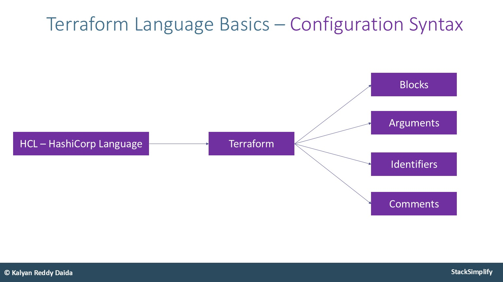
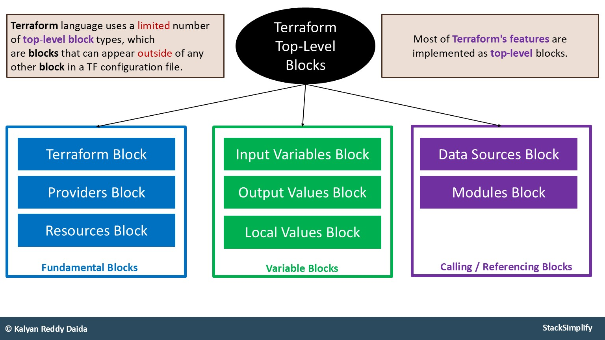

## Prerequisite

- Install Terraform CLI
- Install AWS CLI
- Install VS Code Editor
- Install HashiCorp Terraform plugin for VS Code
## Terraform basic commands

- `terraform init` 
	- used to initialize a working directory that contains terraform config files
	- this is the first command that should be run after writing new terraform configuration
	- it will <font color=#EBAC25>download the provider plugins</font>
	- `.terraform.lock.hcl` file is created to record the provider selections. Include this file in your version control repository so that Terraform can guarantee to make the same selections by default when you run `terraform init` in the future.
- `terraform validate`
	- <font color=#EBAC25>validates syntax and consistency</font> of the terraform files
- `terraform plan`
	- creates an execution plan
	- terraform performs a refresh and determines what actions are necessary to achieve the <font color=#EBAC25>desired state</font> specified in the configuration files
- `terraform apply`
	- will apply the changes required to be in line with the <font color=#EBAC25>desired state</font> 
	- by default, apply will scan the current directory and apply it's configuration (provision the infrastructure)
- `terraform destroy`
	- will destroy the terraform-managed infrastructure
### Other useful commands

- `terraform fmt` - HashiCorp recommends using consistent formatting in all config files by using the `terraform fmt` command. Optional command, <font color=#C7EB25>helps with formatting</font>
- `terraform state` command can be used to check what resources have been deployed against the **terraform state file**
	- `list`
	- `show`
- `terraform workspace`
	- `delete` - Delete a workspace
	- `list` - List Workspaces
	- `new` - Create a new workspace
	- `select` - Select a workspace
	- `show` - Show the name of the current workspace


**Terraform workspaces** are a feature that allow you to manage multiple instances of your infrastructure using the same configuration files, each with its own isolated state file. <font color=#EBAC25>This helps in organizing different environments</font>, such as <font color=#C7EB25>development</font> and <font color=#EB4925>production</font>, without interfering with each other.


- `terraform show` - Reads and outputs a Terraform state or plan file in a human-readable
  form
- `terraform output` - Reads an output variable from a Terraform state file and prints
  the value.
- `terraform refresh` - Update the state file of your infrastructure with metadata that matches
  the physical resources they are tracking
- `terraform providers`- Prints out a tree of modules in the referenced configuration annotated with their provider requirements  

It is said that **best terraform practice** is to output the `terraform plan` to a file and then run `terraform apply` with the file input.

```shell
terraform plan -out tf.plan

terraform apply tf.plan
```

\*_terraform will not ask for confirmation (just like using it with the `-auto-approve` option) when executing the plan from the file._

The **terraform state file** is the only way Terraform can track which resources it is managing. <font color=#EB4925><b>It often contains sensitive information</b></font> so must be stored securely and access must be restricted.
## Terraform Configuration Syntax

_Source:_ [Terraform Language Syntax](https://github.com/stacksimplify/hashicorp-certified-terraform-associate/tree/main/02-Terraform-Basics/02-03-Terraform-Language-Syntax)


### Terraform Blocks


Code in **Terraform** language is stored in plain text files ended with the <i>.tf</i> extension. Those are called <font color=#EBAC25>Terraform Configuration Files</font> or <font color=#EBAC25>Terraform Manifests</font>.


**2 types of blocks:**

- Top Level
	- resource
	- provider
- Block inside Block
	- provisioners
	- resource-specific block tags


### Terraform Arguments, Attributes and Meta-Arguments


- Terraform **Arguments** are the <font color=#EBAC25>Input Values</font>.
- Terraform **Attributes** are the <font color=#EBAC25>Output Values</font>.


- `Arguments` can be <font color=#EB4925>required</font> or <font color=#C7EB25>optional</font>. 

```shell
resource "aws_instance" "ec2" {
  ami           = "ami-08f714c552929eda9"
  instance_type = "t2.nano"  
}
```

- `Attributes` are values exposed by a particular resource. It's format looks like:<br> `resource_type.resource_name.attribute_name`

- `Meta-Arguments` change a resource type's behavior 
	- `count`
	- `depends_on`
	- `for_each`
	- `lifecycle`
	- `provider`


_aws_instance_ resource documentation: https://registry.terraform.io/providers/-/aws/latest/docs/resources/instance contains references to all `Arguments` and `Attributes`.


_More:_
- [Additional Reference](https://learn.hashicorp.com/tutorials/terraform/resource?in=terraform/configuration-language)
- [Resource: AWS Instance](https://registry.terraform.io/providers/hashicorp/aws/latest/docs/resources/instance)
- [Resource: AWS Instance Argument Reference](https://registry.terraform.io/providers/hashicorp/aws/latest/docs/resources/instance#argument-reference)
- [Resource: AWS Instance Attribute Reference](https://registry.terraform.io/providers/hashicorp/aws/latest/docs/resources/instance#attributes-reference)
- [Resource: Meta-Arguments](https://www.terraform.io/docs/language/meta-arguments/depends_on.html)
### Top-Level Blocks

- Terraform Settings Block
- Provider Block
- Resource Block
- Input Variables Block
- Output Values Block
- Local Values Block
- Data Sources Block
- Modules Block



_Terraform Blocks:_ https://github.com/stacksimplify/hashicorp-certified-terraform-associate/tree/main/03-Terraform-Fundamental-Blocks

_Terraform Resources:_ https://github.com/stacksimplify/hashicorp-certified-terraform-associate/tree/main/04-Terraform-Resources
### Terraform Comments

3 ways to make comments in Terraform:

- Single-line:
	- `#`
	- `//`
- Multi-line:

```terraform
/*
Multi-line comments
Line 1
Line 2
*/
```
## Terraform Modules


**Terraform Modules** are containers for multiple resources that are used together. A module consists of a collection of _.tf_ files kept together in a directory.


- Modules are the main way of <font color=#EBAC25>packaging and reusing</font> resource configurations in Terraform
- Every Terraform configuration has at least one module, known as it's <font color=#EBAC25>root module</font>, which consists of the resources defined in the _.tf_ files **placed in the main working directory**
- A <font color=#EBAC25>Terraform module</font> (usually the root module of a configuration) <font color=#EBAC25>can call other modules</font> to include their resources into the configuration
- A module that has been called by another module is often referred to as a <font color=#EBAC25>child module</font>
	- Child modules **can be called multiple times** within the same configuration and **multiple configurations can use the same child module**
- In addition to modules from the local system, Terraform can load modules from a <font color=#EBAC25>public or private registry</font>
	- It is therefore possible to publish modules for others to use and to use modules published by others
---
## >> Sources <<

Kalyan's GitHub Repositories:

- https://github.com/stacksimplify/hashicorp-certified-terraform-associate/tree/main/02-Terraform-Basics
- https://github.com/stacksimplify/terraform-on-aws-ec2/tree/main/02-Terraform-Basics

Additional resources:

- [Additional Reference](https://learn.hashicorp.com/tutorials/terraform/resource?in=terraform/configuration-language)
- [Resource: AWS Instance](https://registry.terraform.io/providers/hashicorp/aws/latest/docs/resources/instance)
- [Resource: AWS Instance Argument Reference](https://registry.terraform.io/providers/hashicorp/aws/latest/docs/resources/instance#argument-reference)
- [Resource: AWS Instance Attribute Reference](https://registry.terraform.io/providers/hashicorp/aws/latest/docs/resources/instance#attributes-reference)
- [Resource: Meta-Arguments](https://www.terraform.io/docs/language/meta-arguments/depends_on.html)
- _aws_instance_ resource documentation: https://registry.terraform.io/providers/-/aws/latest/docs/resources/instance
## >> Disclaimer <<

