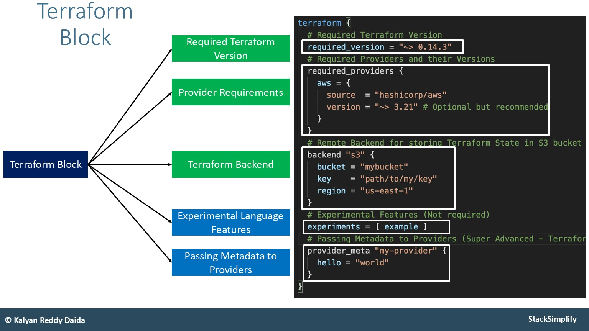
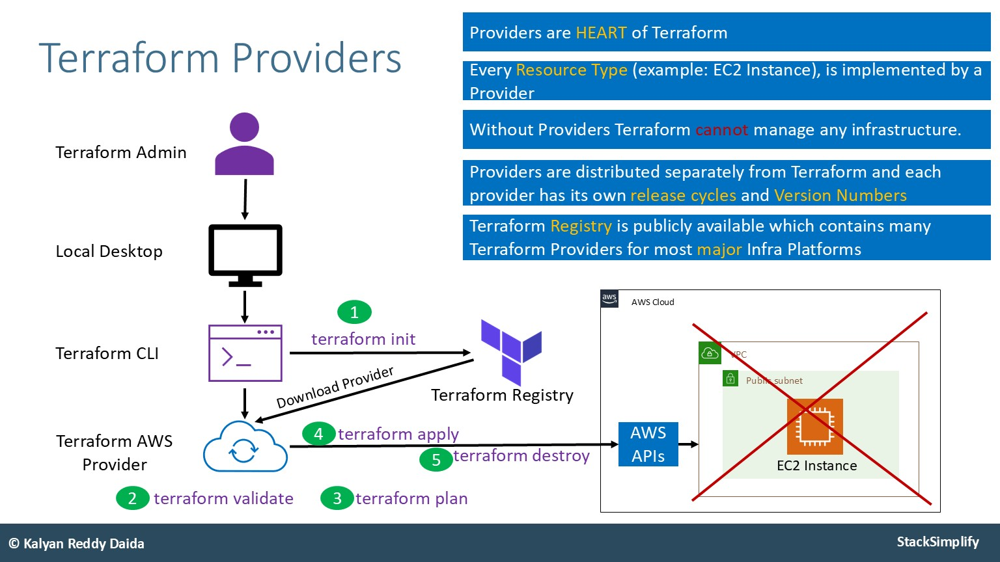
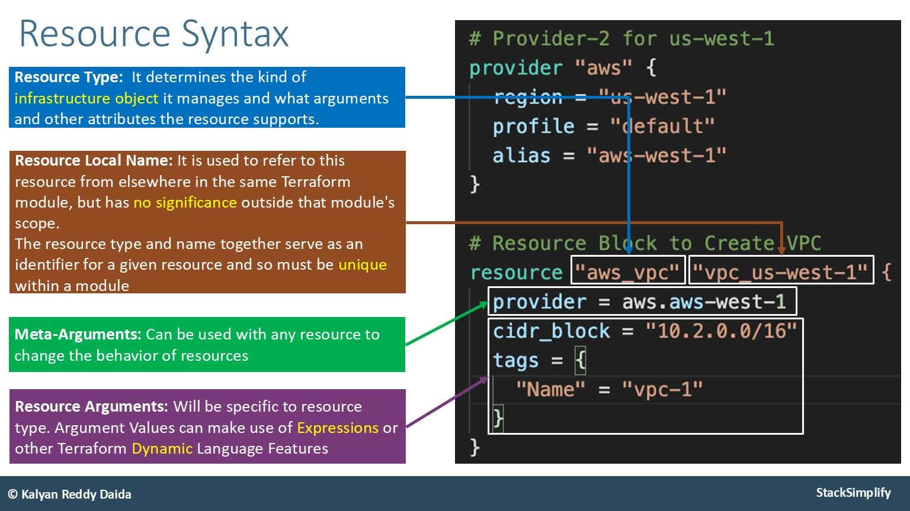

## Terraform Blocks

### Terraform Block

- Special block used to configure some behaviors
	- Required Terraform Version
	- List Required Providers
	- Terraform Backend


Within a Terraform Block <font color=#C7EB25>only constant values can be used</font>. Arguments <font color=#EB4925>may not refer</font> to named objects such as resources, input variables, etc, and <font color=#EB4925>may not use</font> any of the Terraform language built-in functions.



### Provider Block

- <font color=#EB4925>Heart of the Terraform</font>
- Terraform is relying on providers to <font color=#EBAC25>interact with remote systems</font>
- Declare providers for Terraform to install and use them
- <font color=#EBAC25>Provider configurations belong to Root Module</font>

📄_File:_ c1-versions.tf

```shell
# INFO: Terraform Block
terraform {
    required_version = "~> 1.13.0" # NOTE: Greater than 1.13.2. Only the most upright version number (.0) can change.
    required_providers {
      aws = {
        source = "hashicorp/aws"
        version = "~> 6.0" # NOTE: Greater than 6.0. Only the most upright version number (.0) can change.
      }
    }
}
# INFO: Provider Block
provider "aws" {
  region = "eu-west-2"
}
```



`required_version = "~> 1.13.2"` means that valid versions will be: `1.13.2-9`<br><br>
`required_version = "~> 1.13"` means that valid versions will be: `1.13-99`





```shell
# INFO: Provider Block
provider "aws" {
  region = "eu-west-2"
#  profile = "dev-account"
  profile = "terraform-user"
}
```



It is possible to create multiple profiles in the `~/.aws/credentials` settings. Those profiles can then be referenced in the Provider block and used to connect to your Provider.


### Resource Block

- Each Resource Block describes one or more Infrastructure Objects
	- <font color=#EBAC25>Resource Syntax:</font> How to declare Resources?
	- <font color=#EBAC25>Resource Behavior:</font> How Terraform handles resource declarations?
	- <font color=#EBAC25>Provisioners:</font> We can configure Resource post-creation actions

📄_File:_ c2-ec2instance.tf

```shell
# Resource: EC2 Instance
resource "aws_instance" "myec2vm" {
  ami = "ami-0742b4e673072066f"
  instance_type = "t3.micro"
  user_data = file("${path.module}/app1-install.sh")
  tags = {
    "Name" = "EC2 Demo"
  }
}
```


#### Resource Behavior

| Terraform Resource        |                                                                                                                                                                                                             |
| ------------------------- | ----------------------------------------------------------------------------------------------------------------------------------------------------------------------------------------------------------- |
| Create Resource           | <font color=#EBAC25>Create resources that exist in the configuration but are not associated with a real infrastructure</font> object in the state.                                                          |
| Destroy Resource          | <font color=#EB4925>Destroy</font> resources that <font color=#EBAC25>exist in the state</font> but <font color=#EBAC25>no longer exist in the configuration</font>.                                        |
| Update in-place Resources | <font color=#EBAC25>Update in-place</font> resources whose <font color=#EBAC25>arguments have changed</font>.                                                                                               |
| Destroy and re-create     | <font color=#EB4925>Destroy</font> and <font color=#C7EB25>re-create</font> resources whose arguments have changed but <font color=#EBAC25>cannot be updated in-place</font> due to remote API limitations. |
## Terraform State

The primary purpose of **Terraform State** is to store bindings between objects on a remote system and resource instances declared in your configuration.

- Terraform State file `terraform.tfstate`

`terraform.tfstate` file is being created / updated every time `terraform plan` command is being executed.


# <font color=#EB4925>Important!</font>

The **terraform state file** is the only way Terraform can track which resources it is managing. <font color=#EB4925>It often contains sensitive information</font> so must be stored securely and access must be restricted.

## Terraform Registry

https://registry.terraform.io

**Terraform Registry** is a selection of <font color=#C7EB25>Providers</font> and [Modules](02-terraform-basics/#terraform-modules) used by Terraform.

**Provider Badges:**

- <font color=#C7EB25>Official</font> - Owned and maintained by HashiCorp
- <font color=#EBAC25>Verified</font> - Owned and maintained by third-party technology partners. HashiCorp has verified the authenticity of the Provider's publisher
- <font color=#EB4925>Community</font> - Community providers are published to the Terraform Registry by individual maintainers, groups of maintainers or other members of the Terraform community
- <font color=#4B5563>Archived</font> - Official or Verified Providers that are no longer maintained.

---
## >> Sources <<

- More about [Resources](https://www.terraform.io/docs/language/resources/index.html)
- Create [EC2 Instance Resource](https://registry.terraform.io/providers/hashicorp/aws/latest/docs/resources/instance)
- More about [File Function](https://www.terraform.io/docs/language/functions/file.html)
- More about [Resources - Argument Reference](https://registry.terraform.io/providers/hashicorp/aws/latest/docs/resources/instance#argument-reference)
- More about [Resources - Attribute Reference](https://registry.terraform.io/providers/hashicorp/aws/latest/docs/resources/instance#attributes-reference)
## >> References <<

- [Terraform modules](02-terraform-basics/#terraform-modules)
## >> Disclaimer <<

