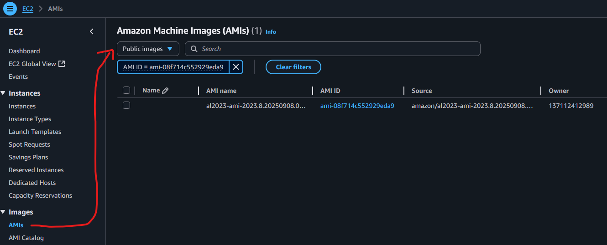
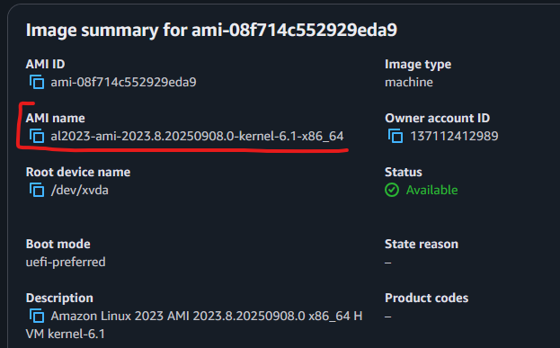

## Terraform Input Variables


**Input Variables** serve as <font color=#EBAC25>parameters</font> for a Terraform module allowing aspects of the module to be <font color=#EBAC25>customized without altering the module's source code</font> and <font color=#EBAC25>allowing modules to be shared</font> between different configurations.


- Basic Input Variables
- Can be provided <font color=#EBAC25>when prompted</font> during `terraform plan` or `terraform apply`
- <font color=#EB4925>Override</font> default variable values using _CLI argument_ `-var`
- <font color=#EB4925>Override</font> default variable values using **Environment Variables (TF_var_aa)**
- Provide Input Variables using `terraform.tfvars` files
- Provide Input Variables using `<any-name>.tfvars` file with _CLI argument_ `-var-file`
- Provide Input Variables using `auto.tfvars` files
- Implement complex type constructors like `List & Map` in Input Variables
- Implement Custom Validation Rules in Variables
- <font color=#EB4925>Protect Sensitive Input Variables</font>



More detailed section about **Terraform Input Variables** and practical examples in **Kalyan’s**  [hashicorp-certified-terraform-associate](https://github.com/stacksimplify/hashicorp-certified-terraform-associate/tree/main) GitHub Repository under this address:

https://github.com/stacksimplify/hashicorp-certified-terraform-associate/tree/main/05-Terraform-Variables


### Implement Input Variables
#### Declare Variables

📄 _File:_ c2-variables.tf

```terraform
# INFO: Input Variables
# INFO: https://developer.hashicorp.com/terraform/language/block/variable

# INFO: AWS Region
variable "aws_region" {
  description = "Region in which AWS Resources will be created"
  type        = string
  default     = "eu-west-2"
}

# INFO: EC2 Instance Type
variable "instance_type" {
  description = "EC2 Instance Type"
  type        = string
  default     = "t3.nano"
}

# INFO: EC2 Instance Key Pair
variable "instance_keypair" {
  description = "EC2 Instance Key Pair associated with EC2 Instance"
  type        = string
  default     = "terraform-key"

}
```
#### Terraform Block

📄 _File:_ c1-versions.tf

```terraform
# INFO: Terraform Block
# INFO: https://registry.terraform.io/providers/hashicorp/aws/latest/docs#example-usage

terraform {
  required_version = "~> 1.13.0" # NOTE: Greater than 1.13.2. Only the most upright version number (.0) can change.
  required_providers {
    aws = {
      source  = "hashicorp/aws"
      version = "~> 6.0" # NOTE: Greater than 6.0. Only the most upright version number (.0) can change.
    }
  }
}

# INFO: Provider Block
provider "aws" {
  region = var.aws_region
}
```

ℹ️ _Note:_ `region = var.aws_region` is now referring to a variable declared in `c1-variables.tf` file.

[AWS Provider](https://registry.terraform.io/providers/hashicorp/aws/latest/docs#example-usage)

_More about Input Variables:_
- [Terraform Input Variables](https://www.terraform.io/docs/language/values/variables.html)
- [Terraform Input Variable Usage - 10 different types](https://github.com/stacksimplify/hashicorp-certified-terraform-associate/tree/main/05-Terraform-Variables/05-01-Terraform-Input-Variables)
#### Create Security Groups

📄 _File:_ c3-ec2securitygroups.tf

```terraform
# INFO: Create Ingress Security Group - SSH Traffic
# INFO: https://registry.terraform.io/providers/hashicorp/aws/latest/docs/resources/security_group#example-usage

resource "aws_security_group" "vpc-ssh" {
  name        = "vpc-ssh"
  description = "Dev VPC SSH"

  tags = {
    Name = "vpc-ssh"
  }
}

resource "aws_vpc_security_group_ingress_rule" "vpc-ssh_ipv4" {
  description       = "Allow Port 22 INBOUND"
  security_group_id = aws_security_group.vpc-ssh.id
  cidr_ipv4         = "0.0.0.0/0"
  from_port         = 22
  ip_protocol       = "tcp"
  to_port           = 22

  tags = {
    "Name" = "vpc-ssh-inbound"
  }
}

# INFO: Create Ingress Security Group - WEB Traffic - 80

resource "aws_security_group" "vpc-web-80" {
  name        = "vpc-web-80"
  description = "Dev VPC WEB"

  tags = {
    Name = "vpc-web-80"
  }
}

resource "aws_vpc_security_group_ingress_rule" "vpc-web-80_ipv4" {
  description       = "Allow Port 80 INBOUND"
  security_group_id = aws_security_group.vpc-web-80.id
  cidr_ipv4         = "0.0.0.0/0"
  from_port         = 80
  ip_protocol       = "tcp"
  to_port           = 80

  tags = {
    "Name" = "vpc-web-80-inbound-80"
  }
}

# INFO: Create Ingress Security Group - WEB Traffic - 80

resource "aws_security_group" "vpc-web-443" {
  name        = "vpc-web-443"
  description = "Dev VPC WEB"

  tags = {
    Name = "vpc-web-443"
  }
}

resource "aws_vpc_security_group_ingress_rule" "vpc-web-443_ipv4" {
  description       = "Allow Port 443 INBOUND"
  security_group_id = aws_security_group.vpc-web-443.id
  cidr_ipv4         = "0.0.0.0/0"
  from_port         = 443
  ip_protocol       = "tcp"
  to_port           = 443

  tags = {
    "Name" = "vpc-web-443-inbound-443"
  }
}

# INFO: Create Egress Security Group - ALL

resource "aws_security_group" "vpc-egress" {
  name        = "vpc-egress"
  description = "Dev VPC Egress"

  tags = {
    Name = "vpc-egress"
  }
}

resource "aws_vpc_security_group_egress_rule" "allow_all_traffic_ipv4" {
  description       = "Allow all IP and pports OUTBOUND"
  security_group_id = aws_security_group.vpc-egress.id
  cidr_ipv4         = "0.0.0.0/0"
  ip_protocol       = "-1" # semantically equivalent to all ports

  tags = {
    "Name" = "vpc-all-outbound"
  }
}
```

_More about_ `aws_security_group` _resource:_

- [Resource: aws_security_group](https://registry.terraform.io/providers/hashicorp/aws/latest/docs/resources/security_group)
## Terraform Datasources



**Data Sources** allow data to be **fetched or computed** for use elsewhere in Terraform configuration.

**Use of data sources allows Terraform configuration to make use of information defined outside of Terraform or defined by another separate Terraform configuration.**

A data source is accessed via a special kind of resource known as a _data resource_ which determines the _kind of object (objects)_ it reads and what query constraint arguments are available.

Data resources have the same dependency resolution behavior as defined or managed resources.

Setting the `depends_on` meta-argument within the data blocks defers reading of the data source until after all changes to the dependencies have been applier.


### Create AMI Datasource Resource

📄 _File:_ c4-ami-datasource.tf

```terraform
# INFO: Get the latest AWS AMI ID for Amazon2 Linux
# INFO: https://registry.terraform.io/providers/hashicorp/aws/latest/docs/data-sources/ami#example-usage

data "aws_ami" "amzlinux2" {
  #  executable_users = ["self"]
  most_recent = true
  #  name_regex       = "^myami-[0-9]{3}"
  owners = ["amazon"]

  filter {
    name   = "name"
    values = ["al2023-ami-*-x86_64"]
  }

  filter {
    name   = "architecture"
    values = ["x86_64"]
  }

  filter {
    name   = "root-device-type"
    values = ["ebs"]
  }

  filter {
    name   = "virtualization-type"
    values = ["hvm"]
  }
}
```

_More about AMI datasource:_

- [AMI Datasource](https://registry.terraform.io/providers/hashicorp/aws/latest/docs/data-sources/ami#example-usage)

💡 Finding AMI for filter value `values = ["al2023-ami-*-x86_64"]`:




## Create EC2 Instance

📄 _File:_ c5-ec2instance.tf

```terraform
# INFO: Create EC2 Instance
# INFO: https://registry.terraform.io/providers/hashicorp/aws/latest/docs/resources/instance#example-usage

# EC2 Instance
resource "aws_instance" "myec2vm" {
  ami           = data.aws_ami.amzlinux2.id
  instance_type = var.instance_type
  user_data     = file("${path.module}/app1-install.sh") # NOTE: Apply User Data
  key_name      = var.instance_keypair                   # NOTE: Attach Key-Pair ID
  vpc_security_group_ids = [                             # NOTE: Attach INGRESS SG
    aws_security_group.vpc-ssh.id,
    aws_security_group.vpc-web-80.id,
    aws_security_group.vpc-web-443.id,
    aws_security_group.vpc-egress.id # NOTE: Attach EGRESS SG
  ]
  tags = {
    "Name" = "EC2 Demo 2"
  }
}
```

_More about EC2 Instance resource:_

- [Resource: aws_instance](https://registry.terraform.io/providers/hashicorp/aws/latest/docs/resources/instance)

## Terraform Output Values



The `output` block lets you expose information about your infrastructure.



📄 _File:_ c6-outputs.tf

```terraform
# INFO: Terraform Output Values
# INFO: https://developer.hashicorp.com/terraform/language/block/output

output "instance_publicip" {
  description = "EC2 Instance Public IP"
  value       = aws_instance.myec2vm.public_ip
}

output "instance_publicdns" {
  description = "EC2 Instance Public DNS"
  value       = aws_instance.myec2vm.public_dns
}
```

_More about Output Values:_

- [Output Block Reference](https://developer.hashicorp.com/terraform/language/block/output)

---
## >> Sources <<

_Terraform:_
- [Terraform Input Variables](https://www.terraform.io/docs/language/values/variables.html)
- [Resource: aws_security_group](https://registry.terraform.io/providers/hashicorp/aws/latest/docs/resources/security_group)
- [AMI Datasource](https://registry.terraform.io/providers/hashicorp/aws/latest/docs/data-sources/ami#example-usage)
- [Resource: aws_instance](https://registry.terraform.io/providers/hashicorp/aws/latest/docs/resources/instance)
- [Output Block Reference](https://developer.hashicorp.com/terraform/language/block/output)

Kalyan’s GitHub Repositories:

https://github.com/stacksimplify/terraform-on-aws-ec2/tree/main/04-Terraform-Variables-and-Datasources
## >> Disclaimer <<

