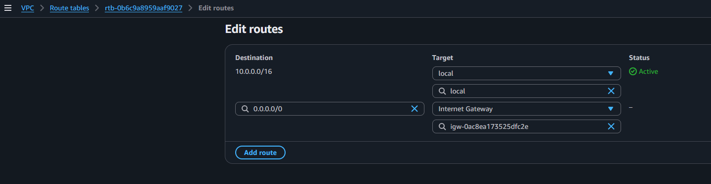
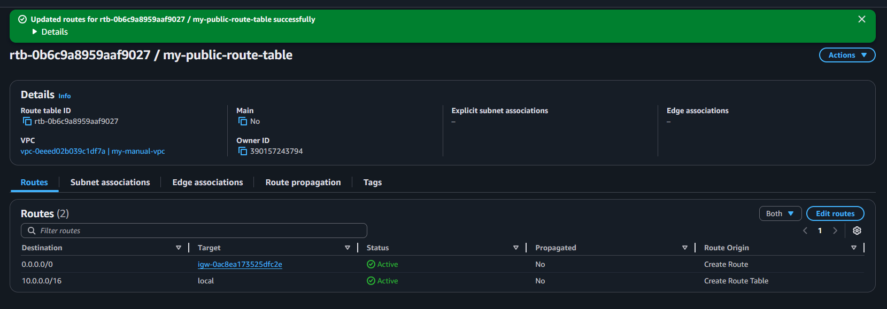
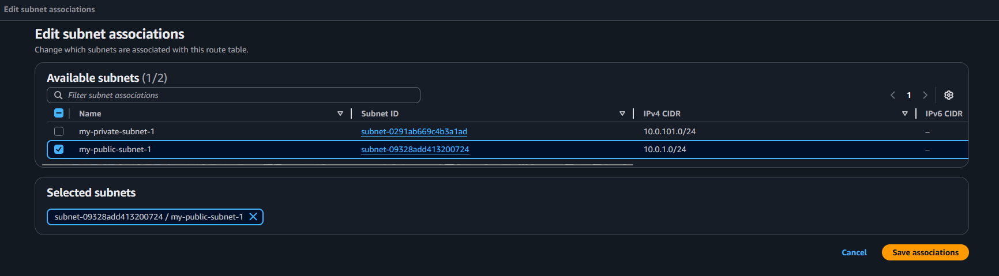
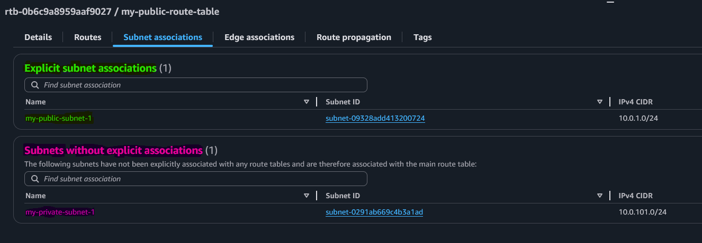
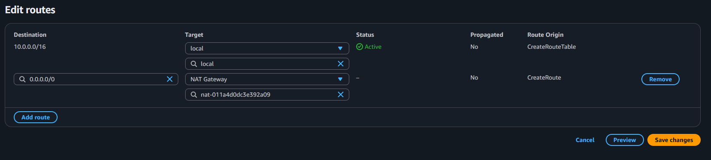

## 👨🏻‍💻Part 1: Building VPC manually

### VPC Components

- Create VPC 
	- 2 AZ
		- Public Subnets
		- Private Subnets
- Create Internet Gateway and Associate to VPC
- Create NAT Gateway in Public Subnet 
- Create Public Route Table, Add Public Route via Internet Gateway and Associate Public Subnet
- Create Private Route Table, Add Private Route via NAT Gateway and Associate Private Subnet
### 1. Create VPC

```CLI
IAM console > VPC
```

- **Name:** my-manual-vpc
- **IPv4 CIDR Block:** 10.0.0.0/16
### 2. Create Subnets

```CLI
IAM console > VPC > Subnets
```

ℹ️ For the purpose of the manual exercise, we are only creating subnets in 1 AZ. With terraform we will spread the infrastructure across 2 AZ.
##### Public Subnets

- **VPC ID:** my-manual-vpc
- **Subnet Name:** my-public-subnet-1
- **Availability zone:** eu-west-2a
- **IPv4 CIDR Block:** 10.0.1.0/24
##### Private Subnets

- **Subnet Name:** my-private-subnet-1
- **Availability zone:** eu-west-2a
- **IPv4 CIDR Block:** 10.0.101.0/24
##### DB Subnets

- **VPC ID:** my-manual-vpc
- **Subnet Name:** my-db-subnet-1
- **Availability zone:** eu-west-2a
- **IPv4 CIDR Block:** 10.0.201.0/24



No association with NAT or Internet Gateway is required for the DB subnet as Databases will not require outbound communication.


### 3. Create IGW and associate it with VPC

```CLI
IAM console > VPC > Internet gateways
```

- **Name Tag:** my-igw
- Click on **Create Internet Gateway**
- Click on Actions -> Attach to VPC -> my-manual-vpc
### 4. Create NAT Gateway

💡NAT Gateway should always be placed in the Public Subnet.

```CLI
IAM console > VPC > NAT gateways
```

- **Name:** my-nat-gateway
- **Subnet:** my-public-subnet-1
- **Allocate Elastic Ip:** click on that
- Click on **Create NAT Gateway**
### 5. Create Public Route Table, Create Routes, Associate Subnets
##### Create Public Route Table

```CLI
IAM console > VPC > Route tables
```

- **Name tag:** my-public-route-table
- **vpc:** my-manual-vpc
- Click on **Create**
##### Create Public Route in newly created Route Table

```CLI
IAM console > VPC > Route tables > my-public-route-table > Routes
```

- Click on **Edit Routes** > **Add Route**
- **Add Destination:** 0.0.0.0/0
- **Target:** my-igw
- Click on **Save Route**




##### Associate Public Subnet 1 in Route Table

```CLI
IAM console > VPC > Route tables > my-public-route-table > Subnet associations > Explicit subnet associations
```

- Click on **Edit Subnet Associations**
- Select **my-public-subnet-1**
- Click on **Save**




### 6. Create Private Route Table, Create Routes, Associate Subnets

##### Create Private Route Table

```CLI
IAM console > VPC > Route tables
```

- **Name tag:** my-private-route-table
- **vpc:** my-manual-vpc
- Click on **Create**
##### Create Private Route in newly created Route Table

```CLI
IAM console > VPC > Route tables > my-private-route-table > Routes
```

- Click on **Edit Routes** > **Add Route**
- **Destination:** 0.0.0.0/0
- **Target:** my-nat-gateway
- Click on **Save Route**


##### Associate Private Subnet 1 in Route Table

```CLI
IAM console > VPC > Route tables > my-public-route-table > Subnet associations > Explicit subnet associations
```

- Click on **Edit Subnet Associations**
- Select **my-private-subnet-1**
- Click on **Save**
### 7. Clean-Up

- Delete `my-nat-gateway`
- Wait till NAT Gateway is deleted
- Delete `my-manual-vpc`
## 📄Part 2: Building VPC using Terraform



My code for this course is available here:

✅ https://github.com/rtdevx/terraform/tree/main/terraform-aws-iac-sre

VPC related files:

- 📄c4-01-vpc-variables.tf
- 📄c2-generic-variables.tf
- 📄c3-local-values.tf
- 📄c4-01-vpc-variables.tf
- 📄c4-02-vpc-module.tf
- 📄c4-01-vpc-variables.tf
- 📄c4-03-vpc-outputs.tf




---
## >> Sources <<

Kalyan’s GitHub Repositories:

https://github.com/stacksimplify/terraform-on-aws-ec2/tree/main/06-AWS-VPC
## >> Disclaimer <<


