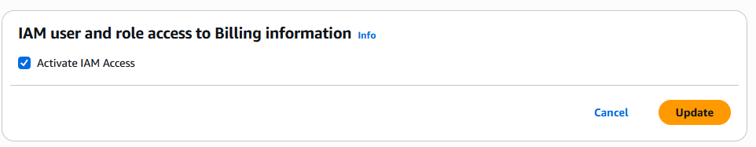
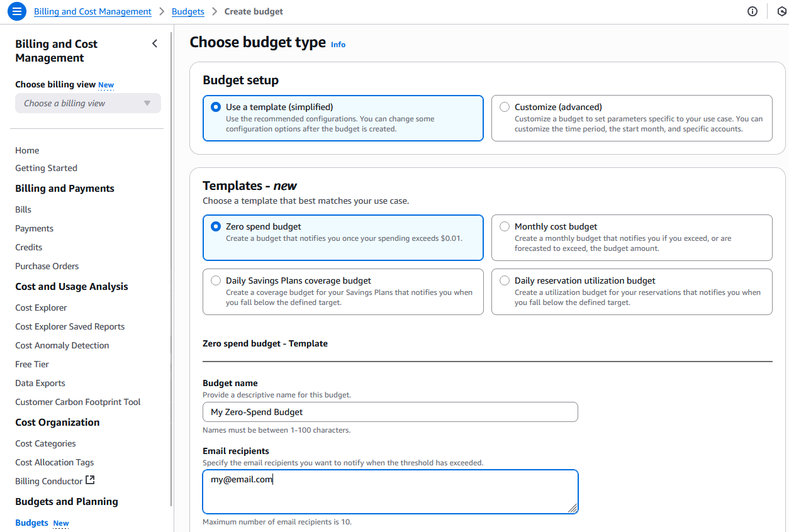

## Setting up a budget

<font color=#f43f5e>Billing and Cost Management is only available for the root user (or user with the right privileges).</font>
### 1. Enabling Billing and Cost Management for IAM user

- Log in as root to AWS Console
- Click on your user in the top right corner, select an account
- Scroll down to "_IAM user and role access to Billing information_"
- Activate IAM access

This will allow access to billing information for IAM users that are in _Administrators_ group.


### 2. Create a budget

```AWSConsole
Billing and Cost Management > Budgets > Create a budget
```



## Disclaimer


_Disclaimer: Content for educational purposes only, no rights reserved._

Most of the content in this series is coming from **Stephane Maarek's** [Ultimate AWS Certified Cloud Practitioner CLF-C02 2025](https://www.udemy.com/course/aws-certified-cloud-practitioner-new/) course on Udemy.

I highly encourage you to take the [Stephane's courses](https://www.udemy.com/user/stephane-maarek/) as they are awesome and really help understanding the subject.

_More about Stephane Maarek:_

- https://www.linkedin.com/in/stephanemaarek
- https://x.com/stephanemaarek

**This article is just a summary and has been published to help me learning and passing the practitioner exam.**

