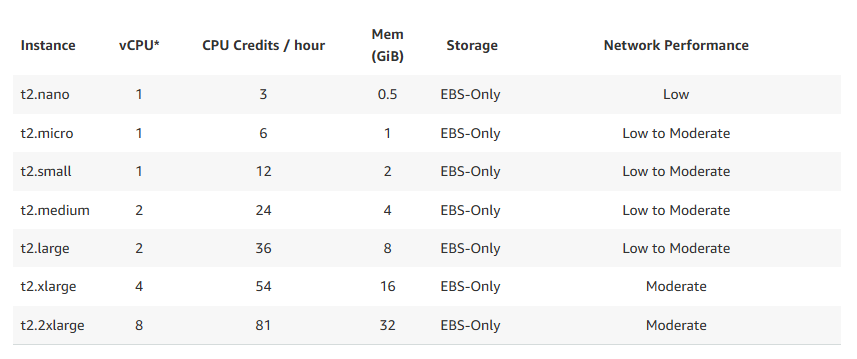
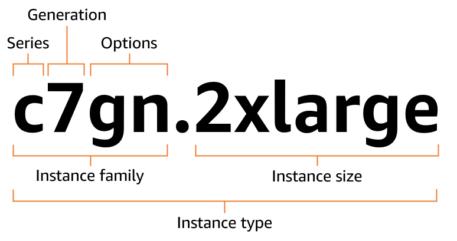
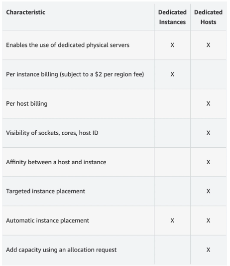

## What is Amazon EC2

An **Amazon EC2** instance is a virtual server in the AWS Cloud. When you launch an EC2 instance, the instance type that you specify determines the hardware available to your instance. Each instance type offers a different balance of compute, memory, network, and storage resources. 

---



---
## EC2 sizing and configuration options

- Operating System (OS) - Linux, Windows, Mac OS
- How much compute power & CPU cores
- How much RAM
- How much storage space
	- Network-attached (<font color=#27D3F5>EBS</font> & <font color=#27D3F5>EFS</font>)
	- Hardware (EC2 Instance Store)
- Network card: speed of the card, Public IP address
- Firewall rules: security group
- Bootstrap script (configure at first launch): EC2 User Data
## Amazon EC2 Instance Types

*More info:* 
[EC2 Instance Types](https://aws.amazon.com/ec2/instance-types/)
[EC2Instances.info](https://ec2instances.info)

- **General Purpose** (M, T) - General
- **Compute Optimized** (C) - Compute bound applications that benefit from thigh performance processors
- **Memory Optimized** (R, X) - Optimized to deliver fast performance for workloads that process large data sets in memory (i.e. <font color=#27D3F5>Elastic Cache</font>)
- **Accelerated Computing** (P, G, Trn, Inf, DL, F, VT1) - Calculations, graphics processing or data pattern matching
- **Storage Optimized** (I, Dx, H1) - High, sequential read and write access to very large data sets on local storage. Low-latency, random I/O operations per second (IOPS)
- **HPC Optimized** (Hpc) - High Performance Computing - complex simulations and deep learning workloads


## Instance type naming conventions

*More info:* [Amazon EC2 Instance type naming conventions](https://docs.aws.amazon.com/ec2/latest/instancetypes/instance-type-names.html)


### Example

*More info:* [Amazon EC2 Instance type naming conventions](https://docs.aws.amazon.com/ec2/latest/instancetypes/instance-type-names.html)

| Series                                                                                                                                                                                                                               | Options                                                                                                                                                                                                                                                                                                                                                                                                                                                                                              |
| ------------------------------------------------------------------------------------------------------------------------------------------------------------------------------------------------------------------------------------ | ---------------------------------------------------------------------------------------------------------------------------------------------------------------------------------------------------------------------------------------------------------------------------------------------------------------------------------------------------------------------------------------------------------------------------------------------------------------------------------------------------- |
| - **C** – Compute optimized<br>    <br>- **Hpc** – High performance computing<br>    <br>- **I** – Storage optimized<br>    <br>- **M** – General purpose<br>    <br>- **P** – GPU accelerated<br>    <br>- **R** – Memory optimized | - **a** – AMD processors<br>   <br>- **i** – Intel processors<br>    <br>- **b** – Block storage optimization<br>    <br>- **d** – Instance store volumes<br>    <br>- **e** – Extra storage (for storage optimized instance types), extra memory (for memory optimized instance types), or extra GPU memory (for accelerated computing instance types).<br>    <br>- **n** – Network and EBS optimized<br>    <br>- **q** – Qualcomm inference accelerators<br>    <br>- **z** – High CPU frequency |
## Launching EC2 instance

```AWSConsole
EC2 > Launch Instance
```

- Name and Tags
- AMI
- Instance Type (t3.micro,t3.large,etc.)
- Key Pair
- Network Settings (Security Group)
- Storage
- Advanced Settings
	- Domain Join
	- IAM Instance Profile
	- Hostname type
	- Instance auto-recovery
	- Shutdown behavior
	- Termination protection
	- Placement group
	- Purchasing option
		- None
		- Capacity Blocks
		- Spot Instances
	- Capacity reservation
	- User data
#### Example user data

<font color=#10b981>User data is only **bootstrap** script and **only starts once** during the machine creation.</font>

```bash
#!/bin/bash
# Use this for your user data (script from top to bottom)
# install httpd (Linux 2 version)
yum update -y
yum install -y httpd
systemctl start httpd
systemctl enable httpd
echo "<h1>Hello World from $(hostname -f)</h1>" > /var/www/html/index.html
```
#### Connecting to EC2 from Windows Terminal

```bash
ssh -i .\.ssh\id_rsa_aws25 ec2-user@ec2-3-95-191-175.compute-1.amazonaws.com
```
#### EC2 Instances Purchasing options

- **On-Demand instances** - short workload, predictable pricing, pay by second
	- Pay for what used
		- Linux or Windows - billing per second after the first minute
		- All other operating systems - billing per hour
	- Highest cost but no upfront payment
	- No long-term commitment
	- <font color=#f4e40b>Recommended for</font> short-term and un-interrupted workloads
- **Reserved** (1 & 3 years)
	- Up to <font color=#f43f5e>72%</font> discount compared to On-demand
	- You reserve a specific instance attributes (Instance Type, Region, Tenancy, OS)
	- Reserved Instances - long workloads
	- Payment options - No upfront, Partial Upfront, All Upfront
	- Scope: Regional or Zonal
	- <font color=#f4e40b>Recommended for</font> steady-state usage applications (think database)
	- Can be bought and sold in the Reserved Instance Market place
	- Convertible Reserved Instances - long workload with flexible instances
		- Can change the EC2 instance type, instance family, OS, scope and tenancy
		- Up to <font color=#f43f5e>66%</font> discount
- **Saving plans** (1 & 3 years) - commitment to an amount of usage, long workloads
	- Get discount based on long-term usage
	- Commit to a certain type of usage ($10/hour for 1 or 3 years)
	- Usage beyond EC2 Savings Plans is billed at the On-Demand price
	- Locked to a specific instance family & AWS region
	- Flexible across
		- Instance Size (e.g. m5.xlarge, m5.2xlarge)
		- OS (e.g. Linux, Windows)
		- Tenancy (Host, Dedicated, Default)
- **Spot Instances** - short workloads, cheap, can lose instances
	- Up to <font color=#f43f5e>90%</font> discount
	- Instances can be "lost" at any point if max price is less than current spot price
	- <font color=#f4e40b>Recommended for</font> workloads that are resilient to failure
		- Batch jobs
		- Data analysis
		- Image processing
- **Dedicated Hosts** - book an entire physical server, control instance placement
	- A physical server with EC2 instance capacity fully dedicated to your use
	- <font color=#f4e40b>Recommended for</font> for companies with strong compliance requirements OR server-bound software licenses (per-socket, per-core)
	- Purchasing Options:
		- On-demand
		- Reserved
	- Most expensive option
- **Dedicated Instances** - no other customers will share your hardware
	- Instances run on a dedicated hardware
	- May share hardware with other instances in the same account
	- No control over instance placement



- **Capacity Reservations** - reserve capacity in a specific AZ for any duration


---
## Sources

- [EC2 Instance Types](https://aws.amazon.com/ec2/instance-types/)
- [Amazon EC2 Instance type naming conventions](https://docs.aws.amazon.com/ec2/latest/instancetypes/instance-type-names.html)
- [EC2Instances.info](https://ec2instances.info)

 _Full YouTube Rahul's AWS Course:_ https://www.youtube.com/playlist?list=PL7iMyoQPMtAN4xl6oWzafqJebfay7K8KP
## References

- <font color=#27D3F5>Security Groups</font>
---
### Disclaimer


_Disclaimer: Content for educational purposes only, no rights reserved._

Most of the content in this series is coming from **Stephane Maarek's** [Ultimate AWS Certified Cloud Practitioner CLF-C02 2025](https://www.udemy.com/course/aws-certified-cloud-practitioner-new/) course on Udemy.

I highly encourage you to take the [Stephane's courses](https://www.udemy.com/user/stephane-maarek/) as they are awesome and really help understanding the subject.

_More about Stephane Maarek:_

- https://www.linkedin.com/in/stephanemaarek
- https://x.com/stephanemaarek

**This article is just a summary and has been published to help me learning and passing the practitioner exam.**
